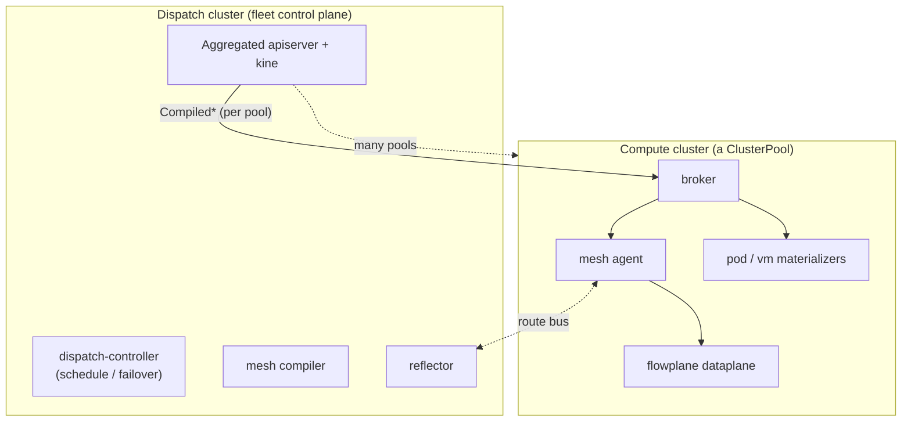

# ectobase

**ectobase** is a Kubernetes-native, multi-cluster IaaS layer for running **containers and KubeVirt VMs** on a shared **eBPF/XDP overlay network**. A single fleet control plane compiles high-level intent (VPCs, interfaces, firewalls, load balancers, VMs, volumes) and distributes it to any number of compute clusters, where a map-driven kernel dataplane gives every workload an address on a shared IPv6-underlay overlay.

It is built from two planes and a fleet:

- **flowplane** — the eBPF/XDP **dataplane** (Rust). Every forwarding decision is a per-flow table lookup: IPv6 underlay, IP-in-IPv6 overlay, multi-VNI tenancy, stateful NAT, Maglev load balancing with DSR, a deny-by-default firewall, DHCP/ARP/ND responders, QoS shaping, and NAT64 — all in the Linux kernel. A DPDK backend runs the same datapath logic for smartNIC offload.
- **mesh** — the per-cluster **control plane** (Go/Kubernetes). CRDs describe intent; controllers compile it into per-workload `Compiled*` objects; a per-node agent programs the local dataplane; a reflector distributes overlay routes over a custom route bus.
- **the dispatch** — the **fleet control plane**. An aggregated apiserver serves the whole API for many clusters; a per-cluster broker syncs each cluster's compiled objects down into it; a controller schedules workloads across clusters and drives failover.



## The API

Intent is authored as CRDs across five groups; the control plane lowers it into the `compiled` group, which the brokers sync to the owning cluster and the agents and materializers execute.

| Group | Kinds |
|---|---|
| `net.ectobase.dev` | VPC, NetworkInterface, FirewallPolicy, LoadBalancer, NATGateway, FloatingIP, VPCPeering |
| `compute.ectobase.dev` | VirtualMachine, Container |
| `storage.ectobase.dev` | Volume |
| `compiled.ectobase.dev` | CompiledNIC, CompiledVM, CompiledContainer, CompiledVolumeAttachment *(controller-written)* |
| `platform.ectobase.dev` | ClusterPool |

## Getting started

Everything is provided by the Nix flake — the Rust toolchain, `bpf-linker`, Go, `controller-gen`, `kind`/`containerlab`, Helm, `mkdocs`, and the eBPF/DPDK/VM tooling the tests need.

```sh
nix develop            # enter the dev shell (all targets assume you are inside it)
make                   # list all targets
make build             # build the flowplane dataplane (host crates + the eBPF object)
make test              # host unit + datapath sim tests (no root)
make generate          # regenerate CRDs, RBAC, conversions, and the CRD API reference
```

The datapath conformance suite runs in-process (`make sim`) and against a real kernel/gRPC path; the full multi-cluster integration suite runs on a local containerlab + kind fabric (`make lab-up` / `make lab-test`). See the documentation for the test tiers.

## Deploying

ectobase ships as two Helm charts — install `ectobase-dispatch` on the fleet control-plane cluster and `ectobase-pool` on each compute cluster:

```sh
helm install ectobase-dispatch  charts/ectobase-dispatch  -n system --create-namespace
helm install ectobase-pool charts/ectobase-pool -n ectobase-system --set broker.clusterName=<pool>
```

The charts are the generated deploy artifact — their CRDs and RBAC are generated from the Go types and `//+kubebuilder:rbac` markers by `make generate`, so they never drift. See the **Deploying with Helm** guide for the full flow (namespaces, the broker credential, and the values that matter).

## Documentation

Full documentation — the vision, architecture deep-dives (multi-cluster control plane, the compile→sync→materialize pipeline, CNI/KubeVirt/CSI integration, rescheduling & failover, the dataplane), feature references, guides, and the generated CRD API reference — is built with mkdocs-material:

```sh
make docs-serve        # serve the docs locally at http://127.0.0.1:8000
make docs              # build the static site (strict)
```

## Lineage & scope

`flowplane` began as an eBPF/XDP reimagining of the DPDK-based [`dpservice`](https://github.com/ironcore-dev/dpservice), but ectobase has since grown its own Kubernetes control plane (`mesh`), a five-group CRD API, a route-distribution bus, a CNI, and a fleet control plane, and now targets containers and KubeVirt VMs directly. metalnet/ironcore compatibility is no longer a design constraint.
