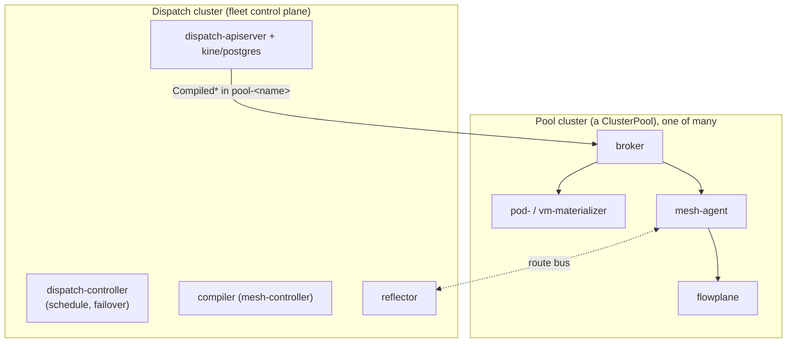

# ectobase

ectobase runs containers and KubeVirt VMs across a fleet of Kubernetes clusters, behind one API and on one eBPF overlay network. You write intent (VPCs, network interfaces, firewall policies, load balancers, VMs, containers, volumes) once, against the fleet control plane. ectobase places each workload on one of many compute clusters (pools), compiles the intent for that pool, and turns it into a real Pod or KubeVirt VM there. Every workload gets an overlay address that stays the same whichever pool it runs on, and reaches the rest of its VPC across pool boundaries.

The code has three parts:

- **flowplane**: the eBPF dataplane (Rust, aya, tcx), on every pool node and every WAN edge. Every forwarding decision is a map lookup. It carries tenant traffic as Geneve over a routed IPv6 fabric, and implements multi-VNI routing, stateful NAT (including NAT64), Maglev load balancing with DSR, a per-interface firewall, DHCP/ARP/ND responders and QoS shaping.
- **mesh**: the network control plane (Go). The compiler lowers intent into per-pool `Compiled*` objects, a per-node agent programs flowplane from them, and the reflector distributes overlay routes over a custom route bus. The materializers that create Pods and KubeVirt VMs live here too.
- **dispatch**: fleet orchestration (Go). An aggregated apiserver backed by kine and postgres serves the whole API; a per-pool broker syncs each pool's compiled objects down and status back up; the dispatch-controller schedules workloads onto pools and fails over VMs from a lost pool.


```mermaid
flowchart TB
  subgraph dispatch["Dispatch cluster (fleet control plane)"]
    api["dispatch-apiserver + kine/postgres"]
    ctl["dispatch-controller<br/>(schedule, failover)"]
    cmp["compiler (mesh-controller)"]
    rfl["reflector"]
  end
  subgraph pool["Pool cluster (a ClusterPool), one of many"]
    brk["broker"]
    mat["pod- / vm-materializer"]
    agt["mesh-agent"]
    dp["flowplane"]
  end
  api -- "Compiled* in pool-&lt;name&gt;" --> brk
  brk --> mat
  brk --> agt
  agt --> dp
  agt <-. "route bus" .-> rfl
```

## The API

You write intent in four groups. The compiler writes the fifth, `compiled`, which the brokers sync to the pool each object is placed on.

| Group | Kinds |
|---|---|
| `net.ectobase.dev` | VPC, Subnet, NetworkInterface, FirewallPolicy, LoadBalancer, NATGateway, FloatingIP, VPCPeering, IPPool, IPAllocation *(controller-written)* |
| `compute.ectobase.dev` | VirtualMachine, Container |
| `storage.ectobase.dev` | Volume |
| `platform.ectobase.dev` | ClusterPool, RouteBusIdentity |
| `compiled.ectobase.dev` | CompiledNIC, CompiledVM, CompiledContainer, CompiledVolumeAttachment *(controller-written)* |

## Getting started

The Nix flake provides everything: the Rust toolchain and `bpf-linker`, Go, `controller-gen`, `kind` and `containerlab`, Helm, `zensical`, and the eBPF and VM tooling the tests need.

```sh
nix develop            # enter the dev shell (all targets assume you are inside it)
make                   # list all targets
make build             # build the flowplane binary (host crates + the eBPF object)
make test              # host Rust unit tests (no root)
make sim               # in-process datapath tests (no root)
make generate          # regenerate deepcopy/conversions, CRDs, RBAC and the API reference
make ci                # everything CI runs: lint, sim, host tests, chart tests, every Go module
```

The multi-cluster integration suite runs on a local Talos + containerlab fabric with a dispatch cluster and two pools (`make lab-up`, then `make lab-test`). The docs describe the test tiers.

## Deploying

ectobase ships as two Helm charts: `ectobase-dispatch` on the fleet control-plane cluster and `ectobase-pool` on each compute cluster.

```sh
helm install ectobase-dispatch charts/ectobase-dispatch -n system --create-namespace
helm install ectobase-pool charts/ectobase-pool -n ectobase-system --set broker.clusterName=<pool>
```

A real install needs more values than these, such as the reflector and dispatch addresses and the PKI settings. The charts' CRDs and RBAC are generated from the Go types and `//+kubebuilder:rbac` markers by `make generate`, so they don't drift. See [Deploy with Helm](https://trevex.github.io/ectobase/operations/deploy-helm/) for the full flow.

## Documentation

The documentation lives at https://trevex.github.io/ectobase/. It covers the concepts, the architecture (multi-cluster orchestration, the overlay and route bus, the dataplane, storage, failover and VM moves), the networking features, walkthrough guides on the lab, operations, and the generated API reference.

The site is built with zensical from `docs/`:

```sh
make docs-serve        # serve the docs with live reload at http://127.0.0.1:8000/
make docs              # build the static site into ./site (strict)
```

## Lineage

flowplane began as an eBPF port of [ironcore dpservice](https://github.com/ironcore-dev/dpservice)'s datapath model and has since diverged; ectobase's control plane is its own Kubernetes-native design. Every applicable test in dpservice's Python conformance suite has a named native replacement, and the conformance map in the docs records which.
