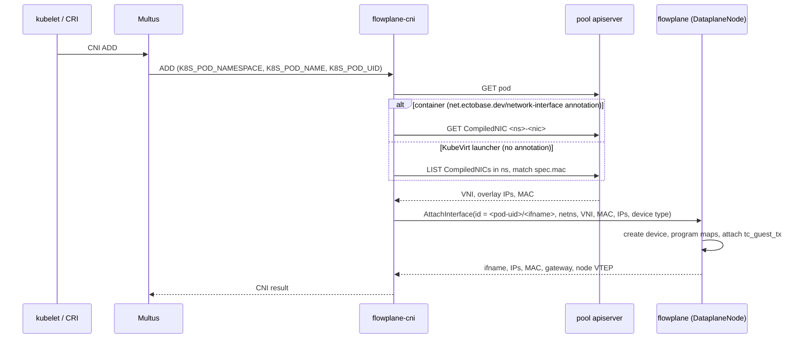
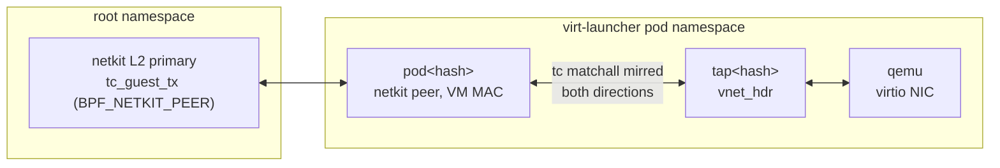

# Attaching workloads

A workload joins the overlay when flowplane on its node creates a device for it, programs the
device's overlay address into the maps, and attaches the guest program. This page explains how a
container and a KubeVirt VM each get there: the CNI plugin, the devices flowplane builds, how a
repeated attach is handled, how guests configure themselves, and the optional SR-IOV hardware tier.

The VM lifecycle around this, from `VirtualMachine` to running guest and its disks, is covered in
[storage and VMs](storage-and-vms.md).

## One entry point: AttachInterface

Both paths end in the same call. `flowplane-cni`, a CNI plugin, calls `AttachInterface` on the
node-local `DataplaneNode` gRPC service, served by flowplane on the root-only Unix socket
`/run/flowplane/dataplane.sock`. The device type in the request decides what flowplane builds.

ectobase does not replace a pool's primary pod network. The overlay is a secondary attachment
through Multus: a pod keeps its normal cluster networking and gains an overlay interface beside it.
The pool chart ships two `NetworkAttachmentDefinition`s that both run `flowplane-cni`:

| NAD | Device type | Used by |
|---|---|---|
| `flowplane-overlay` | not set (auto) | containers; the pod-materializer writes it into the pod's `k8s.v1.cni.cncf.io/networks` annotation |
| `flowplane` | `pod-tap` | KubeVirt VMs, through the `flowplane` network-binding plugin |

### The CNI plugin

On `ADD`, `flowplane-cni` (`cni/plugin`) works out the pod's overlay identity and attaches it. The
whole call has a 30-second deadline.

1. It reads the pod with a node-local service-account kubeconfig.
2. A container pod carries `net.ectobase.dev/network-interface: <ns>/<nic>`, written by the
   pod-materializer. The plugin reads the `CompiledNIC` named `<ns>-<nic>`.
3. A KubeVirt launcher pod has no such annotation, because KubeVirt creates it. The plugin takes the
   interface MAC from the pod's Multus annotation instead, then lists the namespace's `CompiledNIC`s
   and picks the one whose `spec.mac` matches. That is why the plugin's role grants both `get` and
   `list` on `compilednics`.
4. A `CompiledNIC` with VNI 0 has not been compiled yet. The ADD fails and the kubelet retries.
5. It calls `AttachInterface` and turns the response into a CNI result. If the result cannot be
   built, it detaches again rather than leak the interface.

The plugin reads only the lowered `CompiledNIC`, never `NetworkInterface` or `VPC`, so a pool needs
none of the intent CRDs. `DEL` calls `DetachInterface` and ignores every error, so teardown never
blocks; `CHECK` is a no-op.

!!! warning "One flowplane NIC per VM"
    The MAC lookup picks the selection element for the plugin's NAD, else the only element with a
    MAC. A VM with more than one flowplane NIC has several, and the plugin cannot tell which one an
    ADD is for, so it fails rather than guess.

### What flowplane does on attach

`AttachState::attach` (`flowplane/flowplane/src/attach/mod.rs`):

1. Validates the request: an interface id, at least one overlay IPv4 or IPv6 address, an explicit MAC
   for VM device types, and a PCI address for a VF.
2. Picks the MAC: the caller's, or one derived deterministically from the interface id, so a
   detach and re-attach keeps the same MAC.
3. Checks idempotence (below) before touching any device.
4. Creates the device.
5. Programs the maps through the control core: `PORT_META` for the device, `INTERFACES` and
   `INTERFACES6` for `(VNI, address)`, a self-route in `ROUTES`, and the restart journal
   `IFACE_META`. Every interface gets the node's VTEP as its underlay.
6. Attaches `tc_guest_tx` to the host side of the device.
7. For a container, configures the address and routes inside the pod's network namespace. The CNI
   plugin does no IPAM; flowplane assigns the address.

Any failure after the device exists rolls back the programming and deletes the device.

The response carries the interface name, the addresses, the MAC, the IPv4 gateway and the node's
VTEP. It carries no MTU: flowplane sets the guest MTU on the device itself (see
[the overlay](overlay.md#the-mtu-budget)).

### Device types

| `device_type` | What flowplane builds | Delivery into the guest |
|---|---|---|
| `""` or `auto` (default) | `netkit` if the kernel can create a netkit device, else `veth` | as for the chosen type |
| `netkit` | a netkit pair in L3 mode; the primary stays in the root namespace, the peer becomes the pod's interface | `bpf_redirect_peer` |
| `veth` | a veth pair; the host end stays in the root namespace | `bpf_redirect_peer` |
| `pod-tap` | a netkit pair in L2 mode plus a tap in the pod namespace, for KubeVirt | `bpf_redirect` |
| `tap` | a single root-namespace tap whose file descriptor goes to qemu | `bpf_redirect` |
| `vf` | an SR-IOV VF moved into the pod; its switchdev representor is the datapath device | `bpf_redirect` |

flowplane probes for netkit support once by creating and deleting a throwaway netkit device: a
version check would lie on backported kernels.

### Idempotence

`AttachInterface` is safe to repeat. Before creating anything, flowplane checks whether the
`(VNI, address)` is already in use (`overlay_status`):

- Same endpoint (same VNI, address and MAC): return the first attach's outcome and create nothing.
- Different endpoint: fail with `ROUTE_EXISTS: IP already in use in this VNI`.
- Free: attach.

KubeVirt is the reason this matters. A launcher pod gets the flowplane NAD twice, once from the VMI's
Multus network source and once from the binding plugin, so Multus runs `flowplane-cni` twice for the
same NIC with two different interface ids. Before this check, the second ADD failed and the pod
sandbox was recreated forever. The VF path checks before claiming a VF for the same reason.

Retries with the same id are also safe: the `pod-tap` setup deletes any devices a partial earlier
attempt left behind before creating them again.

## Containers: the netkit L3 edge

A container's default edge is a **netkit** pair in L3 mode. netkit is a kernel device built to be
driven by BPF: the primary sits in the root namespace and is the datapath device, and the peer is the
pod's interface.

- flowplane attaches `tc_guest_tx` with a BPF link of type `BPF_NETKIT_PEER` on the primary, so it
  runs on everything the pod sends. aya has no netkit attach API, so flowplane issues the
  `BPF_LINK_CREATE` call itself (`flowplane/flowplane/src/loader.rs`).
- An L3 netkit device has no settable MAC and does no ARP. The pod gets its address as a `/32` (and
  `/128`) and an on-link `default dev <ifname>` route; there is no gateway to resolve.
- On delivery, `uplink_rx` writes the all-zero destination MAC the L3 device accepts and uses
  `bpf_redirect_peer` to reach the pod.

On a kernel without netkit, the edge is a veth pair. The pod gets a `/32`, an on-link host route to
the gateway (`169.254.0.1` in the pool chart) and a default route via it, and the datapath answers the
pod's ARP for the gateway.

## VMs: the netkit L2 edge

A KubeVirt VM attaches through a **network-binding plugin** named `flowplane`, registered in the
KubeVirt CR with `domainAttachmentType: tap` and the NAD `flowplane`. The vm-materializer pins each
interface's MAC from the `CompiledVM` and selects that binding. Multus runs `flowplane-cni` in the
launcher pod's namespace with `deviceType: pod-tap`.

The `pod-tap` edge is built for what KubeVirt expects:

- A netkit pair in L2 mode. The VM needs a real MAC on the pod link, because KubeVirt reads it and
  libvirt rejects the all-zero MAC an L3 netkit device carries. The primary in the root namespace is
  the datapath device; the peer, in the pod, takes the VM's MAC.
- KubeVirt's names. The peer is named after the CNI interface name Multus assigns (`pod<hash>`),
  because virt-launcher finds the pod link by that name. The tap is named `tap<hash>`, which is what
  KubeVirt's `GenerateTapDeviceName` derives for a secondary network: `tap` plus the pod link name
  minus its first three characters. The literal `tap0` is only used for a primary network and would
  never be found.
- A point-to-point splice. A `tc` `matchall` filter with a `mirred` redirect on each side copies
  frames between the peer and the tap. A bridge would add MAC learning, STP and flooding for no gain.
- Plain redirect on delivery. `bpf_redirect_peer` would land the packet in the peer's stack and
  skip the `mirred` hook on its ingress, so it would never reach the tap. VM delivery uses a plain
  `bpf_redirect` instead.

flowplane does not configure anything inside the VM. The guest configures itself with DHCP and Router
Advertisements, answered by the datapath (below).

The `tap` device type, a single root-namespace tap whose file descriptor is handed to qemu, exists for
non-KubeVirt use and the lab's smoke tests; the KubeVirt path does not use it.

## DHCP, ARP and ND

A guest never needs a DHCP server or a router on the network. `tc_guest_tx` answers the guest's
control traffic in place and sends the reply straight back out the device:

- ARP for the IPv4 gateway and Neighbor Solicitations for the IPv6 gateway, answered with the
  shared virtual-router MAC `02:00:00:00:00:01`;
- Router Solicitations, answered with a managed Router Advertisement carrying the default router
  and the MTU option, and no SLAAC prefix, so a guest never picks an address it was not assigned;
- DHCPv4 and DHCPv6, handed by tail call to `tc_guest_dhcp`, which offers the guest's overlay
  address, gateway, MTU (DHCPv4 option 26) and DNS servers.

A container on the netkit edge has no use for them: its device does no ARP, and flowplane has already
configured its address. See [DHCP, ARP and ND](../features/dhcp-arp-nd.md).

## After the attach: the agent finds the interface

The CNI plugin only attaches. The mesh agent on the same node then notices the new interface and
does the rest: it announces the interface's host routes on [the route bus](route-bus.md) and programs
its firewall, NAT, load-balancer, peering and QoS policy from the `CompiledNIC`.

The agent decides that a `CompiledNIC` is local by matching its `(VNI, overlay IP)` against what
flowplane's `ListInterfaces` reports (`localNIC` in `mesh/agent/reconcile.go`), never by a node name.
The VNI is part of the key because two VPCs can use the same address. A `CompiledNIC` has no node
field at all. The consequence is that policy follows the interface: wherever the CNI attaches a NIC,
that node's agent programs it and no other node's does.

## Detach

`DetachInterface` removes the interface's map entries and its self-routes. If the route bus had
taught flowplane a route for the same address while the interface was here, as during a VM move,
flowplane puts that route back into the kernel map (see
[held keys](route-bus.md#local-host-keys-and-held-keys)). Then it deletes the device; deleting a
veth or netkit primary removes the pod-side peer too.

## SR-IOV VF offload

!!! warning "Status: Partial"
    VF attach and the flower offload of established east/west TCP flows are built and merged. They
    are tested on `netdevsim`, which proves only the control plane: the kernel accepts and returns
    the netlink messages, and the attach programs the maps. `netdevsim` does not offload tc-flower, so
    hardware forwarding is unproven on real NICs. SF (sub-function) backends and UDP offload are not
    built. The pool chart enables neither.

The optional hardware tier hands an established flow to the NIC so that later packets skip the eBPF
datapath. eBPF still decides every flow's first packet.

### VF attach

With `device_type: vf`, the CNI passes the VF's PCI address, which the Kubernetes
SR-IOV device plugin injects as `deviceID`. flowplane claims that pre-provisioned VF; it never sets
`sriov_numvfs` or the eswitch mode, which are one-time operator setup. It finds the VF's switchdev
representor with `devlink port show`, moves the VF into the pod, and attaches the unchanged
`tc_guest_tx` to the representor. The interface is marked `offloaded` in `PORT_META`. Detach does not
release the VF itself; the device plugin owns VF reclaim.

### Flow offload

With `serve --offload`, flowplane runs an offload manager (`flowplane/src/offload.rs`)
that polls conntrack every 5 s. A flow is eligible when it is plain east/west traffic (no NAT, load
balancing or NAT64 rewrite), TCP in the established state, and not due a firewall re-evaluation. For
each eligible flow from an offloaded interface to a remote node, it installs a tc-flower filter on the
representor: a 5-tuple match, then a `tunnel_key` set (VNI, remote VTEP, UDP 6081) and a `mirred`
redirect to `fp-geneve0`.

A leftover filter would forward a flow in hardware past the eBPF firewall, so the manager is careful
to remove what it installs:

- it only touches filters in its own priority band, starting at 40000, capped at 4096 flows;
- on startup it flushes its band on every offloaded representor;
- a filter whose hardware packet counter has not moved for 120 s is deleted, since an offloaded flow's
  software conntrack entry stops being refreshed;
- a flow that closes, stops being eligible or moves to another VTEP is deleted or reinstalled.

## Where to go next

- [The overlay network](overlay.md): what happens to a packet after the device exists.
- [Storage and VMs](storage-and-vms.md): the VM lifecycle around this attach.
- [Programs and hooks](dataplane/programs.md): `tc_guest_tx` and the delivery programs.
- [DHCP, ARP and ND](../features/dhcp-arp-nd.md): the responders in detail.
