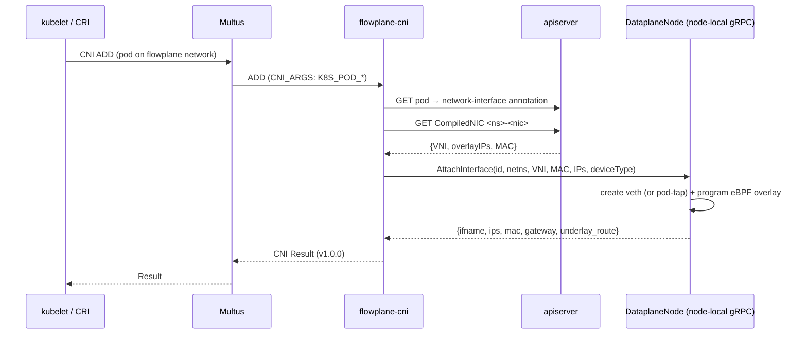

# CNI integration

!!! success "Status: Implemented"
    Pods join the ectobase overlay through **flowplane-cni**, a purpose-built
    CNI plugin invoked as a Multus **secondary** network. On pod ADD the plugin
    resolves the pod's overlay identity from a `CompiledNIC` and programs the
    node dataplane over the `DataplaneNode` gRPC.

## The Multus-secondary model

ectobase does not replace a compute cluster's primary pod network. Instead the
pool installs **Multus (thin)** as a wrapper over whatever CNI the node already
runs. The Multus thin DaemonSet drops `/opt/cni/bin/multus` and a
`00-multus.conf` that delegates the pod's **default** network to the
lexicographically-first existing config on the node (for example the cluster's
own CNI). The overlay is layered on top as a **secondary** attachment, so a pod
keeps its normal primary connectivity and additionally gains an overlay NIC.

The overlay attachment is described by a `NetworkAttachmentDefinition` named
`flowplane` that references the `flowplane-cni` plugin type:

```json
{
  "cniVersion": "1.0.0",
  "name": "flowplane",
  "plugins": [
    { "type": "flowplane-cni", "deviceType": "pod-tap", "tapName": "tap0" }
  ]
}
```

A workload joins the overlay by selecting this NAD — either via the standard
`k8s.v1.cni.cncf.io/networks` pod annotation, or (for VMs) via KubeVirt's network
binding mechanism, which injects the NAD into the launcher pod's Multus
annotation. See [KubeVirt / VM integration](kubevirt-integration.md) for the VM
path.

## Installation

The `flowplane-cni` binary is delivered by an installer DaemonSet
(`flowplane-cni-install`) that runs on every node and mounts the host's
`/opt/cni/bin` and `/etc/cni/net.d`. It drops the plugin binary and a
service-account-token kubeconfig (`dataplane-kubeconfig`) the plugin later uses,
from the host netns, to read the pod and its compiled config. The installer, its
`ServiceAccount`, and the RBAC the plugin needs are all part of the pool chart.

## On pod ADD

When the container runtime creates a pod sandbox on the overlay network, Multus
invokes `flowplane-cni` with the pod coordinates in `CNI_ARGS`. The plugin:

1. **Identifies the pod.** It parses `K8S_POD_NAMESPACE`, `K8S_POD_NAME`, and
   `K8S_POD_UID` from `CNI_ARGS`.
2. **Finds the bound interface.** Using the on-node kubeconfig it reads the pod
   object and follows its `net.ectobase.dev/network-interface` annotation to the
   `NetworkInterface` custom resource that describes this attachment.
3. **Resolves overlay identity from `CompiledNIC`.** It GETs the
   `CompiledNIC` named `<ns>-<nic>` in the NIC's namespace and reads the
   overlay `{VNI, overlay IPs, MAC}` from its spec. The plugin reads **only** this
   lowered object — never the raw `NetworkInterface`/`VPC`/policy objects — so the
   compute cluster never needs the source CRDs. A `CompiledNIC` with `vni == 0`
   is treated as not-yet-compiled and the ADD fails cleanly so the kubelet
   retries.
4. **Programs the datapath.** It dials the node-local `DataplaneNode` gRPC
   (default `127.0.0.1:1337`, reachable because the dataplane DaemonSet runs with
   host networking) and calls `AttachInterface` with the interface id
   (`<pod-uid>/<ifname>`), the target netns, and the resolved `{VNI, MAC, IPs}`.
   The dataplane creates the guest device (a veth for containers) and programs the
   eBPF overlay for it.
5. **Returns a CNI result.** It builds a CNI v1.0.0 `Result` from the attach
   response's IPs, MAC, and gateway. A default/secondary network requires at least
   one IP; if the dataplane returns none, ADD fails.

The whole ADD flow is bounded by a 30-second deadline so a hung apiserver or an
unreachable dataplane cannot stall sandbox creation indefinitely.

### The `deviceType` selector

The NAD's `deviceType` selects which guest-edge device the dataplane creates:

| `deviceType` | Guest edge | Used for |
| --- | --- | --- |
| `""` / `veth` | veth pair; guest end in the pod netns | Containers (default) |
| `pod-tap` | a `tap` in the pod netns spliced to a root-netns veth | KubeVirt VMs |

For `pod-tap` the NAD also sets `tapName: tap0`, because KubeVirt's
`domainAttachmentType: tap` opens the primary tap by that literal name.

## On pod DEL

DEL is best-effort and idempotent. Keyed off the pod UID it calls
`DataplaneNode.DetachInterface(<pod-uid>/<ifname>)`, ignoring not-found and
unreachable-dataplane errors so teardown never blocks. CHECK is a no-op success —
the plugin holds no per-interface state to validate.

## Flow



## Self-locating agent

The CNI attaches an interface; the **netplane agent** on the same node then
programs that interface's central policy. It does so **self-locatingly**: the
agent applies a `CompiledNIC`'s firewall / NAT / LB / peer-import / QoS **iff the
NIC's interface is attached on this node**, and it decides "on this node" by
matching the NIC's `(VNI, overlay IP)` against the interfaces the local dataplane
reports (`DataplaneNode.ListInterfaces`) — never by a declared `nodeName`. The
`CompiledNIC` carries no node field.

The join key is `(VNI, overlay IP)`, not the overlay IP alone, because overlay IPs
can collide across VPCs — two VPCs may both use `10.0.0.1`. The VNI disambiguates,
so the pair is globally unique. The node-local **underlay** nexthop is then taken
from the matched local interface (underlay allocation is node-local dataplane
state, not central config).

The consequence is that **policy follows the interface**. Wherever the CNI lands a
NIC — on an auto-scheduled node, or after a reschedule / live migration — the
agent on *that* node programs its policy, and no other node's agent does. Nothing
has to write a chosen node back into the control plane for the datapath to be
programmed correctly. This is the property that makes
[rescheduling & failover](./rescheduling-and-failover.md) and hub pool-scheduling
compose cleanly.

!!! success "Status: Implemented"
    The self-locating join lives in `netplane/agent/reconcile.go` (`localNIC`,
    the `(VNI, overlay IP)` `ipKey`) and is applied across `fwreconcile.go`,
    `natreconcile.go`, `lbreconcile.go`, `importreconcile.go`, and
    `qosreconcile.go`.

## Where this lives

| Concern | Location |
| --- | --- |
| Plugin entrypoint, ADD/DEL/CHECK | `cni/plugin/main.go` |
| Pod → NetworkInterface → `CompiledNIC` resolution | `cni/plugin/resolve.go` |
| gRPC dial + attach/detach | `cni/plugin/attach.go` |
| `DataplaneNode` service (`AttachInterface`, …) | `api/proto/dataplane/v1/dataplane.proto` |
| Installer DaemonSet + RBAC | `charts/ectobase-pool/templates/cni.yaml` |
| `flowplane` NAD | `charts/ectobase-pool/templates/kubevirt-binding.yaml` |
| Multus (thin) install | `test/lab/internal/deploy/multus.go` |
| Compiled per-NIC policy | `api/compiled/v1alpha1/compilednic_types.go` |
