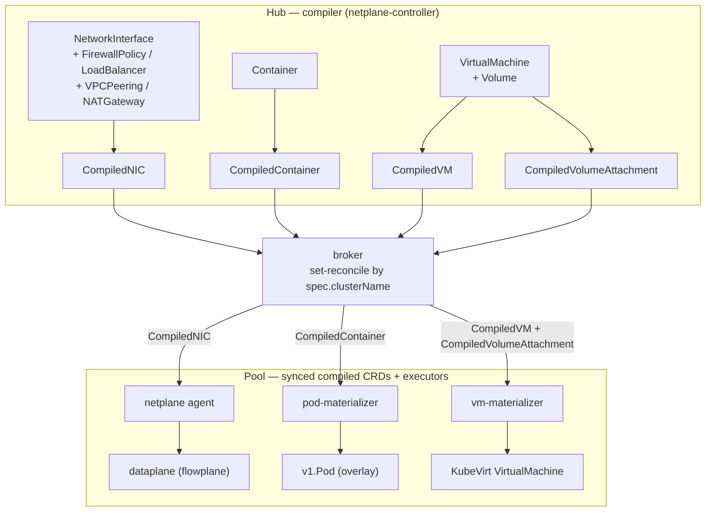

# Compile, sync, materialize

ectobase never programs the datapath directly from user intent. Intent CRDs are
first **compiled** into small, pool-scoped `Compiled*` objects, then **synced**
down to the owning pool, then **materialized** into real Kubernetes/KubeVirt
objects and **programmed** onto the dataplane. This is the single pipeline every
workload flows through:

> **intent** (authored on the hub) → **`Compiled*`** (compiled on the hub, stamped
> per pool) → **synced down** to the pool → **materialized / programmed** on the pool.

!!! success "Status: Implemented"
    The compiler, the broker sync, the pod-materialize path, and the agent's
    dataplane programming are implemented and exercised on the lab fabric. The
    VM-materialize path is partial — see the badge under
    [The materializers and the agent](#the-materializers-and-the-agent).

## The compiler

The compiler is the set of **netplane controller reconcilers**
(`netplane/controllers/`), which run on the hub against the aggregated apiserver
(`charts/ectobase-hub/templates/compiler.yaml`, the `netplane-controller`
Deployment). Each reconciler lowers one intent type into its `Compiled*` twin and
stamps the target pool (and, where applicable, node) onto it:

- **`CompiledNICReconciler`** (`compilednic.go`) — the richest one. Its `Compile`
  function lowers a `NetworkInterface` **together with** the `FirewallPolicy`,
  `LoadBalancer`, `VPCPeering`, and `NATGateway` allocations that apply to it into a
  single per-NIC `CompiledNIC` of **static central policy**: the firewall rules
  whose selector matches the NIC, its LB memberships, its resolved peer-import
  prefixes, and its NAT sources. (Node-local facts like the underlay are *not*
  compiled in — the agent reads those from the local dataplane.)
- **`CompiledVMReconciler`** (`compiledvm.go`) — `VirtualMachine` → `CompiledVM`.
- **`CompiledContainerReconciler`** (`compiledcontainer.go`) — `Container` →
  `CompiledContainer` (the pod template plus its overlay interfaces).
- **`CompiledVolumeAttachmentReconciler`** (`compiledvolumeattachment.go`) — a
  `VirtualMachine` plus its referenced `Volume`s → one `CompiledVolumeAttachment`
  per `VolumeRef`.

### How placement is resolved

Every compiled object carries `spec.clusterName` — the pool it is bound to — and
this is what the broker selects on. For NICs, the binding is resolved by
`resolvePlacement` (`compilednic.go`) with a clear precedence:

1. **Owning `Container`** — a Container is the *placement authority*: it supplies
   both the cluster **and** pins the `nodeName` for the NICs it references.
2. **Owning `VirtualMachine`** — contributes only the cluster binding; its NICs
   keep sourcing `nodeName` from the NIC's own `spec.nodeName`.
3. **The NIC's own `spec.clusterName`** — for a standalone NIC with no owning
   workload.
4. **The compiler default** — the `netplane-controller`'s configured default
   cluster.

`CompiledContainer`, `CompiledVM`, and `CompiledVolumeAttachment` inherit
`clusterName` from their owning workload's `spec.clusterName` directly. When a
workload is the placement authority, the compiler also stamps a `workload` label
onto the compiled objects; the vm-materializer relies on it to join a VM to its
volume attachments.

## The broker sync

The **broker** (`hub/pkg/broker`, `hub/cmd/broker/main.go`) syncs each compiled
type from the hub down to the owning pool's local CRDs — a declarative
set-reconcile filtered by `spec.clusterName == this pool`, with create / update /
delete + GC. It is idempotent and restart-safe. This seam is described in full in
[Multi-cluster control plane → Broker sync](./multi-cluster-control-plane.md#broker-sync);
here it is simply the middle stage: the compiled objects the hub produced become
real CRDs in the pool that hosts the workload.

## The materializers and the agent

On each pool, the synced compiled objects are consumed by three independent
executors.

### pod-materializer → Pod

`PodMaterializerReconciler` (`podmaterializer.go`) turns a `CompiledContainer`
into a `v1.Pod` on the overlay. It applies (server-side) a Pod pinned to
`spec.nodeName`, built from the compiled pod template, and attaches it to the
flowplane overlay via the **Multus** secondary-network annotation
(`k8s.v1.cni.cncf.io/networks`) plus the **flowplane-cni** NIC-ref annotation
(`net.ectobase.dev/network-interface`), which the CNI plugin resolves to the
broker-synced `CompiledNIC`.

### vm-materializer → KubeVirt VirtualMachine

`VMMaterializerReconciler` (`vmmaterializer.go`) plus
`VolumeMaterializerReconciler` (`volumematerializer.go`) turn a `CompiledVM` and
its `CompiledVolumeAttachment`s into a KubeVirt `VirtualMachine` with pinned-MAC
overlay interfaces on the flowplane Multus network. When volume attachments are
present the VM boots from persistent CDI `DataVolume` disks (boot attachment first,
then the rest by name); with none it falls back to an ephemeral `containerDisk`
from the compiled image. The overlay is attached via the KubeVirt `flowplane`
network-binding plugin (a tap device).

!!! warning "Status: Partial"
    The VM-materialize path depends on KubeVirt and CDI being installed on the pool
    and on the `flowplane` network-binding plugin being registered in the pool's
    KubeVirt CR. The materializer builds the correct KubeVirt objects, but the
    surrounding KubeVirt/tap wiring is still being hardened, so treat the VM path as
    partial relative to the fully-proven Pod path. See
    [KubeVirt integration](./kubevirt-integration.md).

### agent → dataplane

The netplane **agent** (`netplane/agent`) consumes `CompiledNIC` as its **central
policy** and programs the local `flowplane` datapath from it: firewall rules
(`fwreconcile.go`), LB memberships (`lbreconcile.go`), NAT sources
(`natreconcile.go`), and peering imports (`importreconcile.go`) all derive from the
`CompiledNIC`s scheduled to this node. The agent deliberately reads **only**
`CompiledNIC` for policy — never the raw `NetworkInterface`/`VPC`/`NATGateway` —
and gets node-local facts (overlay IPs, underlay) from the dataplane itself. The
dynamic overlay routes it programs come from the [route bus](./route-bus.md), not
from the compiled objects.

## The full pipeline

## Intent → compiled → executor

| Intent (hub) | Compiled (hub, pool-stamped) | Executor (pool) | Result |
|---|---|---|---|
| `NetworkInterface` (+ `FirewallPolicy`, `LoadBalancer`, `VPCPeering`, `NATGateway`) | `CompiledNIC` | netplane **agent** | dataplane programmed (firewall / LB / NAT / imports) |
| `Container` | `CompiledContainer` | **pod-materializer** | `v1.Pod` on the overlay |
| `VirtualMachine` | `CompiledVM` | **vm-materializer** | KubeVirt `VirtualMachine` |
| `VirtualMachine` + `Volume` | `CompiledVolumeAttachment` | **vm-materializer** | CDI `DataVolume` disk(s) |

## See also

- [Multi-cluster control plane](./multi-cluster-control-plane.md) — the hub/pool split and the broker seam.
- [Control/data split & the route bus](./route-bus.md) — how the agent learns dynamic overlay routes.
- [KubeVirt integration](./kubevirt-integration.md) — the VM materialize path in depth.
