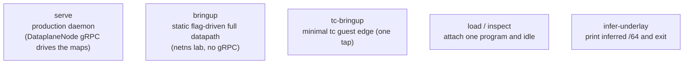

# The flowplane CLI

`flowplane` is a single binary that both runs the production datapath daemon and
provides static/debug bring-up modes for the labs. All modes load the embedded eBPF
bytecode; they differ in how the maps get populated (gRPC vs. flags) and which programs
get attached. This chapter documents the subcommands in `flowplane/flowplane/src/main.rs`.

## `serve` — the production daemon

The only mode used in a real deployment. It attaches the forwarding programs (`uplink_rx`
on the geneve `collect_md` device, the guest edge per interface), serves the
`DataplaneNode` gRPC, and attaches/detaches the guest edge as gRPC calls (from the node
agent and the CNI plugin) drive it. All map state comes from gRPC; there are no datapath
flags.

`--addr` selects the listen socket. A `unix://` path binds a Unix domain socket at that
path with mode 0600 (the deployed form: the dataplane gRPC is node-local and
root-equivalent, so a 0600 socket restricts it to root on the node); any other value is
parsed as a TCP `SocketAddr`. The `127.0.0.1:1337` in the flag's help text is an example of
the TCP form, not the default.

Key flags:

| Flag | Meaning |
|---|---|
| `--addr` | listen socket. A `unix://` path binds a 0600 Unix socket; anything else (e.g. `127.0.0.1:1337`) binds TCP. |
| `--role node\|edge` | `node` (default) is a hypervisor; `edge` additionally attaches `wan_rx` and registers a local-deliver edge underlay (shares VyOS's netns). |
| `--uplink` / `--extra-uplink` | the primary fabric uplink drives EDT egress shaping and the MTU/jumbo probe; `uplink_rx` itself attaches to the geneve `collect_md` device, which demuxes decap for every uplink, so `--extra-uplink` is a no-op under the geneve model and kept only for compatibility. |
| `--wan-uplink` | the WAN-facing uplink (`wan_rx` attaches to its tcx ingress); required for `--role edge`. |
| `--local-underlay` | this host's underlay IPv6 (outer src on encap; base of the `/128` allocation pool). Optional — otherwise resolved from the kubelet node IP (`HOST_IP`/`NODE_IP`) or inferred from a `lo`/`dummy*` fabric loopback. |
| `--gateway-mac` | underlay next-hop MAC — the outer Ethernet dst for all encapped traffic. |
| `--gateway` / `--gateway6` | overlay IPv4/IPv6 gateway the datapath answers ARP/ND for. |
| `--pin-dir` | bpffs pin directory (default `/sys/fs/bpf/flowplane`) — pins programs + maps so a restart re-adopts. |
| `--pin-links` | pin program links so a same-image restart is a zero-forwarding-gap re-point (default on; disable for a guaranteed fresh re-attach). |
| `--conntrack-max` | override the `CONNTRACK` capacity (also `FLOWPLANE_CONNTRACK_MAX`). |
| `--dhcp-*` | server-wide DHCP options. |

The graceful-restart machinery (map pinning, `IFACE_META` journal replay, IPAM reseed,
atomic `bpf_link_update`) is described in [HA & graceful restart](../ha-graceful-restart.md).

## `bringup` — static, flag-driven datapath

Brings up the full map-driven datapath from command-line flags (no gRPC), then idles.
This is how the netns lab configures a node without the Kubernetes control plane. Every
map is populated from repeatable flags, each encoding one control-plane object:

| Flag | Programs |
|---|---|
| `--guest ifname=ip4=mac=underlay=vni` | a local guest interface (`INTERFACES`, `UNDERLAY`, tc guest edge on `ifname`). |
| `--remote ip4=nexthop=vni` | a remote overlay route (`ROUTES`). |
| `--guest6` / `--remote6` | dual-stack v6 counterparts (`PortMeta.gateway_ipv6`, `ROUTES6`). |
| `--vip iface_ip=vip_ip` | a 1:1 VIP mapping (both `VIPS` directions). |
| `--lb ip:port:proto:lb_underlay` + `--lb-target …=backend_underlay` | an LB service + backends (allocates the Maglev table). |
| `--nat guest_ip=nat_ip:min:max` | a NAT source block (`NAT`). |
| `--neighbor-nat nat_ip:min:max@owner@vni` | a distributed-NAT return entry (`NEIGHBOR_NAT`). |
| `--underlay-vni ipv6:vni` | a VNI-only underlay marker for a NAT node with no local interface. |
| `--fw ifname:dir:action:proto:src:dst:dport` | a firewall rule (`FW_RULES`/`FW_META`). |
| `--meter ifname=total_mbps:public_mbps` | a per-interface egress rate cap (`METER`). |
| `--external ip4` | mark a remote route NAT-eligible. |

`bringup` also honors `--pin-dir` and an `--adopt` flag (re-open a pinned datapath after a
restart without re-loading), mirroring `serve`'s HA options for the lab.

## `tc-bringup` — minimal guest edge

Attaches `tc_guest_tx` to a single tap's clsact/tcx ingress and programs `PORT_META` +
DHCP/route config for it, then idles. Used to exercise the guest edge (DHCP responder,
egress encap) in isolation — a single-interface subset of `bringup`. It accepts a focused
flag set: `--uplink`, `--local-underlay`, `--gateway-mac`, per-guest v4/v6 identity, and
`--remote`/`--remote6` routes.

## `load` / `inspect` — single-program debug helpers

Each attaches one program to an interface and idles. There is no `pass` subcommand: the
overlay pipeline is entirely tcx, so the `xdp_pass` shim that native-XDP-redirect-into-veth
once required is gone.

| Subcommand | Program | Use |
|---|---|---|
| `load --uplink <iface>` | `uplink_rx` | attach `uplink_rx` as a clsact/tcx ingress classifier directly on `<iface>` and idle. This is a debug helper; `serve` attaches `uplink_rx` to the geneve `collect_md` device instead. |
| `inspect --iface <iface>` | `xdp_inspect` | attach the XDP inspector (native, falling back to SKB mode) and print the first packet bytes periodically. |

## `infer-underlay` — resolve the underlay `/64`

Prints this host's inferred underlay `/64` (preferring a `lo`/`dummy*` fabric loopback)
and exits. It needs no root and touches no datapath; it just reads `ip -6 -o addr`. The containerlab
IPv6-fabric e2e uses it to assert the inferred `/64` matches the fabric-announced `dummy0`.

## Where to go next

- [Datapath programs](programs.md) — the programs these commands attach.
- [BPF maps & state model](maps.md) — the maps `bringup` flags populate.
- [The clab + Talos fabric](../../tutorials/local-fabric.md) — where `serve` runs in integration.
- [Getting started](../../tutorials/getting-started.md) — the `make` targets that wrap these.
