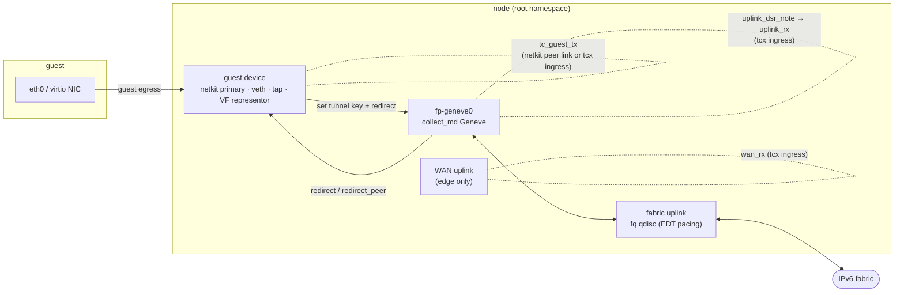
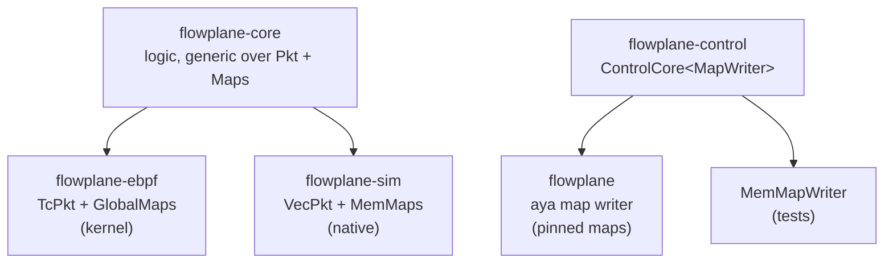

# The flowplane dataplane

**flowplane** is ectobase's per-node dataplane: eBPF programs, written in Rust with aya, that move
every overlay packet, plus a userspace daemon that loads them, owns their maps and serves a gRPC API.
This page is the one-page tour: what runs where, how the code is split, and how the control plane
reaches it. The pages after it go into the programs, the maps, the shared core and the CLI.

## Where it runs

flowplane runs as `flowplane serve` in the `flowplane` DaemonSet on every pool node (host network,
privileged, with `/sys/fs/bpf` mounted). On a WAN edge it runs with `--role edge` beside the edge
router. Each instance:

- creates the node's Geneve device `fp-geneve0` and attaches the ingress programs to it;
- serves the `DataplaneNode` gRPC API on `unix:///run/flowplane/dataplane.sock`;
- creates guest devices and attaches the guest program on `AttachInterface`;
- ages conntrack entries every 10 s, and optionally runs the hardware offload manager (`--offload`).

## Design in four rules

1. Map-driven. The eBPF programs make no distributed decisions. Every forwarding choice is a map
   lookup: routes, interfaces, firewall classes, NAT blocks, Maglev tables. Userspace writes those maps;
   the programs only read them, apart from connection state (conntrack, DSR notes, meters) and the
   guest MAC the DHCP responder learns.
2. tc and netkit, not XDP. Every forwarding program is a tc classifier on a tcx hook or a netkit
   BPF link. The overlay depends on skb tunnel metadata (`bpf_skb_set_tunnel_key`), which XDP does not
   have. The only XDP program is a debugging aid.
3. The kernel owns Geneve. The programs stamp a tunnel key and redirect to the kernel's
   `collect_md` Geneve device; they never write outer headers. See [the overlay](../overlay.md).
4. One copy of the logic. Packet logic lives once, in a `no_std` crate that runs in the kernel
   programs, in a native simulator and in unit tests. See [the pure core](pure-core.md).

## The hooks

| Hook | Program | Job |
|---|---|---|
| Guest device (host side) | `tc_guest_tx` | Everything a guest sends: local responders, firewall, NAT, route, deliver or encapsulate |
| `fp-geneve0` tcx ingress, first | `uplink_dsr_note` | Note the DSR load-balancer address for the reply |
| `fp-geneve0` tcx ingress | `uplink_rx` | Deliver a decapsulated packet: local interface, NAT return, load balancer, edge |
| WAN uplink tcx ingress (edge) | `wan_rx` | Internet traffic to a NAT or load-balancer address, back into the overlay |
| Tail calls | `tc_guest_dhcp`, `tc_guest_nat64`, `tc_guest_egress_v6`, `xdp_uplink_v6` | Paths that need a fresh 512-byte eBPF stack |

[Programs and hooks](programs.md) covers each one.

## The crates

The workspace (`Cargo.toml` at the repository root) has seven flowplane crates.

| Crate | `no_std` | What it holds |
|---|---|---|
| `flowplane-common` | yes | The `#[repr(C)]` map key and value types shared byte for byte by eBPF and userspace, plus constants such as `ENCAP_OVERHEAD_V6` |
| `flowplane-core` | yes | The packet logic, generic over the `Pkt` and `Maps` traits: parsing, firewall, conntrack, NAT, NAT64, load balancing, DHCP, ARP/ND, and the per-hook orchestrators in `datapath/` |
| `flowplane-ebpf` | yes | The eBPF programs: thin glue that builds the kernel `Pkt`/`Maps` impls, calls the core and executes its verdict; the map declarations |
| `flowplane-control` | no | The backend-agnostic control core (`ControlCore<W: MapWriter>`): what to write into which map for an interface, route, NAT block, load balancer or firewall, with the shadow state that makes updates and restarts safe |
| `flowplane-device` | no | Linux device plumbing: the Geneve device, veth, netkit, tap, SR-IOV VFs, tc-flower, guest namespace setup, underlay address inference |
| `flowplane` | no | The daemon and CLI: the eBPF loader, the aya-backed map writer, the gRPC handlers, attach, restart adoption, conntrack aging, the offload manager |
| `flowplane-sim` | no | The native simulator: a `Vec`-backed `Pkt`, `HashMap`-backed `Maps`, single nodes and multi-node fabrics |

## Pure core and kernel shim

The split that shapes the code is between logic and the environment it runs in.

On the packet side, the eBPF programs are a shim: they read the hook's context, call one core
orchestrator such as `process_uplink_rx`, and turn the returned action into a tc verdict, a redirect
or a tunnel-key stamp. On the control side, `flowplane-control` decides the map writes and calls a
`MapWriter`; the daemon supplies one backed by aya and the pinned kernel maps, tests supply an
in-memory one. Both halves can therefore be tested without root and without a kernel.

## The control socket and gRPC

The daemon serves two gRPC services on one listener: `DataplaneNode`
(`api/proto/dataplane/v1/dataplane.proto`) and the standard `grpc.health.v1.Health`. With a
`unix://` address the socket is created with mode `0600`: the API is node-local and root-equivalent,
so only root on the node may call it. The pod's readiness probe checks that the socket exists, which
flowplane creates only after the datapath is loaded and attached.

| Caller | RPCs |
|---|---|
| `flowplane-cni` | `AttachInterface`, `DetachInterface` |
| mesh agent, routes | `ListInterfaces`, `AddRoute`, `WithdrawRoute` |
| mesh agent, NAT | `AddNatSource`, `WithdrawNatSource`, `AddNeighborNat`, `WithdrawNeighborNat`, `ReplaceNeighborNats` |
| mesh agent, load balancing | `AddLoadBalancer`, `DelLoadBalancer`, `AddLbBackend`, `DelLbBackend` |
| mesh agent, policy | `ReplaceInterfaceFirewall`, `ConfigureQoS` |

Most calls are idempotent or declarative by design: `AddRoute` replaces an existing route in place,
withdrawing an absent route is not an error, and `ReplaceInterfaceFirewall` and `ReplaceNeighborNats`
replace a whole set at once, so the agent can push its complete desired state on every reconcile.
`ListInterfaces` also returns an `instance_id` that changes on every process start, which the agent
uses to detect a restart (see [the route bus](../route-bus.md#restarts-the-instance-id)).

## Restarts

The maps are pinned under `/sys/fs/bpf/flowplane` and the program links are pinned too
(`--pin-links`, on by default). When `serve` starts and finds pinned maps, it adopts them: it rebuilds
its in-memory state from the maps and the `IFACE_META` journal and re-points the surviving links at
the newly loaded programs, so forwarding does not stop. [HA and restarts](../ha-and-restarts.md)
covers the mechanism.

## Checking eBPF changes

The eBPF verifier limits each program to a 512-byte stack across nested calls, and much of the
program structure (separate tail-called programs, out-of-line helpers, `uplink_dsr_note` as its own
program) exists to stay under it. `make ci` cannot see a verifier rejection; `make verifier` (needs
root) loads every program through the kernel verifier and is part of finishing any datapath change.

## Where to go next

- [Programs and hooks](programs.md): each program, step by step.
- [Maps and state](maps.md): every map, its key and value, and who writes it.
- [The pure core](pure-core.md): the `Pkt` and `Maps` traits and the testing rule they enforce.
- [The flowplane CLI](cli.md): `serve` and the lab subcommands.
