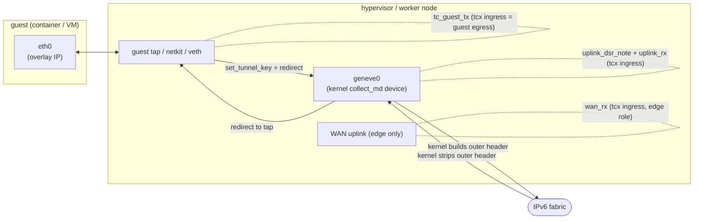

# Datapath programs

`flowplane` runs the overlay as tc (tcx) classifiers, not as a hand-rolled XDP tunnel. The
kernel's Geneve `collect_md` device owns the wire encapsulation: on egress it builds the outer
Ethernet/IPv6/UDP/Geneve header from a tunnel key the datapath stamps; on ingress it strips that
header before any eBPF program runs. The eBPF programs are tc classifiers that stamp the tunnel key
(`bpf_skb_set_tunnel_key`) on the way out and read it (`bpf_skb_get_tunnel_key`) on the way in. They
never read or write outer-header bytes.

Guest egress is intercepted on the guest edge tap (tcx ingress), classified, and either delivered
locally or handed to the geneve device with a tunnel key. Fabric ingress arrives already decapped on
the geneve device (tcx ingress), where the datapath reconstructs the delivery target from the VNI
plus the inner destination and redirects to the guest.

The program bodies are deliberately thin: each builds the `Pkt`/`Maps` trait impls and calls into
[`flowplane-core`](pure-core.md), so the same forwarding code runs in eBPF and in the simulator. The
tables below name the real entry points in `flowplane-ebpf/src/`.

## Attachment map

| Program | Attach type | Where it attaches | Direction |
|---|---|---|---|
| `uplink_dsr_note` | tcx ingress (ordered first) | geneve `collect_md` device | fabric → local, DSR-note pre-pass |
| `uplink_rx` | tcx ingress | geneve `collect_md` device | fabric → local guest |
| `xdp_uplink_v6` | tc classifier (tail-call only) | not attached; reached via `UPLINK_PROGS` | inner-IPv6 firewall/conntrack |
| `wan_rx` | tcx ingress | WAN uplink (edge role only) | internet → overlay return |
| `tc_guest_tx` | tcx ingress | each guest's tap/netkit/veth | guest → fabric |
| `tc_guest_nat64` | tc classifier (tail-call only) | reached via `GUEST_PROGS_TC` | guest NAT64 egress |
| `tc_guest_egress_v6` | tc classifier (tail-call only) | reached via `GUEST_PROGS_TC` | guest IPv6 overlay egress |
| `tc_guest_dhcp` | tc classifier (tail-call only) | reached via `GUEST_PROGS_TC` | guest DHCP responder |
| `xdp_inspect` | XDP | any interface (debug) | packet dump |

Only `xdp_inspect` is an actual `#[xdp]` program. Every forwarding program is a `#[classifier]`,
including `xdp_uplink_v6`, which keeps its historical name to minimize the loader diff but is a tc
program reached only by tail-call.

## Geneve device ingress: `uplink_dsr_note` + `uplink_rx`

Fabric ingress attaches to the kernel geneve `collect_md` device, not to a physical NIC. A single
virtual device demuxes every decapped overlay frame regardless of which uplink carried it, so a
dual-homed host needs no per-NIC attach. Two separate tcx programs share the geneve ingress hook,
ordered by the loader's `LinkOrder::first()` attach.

`uplink_dsr_note` runs first. Its only job is the DSR reverse-VIP note: it reads the Geneve DSR
option off the skb tunnel metadata (`bpf_skb_get_tunnel_opt`) and records the reverse-VIP conntrack
entry (`conntrack::dsr_note`/`dsr_note6`). It always returns `TC_ACT_UNSPEC` (`TCX_NEXT`) so
`uplink_rx` runs next. It exists as its own program because folding the note into `uplink_rx` blows
the verifier's 512-byte combined-stack budget, and out-of-lining it onto `uplink_rx`'s call graph is
rejected outright (see the module doc in `flowplane-ebpf/src/ingress.rs`).

`uplink_rx` (`ingress::try_uplink_rx`) handles delivery. On entry the frame is already the inner
frame the sender handed the geneve device; the VNI comes from `bpf_skb_get_tunnel_key`, not from any
outer address. The shared orchestrator `flowplane_core::datapath::process_uplink_rx` reconstructs
the delivery target from `(vni, inner destination)` across four mechanisms:

- Local delivery: `INTERFACES[(vni, inner_ipv4)]` / `INTERFACES6[(vni, inner_ipv6)]` marks the
  destination local. Rewrite the inner Ethernet (dst = guest MAC, src = gateway MAC) and redirect to
  the tap, using `bpf_redirect_peer` when the delivery device has a pod-netns peer (veth/netkit) and
  a plain `bpf_redirect` otherwise. Keying on the overlay `(vni, ip)` is what makes overlapping
  overlay IPv4 across VNIs safe.
- Load balancing: Maglev-select a backend underlay for the VIP. If the backend is remote, re-stamp
  the tunnel key at the backend node and redirect back to the geneve device without decapping. The
  inner destination stays the VIP (DSR). See [Load balancing](../../features/loadbalancer.md).
- NAT return: a conntrack `CT_REWRITE_DST` entry restores the guest's inner destination (and, for
  NAT64, expands an IPv4 reply back to IPv6).
- Edge local-deliver: on the WAN edge, an `INTERFACES` miss against the edge's own
  `UNDERLAY_LOCAL_DELIVER` sentinel hands the inner packet to the local kernel (VyOS), which
  masquerades it to the internet.

An `INTERFACES` miss on a non-edge node is a genuine miss and drops. Before delivery, the path
applies the firewall (deny-by-default) and touches or creates conntrack. Inner-IPv6 frames tail-call
`xdp_uplink_v6` through the `UPLINK_PROGS` program array, which resets the BPF stack so the v6
firewall and conntrack path gets a fresh 512-byte budget; tc programs can only tail-call other tc
programs, hence the dedicated array.

## Guest egress: `tc_guest_tx`

`tc_guest_tx` (tcx ingress on the guest's tap/netkit/veth, which is the guest's egress direction)
processes everything a guest emits:

1. ARP and IPv6 ND for the overlay gateway are answered in place and redirected back to the guest.
2. DHCPv4/DHCPv6 requests tail-call `tc_guest_dhcp`; overlay-egress traffic to the NAT64 prefix
   (`64:ff9b::/96`) tail-calls `tc_guest_nat64`; other inner-IPv6 traffic tail-calls
   `tc_guest_egress_v6`. Every tail call runs through the `GUEST_PROGS_TC` program array and gets a
   fresh verifier stack budget.
3. Firewall (deny-by-default, egress direction) and conntrack creation.
4. VIP / SNAT rewrites and, if configured, rate metering.
5. Route and deliver decision: an exact-match lookup in `ROUTES`/`ROUTES6` for the guest's VNI
   yields either a local redirect straight to the destination tap (same-host fast path), an overlay
   encap (stamp the resolved `{vni, remote}` tunnel key via `bpf_skb_set_tunnel_key` and redirect to
   the geneve device), or a pass to the kernel when no route matches.

The heavy per-protocol logic (DHCP, NAT64, route lookup, encap decision) lives in `flowplane-core`;
`tc_guest_tx` and its tail-call targets are the tc-context glue. `tc_guest_egress_v6` and
`tc_guest_nat64` are split out as separate tail-called programs because the firewall + conntrack +
route + encap chain overflows `tc_guest_tx`'s own combined stack frame.

## `wan_rx` — the WAN-edge return path

On an edge node (`serve --role edge`, sharing VyOS's netns), `wan_rx` (`ingress::try_wan_rx`)
attaches to the WAN-facing uplink's tcx ingress. It catches internet return traffic destined to a
registered `nat_ip` and encapsulates it back toward the owning hypervisor over the fabric by stamping
the tunnel key and redirecting to the geneve device. The reverse direction, overlay egress to the
internet, is delivered on the far host by the `uplink_rx` edge local-deliver branch above. Both
directions reuse the same tunnel-key core. See [North-South WAN edge](../../features/ns-edge.md).

## DHCP / ARP / ND responders

The datapath answers L2/L3 control-plane requests locally, so a guest never needs an external DHCP
or discovery service:

- DHCPv4 / DHCPv6: `tc_guest_dhcp` (tail-call target, slot `GUEST_PROG_DHCP`) parses the request and
  writes a fixed-layout reply offering the guest's overlay address, gateway, MTU, and DNS servers
  (from `DHCP_CONFIG` + per-interface `DHCP_META`), then redirects it back out the tap. It also
  learns the guest MAC.
- ARP (IPv4) and IPv6 ND: answered inline in `tc_guest_tx` for the configured overlay gateway,
  presenting the gateway at the shared virtual-router MAC (`GW_MAC`).

See [DHCP / ARP / IPv6 ND responders](../../features/dhcp-arp-nd.md).

## Debug / support programs

- `xdp_inspect`: the only real XDP program. `flowplane inspect` attaches it to an interface and dumps
  the first packet bytes into the `INSPECT` map on a timer. It is a debugging aid, not part of the
  datapath.

There is no `xdp_pass` program and no devmap: the overlay pipeline is entirely tcx, and delivery
uses `bpf_redirect`/`bpf_redirect_peer` on the skb, so the native-XDP-redirect-into-veth peer
requirement that once needed an `xdp_pass` shim no longer applies.

## Where to go next

- [The overlay](../../concepts/overlay.md) — the concept these programs implement: Geneve over an IPv6 underlay.
- [The pure-core seam](pure-core.md) — how these programs share code with the simulator.
- [BPF maps & state model](maps.md) — the maps every program reads and writes.
- [The flowplane CLI](cli.md) — how the programs get attached.
