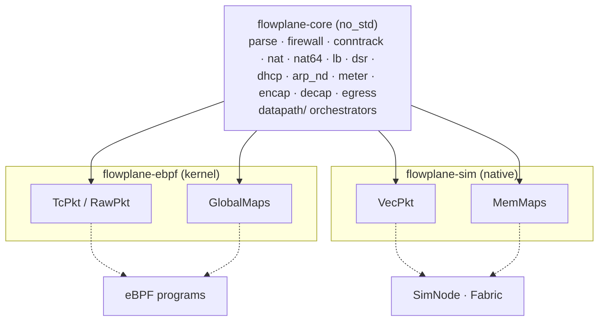

# The pure core

flowplane's packet logic is written once, in `flowplane-core`, and runs in three places: the eBPF
programs in the kernel, the native simulator, and plain unit tests. This page explains the seam that
makes that possible, the `Pkt` and `Maps` traits, the rule that keeps production and tests running
the same code, and what each test level can and cannot prove.

## The seam

`flowplane-core` is a `no_std` crate with no dependency on aya, the kernel or `std`. Its functions are
generic over two traits, and each environment supplies its own implementations.

### Pkt: byte access to a packet

`Pkt` (`flowplane-core/src/pkt.rs`) is bounds-checked access to a frame. It is a trait rather than a
`&mut [u8]` because the verifier only accepts raw-pointer access with explicit bounds checks against
the packet end; a slice would not verify.

- `read_array::<N>` and `write_array::<N>` take the length as a const generic, so the eBPF
  implementation turns each into one fixed-width load or store instead of a byte loop. That keeps the
  larger rewriters, such as SNAT, inside the verifier's limits.
- `len` is the bytes in the linear head; `logical_len` is the full packet length (`skb->len`), which
  is larger for a non-linear skb.
- `grow_head` and `shrink_head` add or remove bytes after the Ethernet header. In the kernel they call
  `bpf_skb_adjust_room`. The overlay never resizes packets, since the kernel adds and strips the outer
  header; NAT64 is the remaining user (shrink by 20 bytes from IPv6 to IPv4, grow by 20 on the way
  back).
- `set_tail` resizes at the tail. Only the simulator's `VecPkt` implements it; in the kernel the
  glue resizes with `bpf_skb_change_tail` and wraps the result in a new `RawPkt`.

The core returns an `Action` for the glue to carry out: `Pass`, `Drop`, `Redirect(ifindex)`,
`RedirectPeer(ifindex)` or `PassToStack` (hand to the local stack as `PACKET_HOST`), plus, where it
applies, a tunnel-key decision (`TunnelEncap`: VNI and remote VTEP).

### Maps: typed access to the state

`Maps` (`flowplane-core/src/maps.rs`) has one method per lookup or update the core needs:
`local`, `route4_get` and `route6_get`, `ifaces_get` and `ifaces6_get`, `fw_bind`, `fw_class4`,
`fw_policy4` and their IPv6 versions, `fw_epoch`, `conntrack_get` and `conntrack_insert`, `dsr_get`,
`lb_get`, `maglev_get`, `nat_get`, `nat_owner`, `dhcp_config`, `meter_get`, `meter_update`, and so
on. It is used through generics, never `dyn`, so the kernel implementation compiles down to direct map
calls.

### The implementations

| | Crate | `Pkt` | `Maps` |
|---|---|---|---|
| Kernel | `flowplane-ebpf` (`coreimpl.rs`) | `TcPkt` over the tc context; `RawPkt` over a `(data, data_end)` window | `GlobalMaps`, thin wrappers over the `#[map]` statics |
| Native | `flowplane-sim` | `VecPkt` over a `Vec<u8>` | `MemMaps`, `HashMap`-backed |

The control side has the same shape. `flowplane-control`'s `ControlCore<W: MapWriter>` decides every
map write for an interface, route, NAT block, load balancer or firewall rule set. The daemon passes a
writer backed by aya and the pinned maps; tests pass `MemMapWriter`.

## The orchestrators

`flowplane-core/src/datapath/` holds one orchestrator per hook: a function that calls the individual
core steps in the same order and with the same gates as the program.

| Orchestrator | Program | How the program uses it |
|---|---|---|
| `process_uplink_rx`, `process_uplink_v6` | `uplink_rx`, `xdp_uplink_v6` | calls it directly |
| `process_wan_rx` | `wan_rx` | calls it directly |
| `process_guest_tx`, `process_guest_tx_v6`, `process_guest_tx_nat64` | `tc_guest_tx`, `tc_guest_egress_v6`, `tc_guest_nat64` | runs the same core steps in its own sequence |
| `process_guest_arp_nd`, `process_guest_dhcp4` | the responders in `tc_guest_tx` and `tc_guest_dhcp` | calls the same responder functions directly |

On the ingress side the program builds `TcPkt` and `GlobalMaps`, calls the orchestrator and executes
the result. On the guest side the stack budget forces the program to run its steps as separate
out-of-line calls (`forward_decision_v4` in `flowplane-ebpf/src/egress.rs`), so the program and the
orchestrator are two sequences over the same core functions: `route4`, `deliver`, `fw_classify`,
`snat_egress`, the conntrack functions. The orchestrator is what the simulator runs, and it has to
follow the program's order.

The simulator's `SimNode` calls the orchestrators over `VecPkt` and `MemMaps`, and `Fabric` wires
several `SimNode`s together to run multi-node scenarios.

## The rule: call the core, never fork it

> Production eBPF calls the core function. It never keeps its own copy of datapath logic that the
> tests then exercise separately.

The whole point of the seam is that the code under test is the code in production. If a program
reimplemented, say, firewall evaluation inline and the tests exercised the core's version, the tests
would validate code the kernel never runs.

When the verifier will not accept a path through the seam, the answer is to restructure it (an
out-of-line helper, a separate tail-called program) or to test the real program another way, not to
keep a parallel copy guarded by a parity check.

Two pieces of eBPF-side logic sit outside the core today:

- Egress floating-IP rewrites (`flowplane-ebpf/src/floatingip.rs`) run in `tc_guest_tx` on raw
  pointers, and the simulator does not model them. The ingress side is in the core.
- The DHCPv6 responder is in the eBPF crate, because its reply has options at offsets only known at
  run time, which the fixed-size `Pkt` accessors cannot express. DHCPv4 is in the core.

## What each test level proves

| Level | Command | Root | Proves |
|---|---|---|---|
| Core and simulator | `make sim` | no | The logic, over every case a scenario sets up, on one node or a multi-node fabric |
| Verifier | `make verifier` | yes | Every program loads: stack budget, instruction limits, bounds |
| Byte-parity anchors | `make sim-anchor` | yes | The compiled bytecode, run through `BPF_PROG_TEST_RUN`, matches the simulator byte for byte |

Anchors have a hard limit on the ingress side. A test skb from `BPF_PROG_TEST_RUN` carries no tunnel
metadata, and `uplink_rx` reads its VNI from that metadata before anything else. So the uplink anchors
(`anchor_uplink`, `anchor_lb`, `anchor_dnat`) only prove the real program fails safe: it passes the
packet unchanged. Delivery, load balancing and NAT return on the ingress side are proved by the
simulator alone, which is why the simulator has to cover every case there.

Anchored today: the guest egress encap with the firewall classifier and conntrack epoch, the `wan_rx`
NAT relay, and the DHCPv4 offer. Not anchored: DHCPv6, the DHCP fallback MTU, the ARP and ND replies,
and NAT64 translation.

## Adding a datapath feature

1. Write the logic in `flowplane-core`, generic over `Pkt` and `Maps`, adding any new `Maps` method.
2. Implement the new method in `GlobalMaps` and in `MemMaps`.
3. Call the core from the eBPF program; do not reimplement it there.
4. Add simulator tests with `SimNode` or `Fabric` covering every case, including the ingress cases an
   anchor cannot reach.
5. Add a `BPF_PROG_TEST_RUN` anchor where the path can be anchored.
6. Run `make verifier`.

## Where to go next

- [Programs and hooks](programs.md): the glue around each orchestrator.
- [Maps and state](maps.md): the maps behind the `Maps` trait.
- [The simulator](../../contributing/testing/sim.md): writing simulator scenarios.
- [Testing strategy](../../contributing/testing/strategy.md): how these levels fit with the live tests.
