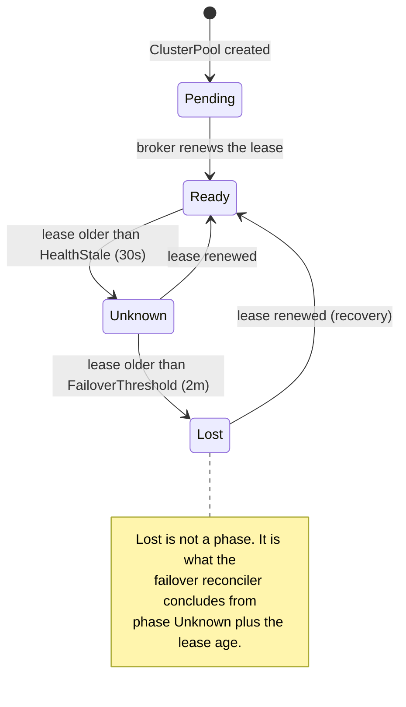
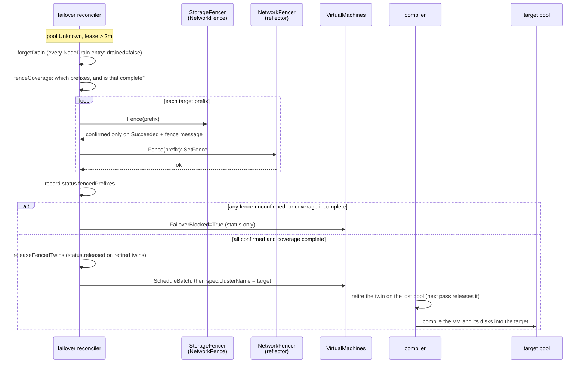
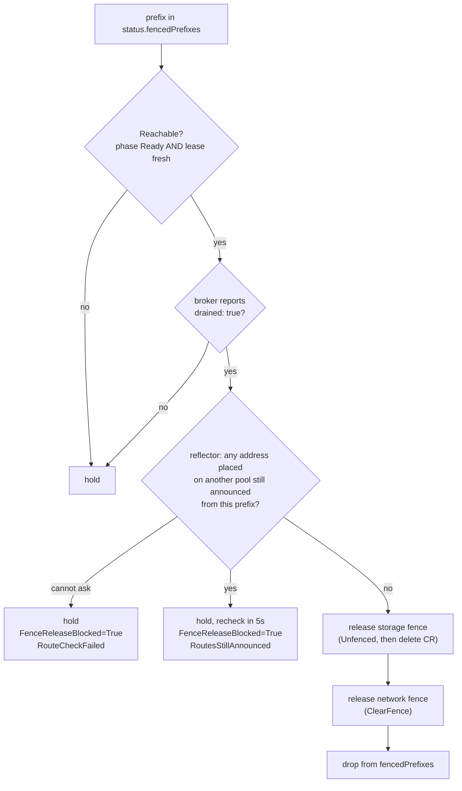

# Scheduling, rescheduling and failover

This page explains how the dispatch places a VM on a pool, how it notices that a pool is gone, and
how it moves that pool's VMs elsewhere without ever letting two copies of a VM write the same disk.
It also covers the way back: how a recovered pool earns its fences off again, and what to do when
it does not.

Terms used here: the **dispatch** is the fleet control plane; a **pool** is a compute cluster,
represented by a `ClusterPool`, whose twins live in namespace `pool-<name>` on the dispatch; the
**broker** runs in each pool and syncs twins down and status up; the **reflector** is the hub of
the route bus. A **fence** on a prefix is two things at once: a reflector route fence and a Ceph
`NetworkFence`.

!!! warning "Status: Partial"
    Fencing, rebinding, the release of retired twins and the drain-gated recovery are exercised end
    to end on the lab by `TestTier2Failover`, which checks the Ceph blocklist and that the target
    pool boots the original disk by CSI handle. The route gate on fence release is covered by envtest
    only: no live run has yet had to wait on it. Tier-2 has had no soak or chaos testing.

## Two tiers

ectobase remediates at two scopes that do not depend on each other.

- **Tier-1, inside a pool.** A dead node is handled by the pool itself, with no dispatch involvement.
  KubeVirt restarts a VM elsewhere in the pool (the compiler defaults `runStrategy` to
  `RerunOnFailure`), and the pool chart can render a medik8s `NodeHealthCheck` and
  `SelfNodeRemediationTemplate` (`tier1Failover.enabled`, off by default) to reboot or taint the
  node out of service.
- **Tier-2, across pools.** When a whole pool is lost, the dispatch fences it and rebinds its VMs to
  healthy pools.

A node failure is common and recoverable in place. Losing a pool is rare, and recovering from it
means starting stateful VMs on other hardware, which is only safe once the old hardware provably
cannot write their disks. Different problems, so different mechanisms. Tier-2's threshold is long
enough that Tier-1 has normally handled a node blip before Tier-2 would act.

The Tier-1 values in the pool chart:

```yaml
tier1Failover:
  enabled: false                          # renders nothing when false
  snrNamespace: self-node-remediation
  unhealthyThreshold: 60s                 # node Ready=Unknown/False this long before remediation
  minHealthy: "51%"                       # never remediate below this healthy quorum
  remediationStrategy: OutOfServiceTaint  # Automatic | ResourceDeletion | OutOfServiceTaint
  watchdog:
    enabled: false                        # true arms /dev/watchdog for a hardware self-fence
    device: /dev/watchdog
```

The rest of this page is Tier-2.

## Initial placement

A VM declared without `spec.clusterName` is bound by the dispatch scheduler. The scheduler only picks
the pool; inside the pool, KubeVirt and kube-scheduler pick the node.

The scheduler (`dispatch/pkg/scheduler`) considers pools that are:

- in phase `Ready`,
- matched by the VM's `poolSelector`, if it has one, and
- able to fit the VM: for every requested resource, the requests of every VM and `Container`
  already bound to the pool plus this VM's must stay within the pool's reported `allocatable`.

Among those it picks the pool with the highest minimum free fraction across the requested resources,
breaking ties by name. It writes `spec.clusterName` and sets the VM's `Scheduled` condition to
`True` (`Bound`), or to `False` (`Unschedulable`) when nothing fits. Binds are serialized by a single
reconcile worker so two VMs cannot both claim the last capacity.

!!! note
    The initial scheduler does not read `spec.antiAffinity`. Only failover's batch placement,
    described below, honours it.

Once bound, `spec.clusterName` is the VM's placement. Changing it is a move, whoever changes it; see
[Moving a VM between clusters](vm-moves.md).

## Detecting a lost pool

The dispatch learns that a pool is alive from its broker's lease. This section explains how a stale
lease turns into a failover.



1. The broker renews `status.lease.renewTime` on its `ClusterPool` every 10 seconds.
2. The pool-health reconciler (`dispatch/pkg/clusterpool`) derives `status.phase`: `Pending` with no
   lease, `Ready` when the lease is at most `HealthStale` (30 s) old, `Unknown` when older. It mirrors
   the phase into a `Ready` condition (`LeaseFresh`, `LeaseExpired` or `NoLease`).
3. The failover reconciler (`dispatch/pkg/failover`) treats a pool as lost when its phase is
   `Unknown` and its lease is older than `FailoverThreshold` (2 minutes).

Two fail-safe defaults sit here. A pool with no lease timing at all is never lost: without evidence
of how long it has been gone, the dispatch does nothing destructive. And the 2-minute threshold is
deliberately far above the 30-second health window.

Only one dispatch-controller acts at a time. Two would each fence and rebind the same pool, so the
manager holds the leader-election Lease `ectobase-dispatch-controller` before it starts any
reconciler. See [HA and restarts](ha-and-restarts.md).

## Failover, step by step

Failover is one reconcile loop over `ClusterPool`s. Each pass on a lost pool runs these steps in
order, and stops at the first one that cannot be confirmed.



### Forget the old drain report

`status.nodeDrain` is the broker's last report of which fenced prefixes are free of VMIs. Nothing
else clears it, and the broker writes it apart from its lease. So `forgetDrain` sets every entry to
not drained before fencing. A pool that comes back can then be `Ready` on a fresh lease without a
stale `drained: true` from before the loss releasing anything; only a report the broker makes after
it is back counts.

### Decide what to fence: coverage

A fence on the prefixes the dispatch knows about is not necessarily a fence on every node.
`status.nodePrefixes` is reported by the broker, so the dispatch's copy is frozen at what it saw
before contact was lost; a node that joined during the outage is missing from it. `fenceCoverage`
decides explicitly.

| Situation | What is fenced | Coverage | Outcome |
|---|---|---|---|
| `spec.underlayPrefix` set | that one aggregate, e.g. `fd00:cafe:1a2b::/48` | complete by construction | proceeds |
| unset, reported prefixes collapse to one distinct /64 | that /64 | complete: every node's VTEP is a /128 inside it | proceeds |
| unset, several distinct /64s | every reported /64 | not provable | fences, then blocks the rebind |
| unset, nothing reported | nothing | none | blocks |

The third row fences first and blocks second on purpose. Containing the nodes the dispatch knows
about costs nothing; the step that can corrupt a filesystem is attaching a disk elsewhere while an
unfenced node might still write to it, so that is the step withheld. The fix is to declare
`spec.underlayPrefix` on the `ClusterPool`, an aggregate containing every node's underlay. It is
central configuration set at registration, precisely so that it does not depend on the cluster that
can no longer be reached.

### Fence each prefix

For each target, the reconciler applies both fences and needs both confirmed:

- **Storage fence.** A csi-addons `NetworkFence` puts the prefix on the Ceph blocklist. It counts as
  confirmed only when the CR is `Fenced` and reports `Succeeded` with the message
  `fencing operation successful`. The CR protocol is described in
  [Storage and VMs](storage-and-vms.md#the-storage-fence-csi-addons-networkfence).
- **Network fence.** `RouteBusAdmin.SetFence` on the reflector. The reflector keeps every stored
  route but stops advertising any nexthop inside the prefix. Where another origin announces the
  same key, such as a VM already running on its new pool, subscribers keep receiving that origin's
  nexthop. See [Route bus](route-bus.md).

The prefix is recorded in `status.fencedPrefixes` as soon as its storage fence is applied, even if a
later step fails, so recovery knows to release it. `fencedPrefixes` only grows during fencing; only a
successful release removes an entry.

The network fencer fails safe by default: unless the dispatch-controller runs with
`--reflector-admin`, it is a `DenyFencer` that refuses every fence and every release.

### Blocked failover: `FailoverBlocked`

When any step cannot be confirmed, every VM bound to the pool gets `FailoverBlocked=True` with reason
`FenceUnconfirmed`, and the reconciler retries on the next pass. It writes only status: a blocked VM's
spec is never touched.

| Message starts with | Meaning |
|---|---|
| `no NodePrefixes reported and spec.underlayPrefix unset` | Nothing to fence. Set `spec.underlayPrefix`. |
| `storage fence unconfirmed for <prefix>: NetworkFence ... created; awaiting Succeeded` | Normal for one pass; csi-addons has not run the fence yet. |
| `storage fence unconfirmed for <prefix>: ... not active (result=..., message=...)` | csi-addons reports something other than a successful fence. Check csi-addons and the Ceph caps. |
| `storage fence unconfirmed for <prefix>: ... unfence not yet reported` | An earlier release is still unfencing that CR. The fencer waits for it, then fences afresh. |
| `network fence unconfirmed for <prefix>` | The reflector admin API is unreachable or not configured. |
| `fenced the N reported node /64s ... coverage is not provably complete` | Several /64s and no `spec.underlayPrefix`. |
| `no pool to fail over to: ...` | Fenced and complete, but no `Ready` pool fits this VM. |

### Rebind

With every fence confirmed and coverage complete, the reconciler collects every VM whose
`spec.clusterName` is the lost pool and places them together with `ScheduleBatch`. Each VM uses the
same rules as initial placement (`Ready`, `poolSelector`, fit, spread), and two more apply within the
batch:

- requests are accumulated per target, so the batch does not over-commit a pool by itself;
- VMs sharing `spec.antiAffinity.group` avoid a pool the batch already put that group on, falling
  back to a violating placement only when no clean pool fits.

For each placed VM it writes `spec.clusterName`, then sets `FailoverBlocked=False` (`FailedOver`,
"failed over to `<pool>`", with "(anti-affinity violated ...)" appended when it had to) and
`Scheduled=True` (`FailedOver`). A failure on one VM does not stop the rest of the batch.

Writing `spec.clusterName` does not start the VM yet. The compiler treats it as a move: it retires
the VM's twin on the lost pool and compiles nothing into the target until that twin is gone. See
[Moving a VM between clusters](vm-moves.md).

### Release the retired twins: `releaseFencedTwins`

On a healthy pool, the broker proves that a retired twin's VM is gone by setting the twin's
`status.released`. A lost pool's broker cannot. The fence makes the proof true anyway: nothing on
that pool can reach Ceph. So, on every pass where the pool is lost with complete coverage,
`releaseFencedTwins` sets `status.released` on every terminating `CompiledVM` in `pool-<name>`. A
mesh controller then drops the finalizer, the twin disappears, and the compiler writes the VM into
the target.

It runs on every pass, not once, because a twin is only retired after the rebind has been compiled,
which is a later pass. A watch on terminating twins wakes the reconciler right away instead of
after the 2-minute requeue. The status patch is optimistically locked, so a stale cached read cannot
mark a live twin of the same name released.

The target pool then adopts the original disk by its recorded CSI identity and boots the VM. Its
overlay IP, MAC and VNI do not change, because central IPAM allocations have no pool dimension. The
agent on the new node recognises the interface by `(VNI, overlay IP)` and programs its policy; see
[Attaching workloads](attaching-workloads.md).

## Recovery: releasing a fence

Fences are not permanent: a Ceph blocklist entry left in place would strand the pool's storage for
its multi-year expiry. This section describes what a returning pool must show before each fence
comes off, and why each condition exists.

Every pass, before it checks whether the pool is lost, the reconciler runs `releaseDrained` over
`status.fencedPrefixes`. A prefix is released only when all three gates pass:

| Gate | Passes when | Prevents |
|---|---|---|
| Reachable | `clusterpool.Reachable`: phase `Ready` and a lease renewed within `HealthStale`, both | Unfencing a pool that is still, or again, partitioned |
| Drained | the broker's current `status.nodeDrain` entry for the prefix says `drained: true` | Unfencing storage while a stale VMI still runs there |
| Routes withdrawn | the reflector holds, from inside the prefix, no route of an address placed on another pool | Unfencing a node that still announces, and may still run, a VM that moved |

For a prefix that passes, the storage fence is released first (flip to `Unfenced`, wait for the
unfence message, delete the CR), then the network fence (`RouteBusAdmin.ClearFence`), and the prefix
leaves `fencedPrefixes`. A release still in progress keeps the prefix and is retried. When the
reflector's fence clears, it re-advertises the routes it was hiding from what it stored; the agents
do not need to re-announce them.



### Gate 1: reachable

Nothing is released unless `clusterpool.Reachable` is true: phase `Ready` and a fresh lease. Both are
checked because the phase is written by another reconciler on its own schedule and lags a broker that
has just gone silent; the lease is the evidence itself.

The scenario it prevents: a pool with a stale `drained: true` is lost again in a partition that also
drops its route-bus sessions. The reflector is then empty, so the route gate passes. Without this
gate, the release would reopen Ceph to nodes that are partitioned but alive, in the same pass that
fences and rebinds their VMs elsewhere. `forgetDrain` covers the same hole from the other side.

### Gate 2: drained, and the broker's drain report

The broker reports drain every 10 seconds, separately from its lease heartbeat:

1. `gatherNodes` reads each node's /64 from the annotation `net.ectobase.dev/underlay-prefix`, which
   the mesh agent stamps on its own `Node`. A node without it is not reported.
2. `gatherVMNodes` lists the pool's KubeVirt `VirtualMachineInstance`s and maps each scheduled VMI
   to its node.
3. `ReportStatus` marks a fenced prefix busy if any VMI runs on a node in it, and writes
   `status.nodeDrain` as one entry per fenced prefix with `drained: !busy`.

The report fails closed. If the VMI list fails for any reason except `kubevirtAbsent`, the broker
leaves `nodeDrain` exactly as stored for that tick: "could not list" must never read as "nothing runs
here". `kubevirtAbsent` is true only when the pool does not serve `kubevirt.io` at all (a no-match
error, or a discovery failure in which every group version failed as not found); a pool without
KubeVirt cannot run a VMI, so every prefix is drained.

The scenario it prevents: the recovered pool still runs a stale VMI of a VM that now runs on the new
pool, on the same RBD image. Releasing the storage fence would give it write access to that image
again. When the broker returns, its first pass deletes the twins the dispatch removed while it was
down; drain is reported only once their VMIs are gone.

### Gate 3: route state and `FenceReleaseBlocked`

"Drained" means the stale VMI objects are gone, not that their routes are. The recovered node's
agent withdraws a moved VM's /32 only after the CNI DEL has detached its interface and on its next
reconcile tick. A node whose kubelet died while its mesh-agent and flowplane kept running never
withdraws it. Released first, the reflector would re-advertise that /32 with two nexthops, the stale
source and the new pool, and agents program only the first nexthop of that sorted set. Other nodes
could send the VM's traffic to the stale copy, and a stale copy that still has its interface may
still be running the guest, so storage stays fenced as long as the route does.

So before lifting either fence, the reconciler asks the reflector `RouteBusAdmin.AnnouncedFrom`: which
of these keys do you still store, fenced or not, with a nexthop inside this prefix? The keys are the
`(VNI, host route)` pairs of every `CompiledNIC` twin compiled outside the recovering pool's
namespace, whether its owner is a failed-over VM, a VM moved by hand, a container, or a bare NIC.
They are sent in batches of 5,000.

The question reads placement, not history, for three reasons: the status write after a rebind can
lose a conflict or a crash, a planned move off a lost pool never gets a `FailedOver` mark, and a later
reschedule overwrites it. Twins are durable, so a controller restart loses nothing. The question is
also targeted on purpose. A recovered pool keeps announcing what it legitimately serves, including
E/W LB anycast addresses that other pools share by design, and none of that holds its fence.

The gate fails closed. If the reflector cannot be asked (unreachable, no `--reflector-admin`, or a
reflector that predates the RPC and answers `Unimplemented`) or the NIC twins cannot be listed, the
fence stays.

The pool's `FenceReleaseBlocked` condition says why a drained prefix is held:

| Status | Reason | Message |
|---|---|---|
| `True` | `RoutesStillAnnounced` | `<prefix> still announces addresses placed on other pools, waiting for their withdraw: vni <n> <route> from node <node> via <nexthop> (nic <namespace>/<name> on pool <pool>), ...` (up to five, then "and N more") |
| `True` | `RouteCheckFailed` | `<prefix>: cannot ask the reflector what it still announces: ...`, `<prefix>: no route reflector configured`, or `<prefix>: cannot work out which addresses to check: ...` |
| `False` | `RoutesWithdrawn` | `no fenced prefix is waiting on a route` |

A pool that never waited on routes has no `FenceReleaseBlocked` condition at all. While a release is
held on routes, the reconciler rechecks every 5 seconds, about one agent tick.

## Why each safeguard exists

Every gate on this page maps to a concrete way two copies of a VM could write the same disk, or
traffic could reach the wrong copy.

| Safeguard | Without it |
|---|---|
| No failover without lease timing | A pool that never reported would be fenced and emptied on no evidence. |
| Fence before rebind | The partitioned source keeps writing the RBD image while the target boots from it: filesystem corruption. `ReadWriteOnce` is enforced per cluster, and the lab's images carry only `layering`, so Ceph does not refuse a second writer. |
| Coverage check | A node that joined during the outage, in an unreported /64, stays writable while the VM starts elsewhere. |
| Retired twin plus `releaseFencedTwins` | The target would start the VM while nothing had shown that the source stopped. |
| `forgetDrain` | A pool lost again carries `drained: true` from its previous recovery into the next one. |
| Reachable gate | A partition that also empties the reflector passes the route gate and reopens Ceph to live, partitioned nodes. |
| Drain gate | A stale VMI on the recovered pool regains write access to an image the new pool is using. |
| Route gate | A stale source still announcing a moved VM's /32 attracts its traffic, and may still be running it. |
| Fence CR deleted only after the unfence message | The Ceph blocklist entry outlives the CR with nothing tracking it, and the pool's storage stays cut off. |

## A pool that will not let go

This section is the operator's view of a recovered pool whose fence stays on. Start with the pool's
status:

```sh
kubectl get clusterpool <pool> -o yaml
```

Read it in this order:

1. `status.phase` is `Ready` and `status.lease.renewTime` is recent. If not, the broker is not
   renewing its lease; nothing is released until it does.
2. `status.fencedPrefixes` lists what is still fenced.
3. `status.nodeDrain` has `drained: true` for each of those prefixes. If an entry stays false, VMIs
   still run on nodes in that prefix (`kubectl get vmi -A -o wide` on the pool), or the broker's VMI
   list keeps failing (its log says "leaving the drain report unchanged").
4. The `FenceReleaseBlocked` condition:

    ```sh
    kubectl get clusterpool <pool> \
      -o jsonpath='{.status.conditions[?(@.type=="FenceReleaseBlocked")].message}'
    ```

    `RouteCheckFailed` points at the dispatch-controller's `--reflector-admin` wiring or the
    reflector itself. `RoutesStillAnnounced` names, for each held route, the node that announces it
    (`<node>` is the agent's `--node-id`, its Kubernetes node name) and the NIC and pool it belongs
    to.
5. If all of that passes and the prefix is still fenced, the release itself is in flight: look at the
   `NetworkFence` CR for the prefix. It should be `Unfenced`, waiting for `unfencing operation
   successful`.

For a `RoutesStillAnnounced` entry:

- **The node's kubelet is dead but its mesh-agent and flowplane run.** End the node's route-bus
  session: stop `mesh-agent` on the host, or power the node off, or cut it from the fabric. The
  reflector withdraws everything a node announced when its session ends, and its keepalive tears down
  a session that stops answering within seconds. The next recheck releases the fence.
- **The kubelet is alive, and the entry names a NIC whose workload moved.** The CNI DEL that should
  have detached the interface was lost, and flowplane still holds it. Restarting `mesh-agent` does not
  help: it announces the interface again. Detach it from flowplane on that node, through the
  dataplane API on `127.0.0.1:1337`:

    ```sh
    grpcurl -plaintext -import-path api/proto/dataplane/v1 -proto dataplane.proto \
      127.0.0.1:1337 dataplane.v1.DataplaneNode/ListInterfaces
    grpcurl -plaintext -import-path api/proto/dataplane/v1 -proto dataplane.proto \
      -d '{"interface_id": "<id>"}' 127.0.0.1:1337 dataplane.v1.DataplaneNode/DetachInterface
    ```

    The agent's next tick withdraws the route.
- **The NIC is on a pool whose nodes really sit inside this prefix.** Two pools' underlay prefixes
  overlap. That is a misconfiguration; each pool's `spec.underlayPrefix` and node /64s must be its
  own. The gate cannot tell such a route from a stale one and holds until the overlap is fixed.

!!! warning
    Do not delete a `NetworkFence` to force a release: that leaves the Ceph blocklist entry in place.
    Patch it to `Unfenced` instead; see
    [Storage and VMs](storage-and-vms.md#the-storage-fence-csi-addons-networkfence).

## Known gaps

These are limits of the code as it stands, stated so that nobody relies on a guarantee it does not
give.

- **In aggregate mode, drain is reported immediately.** With `spec.underlayPrefix` set,
  `fencedPrefixes` holds the aggregate, but the broker marks a prefix busy by matching each node's
  /64. No node /64 equals the aggregate, so the aggregate is always reported `drained: true` as soon
  as the pool is back. Only the route gate holds the release then. It catches a stale VM whose
  interface is still announced, but not one whose node has lost its route-bus session.
- **A reflector restart loses fences.** The reflector keeps its fence set, like its routes, in memory
  only. While the pool is still lost, the next failover pass sets the network fence again (passes run
  at least every 2 minutes). Once the pool is no longer lost, nothing re-applies it: a prefix held on
  drain or routes stays storage-fenced but is no longer hidden at the reflector, and the reflector
  stores again only what agents re-announce after reconnecting.
- **Some retired twins are held forever.** `releaseFencedTwins` runs only for a pool that is lost
  with complete coverage, and only in namespace `pool-<name>`. A twin of a pool whose `ClusterPool`
  was deleted, a pool that never had a lease, a pool fenced with incomplete coverage, or a twin left
  in a namespace outside that convention is never released. A VM moving off such a pool waits until
  an operator releases the twin by hand; see
  [Moving a VM between clusters](vm-moves.md#a-move-that-does-not-finish).
- **A stale address placed on no other pool is re-advertised.** The route gate asks only about
  addresses compiled for another pool. A VM deleted while its pool was lost, or a NIC whose twin is
  gone or whose IPs changed, is re-advertised from what the reflector stored when the fence clears.
- **Only VMs fail over.** The rebind collects `VirtualMachine`s. `Container`s bound to a lost pool stay
  bound to it.
- **Batch placement ignores existing load.** `ScheduleBatch` accumulates only the batch's own requests
  and anti-affinity groups, not those of workloads already bound to the target pools.

## Where this lives

| Concern | Location |
|---|---|
| Pool phase and `Reachable` | `dispatch/pkg/clusterpool/` |
| Failover reconciler, coverage, `forgetDrain`, `releaseFencedTwins`, `releaseDrained` | `dispatch/pkg/failover/failover.go` |
| Route gate and `FenceReleaseBlocked` | `dispatch/pkg/failover/routegate.go` |
| Storage and network fencers | `dispatch/pkg/fence/` |
| Drain report, `gatherVMNodes`, `kubevirtAbsent` | `dispatch/cmd/broker/main.go`, `dispatch/pkg/broker/broker.go`, `dispatch/pkg/broker/report.go` |
| Reflector fences and `AnnouncedFrom` | `mesh/reflector/rib.go`, `mesh/reflector/admin.go` |
| Placement | `dispatch/pkg/scheduler/` |
| Wiring, thresholds, leader election | `dispatch/cmd/controller/main.go` |
| Live test | `test/lab/livetest/tier2_test.go` |

## Where to go next

- [Moving a VM between clusters](vm-moves.md): the break-before-make gate every rebind goes through.
- [Storage and VMs](storage-and-vms.md): the disk identity and the `NetworkFence` protocol.
- [Route bus](route-bus.md): how the reflector stores, fences and re-advertises routes.
- [Fail over a cluster](../guides/failover.md): run a failover on the lab.
