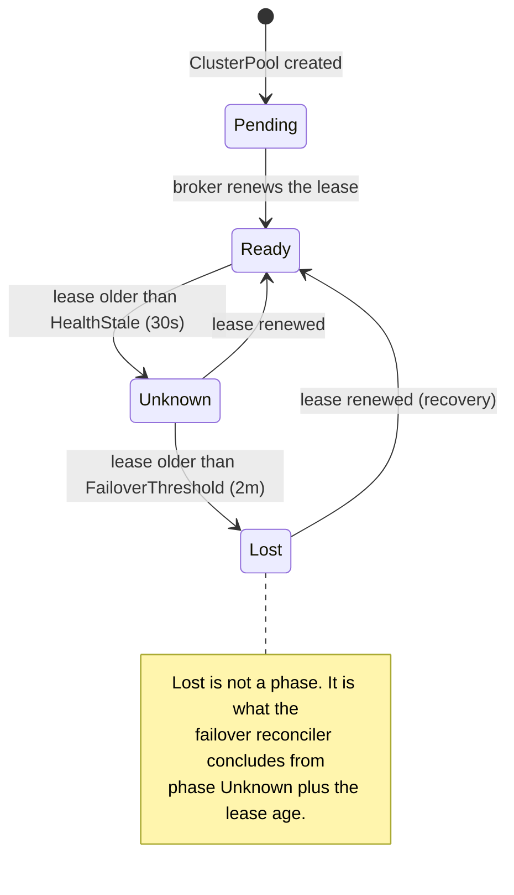
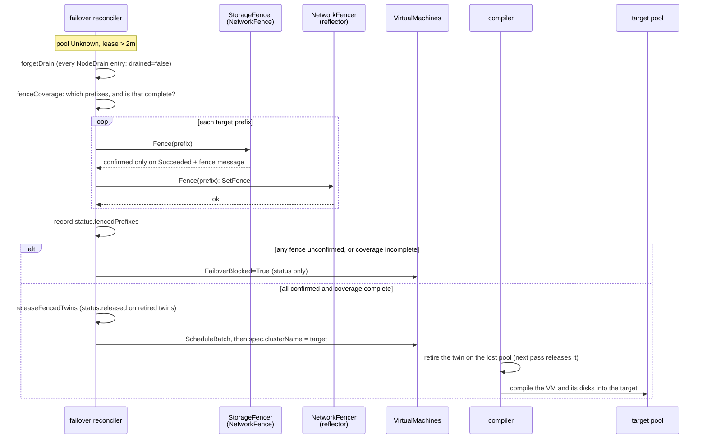
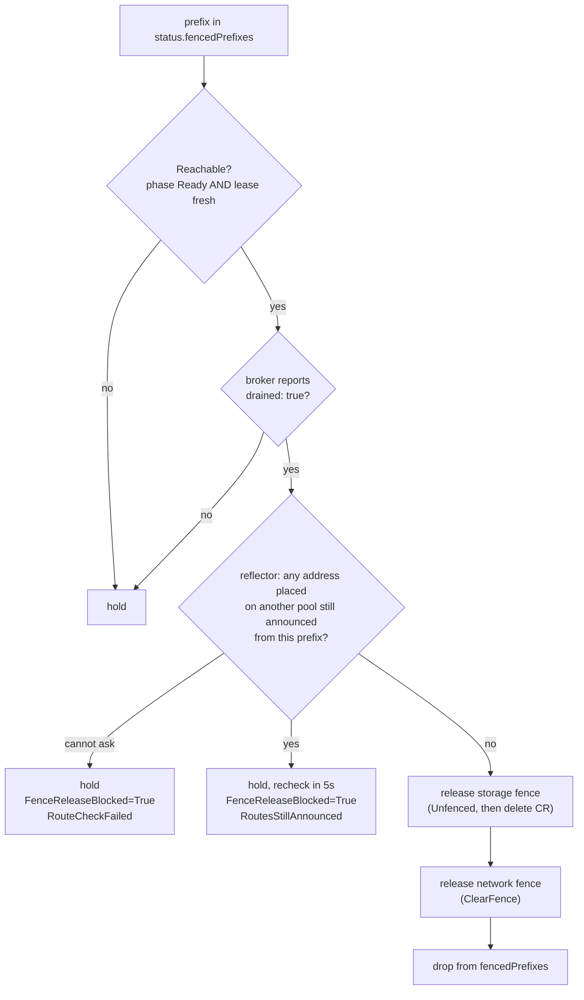
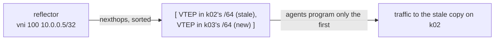

# Failover and rescheduling

This page explains what the dispatch does when a pool is lost: how it notices, fences, rebinds the
pool's VMs, and lets the fence go once the pool is back. Throughout, it never lets two copies of a VM
write the same disk. The page also covers what an operator does when a recovered pool's fence does
not come off.

The [dispatch](../concepts/what-is-ectobase.md#vocabulary) is the fleet control plane, and each
[pool](../concepts/what-is-ectobase.md#vocabulary) is a compute cluster with its own namespace
`pool-<name>` on the dispatch. A [fence](../concepts/what-is-ectobase.md#vocabulary) on a prefix is
two things at once: a reflector route fence and a Ceph `NetworkFence`.

!!! warning "Status: Partial"
    Fencing, rebinding, the release of retired twins and the drain-gated recovery are exercised end
    to end on the lab by `TestTier2Failover`. It checks the Ceph blocklist, and that the target pool
    creates the VMI and binds the original disk by CSI handle; it does not require the guest to
    reach `Running`. The route gate on fence release is covered by unit tests against a fake client
    and an in-process reflector RIB; no live run has yet had to wait on it. Tier-2 has had no soak or
    chaos testing.

## Two tiers

ectobase remediates at two scopes that do not depend on each other.

| Tier | Scope | What acts |
|---|---|---|
| Tier-1 | one node, inside a pool | The pool itself, with no dispatch involvement. KubeVirt restarts a VM elsewhere in the pool (the compiler defaults `runStrategy` to `RerunOnFailure`), and the pool chart can render a medik8s `NodeHealthCheck` and `SelfNodeRemediationTemplate` to reboot or taint the node out of service. |
| Tier-2 | a whole pool | The dispatch fences the pool and rebinds its VMs to healthy pools. |

A node failure is common and recoverable in place. Losing a pool is rare, and recovering from it
means starting stateful VMs on other hardware, which is only safe once the old hardware provably
cannot write their disks. Different problems, so different mechanisms. Tier-2's threshold is long
enough that Tier-1 has normally handled a node blip before Tier-2 would act. The Tier-1 chart values
(`tier1Failover.*`, off by default) are listed in [Helm values](../reference/helm-values.md).

The rest of this page is Tier-2. How a VM gets its pool in the first place, and what
`spec.clusterName` means, is in
[Multi-cluster orchestration](multi-cluster.md#scheduling-how-a-workload-gets-a-pool); changing that
field later is a move, described in [Moving a VM between clusters](vm-moves.md).

## Detecting a lost pool

The dispatch learns that a pool is alive from its broker's lease; how the lease drives the pool's
phase is described in [Multi-cluster orchestration](multi-cluster.md#pool-health). Failover adds one
more threshold on top.



The failover reconciler (`dispatch/pkg/failover`) treats a pool as lost when its phase is `Unknown`
and its lease is older than `FailoverThreshold` (2 minutes), far above the 30-second health window.
A pool with no lease timing at all is never lost: without evidence of how long it has been gone, the
dispatch does nothing destructive. Only one dispatch-controller acts at a time, under leader election;
see [HA and restarts](ha-and-restarts.md).

## Failover, step by step

Failover is one reconcile loop over `ClusterPool`s. Each pass on a lost pool runs these steps in
order, and stops at the first one that cannot be confirmed.



### Forget the old drain report

`status.nodeDrain` is the broker's last report of which fenced prefixes are free of VMIs. Nothing
else clears it, and the broker writes it apart from its lease. So `forgetDrain` sets every entry to
not drained before fencing. A pool that comes back can then be `Ready` on a fresh lease without a
stale `drained: true` from before the loss releasing anything; only a report the broker makes after
it is back counts.

### Decide what to fence: coverage

A fence on the prefixes the dispatch knows about is not necessarily a fence on every node.
`status.nodePrefixes` is reported by the broker, so the dispatch's copy is frozen at what it saw
before contact was lost; a node that joined during the outage is missing from it. `fenceCoverage`
decides explicitly.

| Situation | What is fenced | Coverage | Outcome |
|---|---|---|---|
| `spec.underlayPrefix` set | that one aggregate, e.g. `fd00:cafe:1a2b::/48` | complete by construction | proceeds |
| set, but a reported node prefix lies outside it | the aggregate only | not provable: the declaration may miss a node | fences, then blocks the rebind |
| unset, reported prefixes collapse to one distinct /64 | that /64 | complete: every node's VTEP is a /128 inside it | proceeds |
| unset, several distinct /64s | every reported /64 | not provable | fences, then blocks the rebind |
| unset, nothing reported | nothing | none | blocks |

A reported prefix outside the aggregate is never fenced. `status.nodePrefixes` comes from the
broker of the pool being fenced, so fencing it would let a lying or buggy pool report `::/0`, or
another pool's /64, and fence that at Ceph and the route bus. The worst such a report can do is
block its own pool's rebind, which harms only that pool's tenants. Without `spec.underlayPrefix`, failover has
nothing else to fence and fences the reported /64s themselves, so that protection holds only for a
pool that declares its prefix (which a pool needs to join the route bus anyway).

The third row fences first and blocks second on purpose. Containing the nodes the dispatch knows
about costs nothing; the step that can corrupt a filesystem is attaching a disk elsewhere while an
unfenced node might still write to it, so that is the step withheld. The fix is to declare
`spec.underlayPrefix` on the `ClusterPool`, an aggregate containing every node's underlay. It is
central configuration set at registration, precisely so that it does not depend on the cluster that
can no longer be reached.

### Fence each prefix

For each target, the reconciler applies both fences and needs both confirmed:

| Fence | Mechanism | Confirmed when |
|---|---|---|
| Storage | A csi-addons `NetworkFence` puts the prefix on the Ceph blocklist. The CR protocol is in [Storage and VMs](storage-and-vms.md#the-storage-fence-csi-addons-networkfence). | The CR is `Fenced` and reports `Succeeded` with `fencing operation successful`. |
| Network | `RouteBusAdmin.SetFence` on the reflector. It keeps every stored route but stops advertising any nexthop inside the prefix; where another origin announces the same key, such as a VM already running on its new pool, subscribers keep that origin's nexthop. See [Route bus](route-bus.md). | The RPC succeeds. |

The prefix is recorded in `status.fencedPrefixes` once its storage fence is confirmed, even if its
network fence or a later prefix then fails, so recovery knows to release it. A storage fence that
was created but not yet confirmed is not recorded; see [Known gaps](#known-gaps).
`fencedPrefixes` only grows during fencing; only a
successful release removes an entry.

The network fencer fails safe by default: unless the dispatch-controller runs with
`--reflector-admin`, it is a `DenyFencer` that refuses every fence and every release.

### Blocked failover: `FailoverBlocked`

When any step cannot be confirmed, every VM bound to the pool gets `FailoverBlocked=True` with reason
`FenceUnconfirmed`, and the reconciler retries on the next pass. It writes only status: a blocked VM's
spec is never touched.

| Message starts with | Meaning |
|---|---|
| `no NodePrefixes reported and spec.underlayPrefix unset` | Nothing to fence. Set `spec.underlayPrefix`. |
| `storage fence unconfirmed for <prefix>: NetworkFence ... created; awaiting Succeeded` | Normal for one pass; csi-addons has not run the fence yet. |
| `storage fence unconfirmed for <prefix>: ... not active (result=..., message=...)` | csi-addons reports something other than a successful fence. Check csi-addons and the Ceph caps. |
| `storage fence unconfirmed for <prefix>: ... unfence not yet reported` | An earlier release is still unfencing that CR. The fencer waits for it, then fences afresh. |
| `storage fence unconfirmed for <prefix>: NetworkFence <name> was unfenced; replacing it with a fresh Fenced one` or `... is being deleted; awaiting it to re-fence` | Normal for one pass while a spent CR is replaced. |
| `network fence unconfirmed for <prefix>` | The reflector admin API is unreachable or not configured. |
| `fenced the N reported node /64s ... coverage is not provably complete` | Several /64s and no `spec.underlayPrefix`. |
| `fenced spec.underlayPrefix ..., but coverage is not provably complete: the pool reports node prefixes outside it` | A reported node prefix lies outside the declared aggregate. Correct `spec.underlayPrefix`, or find out why the pool reports it. |
| `no pool to fail over to: ...` | Fenced and complete, but no `Ready` pool fits this VM. |

### Rebind

With every fence confirmed and coverage complete, the reconciler collects every VM whose
`spec.clusterName` is the lost pool and places them together with `ScheduleBatch`. Candidates must be
`Ready` and match the VM's `poolSelector`, as at initial placement. Fit and spread differ:
`ScheduleBatch` starts from an empty allocation, so they count only the batch's own requests, not
the workloads already bound to each target pool (see [Known gaps](#known-gaps)). Within the batch:

- requests are accumulated per target, so the batch does not over-commit a pool by itself;
- VMs sharing `spec.antiAffinity.group` avoid a pool the batch already put that group on, falling
  back to a violating placement only when no clean pool fits.

For each placed VM it writes `spec.clusterName`, then sets `FailoverBlocked=False` (`FailedOver`,
"failed over to `<pool>`", with "(anti-affinity violated ...)" appended when it had to) and
`Scheduled=True` (`FailedOver`). A failure on one VM does not stop the rest of the batch.

Writing `spec.clusterName` does not start the VM yet. The compiler treats it as a move: it retires
the VM's twin on the lost pool and compiles nothing into the target until that twin is gone. See
[Moving a VM between clusters](vm-moves.md).

### Release the retired twins: `releaseFencedTwins`

On a healthy pool, the broker proves that a retired twin's VM is gone by setting the twin's
`status.released`. A lost pool's broker cannot. The fence makes the proof true anyway: nothing on
that pool can reach Ceph. So, on every pass where the pool is lost with complete coverage,
`releaseFencedTwins` sets `status.released` on every terminating `CompiledVM` in `pool-<name>`. The
mesh-controller then drops the finalizer, the twin disappears, and the compiler writes the VM into
the target.

It runs on every pass, not once, because a twin is only retired after the rebind has been compiled,
which is a later pass. A watch on terminating twins wakes the reconciler right away instead of
after the 2-minute requeue. The status patch is optimistically locked, so a stale cached read cannot
mark a live twin of the same name released.

The target pool then adopts the original disk by its recorded CSI identity and starts the VM. Its
overlay IP, MAC and VNI do not change, because central IPAM allocations have no pool dimension. The
agent on the new node recognises the interface by `(VNI, overlay IP)` and programs its policy; see
[Attaching workloads](attaching-workloads.md).

## Recovery: releasing a fence

Fences are not permanent: a Ceph blocklist entry left in place would strand the pool's storage for
its multi-year expiry. This section describes what a returning pool must show before each fence
comes off, and why each condition exists.

Every pass, before it checks whether the pool is lost, the reconciler runs `releaseDrained` over
`status.fencedPrefixes`. A prefix is released only when all three gates pass:

| Gate | Passes when | Prevents |
|---|---|---|
| Reachable | `clusterpool.Reachable`: phase `Ready` and a lease renewed within `HealthStale`, both | Unfencing a pool that is still, or again, partitioned |
| Drained | the broker's current `status.nodeDrain` entry for the prefix says `drained: true` | Unfencing storage while a stale VMI still runs there |
| Routes withdrawn | the reflector holds, from inside the prefix, no route of an address placed on another pool | Unfencing a node that still announces, and may still run, a VM that moved |

For a prefix that passes, the storage fence is released first (flip to `Unfenced`, wait for the
unfence message, delete the CR), then the network fence (`RouteBusAdmin.ClearFence`), and the prefix
leaves `fencedPrefixes`. A release still in progress keeps the prefix and is retried. When the
reflector's fence clears, it re-advertises the routes it was hiding from what it stored; the agents
do not need to re-announce them.



### Gate 1: reachable

Nothing is released unless `clusterpool.Reachable` is true: phase `Ready` and a fresh lease. Both are
checked because the phase is written by another reconciler on its own schedule and lags a broker that
has just gone silent; the lease is the evidence itself.

The scenario it prevents: a pool with a stale `drained: true` is lost again in a partition that also
drops its route-bus sessions. The reflector is then empty, so the route gate passes. Without this
gate, the release would reopen Ceph to nodes that are partitioned but alive, in the same pass that
fences and rebinds their VMs elsewhere. `forgetDrain` covers the same hole from the other side.

### Gate 2: drained, and the broker's drain report

The broker reports drain every 10 seconds, separately from its lease heartbeat:

1. `gatherNodes` reads each node's /64 from the annotation `net.ectobase.dev/underlay-prefix`, which
   the agent stamps on its own `Node`. A node without it is not reported in `nodePrefixes`.
2. `gatherVMNodes` lists the pool's KubeVirt `VirtualMachineInstance`s and maps each scheduled VMI
   to its node.
3. `ReportStatus` marks each node /64 that runs a VMI busy, and writes `status.nodeDrain` as one
   entry per fenced prefix with `drained: !busy`. A fenced prefix is busy when a busy /64 overlaps
   it, in either family, not only when one equals it. That is what makes a pool fenced as its
   `spec.underlayPrefix` aggregate work: a busy node /64 inside the `/48` holds the `/48`. A VMI on a
   node whose /64 is unknown could be inside any fenced prefix, so it holds every one.

The report fails closed. If the VMI list fails for any reason except `kubevirtAbsent`, the broker
leaves `nodeDrain` exactly as stored for that tick: "could not list" must never read as "nothing runs
here". `kubevirtAbsent` is true only when the pool does not serve `kubevirt.io` at all (a no-match
error, or a discovery failure in which every group version failed as not found); a pool without
KubeVirt cannot run a VMI, so every prefix is drained.

The scenario it prevents: the recovered pool still runs a stale VMI of a VM that now runs on the new
pool, on the same RBD image. Releasing the storage fence would give it write access to that image
again. When the broker returns, its first pass deletes the twins the dispatch removed while it was
down; drain is reported only once their VMIs are gone.

### Gate 3: route state and `FenceReleaseBlocked`

"Drained" means the stale VMI objects are gone, not that their routes are. The recovered node's
agent withdraws a moved VM's /32 only after the CNI DEL has detached its interface, on its next
reconcile tick. A node whose kubelet died while its agent and flowplane kept running never withdraws
it at all.

If the fence came off first, the reflector would re-advertise the /32 from what it stored, now with
two nexthops:



Agents program only the first nexthop of that sorted set, so other nodes could send the VM's traffic
to the stale copy. A stale copy that still has its interface may still be running the guest, so
storage stays fenced as long as the route does.

Before lifting either fence, the reconciler therefore asks the reflector
(`RouteBusAdmin.AnnouncedFrom`) which of a set of keys it still stores, fenced or not, with a nexthop
inside the prefix. The keys are the `(VNI, host route)` pairs of every `CompiledNIC` twin compiled
outside the recovering pool's namespace: a failed-over VM, a VM moved by hand, a container, or a bare
NIC. They go in batches of 5,000.

The question reads placement, not history. A `FailedOver` mark would not do: its status write can be
lost to a conflict or a crash, a planned move off a lost pool never gets one, and a later reschedule
overwrites it. Twins are durable, so a controller restart loses nothing. The question is also
targeted: the recovered pool keeps announcing what it legitimately serves, such as the LB host
routes its backends announce, and none of that holds its fence.

The gate fails closed. If the reflector cannot be asked (unreachable, no `--reflector-admin`, or a
reflector that predates the RPC and answers `Unimplemented`) or the NIC twins cannot be listed, the
fence stays.

The pool's `FenceReleaseBlocked` condition says why a drained prefix is held:

| Status | Reason | Message |
|---|---|---|
| `True` | `RoutesStillAnnounced` | `<prefix> still announces addresses placed on other pools, waiting for their withdraw: vni <n> <route> from node <node> via <nexthop> (nic <namespace>/<name> on pool <pool>), ...` (up to five, then "and N more") |
| `True` | `RouteCheckFailed` | `<prefix>: cannot ask the reflector what it still announces: ...`, `<prefix>: no route reflector configured`, or `<prefix>: cannot work out which addresses to check: ...` |
| `False` | `RoutesWithdrawn` | `no fenced prefix is waiting on a route` |

A pool that never waited on routes has no `FenceReleaseBlocked` condition at all. While a release is
held on routes, the reconciler rechecks every 5 seconds, about one agent tick.

## Why each safeguard exists

Every gate on this page maps to a concrete way two copies of a VM could write the same disk, or
traffic could reach the wrong copy.

| Safeguard | Without it |
|---|---|
| No failover without lease timing | A pool that never reported would be fenced and emptied on no evidence. |
| Fence before rebind | The partitioned source keeps writing the RBD image while the target boots from it: filesystem corruption. `ReadWriteOnce` is enforced per cluster, and the lab's images carry only `layering`, so Ceph does not refuse a second writer. |
| Coverage check | A node that joined during the outage, in an unreported /64, stays writable while the VM starts elsewhere. |
| Retired twin plus `releaseFencedTwins` | The target would start the VM while nothing had shown that the source stopped. |
| `forgetDrain` | A pool lost again carries `drained: true` from its previous recovery into the next one. |
| Reachable gate | A partition that also empties the reflector passes the route gate and reopens Ceph to live, partitioned nodes. |
| Drain gate | A stale VMI on the recovered pool regains write access to an image the new pool is using. |
| Route gate | A stale source still announcing a moved VM's /32 attracts its traffic, and may still be running it. |
| Fence CR deleted only after the unfence message | The Ceph blocklist entry outlives the CR with nothing tracking it, and the pool's storage stays cut off. |

## A pool that will not let go

This section is the operator's view of a recovered pool whose fence stays on. Start with the pool's
status:

```sh
kubectl get clusterpool <pool> -o yaml
```

Read it in this order:

1. `status.phase` is `Ready` and `status.lease.renewTime` is recent. If not, the broker is not
   renewing its lease; nothing is released until it does.
2. `status.fencedPrefixes` lists what is still fenced.
3. `status.nodeDrain` has `drained: true` for each of those prefixes. If an entry stays false, VMIs
   still run on nodes in that prefix (`kubectl get vmi -A -o wide` on the pool), or the broker's VMI
   list keeps failing (its log says "leaving the drain report unchanged").
4. The `FenceReleaseBlocked` condition:

    ```sh
    kubectl get clusterpool <pool> \
      -o jsonpath='{.status.conditions[?(@.type=="FenceReleaseBlocked")].message}'
    ```

    `RouteCheckFailed` points at the dispatch-controller's `--reflector-admin` wiring or the
    reflector itself. `RoutesStillAnnounced` names, for each held route, the node that announces it
    (`<node>` is the agent's `--node-id`, its Kubernetes node name) and the NIC and pool it belongs
    to.
5. If all of that passes and the prefix is still fenced, the release itself is in flight: look at the
   `NetworkFence` CR for the prefix. It should be `Unfenced`, waiting for `unfencing operation
   successful`.

For a `RoutesStillAnnounced` entry, the remedy depends on the node it names.

If the node's kubelet is dead but its agent and flowplane still run, the guest may still be running
there. First make sure it is not: power the node off, or confirm on the host that no qemu process of
the moved VM remains. Only then end the node's route-bus session by stopping the agent. When a
session ends, the reflector withdraws everything that node announced, and its keepalive (a 2-second
ping with a 3-second timeout) ends a session that stops answering. The next recheck then finds
nothing held and releases both fences, including the Ceph blocklist. Stopping the agent alone removes
the evidence the gate reads without stopping the guest, and cutting the node from the overlay does
not cut its path to Ceph.

If the kubelet is alive and the entry names a NIC whose workload moved, the CNI DEL that should have
detached the interface was lost, and flowplane still holds it. Restarting the agent does not help: it
announces the interface again. Detach the interface from flowplane through the dataplane API, a
root-only unix socket at `/run/flowplane/dataplane.sock` on the node. As root on the node:

```sh
grpcurl -plaintext -import-path api/proto/dataplane/v1 -proto dataplane.proto \
  unix:///run/flowplane/dataplane.sock dataplane.v1.DataplaneNode/ListInterfaces
grpcurl -plaintext -import-path api/proto/dataplane/v1 -proto dataplane.proto \
  -d '{"interface_id": "<id>"}' \
  unix:///run/flowplane/dataplane.sock dataplane.v1.DataplaneNode/DetachInterface
```

Find the interface id in the `ListInterfaces` output by the overlay IP. A Talos node has no shell.
In the lab, where each Talos node is a container, run `grpcurl` as root on the lab host and reach
the socket through the node container's root, as the live tests do:
`unix:///proc/<pid>/root/run/flowplane/dataplane.sock`, where `<pid>` is the container's host PID
(`docker inspect -f '{{.State.Pid}}' <container>`). The agent's next tick withdraws the route.

If the NIC is on a pool whose nodes really sit inside this prefix, two pools' underlay prefixes
overlap. That is a misconfiguration; each pool's `spec.underlayPrefix` and node /64s must be its own.
The gate cannot tell such a route from a stale one and holds until the overlap is fixed.

!!! warning "Do not force a release"
    Deleting a `NetworkFence` leaves the Ceph blocklist entry in place. Patching it to `Unfenced`
    while the pool still lists the prefix in `status.fencedPrefixes` lifts the blocklist past the
    drain and route gates, and nothing re-fences a pool that is not lost. Fix what the checks above
    name. For a blocklist entry that no pool tracks, see
    [A stranded Ceph blocklist entry](../operations/runbook.md#a-stranded-ceph-blocklist-entry).

## Known gaps

These are limits of the code as it stands, stated so that nobody relies on a guarantee it does not
give.

| Gap | Consequence |
|---|---|
| A reflector restart loses fences, which it keeps in memory only; see [HA and restarts](ha-and-restarts.md#reflector-restarts). | A lost pool is fenced again on the next failover pass; a recovered pool held on drain or routes stays storage-fenced but is no longer hidden at the reflector. |
| `releaseFencedTwins` runs only for a pool that is lost, fenced with every fence confirmed and complete coverage, and only in namespace `pool-<name>`. | A retired twin is never released for a pool whose `ClusterPool` was deleted, a pool that never had a lease, a pool fenced with incomplete coverage, a pool whose fences never confirm (for example a dispatch-controller without `--reflector-admin`, or csi-addons not running), or a twin in a namespace outside that convention. A VM moving off such a pool waits for an operator; see [Moving a VM between clusters](vm-moves.md#a-move-that-does-not-finish). |
| A fence that was never confirmed is not tracked. The first pass creates the `NetworkFence`; the prefix enters `status.fencedPrefixes` only on a later pass that sees it confirmed. | If the pool comes back within the roughly 2 minutes before that pass, the CR stays `Fenced`, csi-addons has likely blocklisted the prefix, and no `ClusterPool` lists it, so nothing releases it. See [A stranded Ceph blocklist entry](../operations/runbook.md#a-stranded-ceph-blocklist-entry). |
| The route gate asks only about addresses compiled for another pool. | A stale address placed nowhere else (a VM deleted while its pool was lost, a NIC whose twin is gone or whose IPs changed) is re-advertised from what the reflector stored when the fence clears. |
| The rebind collects only `VirtualMachine`s. | `Container`s bound to a lost pool stay bound to it. |
| `ScheduleBatch` accumulates only the batch's own requests and anti-affinity groups. | Workloads already bound to a target pool are not counted, so failover can over-commit it. |

## Where this lives

| Concern | Location |
|---|---|
| Pool phase and `Reachable` | `dispatch/pkg/clusterpool/` |
| Failover reconciler, coverage, `forgetDrain`, `releaseFencedTwins`, `releaseDrained` | `dispatch/pkg/failover/failover.go` |
| Route gate and `FenceReleaseBlocked` | `dispatch/pkg/failover/routegate.go` |
| Storage and network fencers | `dispatch/pkg/fence/` |
| Drain report, `gatherVMNodes`, `kubevirtAbsent` | `dispatch/cmd/broker/main.go`, `dispatch/pkg/broker/broker.go`, `dispatch/pkg/broker/report.go` |
| Reflector fences and `AnnouncedFrom` | `mesh/reflector/rib.go`, `mesh/reflector/admin.go` |
| Placement | `dispatch/pkg/scheduler/` |
| Wiring, thresholds, leader election | `dispatch/cmd/controller/main.go` |
| Live test | `test/lab/livetest/tier2_test.go` |

## Where to go next

- [Moving a VM between clusters](vm-moves.md): the break-before-make gate every rebind goes through.
- [Storage and VMs](storage-and-vms.md): the disk identity and the `NetworkFence` protocol.
- [Route bus](route-bus.md): how the reflector stores, fences and re-advertises routes.
- [Fail over a cluster](../guides/failover.md): run a failover on the lab.
