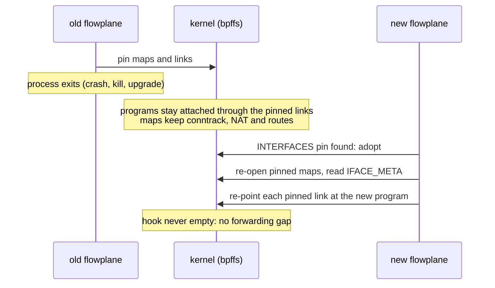

# HA and restarts

Every ectobase component restarts sooner or later: a crash, an OOM kill, a node drain, or a rolling
upgrade. This page goes through them one at a time: what each keeps across a restart, what it
rebuilds, what it loses, and the order in which to upgrade them so that no step breaks the next.

## At a glance

| Component | Replicas | On restart |
|---|---|---|
| `flowplane` | one per node (DaemonSet) | adopts its pinned maps and re-points its pinned links; forwarding does not stop |
| `mesh-agent` | one per node (DaemonSet) | reconnects to the reflector and re-announces; the dataplane keeps its routes meanwhile |
| `broker` | 1, `Recreate` | stateless; re-derives everything on its start-up pass |
| `dispatch-controller` | 1, leader-elected | stateless; the new leader picks up from the API |
| `mesh-controller` | 1, `Recreate`, leader-elected | stateless; the new leader picks up from the API |
| `reflector` | 1, `Recreate` | starts empty; the agents rebuild its table, but its fences are lost |
| `dispatch-apiserver`, kine | 1 each | stateless; postgres holds the state |
| postgres | 1, `Recreate` | keeps all dispatch state on its PVC |

None of the dispatch components runs more than one active copy. The dispatch is not highly
available today: it is built to restart safely, not to survive the loss of its node.

## flowplane graceful restart

A flowplane restart leaves no gap in forwarding. The eBPF programs and their state live in the
kernel, independent of the process that loaded them. Two bpffs pinning mechanisms carry them across
a restart: pinned maps keep the state, and pinned links keep the programs on their hooks.

!!! success "Status: Implemented"
    Restart-adopt with pinned maps and pinned links is the default on kernels 6.6 and later.
    `TestRestartContinuity` in the live suite and the `make ha` contract test cover it.

### Pinned maps and the interface journal

flowplane pins its state maps under `/sys/fs/bpf/flowplane` (`--pin-dir`): conntrack, NAT, routes,
load balancers, firewall bindings and the rest. A pinned map outlives the process that created
it. On start, `flowplane serve` checks for the `INTERFACES` pin. If it is there, the new process
adopts the existing maps instead of creating fresh ones, so live conntrack entries, NAT
allocations and routes are intact.

The process also needs in-memory bookkeeping: which interfaces exist, with their IDs, devices,
VNIs and addresses. It rebuilds that from `IFACE_META`, a journal map with one record per attached
interface. There is no per-interface underlay address to re-allocate: every interface on a node
uses the node's one **VTEP**, so a restart derives the same underlay again.

### Pinned links and the atomic re-point

A `bpf_link` normally detaches its program when the last file descriptor to it closes. On kernel
6.6 and later every forwarding attach is a link that can be pinned, either tcx or netkit, so
flowplane pins all of them under `<pin-dir>/links/`:

| Link pin | Program | Hook |
|---|---|---|
| `links/uplink-geneve` | `uplink_rx` | tcx ingress on the Geneve `collect_md` device, `fp-geneve0` |
| `links/uplink-dsr-note-geneve` | `uplink_dsr_note` | tcx ingress on the same device, ordered first |
| `links/wan-<iface>` | `wan_rx` | tcx ingress on the WAN uplink (edge role) |
| `links/uplink-<iface>` | `uplink_rx` | tcx ingress on an `--extra-uplink` |
| `links/guest-<hex(interface_id)>` | `tc_guest_tx` | tcx ingress on a veth or tap, or the netkit peer hook on a netkit device |

A pinned link, and the program behind it, outlives the process. On restart flowplane opens each
pin and points it at the freshly loaded program in one kernel operation. For a tcx link that is
`PinnedLink::from_pin` followed by `attach_to_link`; for a netkit link it is `bpf(BPF_OBJ_GET)`
followed by `bpf(BPF_LINK_UPDATE)` (`readopt_tc_link` and `readopt_netkit_link` in
`flowplane/flowplane/src/loader.rs`). At no point is the hook empty.

The re-point is correct in both cases. After a crash the bytecode is the same, and swapping it in
is a no-op. After an upgrade the bytecode is new, and the swap is the upgrade. Both program
versions read the same pinned maps, so no version check is needed.

Two cases fall back to a fresh attach, which does leave a short gap:

- The Geneve device was recreated. flowplane brings `fp-geneve0` up on every start and does not
  remove it on shutdown. If it had to create it anew, the pinned uplink links point at a device
  that no longer exists, so it attaches fresh rather than re-point them.
- A guest's device disappeared while flowplane was down. Its interface is skipped on adopt, and a
  later `DetachInterface` cleans up its map entries.

While flowplane restarts, its gRPC socket is gone. A CNI `ADD` on that node fails and the kubelet
retries it, and the agent's calls fail until the socket is back (see
[The agent after a flowplane restart](#the-agent-after-a-flowplane-restart)). Forwarding is
unaffected.

### The flag and older kernels

`--pin-links` (env `FLOWPLANE_PIN_LINKS`) controls link pinning and defaults to on.
`--pin-links=false` attaches fresh on every start. That is a safe rollback, because pinned maps and
the journal do not depend on link pinning. One feature needs pinning: a netkit guest attach is
refused without it (`netkit attach requires pin-links mode`).

Kernels before 6.6 have no tcx. aya then falls back to a netlink `cls_bpf` attach, whose link
cannot be pinned, and flowplane fails loudly rather than degrading silently ("tc link is not a tcx
FdLink (kernel < 6.6); pinning unavailable"). On such a kernel run with `--pin-links=false` and
accept the gap on restart.

Two flowplane instances on one host need separate pin directories. The lab's two WAN edge
sidecars use `--pin-dir /sys/fs/bpf/flowplane-edge1` and `/sys/fs/bpf/flowplane-edge2`.

### How it is tested

- `TestRestartContinuity` (`test/lab/livetest/restart_test.go`) runs a cross-cluster overlay ping,
  60 probes at 0.2 s intervals, through one compute node while that node's flowplane pod is
  deleted and rescheduled. It asserts that at most 15 probes are lost. It also asserts the
  signature of a re-point: the guest's link pin exists before and after, and the program ID
  behind it changed. A detach and re-attach would not keep the pin.
- `TestEdgeLBSurvivesFlowplaneRestart` (`test/lab/livetest/lbrestart_test.go`) restarts both edge
  flowplanes and checks that each adopts its load balancer, the WAN still reaches it, and deleting
  it afterwards leaves no rows behind.
- `make ha` runs the adopt contract test (`flowplane/flowplane/src/control/adopt_test.rs`) as root
  in private namespaces. A real `Control` brings the datapath up, attaches a guest and programs its
  firewall, exits, and adopts.

## Adopting the control state

Maps carry the datapath's state, but flowplane's control core also keeps shadows of what it
programmed: which routes it holds, which load balancer owns which Maglev table, which firewall
scopes are referenced. A shadow that starts empty after a restart turns every later withdraw or
delete into a no-op. So on adopt, flowplane rebuilds each shadow from the pinned maps. This section
covers the order it does that in, and the two rules that keep it safe.

The adopt runs in this order (`Control::bring_up`, `flowplane/flowplane/src/control/bringup.rs`):

1. Firewall: rebuild each scope's reference count from the `FW_BIND` bindings, and collect scopes
   nothing binds.
2. Neighbour NAT: rebuild the block lists from the `NAT_OWNERS` tries, repairing any block a crash
   left half-written.
3. Load balancers: recover them from the `LB`, `LB6` and `MAGLEV` maps.
4. Interfaces: replay `IFACE_META` and queue each surviving interface's guest program for re-point.
5. Routes: rebuild the route shadows from the `ROUTES` tries. This step runs last because it needs
   the recovered interfaces.

### The whole-walk rule

Adopt reads each map by walking it, and a walk can be cut short by a read error. After a cut walk,
an entry missing from what was read may still be in the map. So adopt acts on an absence only
after a whole walk:

- Firewall: after a cut `FW_BIND` walk, no scope is deleted. The next firewall change walks the map
  again, and a whole walk then restores every reference and collects the leaked scopes.
- Load balancers: a cut walk is retried a few times. If it stays cut, what was read is adopted, and
  nothing is repaired, moved or deleted. The Maglev table-ID counter jumps well past every ID seen,
  and no table below that jump is deleted later, because a row the walk never read may point at
  it.
- Interfaces: after a cut `IFACE_META` walk, no VNI is purged and no self-route that looks orphaned
  is released, until the next whole adopt.

### Held keys

A **held key** is a route key that a local interface's self-route owns. It matters most during a VM
move. When a VM lands on a node, the fabric may still carry its address with the old node as
nexthop. The guest's self-route must win the kernel entry on this node, but the fabric's route must
not be lost either.

So while a local interface lives, its `/32` or `/128` key is held. A mesh `AddRoute` for that key
updates only the shadow, and a mesh `WithdrawRoute` removes it only from the shadow. When the
interface detaches, flowplane reinstalls whatever mesh route the shadow holds for the key.

On adopt, every recovered interface's self-route is rewritten and holds its key again. That repairs
a node where older code had let a mesh route overwrite a self-route. A self-route whose interface
did not come back is recognised from its `INTERFACES` entry and no longer holds its key, so a mesh
route can replace it.

What adopt cannot recover is a mesh route a self-route was holding back: the kernel never had it,
so no map records it. The agent re-sends it, as the next section describes.

### Load balancers

The `LB` maps hold everything about a load balancer except its ID: its address, VNI, ports and
table, with every backend in the table's slots. Recovered load balancers therefore wait in a list
until a call names one by its address, and then that call claims it. The table-ID counter resumes
above every ID still in use, so a new load balancer is never given a live one's table.

Adopt also repairs what a crash left half-done: a table that no row points at is removed, a table
missing slots is rewritten whole, and two addresses sharing one table each get their own copy.

## The agent after a flowplane restart

The mesh-agent owns the routes it learned from the route bus. After a flowplane restart it re-sends
them, because a flowplane restart can lose routes the agent still wants. This section covers how
the agent notices, how it limits the re-send, and how it retries a route that fails.

### Noticing the restart

Every flowplane process generates a random instance ID at start and returns it in each
`ListInterfaces` response. The agent calls `ListInterfaces` on every reconcile tick, every 5
seconds. It queues a full re-send when either:

- the instance ID changed, or
- the dataplane answers again after a failed call.

A dataplane that predates the instance ID returns an empty one. For that case the agent re-sends
everything every 5 minutes as a safety net.

### A budgeted re-send

A full re-send is paid out over ticks, at most 256 dataplane calls per tick. The loop that makes
those calls also drains the route-bus stream, and it drains nothing while it calls. Once the
agent's 64-message receive buffer is full, messages back up in the reflector's per-session queue,
which drops live deltas beyond 1024, and no resync can recover those. 256 calls take a fraction of
a second, so the stream keeps moving. At that rate 10,000 routes take
about three minutes. The queue puts held local host keys first, since those are the ones a
restarted flowplane cannot recover from its maps.

Each tick first converges the keys that drifted from what the agent last programmed. A converged
tick makes no calls at all. The remaining budget then goes to the re-send queue. flowplane's
`AddRoute` replaces in place, so re-sending a route it already holds is a harmless upsert.

### Backoff that never delays a withdraw

A call that flowplane refuses backs off per key: retries come 1, 2, 4 and more ticks apart, capped
at 60 ticks (five minutes). Backoff applies only while the key still wants the exact route that
failed:

- A key that now wants nothing, such as a revoked peering or a forgotten VNI, is withdrawn at once.
  A cross-VPC route must not outlive its peering by a backoff interval.
- A key that now wants a different route starts over and goes out at once.
- An unreachable dataplane is not the key's fault. It is logged but not backed off, so each key goes
  out as soon as the dataplane is back.

Keys still failing are summarised in the log about once a minute.

### Unsubscribe hysteresis

A VNI that drops out of the agent's subscriptions keeps its learned routes for three successful
ticks, about 15 seconds, before they are forgotten and withdrawn. A guest pod that restarts
detaches and re-attaches within a tick or two, and a single reconcile can read peering config
without an import. Dropping a VNI's routes on either event would blackhole it until the
re-subscribe replayed them.

Firewall and QoS need no special restart handling. The agent replaces each local interface's whole
firewall rule set (`ReplaceInterfaceFirewall`) on every tick, so after a restart the next tick
re-asserts it. The route bus itself, including reconnects and the end-of-table prune, is covered
in [The route bus](route-bus.md).

## Controller leader election

The two dispatch controllers each run one replica, and each also takes a lease. A rolling update
briefly runs an old and a new pod side by side even with `replicas: 1`, and two active managers
would each act.

| Controller | Lease | Lease namespace | Why two would be harmful |
|---|---|---|---|
| `dispatch-controller` | `ectobase-dispatch-controller` | `system`, its ServiceAccount's namespace | failover would fence a pool and rebind its VMs twice: a second rebind of a disk the first already moved |
| `mesh-controller` | `ectobase-mesh-controller` | `ectobase-system` | the VNI, IPAM, LB address and NAT allocators rely on a single writer; two would double-allocate |

Both leases are `Lease` objects on the host kube-apiserver, and both managers set
`LeaderElectionReleaseOnCancel`, so a graceful shutdown hands the lease over immediately instead of
waiting for it to expire. The mesh-controller Deployment also uses `Recreate`, because it runs with
`hostNetwork`.

The broker takes no lease. It is one replica with the `Recreate` strategy, so the old pod is gone
before the new one starts. Within the process, its controller runs one worker; see
[One worker, deliberately](multi-cluster.md#one-worker-deliberately).

## Reflector restarts

The reflector keeps everything in memory: the per-VNI routing table, the neighbour-NAT and public
tables, and the set of fenced prefixes. Nothing is persisted. It runs one replica with the
`Recreate` strategy, because it binds host ports with `hostNetwork`.

On `SIGTERM` the reflector stops gracefully, so agents see a clean stream close. Each agent then
reconnects and re-announces everything from scratch, and the reflector rebuilds its table from
those announcements. The agents keep their programmed routes across the reconnect, so the
dataplanes keep forwarding meanwhile. When an agent receives a VNI's snapshot again, it prunes the
routes that are no longer in it. When every edge reconnects at once, the reflector builds the
global NAT and public snapshot once and shares it across sessions.

!!! warning "A reflector restart drops every route fence"
    A route fence lives only in the reflector's memory. After a restart, the reflector advertises
    routes from every node again, including fenced ones, until something re-applies the fence.

    - While a pool is lost, failover re-applies its fences on every pass, at most 2 minutes apart.
    - Once a pool is back but still waits for its fence release, nothing re-applies the network
      fence. The pool's `status.fencedPrefixes` still lists it, and the storage fence on Ceph
      still stands. But the reflector advertises that pool's routes again, including any route a
      stale node still announces for a VM that has moved.

    The route check that gates a fence release reads the reflector's current table. Right after
    a restart, that table holds only the sessions that have reconnected so far.

The reflector is a single point of failure for route changes, not for forwarding. While it is
down, nothing new propagates (a new guest, a moved VM, a withdrawn route), but every dataplane keeps
forwarding on what it last programmed.

## Dispatch state persistence

All dispatch state lives in one postgres database, behind kine. This section covers where that
data sits and how a restart treats it.

| Piece | Holds state? | Restart behaviour |
|---|---|---|
| postgres | yes: every object of every group | `Recreate` strategy, so a rolling update never starts a second postgres against the same volume |
| kine | no | reconnects to postgres |
| dispatch-apiserver | no; a watch cache in memory | rebuilds its cache from kine. With PKI enabled it binds port 6444 on the host network, so it uses `Recreate` too |

`postgres.persistence.type` chooses where the data directory lives:

- `pvc` (the default): a `ReadWriteOnce` PersistentVolumeClaim, 1 Gi by default. It carries
  `helm.sh/resource-policy: keep`, so `helm uninstall` leaves it behind.
- `hostPath`: a directory on the node. Safe only where postgres cannot be rescheduled onto another
  node, such as a single-node cluster.
- `emptyDir`: scratch space. Every postgres restart loses all dispatch state. Use it only for a
  throwaway cluster.

On persistent storage, deleting the postgres pod keeps everything. Every `ClusterPool` stays in
place, and its lease keeps renewing, with no manual step.

Two cautions:

- Postgres reads `kine.password` only when it initialises an empty data directory. Changing the
  value later, on persistent storage, locks kine out.
- Moving an existing installation from `emptyDir` to `pvc` starts postgres on an empty directory
  once. kine and the apiserver then need restarts, because kine creates its schema only at start
  and the apiserver keeps serving its stale watch cache. The steps are in
  [Deploying with Helm](../operations/deploy-helm.md).

## Rollout order

Components on both sides of each protocol must agree, so upgrade order matters. On first install
the dispatch chart goes first, because its `ClusterIssuer` and root must exist before a pool can
enroll. On upgrade the order reverses.

1. Upgrade every pool chart, then the dispatch chart. A planned move, or deleting a VM, relies on
   the pool's broker speaking the release protocol. An older broker treats a retired `CompiledVM`
   as still desired and keeps recreating its VM, and it never reports a release. Nothing runs on
   two pools, since the design fails closed, but every move off that pool and every VM delete on
   it waits until the pool is upgraded.
2. Within a pool, run the new flowplane before the new mesh-agent. The agent passes routes for its
   own guests' addresses through to the dataplane, and relies on flowplane holding those keys. An
   older flowplane lets such a route overwrite the guest's self-route, and a later withdraw deletes
   it, which cuts the guest off on its own node. A normal `helm upgrade` can briefly pair a new
   agent with an old flowplane on a node; the new flowplane repairs such a self-route when it
   adopts. Never upgrade the `mesh` image on a pool on its own.
3. Within the dispatch chart, the apiserver, `dispatch-controller`, `mesh-controller` and
   `reflector` move together. An older reflector answers the fence-release route check with
   `Unimplemented`, and the dispatch-controller holds the fence on that, so a release waits until
   the reflector catches up.

The operator steps, including a one-time patch for Deployments created before they switched to
`Recreate`, are in [Deploying with Helm](../operations/deploy-helm.md).

## Where to go next

- [Multi-cluster orchestration](multi-cluster.md): the broker's sync and release protocol.
- [The route bus](route-bus.md): sessions, snapshots and fences in the reflector.
- [Maps and state](dataplane/maps.md): the pinned maps flowplane adopts.
- [Operator runbook](../operations/runbook.md): diagnosing a node or a pool in trouble.
