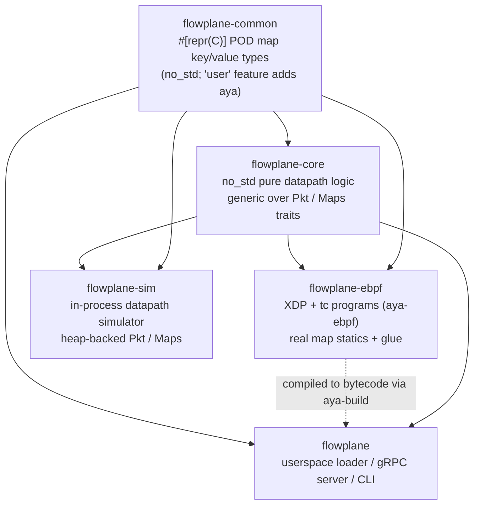

# Repository layout & crates

ectobase is a single repository containing the Rust dataplane, the Go control plane, the
CNI plugin, the CRD API, Kubernetes manifests, and the lab/test harnesses.

## Top-level layout

| Path | What |
|---|---|
| `flowplane/` | The Rust workspace: the eBPF dataplane, its userspace loader/agent/CLI, the pure-core datapath library, the shared map types, and the in-process simulator (see the crate table below). |
| `netplane/` | The per-pool Go control plane: `cmd/agent`, `cmd/reflector`, `cmd/controller`, plus the `routebus` client/server and the reconcile/desired-state logic. |
| `cni/` | The CNI plugin (`cni/plugin/main.go`) that attaches pods via the `DataplaneNode` gRPC. |
| `hub/` | The fleet control plane: the extension `apiserver`, the `controller` (compiler), and the `broker` (per-pool kubelet-analog) under `cmd/`, plus their generated client. |
| `api/` | Kubernetes CRD types, split into five API groups — `net`, `compute`, `storage`, `compiled`, `platform` (each `api/<group>/v1alpha1/`, group `<group>.ectobase.dev`) — and the gRPC/protobuf contracts (`api/proto/dataplane/v1/`, `api/proto/routebus/v1/`). |
| `charts/` | The Helm charts (`ectobase-hub`, `ectobase-pool`) with generated CRDs and RBAC. |
| `hack/` | Lab bring-up: the containerlab + kind IPv6 fabric (`clab-up.sh` / `clab-down.sh`, `clab/`), the fabric kind-node image, and edge-agent helpers. |
| `test/` | Test harnesses: Go conformance/e2e suites (`test/conformance/`, `test/e2e/`), the CRD bases (`test/crds/`), test container images (`test/images/`), and the `test/lab/` kind-substrate lab. |
| `docs/` | This mkdocs-material site plus the design-spec/plan archive (`docs/superpowers/`). |

The Nix flake (`flake.nix`) provides the entire toolchain — pinned Rust, `bpf-linker`,
`protobuf`, Go, `kind`/`containerlab`, `python3` (DPDK build's pyelftools), `qemu`, `bpftool`, and
friends. `make` (from inside `nix develop`) is the entry point for all build/test/lab
targets. See [Getting started](../guides/getting-started.md).

## The `flowplane` Rust workspace

The dataplane is a Cargo workspace of five crates. The crucial split is between the
**pure datapath logic** (`flowplane-core`, `no_std`, generic over traits) and the two
concrete environments that run it: the real **eBPF programs** (`flowplane-ebpf`) and the
**native simulator** (`flowplane-sim`). See [The pure-core seam](../architecture/dataplane/pure-core.md)
for why this split exists.

| Crate | Role |
|---|---|
| **`flowplane-common`** | `#[repr(C)]` plain-old-data types shared between eBPF and userspace — the map key/value structs (`IfaceKey`, `RouteValue`, `CtKey`/`CtEntry`, `NatKey`/`NatValue`, `FwRule`, …) and protocol constants — with layout tests. `no_std` by default; a `user` feature adds the aya `Pod` integration for the userspace side. |
| **`flowplane-core`** | `no_std`, generic **pure datapath logic**. Every forwarding function (parse, encap/decap, NAT, NAT64, LB, firewall, conntrack, meter, ARP/ND, DHCP, egress-route, uplink-deliver) is written against the `Pkt` and `Maps` traits, so the *same* code runs in eBPF, in the sim, and in unit tests. Depends only on `flowplane-common`. |
| **`flowplane-ebpf`** | The actual eBPF programs (`uplink_rx`, `wan_rx`, `tc_guest_tx`, `tc_guest_dhcp`, `tc_guest_nat64`, `xdp_pass`, `xdp_inspect`) plus the `#[map]` declarations. `coreimpl.rs` binds the `Pkt`/`Maps` traits to the real kernel maps and the XDP/tc packet context; the program bodies are thin glue that call into `flowplane-core`. Compiled to bytecode by `aya-build` and embedded into the `flowplane` binary. |
| **`flowplane`** | The Rust userspace daemon and CLI. Contains the `DataplaneNode` gRPC server + map control plane (`control.rs`), the eBPF loader with link/adopt logic (`loader.rs`), veth/tap lifecycle + IPAM (`attach.rs`), the underlay inference (`underlay.rs`), the Maglev table builder (`maglev.rs`), conntrack GC (`conntrack_gc.rs`), and the CLI (`main.rs`). This is the binary that ships in the container image. |
| **`flowplane-sim`** | An **in-process datapath simulator**: heap-backed `Pkt`/`Maps` impls (`VecPkt`, `MemMaps`), a `SimNode` that runs the real `flowplane-core` logic, and a multi-node `Fabric` that follows encap/redirect hops across simulated nodes. No kernel, no clab, no root — the fast dev/regression loop. `compilednic.rs` lowers a `CompiledNIC` into sim maps so the control-plane→datapath path is tested end-to-end. See [The in-process sim](../testing/sim.md). |

### Build note

`flowplane-ebpf`'s binary target is named `flowplane-prog` (not `flowplane-ebpf`): aya-build
uses `$OUT_DIR/<pkg-name>` as the build target directory and copies the artifact to
`$OUT_DIR/<bin-name>`, so a matching name would make the copy destination collide with the
build directory. The BPF *program* names (`uplink_rx`, `tc_guest_tx`, …) are independent of
this file name.

## The `netplane` Go modules

`netplane/` is the Go workspace (tied together by the top-level `go.work`) holding the
three control-plane binaries under `cmd/` (agent, reflector, controller), the `routebus`
gRPC client/server, and the reconcilers that turn CRDs into dataplane programming. The
CRD Go types and the gRPC contracts it depends on live in `api/`. See
[Control/data split & the route bus](../architecture/route-bus.md) and
[The CRD API](../reference/crd-interactions.md).

## Where to go next

- [Datapath programs](../architecture/dataplane/programs.md)
- [The pure-core seam](../architecture/dataplane/pure-core.md)
- [BPF maps & state model](../architecture/dataplane/maps.md)
