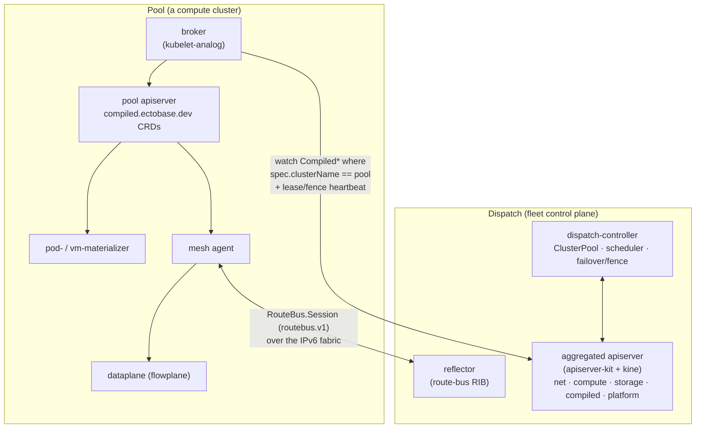

# Multi-cluster control plane

ectobase is a fleet of Kubernetes clusters, not a single one. It separates a
dispatch — the fleet control plane where all intent is authored and compiled —
from N pools — the compute clusters that actually run workloads on the shared
eBPF/XDP overlay. The dispatch decides what and where; each pool executes its own
slice locally. This split bounds the load on the fleet API and lets a pool keep
operating on its locally synced copy of state.

!!! success "Status: Implemented"
    The single-dispatch / single-or-many-pool control plane — aggregated apiserver,
    broker sync, ClusterPool registration, materializers, and the route bus — is
    implemented and exercised on the lab fabric. Cross-pool rescheduling and
    failover is only partially implemented; see the badge under
    [Why the tiered model](#why-the-tiered-model) and
    [Rescheduling & failover](./rescheduling-and-failover.md).

## The dispatch

The dispatch runs on one ordinary Kubernetes host cluster and adds three moving parts,
all shipped by the `charts/ectobase-dispatch` chart.

### Aggregated apiserver and kine, no CRDs

The fleet API is served by an aggregated apiserver built on
[apiserver-kit](https://go.opendefense.cloud/kit/apiserver), backed by kine —
a Postgres-backed etcd shim — for storage. It serves all five API groups as
aggregated resources (`dispatch/cmd/apiserver/main.go`):

| Group | Resources |
|---|---|
| `platform.ectobase.dev` | `ClusterPool`, `RouteBusIdentity` |
| `net.ectobase.dev` | `VPC`, `Subnet`, `LBPool`, `NetworkInterface`, `FirewallPolicy`, `FloatingIP`, `LoadBalancer`, `NATGateway`, `VPCPeering` |
| `compute.ectobase.dev` | `VirtualMachine`, `Container` |
| `storage.ectobase.dev` | `Volume` |
| `compiled.ectobase.dev` | `CompiledNIC`, `CompiledVM`, `CompiledContainer`, `CompiledVolumeAttachment` |

Because these groups are aggregated — registered with the host cluster via
`APIService` objects that point at the in-cluster `apiserver-service`
(`charts/ectobase-dispatch/templates/apiservice.yaml`) — the dispatch host cluster needs
no CRDs. One apiserver process owns the whole schema and gives every client a
single, fleet-wide API surface. A thin admission plugin, `ClusterRestriction`
(`dispatch/pkg/clusterrestriction`), constrains each pool's broker identity so it may
write only its own `ClusterPool` status and may never set `spec.clusterName`.

Aggregation, not CRDs, is the right fit on the dispatch. A single aggregated server
presents many groups behind one endpoint with server-side compilation and admission, and
avoids scattering a large CRD catalog across the fleet control plane. The pools,
by contrast, receive only the compiled subset they need — and receive it as real
CRDs — so a pool never has to understand the full intent schema.

### dispatch-controller

The dispatch-controller (`dispatch/cmd/controller/main.go`) runs the fleet reconcilers
against the aggregated apiserver:

- ClusterPool reconcile (`dispatch/pkg/clusterpool`) derives each pool's lifecycle
  phase from its broker's lease freshness: a fresh renew → `Ready`, a stale renew
  → `Unknown`, no lease → `Pending`. It requeues on a staleness interval so an
  expired lease is noticed without an event.
- Scheduling (`dispatch/pkg/scheduler`) binds workloads to a pool. Both
  `VirtualMachine` and `Container` are pool-scheduled: a workload authored with
  no `spec.clusterName` is bound to a `Ready` pool by resource fit and spread
  (shared pool capacity is counted across VMs and Containers alike). The dispatch picks
  only the pool; the node within it is chosen later on the pool cluster by
  kube-scheduler (for Pods) or KubeVirt (for VMs) — `spec.nodeName` remains an
  optional pin, not a requirement. An explicit `spec.clusterName` hard-binds the
  workload and is left untouched.
- Failover / fencing (`dispatch/pkg/failover`, `dispatch/pkg/fence`) reacts when a pool
  goes `Unknown` for long enough by fencing the pool's storage (via the csi-addons
  `NetworkFence` actuator) and its network (via the reflector's `RouteBusAdmin`
  gRPC) before any rebind — a fail-safe barrier that blocks rather than
  double-schedules. See [Rescheduling & failover](./rescheduling-and-failover.md).

### reflector (route bus)

The dispatch also hosts the reflector (`charts/ectobase-dispatch/templates/reflector.yaml`),
the central rendezvous of the overlay [route bus](./route-bus.md). It runs on
hostNetwork pinned to a control-plane node, listening on that node's fabric
loopback so every node — in every pool — can reach it over the shared IPv6
fabric. The per-pool mesh agents open a long-lived `RouteBus.Session` stream
to it to learn which overlay prefix lives behind which underlay node. The bus can
be secured with [per-node mutual TLS](./route-bus.md#securing-the-bus-per-node-mtls-underlay-authz):
a dispatch-held root CA signs a name-constrained intermediate per pool, each node
self-mints a leaf bound to its own underlay, and the reflector rejects any announce
outside the session's underlay.

## The pool

Each pool is a plain Kubernetes cluster, registered on the dispatch as a
`platform.ectobase.dev/ClusterPool`, and provisioned by the
`charts/ectobase-pool` chart. It runs:

- broker (`dispatch/cmd/broker/main.go`) — the kubelet-analog described below.
- mesh agent — the per-node route-bus client that programs the local
  dataplane from `CompiledNIC` (see [Compile → sync → materialize](./compile-sync-materialize.md)).
- dataplane (`flowplane`, eBPF) — the datapath itself.
- materializers — `pod-materializer` and `vm-materializer`, which turn the
  synced compiled objects into real Pods and KubeVirt VirtualMachines.
- flowplane-cni — the CNI plugin that attaches Pods/VMs to the overlay.

A pool holds only the compiled subset as local CRDs (`compiled.ectobase.dev`);
it never sees the raw intent objects. Everything it executes is derived from the
compiled objects the broker syncs down.

## The dispatch ↔ pool relationship

The broker is the sole seam between a pool and the dispatch. It is a kubelet-analog:
it watches the dispatch for the compiled objects stamped with this pool's
`spec.clusterName` and reconciles them down into the pool's local CRDs.

### Broker sync

The broker (`dispatch/pkg/broker/broker.go`) runs a declarative set-reconcile per
compiled type — `CompiledNIC`, `CompiledVM`, `CompiledVolumeAttachment`,
`CompiledContainer`. On any event it recomputes the desired set (dispatch objects with
`spec.clusterName == this pool`) and the current set (the pool's local objects) and
makes them match: create missing, update drifted (spec and labels — the
`workload` label is load-bearing downstream), and garbage-collect any local
object no longer in the desired set. The sync is idempotent and restart-safe: it
derives both sets live each tick and keeps no in-memory diff state.

To keep watch traffic and memory bounded, the broker's dispatch cache scopes each
compiled type with a field selector on `spec.clusterName`, so its informer
streams only the objects this pool owns (`dispatch/cmd/broker/main.go`).

Alongside the sync, the broker reports upward:

- a ClusterPool lease + capacity heartbeat every 10s (the freshness signal the
  dispatch-controller turns into a phase), summing allocatable resources over Ready
  downstream nodes;
- fence facts — each node's `/64` underlay prefix (read from the
  agent-stamped Node annotation) and each running VM's node — patched into the
  ClusterPool status and per-VM placement, so the dispatch can fence precisely on
  failover.

### The broker's dispatch credential

The broker's identity to the dispatch is a cert-manager client certificate, not a shared
ServiceAccount token. The pool chart mints a `Certificate`
(`charts/ectobase-pool/templates/routebus-tls.yaml`) with `commonName: ectobase:cluster:<pool>`
and `organizations: [ectobase:brokers]`, issued from the pool's own `ectobase-pool-ca`
Issuer — the same intermediate that signs the route-bus node leaves. The broker Deployment
(`charts/ectobase-pool/templates/broker.yaml`, `--dispatch-client-cert`/`--dispatch-client-key`)
mounts that cert instead of a kubeconfig; client-go reloads it off disk as cert-manager rotates
it (2160h/90d), so the credential never goes stale between restarts the way the old 24h token
did. The broker talks to the local pool apiserver in-cluster (its downstream client) and to the
dispatch over this mTLS-authenticated channel; it also verifies the dispatch server's own
cert-manager-issued serving cert against the `ectobase-ca` root, so `insecure-skip-tls-verify`
is gone.

The broker reaches the aggregated apiserver **directly**, not through the host kube-apiserver's
aggregation. The host kube-apiserver (`:6443`) serves the *host* cluster CA and authenticates
callers via the aggregation front-proxy, so a broker dialing it could neither verify against
`ectobase-ca` nor have its client-cert CN read. Instead the aggregated apiserver is exposed on
the dispatch fabric IP at `:6444` (`hostNetwork` in the lab; a LoadBalancer/VIP in production),
and the broker dials that. This is purely additive: aggregation still serves in-cluster clients
(the compiler, dispatch-controller) via requestheader, and the aggregated apiserver still
delegates *authorization* (SubjectAccessReview) to the host — only the broker's *authentication*
now happens directly (x509 client cert), which is what its `DelegatingAuthenticationOptions`
union already supports.

The dispatch's x509 authenticator turns the cert's CN into the broker's Kubernetes username,
`ectobase:cluster:<pool>` — the exact prefix the `ClusterRestriction` admission plugin parses to
scope writes to that pool's own `ClusterPool` status and placement status
(`dispatch/pkg/clusterrestriction/admission.go`). Under the old shared-SA token every pool
authenticated as the same central identity (`system:serviceaccount:system:dispatch-broker`),
which never matched that prefix, so the plugin was effectively inert; the per-pool CN is what
activates it as a real write-scope. The PKI behind all of this is the platform-wide `ectobase-ca`
root (see [Control/data split & the route bus](./route-bus.md)) — the route bus is one consumer
of that root, not its owner; the same CA now also backs the dispatch's serving cert and the
broker's client cert.

This closes write-scoping, not read-scoping: the broker's dispatch-side *read* set is still
bounded only by the field-scoped cache described above (`spec.clusterName` selector), not by
RBAC — a broker with the right identity could still be granted broader read access by
misconfigured RBAC, since none exists to prevent it beyond the plugin's write checks. A
namespace-per-pool authorization model that closes that gap centrally is a separate,
not-yet-built effort.

The legacy token path (a dedicated, shared full-privilege `dispatch-broker` ServiceAccount +
kubeconfig Secret) has been removed: `pki.enabled` is mandatory (`true`) on both charts, and
mTLS is the sole broker→dispatch auth path. `charts/ectobase-dispatch/templates/broker-identity.yaml`
now grants the `dispatch-broker` `ClusterRole` only to the `ectobase:brokers` cert group; the
narrow `dispatch-broker-bootstrap` ServiceAccount remains as the first-boot enrollment identity
(routebusidentities-only) used before a fresh pool's steady-state client cert exists.

That bootstrap resolves a chicken-and-egg: the steady-state cert is issued from the pool
intermediate, which the broker itself bootstraps *over* the dispatch connection. A fresh pool
is pre-provisioned two Secrets out-of-band — the `ectobase-ca` root (`dispatch-root-ca`, the
trust anchor) and a short-lived bootstrap-token kubeconfig for `dispatch-broker-bootstrap`
(`broker-dispatch-bootstrap`). On first boot the broker (a two-phase startup in
`dispatch/cmd/broker`) uses that token to submit its `RouteBusIdentity` CSR and write the
intermediate; cert-manager then mints `broker-dispatch-tls`; the broker waits for it and runs
steady-state on mTLS, using the leaf (not the bootstrap token) for all later intermediate
renewals. See [Deploy with Helm](../operations/deploy-helm.md#fresh-pool-enrollment-bootstrap).

## Why the tiered model

The dispatch compiles and schedules; pools execute. Concentrating intent,
compilation, and placement on one aggregated apiserver keeps the fleet API
singular and consistent, while pushing only the compiled, pool-scoped result down
means each pool operates on a small local copy and keeps running even when it is
partitioned from the dispatch. This is what bounds dispatch apiserver load as pools are added.

!!! warning "Status: Partial"
    The single-cluster execution path (author intent on the dispatch → compile →
    sync down → materialize/program in a pool) is implemented and proven end to
    end. Cross-pool failover and rescheduling — moving a workload from a lost
    pool to a healthy one, gated by storage/network fencing — is implemented at the
    reconciler level and validated on the lab fabric, but is not yet a
    production-hardened path. See
    [Rescheduling & failover](./rescheduling-and-failover.md).

## See also

- [Two planes and the fleet](../concepts/two-planes-and-the-fleet.md) — the concept behind the dispatch/pool split and the fleet model.
- [Compile → sync → materialize](./compile-sync-materialize.md) — the intent → `Compiled*` → executed pipeline.
- [Control/data split & the route bus](./route-bus.md) — the reflector and overlay distribution.
- [Rescheduling & failover](./rescheduling-and-failover.md) — fence-gated pool failover.
