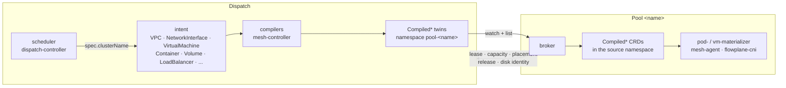
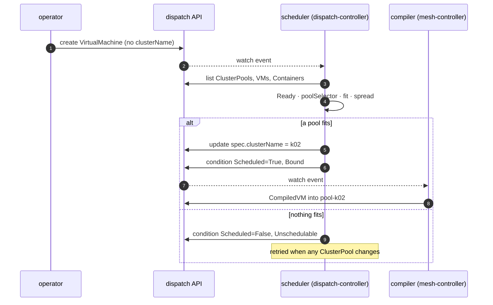

# Multi-cluster orchestration

ectobase spreads workloads over many Kubernetes clusters without making any of them aware of the
others. You write intent once, on the dispatch. The dispatch compiles it into small, pool-scoped
objects, decides which pool runs each workload, and lets each pool pull its own share. This page
explains that path end to end: the API and its storage, the compilers, the `Compiled*` twins, the
broker (`dispatch-broker`) that moves them, scheduling, IP allocation, and how the dispatch decides a pool is healthy.

## The path in one picture

Intent goes down and observations come up, and the two directions use different objects.

Three rules hold throughout:

- Only the dispatch decides. A pool never allocates an address, picks a pool, or edits a spec.
- A pool sees only compiled objects. Its components read `compiled.ectobase.dev` and nothing else
  from the fleet API.
- Everything a pool reports goes onto its own objects. The dispatch copies it across tenant
  namespaces.

## The aggregated API and its storage

The dispatch serves the fleet API from one aggregated apiserver, `dispatch-apiserver`, built on
apiserver-kit. It registers five groups with the host kube-apiserver through `APIService` objects,
so the dispatch's host cluster installs no CRDs for them.

| Group | Kinds |
|---|---|
| `platform.ectobase.dev` | `ClusterPool`, `RouteBusIdentity` |
| `net.ectobase.dev` | `VPC`, `Subnet`, `IPPool`, `IPAllocation`, `NetworkInterface`, `FirewallPolicy`, `FloatingIP`, `LoadBalancer`, `NATGateway`, `VPCPeering` |
| `compute.ectobase.dev` | `VirtualMachine`, `Container` |
| `storage.ectobase.dev` | `Volume` |
| `compiled.ectobase.dev` | `CompiledNIC`, `CompiledVM`, `CompiledVolumeAttachment`, `CompiledContainer` |

The API is aggregated for two reasons. One process owns the whole schema, so every client sees
one consistent fleet API. And the pools need only the compiled subset, so no pool has to
understand the intent schema. (The pool chart still installs the `net.ectobase.dev` CRDs alongside
the compiled ones, but no pool component reads them.)

The dispatch apiserver stores objects in kine, an etcd v3 shim, and kine stores them in postgres.
Postgres holds all of the dispatch's state, so by default its data directory is a
`ReadWriteOnce` PVC that `helm uninstall` keeps. How that storage survives restarts is covered in
[HA and restarts](ha-and-restarts.md).

!!! note
    The aggregated apiserver does not support client-go's streaming list (`WatchList`). Every
    ectobase client of it sets `KUBE_FEATURE_WatchListClient=false` before it builds a client.
    Without that, an informer never receives its initial list and stalls without an error.

Clients reach the API two ways. In-cluster clients, the mesh-controller and the
dispatch-controller, go through the host kube-apiserver's aggregation layer with their
ServiceAccounts. A pool's broker dials the aggregated apiserver directly on the dispatch's fabric
address, port 6444, with a client certificate. The reason is in
[Trust boundaries](overview.md#trust-boundaries).

## Per-pool namespaces

Each pool's compiled objects live in their own namespace on the dispatch, `pool-<clusterName>`.
This section explains why, and how a twin is named and traced back to its source.

The namespace exists for RBAC. A `RoleBinding` authorizes only requests that carry its
namespace, and a cluster-wide `LIST` carries none. If a pool's twins were scattered across tenant
namespaces, a broker would have to list cluster-wide, and no per-pool grant could scope that
read. With one namespace per pool, a namespaced `Role` can grant a broker exactly its own
twins, and the broker's cache is scoped to that namespace.

Because the namespace name embeds the pool name, `spec.clusterName` is not free-form. It must be
a DNS-1123 label of at most 58 characters, so that `pool-` plus the name is still a legal
namespace (`api/validate/clustername.go`). The namespace must exist before the compiler can write
into it, so enrollment creates it together with the `ClusterPool`.

A twin's name is `<sourceNamespace>-<sourceName>`, so twins from different tenant namespaces
cannot collide once they share one pool namespace. Kubernetes forbids an ownerReference across
namespaces, so each twin records its source in two annotations instead:
`compiled.ectobase.dev/source-namespace` and `compiled.ectobase.dev/source-name`. They are
annotations rather than labels because a name can exceed the 63-character limit on label values.

The pool namespace is a dispatch-side detail. The broker mirrors each twin back into its source
namespace on the pool cluster, so the CNI finds a pod's `CompiledNIC` in the pod's own namespace,
and the materializers create workloads where their owner put them.

## Compilers

The compilers lower intent into twins. They are reconcilers in one binary, the
`mesh-controller` (`mesh/controllers`), which runs on the dispatch against the aggregated API.

| Compiler | Reads | Writes |
|---|---|---|
| `CompiledNICReconciler` | a `NetworkInterface`, plus the `FirewallPolicy`, `LoadBalancer`, `VPCPeering` and `NATGateway` objects that apply to it | one `CompiledNIC`: VNI, overlay IPs, MAC, compiled firewall, LB memberships, peer imports, NAT sources, QoS |
| `CompiledVMReconciler` | a `VirtualMachine` and its NICs and Volumes | one `CompiledVM`: image, resources, run strategy, interfaces, cloud-init, attachment names |
| `CompiledVolumeAttachmentReconciler` | a `VirtualMachine` and each `Volume` it references | one `CompiledVolumeAttachment` per volume |
| `CompiledContainerReconciler` | a `Container` | one `CompiledContainer`: the pod template and its overlay interfaces |

The same binary also runs the central allocators (VNI, Subnet, IPPool, NIC IPAM, LB address,
NAT), the mirrors that copy pool reports onto tenant objects, and the volume reclaimer. It is
leader-elected, because the allocators depend on a single writer; see
[HA and restarts](ha-and-restarts.md).

### What a compiler waits for

A compiler emits a twin only once that twin is final. Each gate below holds back a twin that a
pool could not use, or one that would carry a value about to change.

- No pool, no twin. A workload with an empty `spec.clusterName` has no namespace to compile into,
  so its compiler waits for the scheduler.
- The IPAM gate. A `CompiledNIC` is written only when its NIC's status is `Allocated` for the
  current spec generation and has at least one allocated IP. Downstream therefore only ever sees
  final addresses.
- The LB address gate. A NIC carries an LB membership only for a `LoadBalancer` whose address is
  `Allocated`.
- Keep the last good twin. A NIC that falls out of `Allocated` (a bad edit, its Subnet deleted)
  keeps its existing `CompiledNIC`. A transient bad edit does not cut a running workload off. To
  revoke an interface, delete the `NetworkInterface`.

### Placement of a NIC

A `CompiledNIC` goes to the pool of whatever owns it. The compiler resolves that in this order
(`resolvePlacement`, `mesh/controllers/compilednic.go`):

1. An owning `Container`, one whose `spec.interfaceRefs` names the NIC.
2. An owning `VirtualMachine`.
3. The NIC's own `spec.clusterName`, for a standalone NIC.
4. The mesh-controller's `--cluster-name` default. The dispatch chart does not set it, so in
   practice a NIC with none of the above is not compiled.

A `CompiledNIC` carries no node. The agent on whichever node the interface attaches to finds the
policy by the interface's `(VNI, overlay IP)` key, so a workload can land on any node, or move,
without a write back to the dispatch.

### Teardown

A source object carries one finalizer per compiler that compiled it, for example
`compiled.ectobase.dev/compilednic`. When the source is deleted, that compiler deletes its twins
and then removes its own finalizer. Each compiler has its own finalizer because two of them
compile from the same `VirtualMachine`. With a shared finalizer, the first to finish would let
the VM go before the other had removed its twins.

An `OrphanSweeper` is the backstop for what a finalizer cannot cover, such as a finalizer an
operator force-removed. Every 10 minutes it deletes any stamped twin older than 5 minutes whose
source no longer exists. It reads the source uncached, because a lagging cache could report a
live source as gone.

### Break before make for VMs

A `CompiledVM` is the one twin that is never simply replaced. When a VM's `spec.clusterName`
changes, the compiler retires the old twin and compiles nothing into the new pool until the old
pool proves it has let go of the VM. Two pools running one VM would mean two writers on one
`ReadWriteOnce` disk image. Ceph does not refuse a second mapper, and `ReadWriteOnce` is enforced
only within one cluster.

A retired twin keeps a `compiled.ectobase.dev/source-released` finalizer, which holds it on the
dispatch until its `status.released` is true. The VM's `Moving` condition reports
`WaitingForSourceRelease` meanwhile. The move protocol is described in full in
[Moving a VM between clusters](vm-moves.md). Containers and NICs have no such gate: their
compiler writes the twin into the new pool and prunes the old one.

## `Compiled*` twins

A **twin** is a `Compiled*` object on the dispatch together with its copy on the pool. It is the
contract between the two planes: everything a pool needs, and nothing more.

| Twin | Consumed on the pool by | Becomes |
|---|---|---|
| `CompiledNIC` | mesh-agent, flowplane-cni | an attached interface with its firewall, LB membership, NAT, QoS and peering imports |
| `CompiledContainer` | pod-materializer | a `Pod` on the overlay |
| `CompiledVM` | vm-materializer | a KubeVirt `VirtualMachine` |
| `CompiledVolumeAttachment` | vm-materializer | a CDI `DataVolume`, the VM's disk |

The `compiled.ectobase.dev` group imports nothing from the intent groups, so a pool depends on
nothing but this group. Even `CompiledVM.status.placement` uses its own `VMPlacement` type rather
than the one in `compute.ectobase.dev`.

Besides its `ClusterPool` status and its `RouteBusIdentity`, the pool writes back only through twin
status:

- `CompiledVM.status.placement`: the pool, node and node `/64` where the VM runs.
- `CompiledVM.status.released`: the pool has let go of a retired twin's VM.
- `CompiledVolumeAttachment` status: the identity of the disk the pool provisioned.

Two mesh-controller mirrors copy placement onto the `VirtualMachine` and disk identity onto the
`Volume`. That keeps the cross-namespace write on the dispatch, which is fleet-scoped by design.

Field-level detail is in the generated [compiled API reference](../reference/api/compiled.md).

## The broker

The **broker** is the only connection between a pool and the dispatch. It works much like a
kubelet: one Deployment per pool (`dispatch/cmd/broker`) watches that pool's namespace on the
dispatch and makes the pool match it. This section covers how it syncs down, what it reports up,
and the rules that make it safe to restart at any time.

The broker holds three clients:

- a cached dispatch client, scoped to `pool-<name>`, for the twins;
- an uncached dispatch client for its own `ClusterPool` and `RouteBusIdentity`, which it reads by
  name (see [per-pool RBAC](overview.md#per-pool-rbac-on-the-dispatch));
- an uncached client for the pool's own apiserver.

### Down-sync

Each sync pass is a declarative set reconcile, run once per twin kind. The desired set is the twins
in `pool-<name>` on the dispatch, keyed by the namespace and name they will have on the pool. The
current set is what the pool holds. The broker creates what is missing, updates a twin whose spec
or labels drifted, and deletes what is no longer desired. Labels are compared too, because the
vm-materializer joins a VM to its volume attachments by the `workload` label.

A pass keeps no state between runs. Both sets are read fresh every time, so a broker restart
loses nothing.

Two details keep one bad twin from blocking the rest:

- Within a kind, a failed create, update or delete is collected, and the pass carries on with the
  other twins.
- All four kinds run even when an earlier one fails. The errors are returned together, so the pass
  is still retried.

A `CompiledVM` with a deletion timestamp is not desired, even while its finalizer keeps it
visible. It names a VM that this pool must stop, so the sync deletes it downstream.

### When a pass runs

Three things start a pass:

- any event on a twin in the pool namespace;
- the broker starting;
- a timer: one minute after a successful pass.

All three enqueue the same work item, so a burst of events becomes one pass, and a pass never runs
concurrently with itself. A failed pass is retried with a backoff that starts at 5 ms, doubles, and
stops at one minute. A pass that keeps failing is never retried less often than a healthy one
runs.

The start-up pass is what prunes twins nobody is watching. Picture a pool whose last VM failed over
elsewhere while its broker was down. Its pool namespace is now empty, and an empty namespace yields
no events at all. Without the start-up pass, that pool would keep the VM, and its claim on a disk
another pool now runs, indefinitely.

Pruning on an empty desired set is safe because empty is authoritative. Dispatch reads go through
the cache, which serves nothing until it has synced, and a failed list aborts the pass before
anything is deleted. "The dispatch wants nothing here" and "the dispatch could not be read" never
look alike to the sync.

### The release check

A second work item, the release check (`ReportReleases`, `dispatch/pkg/broker/release.go`), marks
a retired `CompiledVM` twin `status.released` once nothing on the pool can still run that VM or
write its disks, and polls every 5 seconds while any twin is still held. It is a separate item so
that a failing sync's backoff never slows a move; what it checks, and how the move waits on it, is
in [Moving a VM between clusters](vm-moves.md).

### One worker, deliberately

The broker's controller runs with `MaxConcurrentReconciles` pinned to 1. A sync pass and a release
check must never overlap. Suppose the sync reads a twin as live, finds nothing downstream, and goes
on to create its VM. A release check running in between could see the same twin as retired with
nothing downstream yet, and report it released. The sync's create would then start the VM on this
pool after the move had been told it was safe to start it on the new one, and two pools would run
it. With one worker, each pass sees the other's writes complete.

One is also controller-runtime's default, but a manager-wide setting would override a default, so
the broker states its own value (`brokerControllerOptions`, `dispatch/cmd/broker/sync.go`).

### Status up

Alongside the sync, two loops report upward every 10 seconds. They are separate so that a slow
node or VMI list never delays a lease renewal.

| Loop | Writes | Used for |
|---|---|---|
| Heartbeater | `ClusterPool.status.lease` (holder, renew time) and `status.allocatable`, the sum over Ready nodes | pool health and scheduling capacity |
| Status reporter | `ClusterPool.status.nodePrefixes` (the distinct underlay `/64`s of its nodes; usually one per pool, since nodes share a `/64` and each holds a `/128` in it), `status.nodeDrain`, `CompiledVM.status.placement`, disk identities on `CompiledVolumeAttachment` | fencing, drain confirmation, placement, keeping a disk across a move |

Both write `ClusterPool` status with a merge patch and no resourceVersion precondition. Four
writers share that status subresource: the heartbeater, the status reporter, the dispatch's
pool-health controller (`status.phase`), and failover (`status.fencedPrefixes`, and clearing a
lost pool's `status.nodeDrain`). A full update from a cached read would conflict with the others
and overwrite their fields.

The node `/64` comes from an annotation the agent stamps on its own Node. A node without it is
left out rather than guessed. When the VMI list fails, the reporter leaves `nodeDrain` exactly as
stored. "Could not list" must never read as "nothing runs here", because the dispatch releases a
fence on a drained `/64`.

## Per-pool RBAC

Each broker authenticates as `ectobase:cluster:<pool>`. Its grants on the dispatch are a namespaced
`Role` in `pool-<pool>` and a `ClusterRole` limited by `resourceNames` to its own `ClusterPool` and
`RouteBusIdentity`. It may read its twins and write only status. The full grant table, and the
constraint behind each scope, are in
[Per-pool RBAC on the dispatch](overview.md#per-pool-rbac-on-the-dispatch).

Two consequences shape the broker's code. Its cache is namespace-scoped, never filtered by a field
selector, because only the namespace scope can be expressed in RBAC. And it reads cluster-scoped
objects uncached and by name, because `resourceNames` cannot match a list.

## Scheduling: how a workload gets a pool

The dispatch picks the pool; the pool picks the node. This section covers the first half: what
`spec.clusterName` means, and how the scheduler fills it in.

### What `spec.clusterName` means

`VirtualMachine` and `Container` both carry `spec.clusterName`, the pool the workload is bound to.

- Empty: the scheduler binds the workload to a pool.
- Set: a hard binding. The scheduler leaves it alone.
- Changed on a running `VirtualMachine`: a **planned move**. The compiler retires the old twin and
  waits for the old pool's release, as described in [Break before make](#break-before-make-for-vms).
- Changed on a `Container`: the compiler writes the new pool's twin and prunes the old one.

The node inside the pool is chosen there: by kube-scheduler for a Pod, by KubeVirt for a VM. A
`Container` can pin a node with `spec.nodeName`, which the pod-materializer turns into a
`kubernetes.io/hostname` node selector.

### The scheduler

Two controllers in the dispatch-controller (`dispatch/pkg/scheduler`) bind unbound workloads: one
for `VirtualMachine`, one for `Container`. Both use the same placement function,
`ScheduleWorkload`:

1. Keep pools whose `status.phase` is `Ready`.
2. For a VM, keep pools whose labels match `spec.poolSelector`. A Container has no pool selector.
3. Keep pools where, for every requested resource, the requests of the workloads already bound
   there plus this one fit within `status.allocatable`. A resource the pool does not advertise
   does not fit. Only requests count; limits are carried but ignored.
4. Among those, pick the pool with the highest minimum free fraction across the requested
   resources. This spreads load. A tie goes to the lowest name.

Bound VMs and bound Containers share a pool's capacity: both kinds count against its
`allocatable`.

When nothing fits, a VM gets a `Scheduled=False` condition with reason `Unschedulable`. A Container
has no conditions, so it simply stays unbound. Either way, any change to any `ClusterPool`
re-enqueues every unbound workload of that kind, so a pool that becomes `Ready` or gains capacity
picks them up.

Each scheduler runs a single worker, so binds of one kind are serialized. The VM and Container
schedulers are separate controllers, though, so a VM bind and a Container bind can run at the same
time and each count the pool's capacity without the other.

!!! note
    `spec.antiAffinity` on a `VirtualMachine` is not used by this initial bind. Only failover's
    batch placement reads it; see [Scheduling, rescheduling and failover](failover.md).

## IPAM and placement

All address allocation happens on the dispatch, before a twin exists. Pools receive final
addresses and never allocate. This section lists the allocators and how compilation waits for
them.

| Allocator (mesh-controller) | Allocates | From |
|---|---|---|
| `VPCReconciler` | a fleet-unique VNI per `VPC`, written to `status.vni` | `spec.vni` if pinned, else the lowest free value in `[1000, 2^24-1]` |
| `SubnetReconciler` | validates a `Subnet`'s v4/v6 prefixes; `Conflict` if it overlaps a sibling in the same VPC | the Subnet's prefixes |
| `NICIPAMReconciler` | a `NetworkInterface`'s overlay IPs and MAC, written to `status.allocatedIPs` and `status.allocatedMAC` | its Subnet; pinned `spec.ips` are honoured |
| `IPPoolReconciler` | validates an `IPPool` (type `public` or `internal`); `Conflict` if it overlaps a sibling pool | the pool's prefixes |
| `LoadBalancerIPReconciler` | a `LoadBalancer` address, as an `IPAllocation` | the `IPPool` in `spec.poolRef` |
| `NATGatewayReconciler` | public addresses (as `IPAllocation` objects, with `spec.poolRef`) and per-source port blocks | the gateway's pool or `spec.publicIPs` |

An `IPAllocation` has no status: its existence is the allocation. Its name is derived from the pool
and the address, and object names are unique within a namespace, so creating it is a
compare-and-swap. Two allocators racing for one address cannot both succeed.

The allocators that build a used-set do so from an uncached read, and they run a single worker
each. That combination is what makes them race-free, and it is why the mesh-controller is
leader-elected: two managers during a rolling restart would be two writers.

Addresses do not depend on placement. A Subnet belongs to a VPC, not to a pool, so a NIC keeps its
IPs and MAC when its workload moves to another pool. The compile gates above make sure a pool only
ever sees finished allocations. The operator view, and moving an existing installation to central
IPAM, are in [IPAM migration](../operations/ipam-migration.md).

## Pool health

The dispatch judges a pool by one signal: whether its broker keeps renewing a lease. This section
covers how the lease turns into a phase, and what reads that phase.

The broker renews `ClusterPool.status.lease.renewTime` every 10 seconds. The dispatch-controller's
`ClusterPool` reconciler (`dispatch/pkg/clusterpool`) turns lease age into `status.phase`, with
`HealthStale` set to 30 seconds:

| Phase | When | `Ready` condition reason |
|---|---|---|
| `Pending` | no lease has ever been reported | `NoLease` |
| `Ready` | the lease was renewed at most `HealthStale` ago (inclusive) | `LeaseFresh` |
| `Unknown` | the lease is older than `HealthStale` | `LeaseExpired` |

Each heartbeat is an event on the `ClusterPool`, so the phase follows a live pool closely. When the
heartbeats stop, the reconciler still requeues itself every `HealthStale`, so a silent pool turns
`Unknown` within about a minute of its last renewal.

Readers use the phase differently:

- The scheduler binds only to `Ready` pools.
- Failover treats a pool as lost once it is `Unknown` and its lease is older than 2 minutes.
- Fence release requires the pool to be reachable: `Ready` and a lease within `HealthStale`
  checked again at that moment, because the phase lags a broker that has just gone silent.

## When a pool is unreachable

A pool that loses the dispatch keeps what it has. Its broker's cache holds the twins as last
synced, and no pool component reads the dispatch directly, so running workloads continue. What
stops is change: no new twins arrive, and no status goes up.

On the dispatch side the pool goes `Unknown`, and the scheduler stops binding to it. After 2
minutes without a lease, failover starts. It fences the pool's storage (a Ceph `NetworkFence`) and
its network (a reflector route fence) for each node `/64`, and only then rebinds the pool's
`VirtualMachine` objects to healthy pools. Failover moves VMs only; a `Container` bound to a lost
pool stays bound. Fencing, rebinding and recovery are described in
[Scheduling, rescheduling and failover](failover.md).

## Where to go next

- [Moving a VM between clusters](vm-moves.md): the release protocol a planned move uses.
- [Scheduling, rescheduling and failover](failover.md): what happens when a pool is lost.
- [HA and restarts](ha-and-restarts.md): leader election, persistence and rollout order.
- [The overlay network](overlay.md): how workloads on different pools reach each other.
