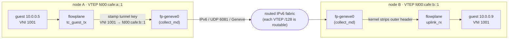
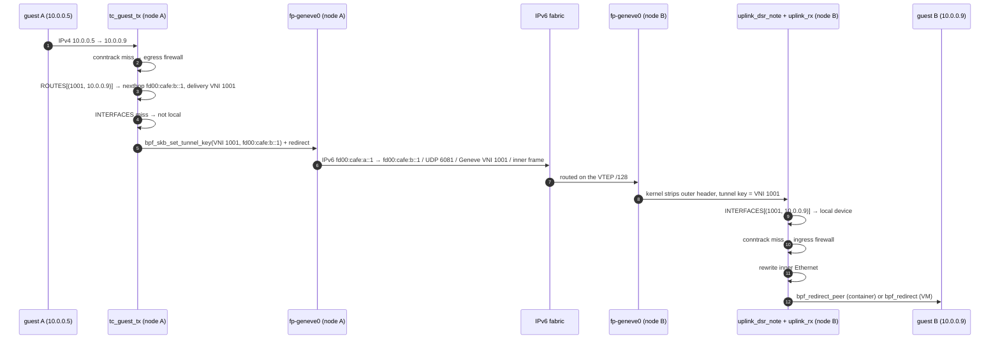

# The overlay network

Every ectobase workload, container or VM, gets an overlay address that only means something inside
its tenant's network. Overlay packets cross between hosts as Geneve frames over a routed IPv6
underlay. This page explains how that works end to end: the underlay, the one address each node
holds on it, the Geneve encapsulation and its MTU cost, how VNIs keep tenants apart, and the path a
packet takes from one guest to another.

The pieces it touches are covered in depth elsewhere: [the route bus](route-bus.md) distributes the
routes, [attaching workloads](attaching-workloads.md) explains how an interface joins, and
[the flowplane dataplane](dataplane/index.md) is the eBPF code that moves the packets.

## The picture

A guest sends an ordinary IP packet. flowplane on the sending node looks up the destination in the
guest's VNI, learns which node holds it, and hands the packet to the kernel's Geneve device with a
tunnel key that names the VNI and the remote node. The kernel builds the outer header. On the far
side the kernel strips it again, and flowplane delivers the inner packet to the right interface by
looking up the VNI and the inner destination.

## The IPv6 underlay

The underlay is the physical network between hypervisors: a routed IPv6 fabric. ectobase asks one
thing of it, that every node's VTEP address is reachable from every other node.

### One VTEP per node

Each node has exactly one underlay address, its **VTEP** (virtual tunnel endpoint), a `/128`
usually held on a fabric loopback (`lo` or a `dummy` device) and routed by the fabric. In the lab
each node holds its VTEP on `dummy0` and advertises the `/128` over BGP.

The VTEP is:

- the outer source address of every Geneve frame the node sends;
- the outer destination other nodes send to, for any workload on this node;
- the underlay of every interface attached to the node. `AttachInterface` programs each interface
  with the node's VTEP, and `ListInterfaces` reports it back as the interface's `underlay_route`.

flowplane resolves the VTEP once at startup, in this order: `--local-underlay` if set; else the host
address inside `--underlay-within` (the expected node aggregate); else the `HOST_IP` or `NODE_IP`
environment variable, if it holds an IPv6 address; else the address on a `lo` or `dummy*` fabric
loopback. The pool chart sets neither environment variable, so deployed nodes rely on
`--underlay-within` (the chart's `underlayWithin` value) or on loopback inference.

### No per-endpoint underlay, no underlay IPAM

No interface gets an underlay address of its own, and nothing allocates underlay addresses at
runtime. This works because Geneve carries the VNI in its header. The outer destination only has to
name the node; the receiving node finds the interface by looking up `(VNI, inner destination)` in its
`INTERFACES` map. Overlapping tenant address ranges are harmless for the same reason.

The earlier design was different. A bare IP-in-IPv6 header carries no VNI, so the outer destination
had to identify the endpoint itself, and every interface got its own `/128` carved from the node's
`/64`. Geneve retired that model.

### The node /64 is a drain coordinate

The `/64` that contains a node's VTEP survives with one job: the broker's drain report. The agent
writes it onto its own `Node` as an annotation (`StampNodePrefix` in `mesh/agent/nodeprefix.go`),
the broker reports it in `status.nodePrefixes`, and a fenced prefix stays held while any node `/64`
inside it still runs a VMI. It is never what failover
[fences](../concepts/what-is-ectobase.md#vocabulary): that is only the operator-declared
`spec.underlayPrefix`, because the pool being fenced writes `status.nodePrefixes` itself. See
[failover](failover.md).

The `/64` is not an address-ownership unit. In the lab every node in a cluster takes its `/128` from
one shared cluster `/64`, which is why the route bus checks announcements against the exact `/128`
and never against the `/64` (see [origin authorization](route-bus.md#origin-authorization)).

## Geneve encapsulation

ectobase encapsulates with **Geneve**: outer IPv6, UDP (destination port 6081), and an 8-byte Geneve
header that carries the 24-bit VNI and any options. The inner frame keeps its Ethernet header, so one
format carries both inner IPv4 and inner IPv6.

### The kernel builds the header

flowplane never writes outer-header bytes. Each node runs one kernel Geneve device in metadata mode,
`fp-geneve0` (`ip link add fp-geneve0 type geneve external`), which serves every VNI and every remote.

- On egress, a tc program stamps the packet's tunnel key with `bpf_skb_set_tunnel_key`: the VNI as
  the tunnel id, the remote VTEP as the IPv6 destination, and a hop limit of 64. It then redirects the
  packet to `fp-geneve0`, and the kernel builds the outer IPv6, UDP and Geneve headers from that key
  and routes the result onto the fabric.
- On ingress, `fp-geneve0` decapsulates before any eBPF program runs. The program on its tcx ingress
  hook reads the VNI back with `bpf_skb_get_tunnel_key`.

The kernel owning the header has three payoffs. It picks the outer UDP source port from a hash of the
inner flow, which gives the fabric's ECMP and the receiving NIC's RSS per-flow entropy; a bare
IP-in-IPv6 header has no ports to hash on. A non-linear (jumbo) packet gets the right outer length
without the eBPF program having to grow the packet. And the optional hardware tier can offload a flow
with a tc-flower `tunnel_key` action toward the same device (see
[attaching workloads](attaching-workloads.md#sr-iov-vf-offload)).

`fp-geneve0` carries the MAC given by `--gateway-mac`. The device carries inner Ethernet. On a WAN
edge `--gateway-mac` is the virtual-router MAC guests address (`02:00:00:00:00:01`), so frames from
guests already match the device. On compute nodes the pool chart passes the fabric router's MAC, and
it has no effect on delivery there.

### Options: the DSR TLV

flowplane defines one Geneve option, the **DSR TLV** (direct server return). It is 24 bytes: a
4-byte option header (class `0x0108`, type `0x01`, length 5 words) and a 20-byte payload holding the
address family, the service port and the 16-byte load-balancer address.

Only the WAN edge stamps it, on a packet it forwards from the internet to a load-balancer backend.
The backend notes the load-balancer address, and when the guest replies it rewrites the reply's
source to that address, so the reply can leave directly instead of hairpinning through the edge.
See [the WAN edge](../features/ns-edge.md) and [load balancing](../features/loadbalancer.md).

### The MTU budget

Encapsulation costs 56 bytes: outer IPv6 (40), UDP (8) and Geneve (8). The outer Ethernet header is
link framing on the fabric NIC, not part of the IP MTU. On top of that, ectobase reserves the 24-byte
DSR option on every guest, for 80 bytes in total (`ENCAP_OVERHEAD_V6` in `flowplane-common`).

| Smallest uplink MTU | Guest MTU |
|---|---|
| 1500 | 1420 |
| 9000 | 8920 |

The DSR reserve applies to the whole fleet because any interface can become a load-balancer backend
later, and a guest's MTU is advertised once. A guest learns it from the link MTU, the DHCPv4 MTU
option (26) or the IPv6 Router Advertisement MTU option, and none of those is renegotiated when the
guest joins a load balancer.

flowplane derives one guest MTU per node at startup: the smallest MTU across `--uplink` and
`--extra-uplink`, minus 80, floored at 576. `--guest-mtu` overrides it. That value sets the link MTU
on both ends of each guest device and is what the DHCP and RA responders advertise.

Jumbo MTUs are offered only where the datapath can carry them: when `FLOWPLANE_SKB_MODE` is set, or
when every uplink advertises XDP scatter-gather. Otherwise the uplink is treated as 1500 before the
subtraction. The lab's fabric runs 9000 end to end and sets `FLOWPLANE_SKB_MODE`, so its guests get
8920.

flowplane does not generate ICMP "packet too big" messages. It relies on advertising the right MTU.

## VNIs and multi-tenancy

A **VNI** (virtual network identifier) names one tenant network, a `VPC`. The mesh-controller
allocates VNIs from 1000 to 2^24 − 1, the range a Geneve header can carry; a `VPC` can also pin one in
`spec.vni`. VNI 0 is reserved for the route bus's public VNI, which only carries the WAN edges'
default routes and never appears on the wire.

Isolation comes from keying every lookup that could collide on the VNI:

- `ROUTES` and `ROUTES6` are LPM tries keyed on the VNI followed by the address, so a lookup only ever
  matches routes in the guest's own VNI;
- `INTERFACES` and `INTERFACES6` resolve an inbound packet by `(VNI, inner destination)`, with the
  VNI taken from the Geneve header;
- conntrack, NAT and floating-IP keys carry the VNI.

The firewall binds to the interface, not the VNI: each interface has its own rules. Reaching another
VPC is never implicit. [VPC peering](../features/vpc-peering.md) imports routes across VNIs, and the
[firewall](../features/firewall.md) still applies.

### The sender stamps the delivery VNI

A route value carries the VNI to deliver under, `RouteValue.nexthop_vni`, separate from the VNI
whose table it sits in. The sending node stamps that value as the Geneve tunnel id, and the
receiving node looks the destination up in that VNI. The route bus agent sets it through
`AddRoute.delivery_vni` (0 means "the table's own VNI").

| Route | Table (key) VNI | Delivery VNI |
|---|---|---|
| A guest in the same VPC | the VPC's VNI | the same VNI |
| A peered VPC's guest, imported | the importing VPC's VNI | the peer VPC's VNI |
| The public default, imported into an egress VNI | the egress VNI | the egress VNI (public VNI 0 means "the key VNI") |

The peering case is why the field exists. The receiving node only knows the peer guest under the
peer's VNI, so the sender must stamp that VNI, not its own.

## The egress walk

A guest's packet enters flowplane on the host side of its device, at `tc_guest_tx`. The program first
answers the guest's control traffic (ARP, IPv6 Neighbor and Router Solicitations, DHCP) and sends
the reply straight back; see [DHCP, ARP and ND](../features/dhcp-arp-nd.md). For any other IPv4
packet it runs these steps in order (`forward_decision_v4` in `flowplane-ebpf/src/egress.rs`; the
simulator runs the same core steps through `process_guest_tx`):

1. Conntrack and egress firewall. A new flow, or one whose entry predates the current firewall
   epoch, meets the interface's egress rules. An established flow skips them.
2. Address rewrites. A reply to a DSR-load-balanced flow gets its source rewritten to the
   load-balancer address, and floating-IP mappings apply.
3. Route lookup. A longest-prefix match on `(VNI, destination)` in `ROUTES`. A miss passes the
   packet to the host stack.
4. NAT. If the route is external (a default route toward a WAN edge), the source is translated to
   the interface's NAT address and port block.
5. Track and meter. The flow is recorded in conntrack, and external egress is policed against the
   interface's public lane.
6. Deliver. If `INTERFACES` says the destination is on this node, take the same-host fast path.
   Otherwise stamp the tunnel key from the route (`nexthop_vni`, `nexthop_ipv6`) and redirect to
   `fp-geneve0`.

IPv6 takes the same shape in `tc_guest_egress_v6`: firewall and conntrack, the DSR rewrite, NAT66 on
an external route, then route and deliver. Traffic to the NAT64 prefix `64:ff9b::/96` goes through
`tc_guest_nat64` instead. Both are reached by tail call, which gives each a fresh eBPF stack.

## The ingress walk

The packet arrives at `fp-geneve0` on the destination node. The kernel strips the outer header, then
two programs run on the device's tcx ingress hook, in order:

1. `uplink_dsr_note` reads the DSR option if present and records the load-balancer address for the
   reply. It always hands on to the next program.
2. `uplink_rx` reads the VNI from the tunnel key and works out where the inner packet goes. An inner
   IPv6 packet is passed by tail call to the IPv6 program.

`uplink_rx` resolves the target in this order (`process_uplink_rx` in
`flowplane-core/src/datapath/uplink.rs`):

- Load balancer (edge and simulator only today; see [load balancing](../features/loadbalancer.md)).
  If the destination is a load-balancer address, Maglev picks a backend. A local backend is delivered
  to; a remote one is re-stamped with that backend's VTEP and sent back out through `fp-geneve0`.
- NAT return. A reply to a NAT address restores the guest's address from conntrack and delivers
  it.
- Floating IP. A destination in `FLOATING_IPS` is rewritten to the guest behind it, which is then
  delivered as a local interface.
- Neighbour NAT relay. A destination address and port inside another node's NAT block
  (`NAT_OWNERS`, same VNI) is re-stamped toward the owner's VTEP and sent back out `fp-geneve0`.
- Local interface. `INTERFACES[(VNI, destination)]` names a local interface: run the ingress
  firewall on a new flow, rewrite the inner Ethernet header, and redirect to the interface's device.
- WAN edge. On an edge, a miss hands the packet to the local kernel to be routed onto the WAN.
- Otherwise, drop. A miss on a normal node is dropped, never passed to the host.

### Packet walk

## The same-host fast path

When both guests are on the same node, step 6 of the egress walk finds the destination in
`INTERFACES` and never touches `fp-geneve0`. flowplane runs the destination's ingress firewall on a
new flow (a same-node packet never passes through `uplink_rx`, so this is where that check happens),
rewrites the inner Ethernet header (destination = the guest's MAC, source = the shared
virtual-router MAC `02:00:00:00:00:01`) and redirects to the destination's device with a plain `bpf_redirect`.

Every local interface also has a self-route in `ROUTES` pointing at the node's own VTEP, so step 3
finds a route for a local guest even before the route bus has said anything.

## Delivering with `bpf_redirect_peer`

`bpf_redirect_peer` moves a packet straight to the ingress of a device's peer in another network
namespace, in the same softirq, skipping the host-side transmit and a trip back through the stack.
flowplane uses it in one place: `uplink_rx` delivering to a container, whose device is a veth or
netkit pair whose peer is the pod's `eth0`. The interface records this as `peer_capable` in
`INTERFACES`.

Everywhere else delivery is a plain `bpf_redirect`:

- VMs. The VM's netkit peer is spliced to the VM's tap by a `tc mirred` action on the peer's
  ingress, and `bpf_redirect_peer` bypasses that hook, so the packet would never reach the tap.
- SR-IOV VFs. The switch delivers to the VF; there is no peer to redirect into.
- The same-host fast path. Peer redirect from the netkit peer hook does not reach a VM's tap
  either, so this path keeps the plain redirect for every destination.

## The WAN edge and north-south traffic

Traffic to and from the internet goes through WAN edges. An edge runs flowplane with `--role edge`
next to a router (VyOS in the lab), attaches `wan_rx` to its WAN uplink, and joins the overlay like
any node. Its agent originates `0.0.0.0/0`, `::/0` and `64:ff9b::/96` into the public VNI with the
edge's underlay address as the nexthop; nodes with guests that need egress import those defaults into
their VNIs.

- Egress: a guest's packet to the internet matches the imported default, is NAT-translated on its
  own node and encapsulated to the edge. The edge's `uplink_rx` hands it to the local kernel.
- Return and inbound: `wan_rx` catches traffic to a NAT address and relays it to the node that
  owns the port block, or, for a load-balancer address, picks a backend with Maglev and stamps the DSR
  option.

See [the WAN edge](../features/ns-edge.md) for the full design.

## Where to go next

- [The route bus](route-bus.md): how the `ROUTES` entries in these walks get onto every node.
- [Attaching workloads](attaching-workloads.md): how a container or VM gets its device and its
  `INTERFACES` entry.
- [Programs and hooks](dataplane/programs.md): each eBPF program in detail.
- [Routing and VNIs](../features/routing-vni.md): the routing feature from the user's side.
