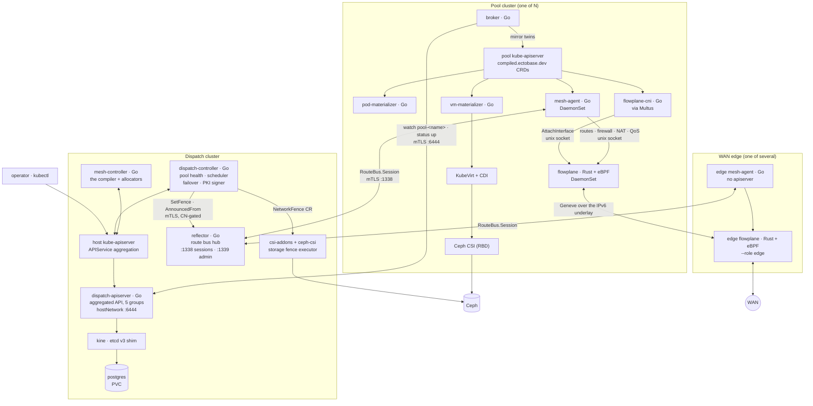
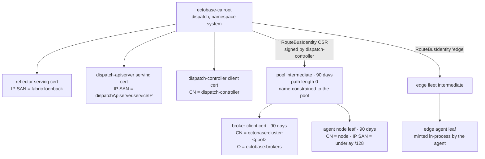
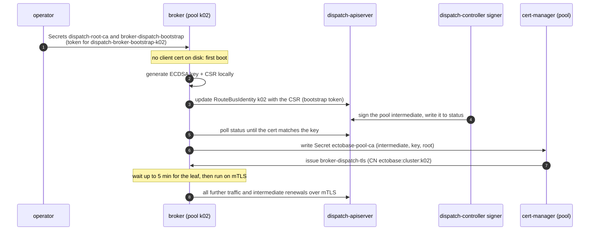
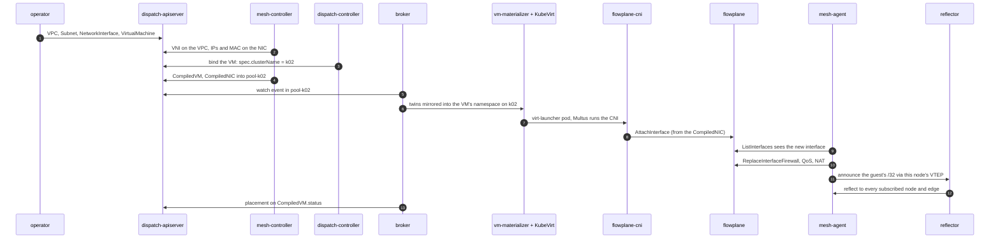

# Architecture overview

ectobase runs workloads on a fleet of Kubernetes clusters and connects them with one eBPF overlay.
This page puts every component on one map: where it runs, what it talks to, which identity it
holds, and how a single request passes through all of them.

Components run in three places:

- The **dispatch** is the fleet control plane. You write intent there, and it compiles that intent,
  schedules it and stores it.
- Each **pool** is a compute cluster. It runs workloads from its own copy of the compiled state.
- The **WAN edges** are the routers between the overlay and the outside world. Each runs its own
  dataplane and agent.

Most of the control plane is Go. The dataplane, `flowplane`, is Rust: a userspace daemon plus eBPF
programs built with aya.

## The whole system

The diagram shows one pool. A real fleet has several, each with the same components, all
connected to one dispatch and one route bus.

The dispatch never reaches into a pool. Every pool-side connection starts in the pool: the broker
dials the dispatch apiserver, and the agents dial the reflector. Once a pool has its compiled
objects, it runs them from its own apiserver, and a lost dispatch leaves running workloads alone.

## The components

| Component | What it is | Runs where | Talks to | Language |
|---|---|---|---|---|
| `dispatch-apiserver` | Aggregated apiserver built on apiserver-kit. It serves the `platform`, `net`, `compute`, `storage` and `compiled` groups. | Dispatch: one-replica Deployment, `hostNetwork` on port 6444 | kine over etcd v3; the host kube-apiserver for delegated authentication and authorization | Go |
| kine and postgres | kine is an etcd v3 shim that stores the API objects in postgres. | Dispatch: two one-replica Deployments; postgres data on a PVC by default | postgres on 5432 | upstream |
| `dispatch-controller` | Fleet reconcilers: `ClusterPool` health, the VM and Container schedulers, failover and fencing, and the `RouteBusIdentity` signer for the PKI. | Dispatch: one-replica Deployment, leader-elected | aggregated API via the host kube-apiserver; reflector admin port; csi-addons `NetworkFence` | Go |
| `mesh-controller` | The compiler. It lowers intent into `Compiled*` twins and runs the central allocators (VNI, Subnet, IPPool, NIC IPAM, LB address, NAT). | Dispatch: one-replica Deployment, `hostNetwork` on a control-plane node, leader-elected | aggregated API via the host kube-apiserver | Go |
| `reflector` | The route bus hub. It keeps an in-memory per-VNI routing table and reflects routes between agents. | Dispatch: one-replica Deployment, `hostNetwork` on a control-plane node | agents on 1338; the dispatch-controller on 1339 | Go |
| csi-addons and ceph-csi | The storage fence executor: a `NetworkFence` becomes a `ceph osd blocklist`. ceph-csi here also deletes the RBD image behind a deleted `Volume`. | Dispatch | Ceph | upstream |
| `broker` | One per pool. It syncs the pool's twins down and reports lease, capacity, placement and release up. | Pool: one-replica Deployment, `hostNetwork` on a control-plane node | dispatch apiserver on 6444; the pool's own apiserver | Go |
| `mesh-agent` | One per node. It programs the node's dataplane from `CompiledNIC` objects and speaks the route bus. | Pool: DaemonSet, `hostNetwork` | reflector on 1338; local flowplane socket; pool apiserver | Go |
| `pod-materializer` | Turns a `CompiledContainer` into a Pod on the overlay. | Pool: Deployment | pool apiserver | Go |
| `vm-materializer` | Turns a `CompiledVM` and its `CompiledVolumeAttachment` objects into a KubeVirt `VirtualMachine` and CDI `DataVolume` objects. | Pool: Deployment, when `vmMaterializer.enabled` | pool apiserver | Go |
| `flowplane` | The eBPF dataplane: tcx and netkit programs, pinned maps, and a gRPC control socket. | Pool: privileged DaemonSet, `hostNetwork`, `hostPID` | the kernel; `/run/flowplane/dataplane.sock` | Rust |
| `flowplane-cni` | CNI plugin that Multus runs for an overlay attachment. A DaemonSet installs the binary on every node. | Pool: every node | pool apiserver (Pod, `CompiledNIC`); flowplane socket | Go |
| KubeVirt, CDI, Multus | Run VMs, import disks, and attach secondary networks. | Pool | pool apiserver | upstream |
| Ceph CSI (RBD) | Maps RBD images onto pool nodes for VM disks. | Pool | Ceph | upstream |
| edge `flowplane` | The dataplane in edge mode: `--role edge` attaches `wan_rx` to the WAN uplink. | WAN edge: container sharing the edge router's network namespace | WAN and fabric uplinks | Rust |
| edge `mesh-agent` | The agent in API-less edge mode (`--edge-loopback` without `--kubeconfig`). It learns LB addresses and their backends from the route bus. | WAN edge: same network namespace | reflector; local edge flowplane | Go |

The charts deploy the dispatch and pool components: `charts/ectobase-dispatch` and
`charts/ectobase-pool`. The edges are not in a chart. In the lab they are containers defined in
the containerlab topology, next to each VyOS edge router.

!!! note
    csi-addons runs on the dispatch, not on the pools. The dispatch-controller writes the
    `NetworkFence` objects there, and the ceph-csi provisioner on the dispatch carries the
    csi-addons sidecar that executes them. Pools run ceph-csi only to attach RBD images.

A pool can also run Tier-1 local remediation (medik8s NodeHealthCheck and SelfNodeRemediation,
`tier1Failover.enabled`). It is optional and pool-local; see
[Scheduling, rescheduling and failover](failover.md).

## Trust boundaries

This section covers who can prove what to whom. Three facts frame it: one certificate root signs
everything, every cross-cluster link is mutual TLS, and a pool's credential reaches only that
pool's objects.

### One PKI

The dispatch chart creates a self-signed root, `ectobase-ca` (ECDSA P-256, ten-year lifetime), with
cert-manager, and a `ClusterIssuer` of the same name. Each pool gets its own intermediate CA
signed from that root. The pool generates the intermediate's key itself and only ever sends a CSR.

The pool intermediate is a CA with path length 0, so it signs leaves but no further CAs. It is
name-constrained to the DNS domain `<pool>.routebus.ectobase.dev`. When the pool chart sets
`pki.underlayCIDRs`, it is also constrained to those underlay ranges, so it cannot issue a leaf
with an IP SAN in another pool's underlay. The pool's cert-manager `Issuer` `ectobase-pool-ca`
issues the broker's client cert and each agent's node leaf from it.
Pool and edge PKI are covered in more depth in [The route bus](route-bus.md).

### Mutual TLS on every cross-cluster link

| Link | The client checks | The server checks | Authorization |
|---|---|---|---|
| broker to dispatch-apiserver, port 6444 | the serving cert chains to `ectobase-ca` | the client cert chains to `ectobase-ca`; its CN becomes the username `ectobase:cluster:<pool>` | per-pool RBAC, delegated to the host kube-apiserver |
| agent to reflector, port 1338 | the reflector cert chains to the root | the node leaf chains through the pool intermediate, with its name constraints enforced | every announced nexthop must equal one of the leaf's IP SANs exactly |
| dispatch-controller to reflector admin, port 1339 | the reflector cert | the client cert's CN must be `dispatch-controller` | only that CN may fence |

The broker dials the dispatch apiserver directly and does not go through the host
kube-apiserver. The host kube-apiserver serves the host cluster's CA and authenticates its
callers by the aggregation front-proxy, so a broker going through it could neither verify
`ectobase-ca` nor present its own client cert. In-cluster clients, the mesh-controller and the
dispatch-controller, still use APIService aggregation with their ServiceAccount identities.

The reflector registers the fence API only on its admin listener, port 1339, never on the session
port. That listener also rejects every client whose CN is not `dispatch-controller`, so an agent's
valid session cert cannot drive a fence.

### Per-pool RBAC on the dispatch

Each pool's credential is scoped twice: by namespace for its compiled objects, and by name for the
cluster-scoped objects it owns. Enrollment creates these objects alongside the `ClusterPool`. The
lab generates them in `clusterPoolsManifest` (`test/lab/internal/deploy/ectobase.go`).

| Object | Grants |
|---|---|
| `Role` `dispatch-broker` in `pool-<pool>` | `get`, `list`, `watch` on `compilednics`, `compiledvms`, `compiledvolumeattachments`, `compiledcontainers`; `get`, `update`, `patch` on `compiledvms/status` and `compiledvolumeattachments/status` |
| `ClusterRole` `dispatch-broker-pool-<pool>` | with `resourceNames: [<pool>]`: `get`, `update` on `routebusidentities` and their status; `get` on `clusterpools`; `get`, `update`, `patch` on `clusterpools/status` |

Both are bound to the user `ectobase:cluster:<pool>`. The `ClusterRole` is also bound to the
bootstrap ServiceAccount `dispatch-broker-bootstrap-<pool>`.

Each scope follows from a constraint:

- A `RoleBinding` only authorizes requests that carry its namespace. A cluster-wide `LIST`
  carries none, so the broker's cache is scoped to `pool-<pool>` and its lists are namespaced.
  The result is that a broker cannot read another pool's compiled state, even if it drops its own
  filter.
- `resourceNames` matches only requests that name an object, and a list or watch names none. So
  the broker reads its `ClusterPool` and `RouteBusIdentity` through an uncached client, by name.
- Writes go to status subresources only. A broker can never rewrite a spec (for example
  `spec.clusterName`), and it cannot create or delete a twin.
- `RouteBusIdentity` `<pool>` is pre-created, because RBAC cannot scope `create` by name.

The dispatch apiserver has no broker-specific admission plugin; RBAC alone draws the boundary.
Writes that cross into tenant namespaces, such as a VM's placement or a `Volume`'s disk identity,
go onto the pool's own twin first. A mesh-controller mirror then copies them across.

### The token bootstrap

A fresh pool faces a chicken-and-egg problem. Its steady-state client cert comes from its
intermediate CA, and the broker obtains that intermediate over the dispatch connection. A
short-lived token breaks the loop.

The token is used once. After that the broker authenticates with its leaf, and client-go re-reads
the cert files from disk, so a cert-manager rotation needs no restart. The operator steps are in
[Deploying with Helm](../operations/deploy-helm.md).

### Where trust is weaker

A few links are not authenticated the same way. Know them before you run this outside a lab.

- The `APIService` objects set `insecureSkipTLSVerify: true`, so the host kube-apiserver does not
  verify the aggregated apiserver's serving cert.
- The dispatch apiserver reaches kine over plain HTTP (`--etcd-servers=http://kine:2379`), and kine
  reaches postgres with `sslmode=disable`. The chart's default database password is `kine`.
- The agent's kubeconfig for its own pool apiserver sets `insecure-skip-tls-verify`, because the
  apiserver's serving cert has no SAN for the fabric address it is dialled on. The agent still
  authenticates with its ServiceAccount token.
- flowplane's gRPC socket has no authentication. It is a `0600` unix socket on the node, so only
  root on that node can reach it, and the CNI and the agent both run as root.

## One request, end to end

This tour follows one VM with one network interface, from `kubectl apply` to traffic, and names
every component it crosses.

1. The operator creates a `VPC`, a `Subnet`, a `NetworkInterface` and a `VirtualMachine` on the
   dispatch. The request reaches the host kube-apiserver, which hands it to the dispatch apiserver
   through the `APIService`. The dispatch apiserver stores it in postgres through kine.
2. The mesh-controller's allocators give the VPC a VNI, mark the Subnet `Ready`, and give the NIC
   its overlay IPs and MAC. Nothing compiles a NIC before that allocation is final.
3. The dispatch-controller's scheduler sees a VM with no `spec.clusterName` and binds it to a
   `Ready` pool that fits, here `k02`.
4. The mesh-controller compiles a `CompiledVM` and a `CompiledNIC` (plus a
   `CompiledVolumeAttachment` per volume) into the namespace `pool-k02` on the dispatch.
5. k02's broker gets a watch event for its namespace and runs a sync pass. It creates the twins
   in the VM's own namespace on k02.
6. The vm-materializer turns the `CompiledVM` into a KubeVirt `VirtualMachine`, and KubeVirt starts
   a virt-launcher pod.
7. Multus runs flowplane-cni in the launcher's network namespace. The CNI finds the
   `CompiledNIC` by the interface MAC and calls `AttachInterface` on the node's flowplane.
8. The node's mesh-agent sees the interface in `ListInterfaces` and matches it to the
   `CompiledNIC` by `(VNI, overlay IP)`. It programs the interface's firewall, plus any QoS and
   egress NAT the `CompiledNIC` carries, and announces the guest's address to the reflector with
   this node's VTEP as the nexthop.
9. The reflector sends the route to every node and edge subscribed to that VNI, and their agents
   program it into their flowplane. Traffic to the VM now crosses the fabric in Geneve.
10. Within ten seconds the broker reports where the VM runs onto `CompiledVM.status.placement`,
    and the mesh-controller mirrors it onto the `VirtualMachine`.

If the VM is exposed by a `LoadBalancer`, its node's agent also announces an LB record on the
route bus. The edge agents learn the LB address and its backends from those records, and the edge
flowplane answers for that address on the WAN. See [North-south edge](../features/ns-edge.md).

## Where to go next

- [Multi-cluster orchestration](multi-cluster.md): the compile, sync and status path in detail.
- [The route bus](route-bus.md): how overlay routes reach every node and edge.
- [The dataplane](dataplane/index.md): what flowplane does with a packet.
- [HA and restarts](ha-and-restarts.md): what survives a restart of each component.
