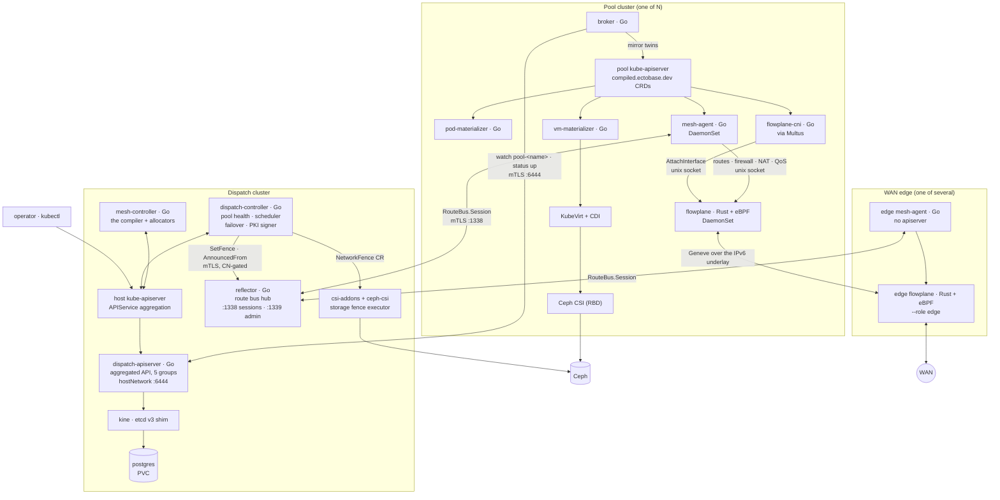
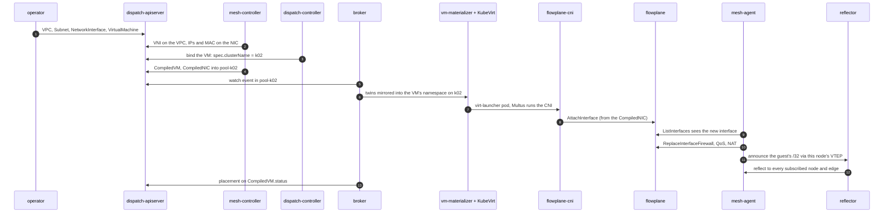
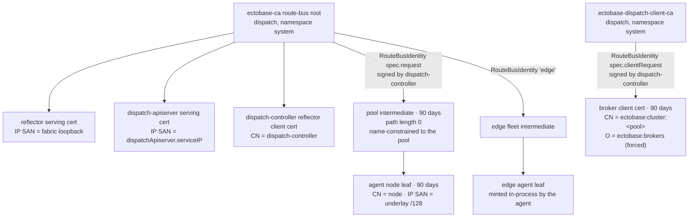
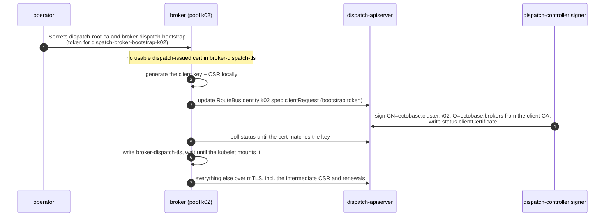

# Architecture overview

ectobase runs workloads on a fleet of Kubernetes clusters and connects them with one eBPF overlay.
This page puts every component on one map: where it runs, what it talks to, which identity it
holds, and how a single request passes through all of them.

Components run in three places:

- The **dispatch** is the fleet control plane. You write intent there, and it compiles that intent,
  schedules it and stores it.
- Each **pool** is a compute cluster. It runs workloads from its own copy of the compiled state.
- The **WAN edges** are the routers between the overlay and the outside world. Each runs its own
  dataplane and agent.

Most of the control plane is Go. The dataplane, `flowplane`, is Rust: a userspace daemon plus eBPF
programs built with aya.

## The whole system

The diagram shows one pool. A real fleet has several, each with the same components, all
connected to one dispatch and one route bus.

The dispatch never reaches into a pool. Every pool-side connection starts in the pool: the
broker (`dispatch-broker`) dials the dispatch apiserver, and the agents dial the reflector. Once a
pool has its compiled objects, it runs them from its own apiserver, and a lost dispatch leaves
running workloads alone.

## The components

Each row says where a component runs and what it talks to. What each one does, its flags and its
image are in the [Components](../reference/components.md) reference.

| Component | Runs where | Talks to | Language |
|---|---|---|---|
| `dispatch-apiserver` | Dispatch: one-replica Deployment, `hostNetwork` on port 6444 | kine over etcd v3; the host kube-apiserver for delegated authentication and authorization | Go |
| kine and postgres | Dispatch: two one-replica Deployments; postgres data on a PVC by default | postgres on 5432 | upstream |
| `dispatch-controller` | Dispatch: one-replica Deployment, leader-elected | aggregated API via the host kube-apiserver; reflector admin port; csi-addons `NetworkFence` | Go |
| `mesh-controller` (the compiler) | Dispatch: one-replica Deployment, `hostNetwork` on a control-plane node, leader-elected | aggregated API via the host kube-apiserver | Go |
| `reflector` | Dispatch: one-replica Deployment, `hostNetwork` on a control-plane node | agents on 1338; the dispatch-controller on 1339 | Go |
| csi-addons and ceph-csi (fence executor) | Dispatch | Ceph | upstream |
| `dispatch-broker` | Pool: one-replica Deployment, `hostNetwork` on a control-plane node | dispatch apiserver on 6444; the pool's own apiserver | Go |
| `mesh-agent` | Pool: DaemonSet, `hostNetwork` | reflector on 1338; local flowplane socket; pool apiserver | Go |
| `pod-materializer` | Pool: one-replica Deployment | pool apiserver | Go |
| `vm-materializer` | Pool: one-replica Deployment, when `vmMaterializer.enabled` | pool apiserver | Go |
| `flowplane` | Pool: privileged DaemonSet, `hostNetwork`, `hostPID` | the kernel; `/run/flowplane/dataplane.sock` | Rust |
| `flowplane-cni` | Pool: every node; Multus runs it | pool apiserver (Pod, `CompiledNIC`); flowplane socket | Go |
| KubeVirt, CDI, Multus | Pool | pool apiserver | upstream |
| ceph-csi (RBD) | Pool | Ceph | upstream |
| edge `flowplane` (`--role edge`) | WAN edge: container sharing the edge router's network namespace | WAN and fabric uplinks | Rust |
| edge `mesh-agent` (no apiserver) | WAN edge: same network namespace | reflector; local edge flowplane | Go |

The charts deploy the dispatch and pool components: `charts/ectobase-dispatch` and
`charts/ectobase-pool`. The edges are not in a chart. In the lab they are containers defined in
the containerlab topology, next to each VyOS edge router.

!!! note
    csi-addons runs on the dispatch, not on the pools. The dispatch-controller writes the
    `NetworkFence` objects there, and the ceph-csi provisioner on the dispatch carries the
    csi-addons sidecar that executes them. Pools run their own ceph-csi to provision the RBD
    images behind a VM's disks and to map those images onto their nodes; only the fence executor
    runs on the dispatch.

A pool can also run [Tier-1](failover.md#two-tiers) local remediation (medik8s NodeHealthCheck
and SelfNodeRemediation, `tier1Failover.enabled`). It is optional and pool-local; see
[Scheduling, rescheduling and failover](failover.md).

## One request, end to end

This tour follows one VM with one network interface, from `kubectl apply` to traffic, and names
every component it crosses.

The diagram compresses the path into its handoffs between components. The same request is told
stage by stage, with what each stage waits for, in
[From intent to a running workload](../concepts/intent-to-running.md). If the VM backs a
`LoadBalancer`, the edges learn its address and backends from the route bus and answer for it on
the WAN; see [The WAN edge](../features/ns-edge.md).

## Trust boundaries

This section covers who can prove what to whom. Three facts frame it: two certificate roots sign
everything, every cross-cluster link is mutual TLS, and a pool's credential reaches only that
pool's objects.

### Two roots

The dispatch chart creates two self-signed roots with cert-manager (ECDSA P-256, ten-year
lifetime), both in the dispatch namespace:

- `ectobase-ca`, the route-bus root, with a `ClusterIssuer` of the same name. It signs the
  reflector's and the dispatch apiserver's serving certificates, the dispatch-controller's
  reflector client certificate, and each pool's intermediate CA. The pool generates the
  intermediate's key itself and only ever sends a CSR.
- `ectobase-dispatch-client-ca`, the dispatch client CA. It signs only the brokers' client
  certificates for the dispatch apiserver, and it is the only CA that apiserver accepts client
  certificates from. It has no cert-manager `Issuer`: only the dispatch-controller's signer issues
  from it.

They are separate because every pool intermediate chains to the route-bus root, and an
intermediate's name constraints bind its leaves' SANs, not their subject. If the apiserver trusted
that root for clients, a pool could mint itself a certificate with `O=system:masters` (which the
apiserver authorizes unconditionally) or with another pool's CN.

The pool intermediate is a CA with path length 0, so it signs leaves but no further CAs. It is
name-constrained to the DNS domain `<pool>.routebus.ectobase.dev` and to the IP range in the
pool's `ClusterPool` `spec.underlayPrefix`, so it cannot issue a leaf with an IP SAN in another
pool's underlay. The operator sets that prefix; the broker cannot write it, and the range the
broker sends with its CSR is ignored. A pool without the prefix gets no intermediate. The edge
fleet's intermediate is constrained to its own `RouteBusIdentity`'s ranges instead, which the
signer trusts only because the operator names `edge` in the dispatch chart's
`pki.fleetIdentities`. The pool's
cert-manager `Issuer` `ectobase-pool-ca` issues each agent's node leaf from it.

The broker's client certificate comes from the dispatch signer instead. The broker generates the
key, files a CSR as its `RouteBusIdentity`'s `spec.clientRequest`, and writes the signed certificate
from `status.clientCertificate` into its `broker-dispatch-tls` Secret. The signer takes only the
public key from the CSR. Subject `CN=ectobase:cluster:<pool>`, `O=ectobase:brokers`, client-auth
usage only, not a CA, no SANs and a 90-day lifetime are its own, whatever the CSR asks for. It
signs one only for a pool: an identity named after an existing `ClusterPool`, never a fleet
identity such as `edge`. The broker renews at two thirds of the lifetime, over its current
certificate.
Pool and edge PKI are covered in more depth in [The route bus](route-bus.md).

### Mutual TLS on every cross-cluster link

| Link | The client checks | The server checks | Authorization |
|---|---|---|---|
| broker to dispatch-apiserver, port 6444 | the serving cert chains to `ectobase-ca` | the client cert chains to `ectobase-dispatch-client-ca`, and to nothing else; its CN becomes the username `ectobase:cluster:<pool>`, its O the group `ectobase:brokers` | per-pool RBAC, delegated to the host kube-apiserver |
| agent to reflector, port 1338 | the reflector cert chains to the root | the node leaf chains through the pool intermediate, with its name constraints enforced | every announced nexthop must equal one of the leaf's IP SANs exactly |
| dispatch-controller to reflector admin, port 1339 | the reflector cert | the client cert's CN must be `dispatch-controller`, issued directly by the root | only that identity may fence |

The broker dials the dispatch apiserver directly and does not go through the host
kube-apiserver. The host kube-apiserver serves the host cluster's CA and authenticates its
callers by the aggregation front-proxy, so a broker going through it could neither verify
`ectobase-ca` nor present its own client cert. In-cluster clients, the mesh-controller and the
dispatch-controller, still use APIService aggregation with their ServiceAccount identities.

The reflector registers the fence API only on its admin listener, port 1339, never on the session
port. That listener also rejects every client whose CN is not `dispatch-controller` or whose
certificate the root did not issue directly, so neither an agent's session cert nor a leaf a pool
intermediate mints with that CN can drive a fence.

### Per-pool RBAC on the dispatch

Each pool's credential is scoped twice: by namespace for its compiled objects, and by name for the
cluster-scoped objects it owns. Enrollment creates these objects alongside the `ClusterPool`. The
lab generates them in `clusterPoolsManifest` (`test/lab/internal/deploy/ectobase.go`).

| Object | Grants |
|---|---|
| `Role` `dispatch-broker` in `pool-<pool>` | `get`, `list`, `watch` on `compilednics`, `compiledvms`, `compiledvolumeattachments`, `compiledcontainers`; `get`, `update`, `patch` on `compiledvms/status` and `compiledvolumeattachments/status` |
| `ClusterRole` `dispatch-broker-pool-<pool>` | with `resourceNames: [<pool>]`: `get`, `update` on `routebusidentities` (not their status, which only the signer writes); `get` on `clusterpools`; `get`, `update`, `patch` on `clusterpools/status` |

Both are bound to the user `ectobase:cluster:<pool>`. The `ClusterRole` is also bound to the
bootstrap ServiceAccount `dispatch-broker-bootstrap-<pool>`, which is how the bootstrap token can
file the broker's first client CSR on its own `RouteBusIdentity`. Nothing is bound to the group
`ectobase:brokers`; it only marks the certificate as a broker's.

Each scope follows from a constraint:

- A `RoleBinding` only authorizes requests that carry its namespace. A cluster-wide `LIST`
  carries none, so the broker's cache is scoped to `pool-<pool>` and its lists are namespaced.
  The result is that a broker cannot read another pool's compiled state, even if it drops its own
  filter.
- `resourceNames` matches only requests that name an object, and a list or watch names none. So
  the broker reads its `ClusterPool` and `RouteBusIdentity` through an uncached client, by name.
- Apart from the CSRs it writes into its own `RouteBusIdentity` (`spec.request` and
  `spec.clientRequest`), writes go to status subresources only. A broker can never rewrite a workload's spec (for example `spec.clusterName`), and it
  cannot create or delete a twin.
- `RouteBusIdentity` `<pool>` is pre-created, because RBAC cannot scope `create` by name. The
  signer would deny an identity a broker created anyway: only names in the dispatch chart's
  `pki.fleetIdentities` are signed on their own `spec.permittedUnderlayCIDRs`, and every other
  identity must be a `ClusterPool` with `spec.underlayPrefix`.
- The broker cannot write its `ClusterPool`'s spec, so `spec.underlayPrefix`, its route-bus
  certificate constraint and its fence coordinate, stays the operator's.

The dispatch apiserver has no broker-specific admission plugin; RBAC alone draws the boundary.
Writes that cross into tenant namespaces, such as a VM's placement or a `Volume`'s disk identity,
go onto the pool's own twin first. A mesh-controller mirror then copies them across.

### The token bootstrap

A fresh pool has no credential for the dispatch apiserver: its client certificate is issued over
that very connection. A short-lived token breaks the loop.

After enrollment the broker authenticates with its certificate. client-go re-reads the mounted
files, so a renewal needs no restart. If the dispatch ever rejects the certificate (401), the broker
enrolls again with the bootstrap token, if the Secret still holds a valid one. The operator steps
are in [Deploy with Helm](../operations/deploy-helm.md).

### Where trust is weaker

A few links are not authenticated the same way. Know them before you run this outside a lab.

- The `APIService` objects set `insecureSkipTLSVerify: true`, so the host kube-apiserver does not
  verify the aggregated apiserver's serving cert.
- The dispatch apiserver reaches kine over plain HTTP (`--etcd-servers=http://kine:2379`), and kine
  reaches postgres with `sslmode=disable`. The chart's default database password is `kine`.
- The agent's kubeconfig for its own pool apiserver sets `insecure-skip-tls-verify`, because the
  apiserver's serving cert has no SAN for the fabric address it is dialled on. The agent still
  authenticates with its ServiceAccount token.
- Nothing revokes a route-bus intermediate. The reflector refuses one with no IP constraint at
  all, but an intermediate signed with a wider constraint than its pool's current
  `spec.underlayPrefix` stays valid until it expires (90 days). The signer re-signs and the broker
  adopts the new one, but a compromised pool keeps the old one. Rotating the root is the only way
  to cut it off sooner.
- The dispatch apiserver still authorizes the group `system:masters` unconditionally (the generic
  apiserver default; the apiserver kit exposes no way to change it, and the delegated check against
  the host kube-apiserver would allow that group anyway). No certificate a pool can obtain carries
  it: the client CA is the only one trusted, and its key sits only with the dispatch-controller,
  which forces the subject.
- flowplane's gRPC socket has no authentication. It is a `0600` unix socket on the node, so only
  root on that node can reach it, and the CNI and the agent both run as root.

## Where to go next

- [Multi-cluster orchestration](multi-cluster.md): the compile, sync and status path in detail.
- [The route bus](route-bus.md): how overlay routes reach every node and edge.
- [The flowplane dataplane](dataplane/index.md): what flowplane does with a packet.
- [HA and restarts](ha-and-restarts.md): what survives a restart of each component.
