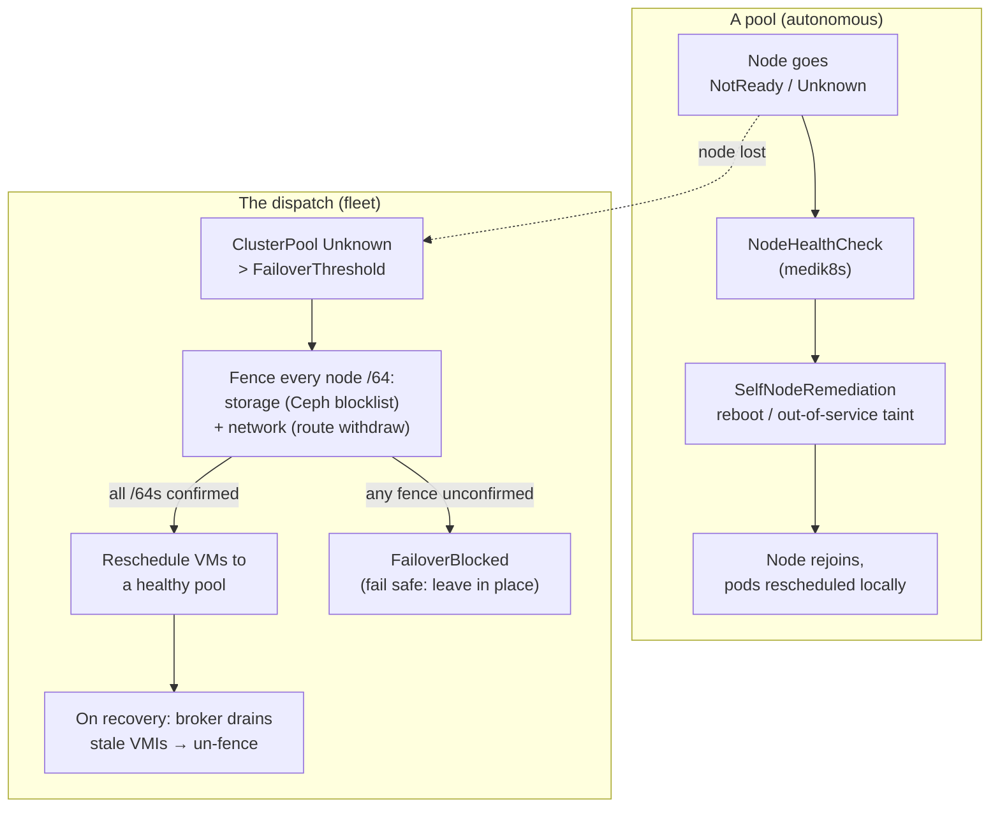

# Rescheduling & failover

ectobase keeps workloads available across two independent tiers of remediation.
They operate at different scopes, with different blast radii, and neither
depends on the other:

- **Tier-1 — pool-local, node-level.** Inside a single pool, an unhealthy node
  is remediated autonomously and fast, with no involvement from the dispatch. This is
  a standard [medik8s](https://www.medik8s.io/) deployment
  (NodeHealthCheck + SelfNodeRemediation) that each pool opts into.
- **Tier-2 — dispatch-driven, cross-pool, for VMs.** When a *whole pool* is lost, the
  dispatch reschedules the VirtualMachines bound to it onto a healthy pool — but only
  after it has *fenced* the lost pool's storage and network, so a VM can never
  boot in two places at once.

!!! warning "Status: Partial"
    Tier-1 is a standard medik8s deployment and ships as a first-class pool
    chart option (**Implemented**). Tier-2 cross-pool VM failover is
    **Partial**: the reconciler, the fence actuators, the batch scheduler, and
    the drain-gated recovery path all exist and are exercised end-to-end on the
    local lab fabric, but this is not yet a hardened production path. Treat it as
    a working reference implementation, not a battle-tested one.

## Why two tiers

A single node crashing is common, local, and recoverable in place — you want to
reboot it and move on without a fleet-wide control loop getting involved. Losing
an entire pool (a partition, a control-plane outage, a site failure) is rare,
global, and *destructive to recover from*: you have to move stateful VMs to
different hardware, which means their persistent storage must be guaranteed
detached from the dead pool first. Those are different problems, so ectobase
solves them with different mechanisms at different altitudes.



Tier-1 heals nodes *within* a pool. Tier-2 only engages when the pool as a whole
is declared lost. In the common case, Tier-1 remediates the node long before
Tier-2's conservative threshold would ever fire.

## Tier-1 — pool-local node remediation

!!! success "Status: Implemented"
    Rendered by the pool chart as an opt-in option
    (`charts/ectobase-pool/templates/tier1/`).

Each pool can run the medik8s stack. The pool chart renders a
`NodeHealthCheck` and a `SelfNodeRemediationTemplate` (plus an optional
`SelfNodeRemediationConfig` for a hardware watchdog) when
`tier1Failover.enabled` is set in the pool's values.

- **Trigger.** A node's `Ready` condition is `False` *or* `Unknown` for longer
  than `unhealthyThreshold` (default `60s`). The `NodeHealthCheck` watches the
  nodes matched by `tier1Failover.nodeSelector` (control-plane nodes excluded by
  default) and guards a quorum with `minHealthy` (default `51%`) so it never
  remediates the fleet below a healthy majority.
- **Actor.** SelfNodeRemediation on each node. The default
  `remediationStrategy` is `OutOfServiceTaint`, which taints the node so its
  pods are force-deleted and rescheduled elsewhere in the *same* pool; the enum
  also allows `Automatic` and `ResourceDeletion`. With
  `tier1Failover.watchdog.enabled`, SNR arms a hardware watchdog
  (`/dev/watchdog`) so a wedged kernel is force-rebooted even if software can't
  act — the strongest self-fencing guarantee for node-level recovery.
- **Outcome.** The node is rebooted or tainted out of service and its workloads
  reschedule within the pool. The dispatch is never contacted.
- **Safety property.** `minHealthy` prevents a remediation storm from taking the
  pool below quorum, and the watchdog gives a genuine self-fence: a node that
  cannot prove it is healthy takes itself out.

The values that drive this:

```yaml
tier1Failover:
  enabled: false                          # opt-in per pool; renders nothing when false
  snrNamespace: self-node-remediation     # where the SNR operator (+ our Template/Config) live
  unhealthyThreshold: 60s                 # Node Ready=Unknown/False duration before remediation
  minHealthy: "51%"                       # NHC guard: never remediate below this healthy quorum
  remediationStrategy: OutOfServiceTaint  # SNR enum: Automatic | ResourceDeletion | OutOfServiceTaint
  watchdog:
    enabled: false                        # dev/kind: software reboot. prod true = hardware watchdog
    device: /dev/watchdog
```

Because Tier-1 is entirely a pool-local medik8s deployment, it works the same
whether the pool is one of many in a fleet or standing alone.

## Tier-2 — dispatch-driven cross-pool VM failover

!!! warning "Status: Partial"
    Implemented and proven on the lab fabric; not a hardened production path.
    Code: `dispatch/pkg/failover/`, `dispatch/pkg/fence/`, `dispatch/pkg/scheduler/`,
    wired in `dispatch/cmd/controller/main.go`.

Tier-2 is a controller on the dispatch (`failover.Reconciler`) that watches
`ClusterPool` objects. It runs alongside — but independently of — the pool-health
and scheduler reconcilers on the same manager.

### What triggers it

The dispatch declares a pool **lost** when it has been in the `Unknown` phase and its
broker lease `RenewTime` has been stale for longer than `FailoverThreshold`
(default `2m`). That threshold is deliberately far larger than pool-health's
`30s` lease-staleness window: a pool must be gone for a good while — long enough
that Tier-1 would already have handled any mere node blip — before the dispatch does
anything destructive. If a pool is `Unknown` but has *no* lease timing at all,
`poolLost` returns false: without evidence of *how long* the pool has been gone,
the dispatch refuses to trigger a rebind. This is the first of several fail-safe
defaults.

### What acts, and the fence-before-reschedule barrier

The correctness heart of Tier-2 is simple to state: **a VM's RBD volume must be
detached from the dead pool before that VM boots anywhere else.** If both the
old and new node could write the same block device, the guest filesystem is
corrupted. The reconciler enforces this with a *whole-pool fence barrier* before
any reschedule.

For every node `/64` prefix the lost pool reported in `Status.NodePrefixes`, the
reconciler applies **two** fences and requires both to confirm active:

- **Storage fence** (`fence.StorageFencer`). Blocklists the `/64` at Ceph via a
  [csi-addons](https://github.com/csi-addons/kubernetes-csi-addons)
  `NetworkFence` custom resource (`fenceState: Fenced`, the node's CIDR in
  `spec.cidrs`). It returns success **only** when the CR reports
  `status.result == Succeeded`; a freshly-created or still-`Pending` fence
  returns an error, so an unconfirmed blocklist never lets a reschedule proceed.
  Under the hood csi-addons runs `ceph osd blocklist add` for the CIDR.
- **Network fence** (`fence.NetworkFencer`). Withdraws the `/64`'s overlay routes
  by calling the reflector's `RouteBusAdmin.SetFence`, so even if a node in the
  lost pool is still alive it can no longer attract or emit overlay traffic for
  that prefix.

If **any** `/64` fails to confirm both fences, the reconciler marks every VM on
the pool `FailoverBlocked` and **leaves them in place** — it writes only status,
never touches a VM's `Spec`. A pool that reported *no* `NodePrefixes` can't be
safely fenced, so it is blocked outright rather than evacuated blind. The
network fencer even defaults to a `DenyFencer` (which refuses to confirm) unless
the reflector admin endpoint is explicitly wired, so a misconfigured dispatch fails
safe rather than open.

Only once **every** `/64` has both fences confirmed active does the barrier
lift and rescheduling begin.

```mermaid
sequenceDiagram
    participant F as failover.Reconciler (dispatch)
    participant S as StorageFencer<br/>(csi-addons / Ceph)
    participant N as NetworkFencer<br/>(reflector RouteBusAdmin)
    participant Sched as scheduler.ScheduleBatch
    participant VM as VirtualMachine

    Note over F: ClusterPool Unknown > FailoverThreshold
    loop each node /64 in Status.NodePrefixes
        F->>S: Fence(/64)  →  NetworkFence Fenced
        S-->>F: err unless status.result == Succeeded
        Note over F: track /64 in FencedPrefixes
        F->>N: Fence(/64)  →  SetFence (withdraw routes)
        N-->>F: err unless route fence set
    end
    Note over F: any unconfirmed → FailoverBlocked, stop (fail safe)
    F->>Sched: ScheduleBatch(VMs on lost pool, healthy pools)
    Sched-->>F: per-VM Placement (pool | no-fit)
    F->>VM: Spec.ClusterName = target pool (or FailoverBlocked)
    Note over VM: scheduler binds it; vm-materializer boots it on the new pool
```

### Rescheduling

Once fenced, the reconciler collects every VirtualMachine whose
`Spec.ClusterName` is the lost pool and places the whole set at once with
`scheduler.ScheduleBatch`. Batch placement matters here: it accumulates
committed resources so N evacuating VMs don't over-commit a single target, and
it tracks anti-affinity occupancy so a batch doesn't co-locate a group it just
placed. Placement itself is the same pure logic the normal scheduler uses:

- only `Ready` pools that match the VM's `PoolSelector`,
- resource fit (`used + request ≤ Allocatable` for every requested resource),
- spread by highest minimum free fraction, tie-broken by pool name,
- anti-affinity: VMs sharing an `AntiAffinity.Group` repel each other across
  pools, falling back to a violating placement (recorded as such) only when
  availability leaves no clean option.

For each VM that places, the reconciler sets `Spec.ClusterName` to the new pool
and marks it `Scheduled`. The rest of the pipeline — the scheduler binding, the
compute-side vm-materializer turning the bound `CompiledVM` into a KubeVirt
`VirtualMachine` with its RBD `DataVolume` — then boots the VM on the new pool,
attached to fenced-off storage that the dead pool can no longer touch. A VM with
no viable target is marked `FailoverBlocked` and left where it is.

### Recovery and un-fencing

Fences are not permanent — leaving a Ceph blocklist entry in place would strand
the pool's storage for its multi-year default expiry. When a fenced pool comes
back, its broker reports, per fenced `/64`, whether that prefix's stale VMIs are
gone (`Status.NodeDrain[].Drained`). The reconciler's `releaseDrained` step
un-fences **only** `/64`s the broker has confirmed drained:

- the storage fence is driven `Fenced → Unfenced` **in place** (so csi-addons
  runs `ceph osd blocklist rm` on the *state transition* — a bare delete would
  leave the blocklist entry behind), and only after the un-fence reports
  `Succeeded` is the `NetworkFence` CR deleted;
- the network fence is cleared with `RouteBusAdmin.ClearFence`.

An un-drained `/64` stays fenced. This is the recovery-side fail-safe: storage
is only reopened to a returned node once that node has proven it holds no stale
VM instances that could race the ones now running on the new pool.

## Why the datapath re-programs itself

Failover only ever changes a VM's **pool** (`Spec.ClusterName`); it never has to
name a node. The datapath follows automatically because the mesh agent is
**self-locating**: it programs a `CompiledNIC`'s firewall / NAT / LB / QoS **iff
that NIC's interface is locally attached**, matched by the unique
`(VNI, overlay IP)` key the local dataplane reports — not by any declared node.

So when the rebound VM boots on a surviving pool and its overlay interface
attaches there, the agent on the new node recognises the `(VNI, overlay IP)` pair
and programs the policy; the old pool's agents, which no longer see that
interface, stop. Policy follows the interface, so a cross-pool move needs **no**
node write-back and no per-node reconfiguration — the same property that lets the
dispatch schedule workloads to a *pool* and leave the *node* to kube-scheduler /
KubeVirt. See
[CNI integration → Self-locating agent](./cni-integration.md#self-locating-agent).

## How it ties to the rest of the system

- **Storage / CSI.** The storage fence *is* the CSI integration doing its most
  safety-critical job. See [Storage / CSI integration](storage-csi-integration.md)
  for how RBD volumes are provisioned and how the csi-addons `NetworkFence`
  actuator reaches Ceph. Tier-2's whole reason to fence-before-reschedule is the
  single-writer guarantee of a block device.
- **The fleet model.** Tier-2 is a dispatch concern precisely because it moves
  workloads *between* pools. See
  [Multi-cluster control plane](multi-cluster-control-plane.md) for the
  dispatch/pool/broker split, the `ClusterPool` lease that drives the `Unknown`
  phase, and the compile→sync→materialize path that re-materializes a VM after
  its `Spec.ClusterName` is changed.
- **KubeVirt.** The workloads Tier-2 moves are KubeVirt VMs; see
  [KubeVirt / VM integration](kubevirt-integration.md).
- **Node-level HA.** For dispatch *component* availability (as opposed to workload
  failover), see [HA & graceful restart](ha-graceful-restart.md).

## What is not done

!!! note "Status: Planned"
    Tier-2 today is a **cold** failover: it changes a VM's bound pool and lets
    the target pool boot it from its RBD volume. It does **not** perform hitless
    *live migration* of a running VM across pools — a lost pool is, by
    definition, unreachable, so there is no source VM to migrate from. Warm,
    planned cross-pool live migration (draining a healthy-but-departing pool
    without a guest reboot) is future work.

Also intentionally out of scope for the current implementation: any richer,
capacity-aware or topology-aware placement beyond the resource-fit + spread +
anti-affinity model the batch scheduler already applies, and any production
hardening (soak testing, chaos testing, tuned thresholds) that would let Tier-2
graduate from **Partial** to **Implemented**.
