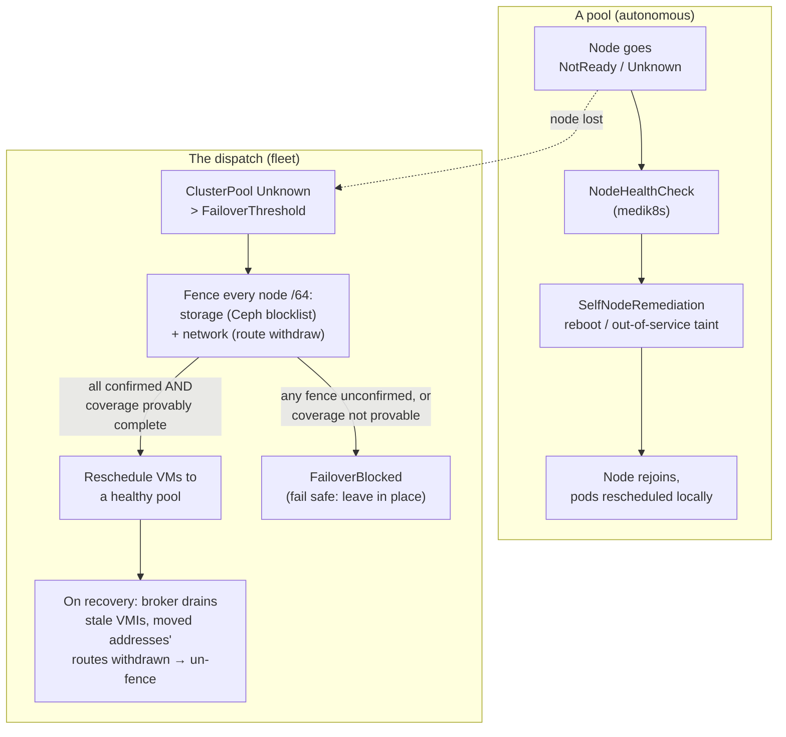

# Rescheduling & failover

ectobase keeps workloads available across two independent tiers of remediation.
They operate at different scopes, with different blast radii, and neither
depends on the other:

- Tier-1, pool-local, node-level. Inside a single pool, an unhealthy node
  is remediated autonomously and fast, with no involvement from the dispatch. This is
  a standard [medik8s](https://www.medik8s.io/) deployment
  (NodeHealthCheck + SelfNodeRemediation) that each pool opts into.
- Tier-2, dispatch-driven, cross-pool, for VMs. When a whole pool is lost, the
  dispatch reschedules the VirtualMachines bound to it onto a healthy pool — but only
  after it has fenced the lost pool's storage and network, so a VM can never
  boot in two places at once.

!!! warning "Status: Partial"
    Tier-1 is a standard medik8s deployment and ships as a first-class pool
    chart option (Implemented). Tier-2 cross-pool VM failover is
    Partial: the reconciler, the fence actuators, the batch scheduler, and
    the drain-gated recovery path all exist and are exercised end-to-end on the
    local lab fabric, but this is not yet a hardened production path. It is a
    working reference implementation, not a battle-tested one.

## Why two tiers

A single node crashing is common, local, and recoverable in place: the node reboots
and rejoins without a fleet-wide control loop getting involved. Losing
an entire pool (a partition, a control-plane outage, a site failure) is rare,
global, and destructive to recover from: stateful VMs must move to
different hardware, which means their persistent storage must be guaranteed
detached from the dead pool first. Those are different problems, so ectobase
solves them with different mechanisms at different altitudes.


```mermaid
flowchart TD
    subgraph pool["A pool (autonomous)"]
        node["Node goes<br/>NotReady / Unknown"]
        node --> nhc["NodeHealthCheck<br/>(medik8s)"]
        nhc --> snr["SelfNodeRemediation<br/>reboot / out-of-service taint"]
        snr --> healed["Node rejoins,<br/>pods rescheduled locally"]
    end

    subgraph dispatch["The dispatch (fleet)"]
        lost["ClusterPool Unknown<br/>&gt; FailoverThreshold"]
        lost --> fence["Fence every node /64:<br/>storage (Ceph blocklist)<br/>+ network (route withdraw)"]
        fence -->|all confirmed AND<br/>coverage provably complete| rebind["Reschedule VMs to<br/>a healthy pool"]
        fence -->|any fence unconfirmed, or<br/>coverage not provable| block["FailoverBlocked<br/>(fail safe: leave in place)"]
        rebind --> recover["On recovery: broker drains<br/>stale VMIs, moved addresses'<br/>routes withdrawn → un-fence"]
    end

    node -.node lost.-> lost
```

Tier-1 heals nodes within a pool. Tier-2 only engages when the pool as a whole
is declared lost. In the common case, Tier-1 remediates the node long before
Tier-2's conservative threshold would ever fire.

## Tier-1 — pool-local node remediation

!!! success "Status: Implemented"
    Rendered by the pool chart as an opt-in option
    (`charts/ectobase-pool/templates/tier1/`).

Each pool can run the medik8s stack. The pool chart renders a
`NodeHealthCheck` and a `SelfNodeRemediationTemplate` (plus an optional
`SelfNodeRemediationConfig` for a hardware watchdog) when
`tier1Failover.enabled` is set in the pool's values.

- Trigger. A node's `Ready` condition is `False` or `Unknown` for longer
  than `unhealthyThreshold` (default `60s`). The `NodeHealthCheck` watches the
  nodes matched by `tier1Failover.nodeSelector` (control-plane nodes excluded by
  default) and guards a quorum with `minHealthy` (default `51%`) so it never
  remediates the fleet below a healthy majority.
- Actor. SelfNodeRemediation on each node. The default
  `remediationStrategy` is `OutOfServiceTaint`, which taints the node so its
  pods are force-deleted and rescheduled elsewhere in the same pool; the enum
  also allows `Automatic` and `ResourceDeletion`. With
  `tier1Failover.watchdog.enabled`, SNR arms a hardware watchdog
  (`/dev/watchdog`) so a wedged kernel is force-rebooted even if software can't
  act — the strongest self-fencing guarantee for node-level recovery.
- Outcome. The node is rebooted or tainted out of service and its workloads
  reschedule within the pool. The dispatch is never contacted.
- Safety property. `minHealthy` prevents a remediation storm from taking the
  pool below quorum, and the watchdog gives a genuine self-fence: a node that
  cannot prove it is healthy takes itself out.

The values that drive this:

```yaml
tier1Failover:
  enabled: false                          # opt-in per pool; renders nothing when false
  snrNamespace: self-node-remediation     # where the SNR operator (+ our Template/Config) live
  unhealthyThreshold: 60s                 # Node Ready=Unknown/False duration before remediation
  minHealthy: "51%"                       # NHC guard: never remediate below this healthy quorum
  remediationStrategy: OutOfServiceTaint  # SNR enum: Automatic | ResourceDeletion | OutOfServiceTaint
  watchdog:
    enabled: false                        # dev/lab: software reboot. prod true = hardware watchdog
    device: /dev/watchdog
```

Because Tier-1 is entirely a pool-local medik8s deployment, it works the same
whether the pool is one of many in a fleet or standing alone.

## Tier-2 — dispatch-driven cross-pool VM failover

!!! warning "Status: Partial"
    Implemented and proven on the lab fabric; not a hardened production path.
    Code: `dispatch/pkg/failover/`, `dispatch/pkg/fence/`, `dispatch/pkg/scheduler/`,
    wired in `dispatch/cmd/controller/main.go`.

Tier-2 is a controller on the dispatch (`failover.Reconciler`) that watches
`ClusterPool` objects. It runs alongside — but independently of — the pool-health
and scheduler reconcilers on the same manager.

Only one dispatch-controller acts at a time. Two acting at once would each fence and
rebind the same lost pool, so the manager takes a leader-election Lease
(`ectobase-dispatch-controller`, on the host kube-apiserver in the controller's namespace)
before it starts any reconciler. That holds when two pods overlap during a rolling restart, or
if the Deployment is scaled for a standby. A graceful shutdown releases the lease, so the next
pod takes over at its next retry (about 2 s) instead of waiting out the 15 s lease.

### What triggers it

The dispatch declares a pool lost when it has been in the `Unknown` phase and its
broker lease `RenewTime` has been stale for longer than `FailoverThreshold`
(default `2m`). That threshold is deliberately far larger than pool-health's
`30s` lease-staleness window: a pool must be gone for a good while — long enough
that Tier-1 would already have handled any mere node blip — before the dispatch does
anything destructive. If a pool is `Unknown` but has no lease timing at all,
`poolLost` returns false: without evidence of how long the pool has been gone,
the dispatch refuses to trigger a rebind. This is the first of several fail-safe
defaults.

### What acts, and the fence-before-reschedule barrier

The correctness heart of Tier-2 is that a VM's RBD volume must be
detached from the dead pool before that VM boots anywhere else. If both the
old and new node could write the same block device, the guest filesystem is
corrupted. The reconciler enforces this with a whole-pool fence barrier before
any reschedule.

For every node `/64` prefix the lost pool reported in `Status.NodePrefixes`, the
reconciler applies two fences and requires both to confirm active:

- Storage fence (`fence.StorageFencer`). Blocklists the `/64` at Ceph via a
  [csi-addons](https://github.com/csi-addons/kubernetes-csi-addons)
  `NetworkFence` custom resource (`fenceState: Fenced`, the node's CIDR in
  `spec.cidrs`). It returns success only when the CR is `Fenced` and reports
  `status.result == Succeeded` for the fence op; a freshly-created or
  still-`Pending` fence returns an error, so an unconfirmed blocklist never lets a
  reschedule proceed. A CR left `Unfenced` by a release in flight is replaced with
  a fresh `Fenced` one rather than flipped back, since its `Succeeded` reports the
  unfence.
  Under the hood csi-addons runs `ceph osd blocklist add` for the CIDR.
- Network fence (`fence.NetworkFencer`). Withdraws the `/64`'s overlay routes
  from every subscriber by calling the reflector's `RouteBusAdmin.SetFence`, so
  even if a node in the lost pool is still alive it can no longer attract or emit
  overlay traffic for that prefix. The fence is a filter on what the reflector
  advertises: it keeps the routes stored, hides any the lost pool announces while
  fenced, and keeps advertising another pool's nexthop for the same prefix.

If any `/64` fails to confirm both fences, the reconciler marks every VM on
the pool `FailoverBlocked` and leaves them in place — it writes only status,
never touches a VM's `Spec`. A pool that reported no `NodePrefixes` can't be
safely fenced, so it is blocked outright rather than evacuated blind. The
network fencer even defaults to a `DenyFencer` (which refuses to confirm) unless
the reflector admin endpoint is explicitly wired, so a misconfigured dispatch fails
safe rather than open.

Only once every `/64` has both fences confirmed active does the barrier
lift and rescheduling begin.

#### Is the fence COMPLETE? — `spec.underlayPrefix`

Confirming a fence is not the same as having fenced everything. `NodePrefixes` is
reported *by the broker*, so central's copy is frozen at whatever was last seen
before contact was lost — and a node that joined **during** the outage is absent
from it. A fence coordinate derived from the entity being fenced is exactly the
thing you cannot lean on, because that entity is the one you have lost contact
with.

Whether that matters depends on the underlay topology, so central decides
explicitly rather than assuming:

| Situation | Fence coverage | Failover |
|---|---|---|
| `spec.underlayPrefix` declared | Complete by construction — the aggregate contains every node underlay, observed or not | Proceeds |
| Not declared, nodes report **one** distinct `/64` | Complete — each node's identity is a `/128` inside that `/64`, so fencing it covers unobserved nodes too | Proceeds |
| Not declared, nodes report **several** distinct `/64`s | Not provable — an unobserved node may sit in an unreported `/64` | **Fences what is known, then blocks the rebind** |

The third row fences first and blocks second, deliberately. Containing the nodes
central *does* know about is pure upside and costs nothing; the step that can
corrupt a filesystem is reattaching a disk while some unfenced node may still be
writing to it, so that is the step withheld. The blocked VMs carry the reason,
which names the fix: declare `spec.underlayPrefix` on the `ClusterPool` — an
aggregate (e.g. `fd00:cafe:1a2b::/48`) containing every node's underlay. It is
central configuration set at pool registration, precisely so it does not depend
on the unreachable cluster to report it.

```mermaid
sequenceDiagram
    participant F as failover.Reconciler (dispatch)
    participant S as StorageFencer<br/>(csi-addons / Ceph)
    participant N as NetworkFencer<br/>(reflector RouteBusAdmin)
    participant Sched as scheduler.ScheduleBatch
    participant VM as VirtualMachine

    Note over F: ClusterPool Unknown > FailoverThreshold
    loop each node /64 in Status.NodePrefixes
        F->>S: Fence(/64)  →  NetworkFence Fenced
        S-->>F: err unless status.result == Succeeded
        Note over F: track /64 in FencedPrefixes
        F->>N: Fence(/64)  →  SetFence (withdraw routes)
        N-->>F: err unless route fence set
    end
    Note over F: any unconfirmed → FailoverBlocked, stop (fail safe)
    F->>Sched: ScheduleBatch(VMs on lost pool, healthy pools)
    Sched-->>F: per-VM Placement (pool | no-fit)
    F->>VM: Spec.ClusterName = target pool (or FailoverBlocked)
    Note over VM: scheduler binds it; vm-materializer boots it on the new pool
```

### Rescheduling

Once fenced, the reconciler collects every VirtualMachine whose
`Spec.ClusterName` is the lost pool and places the whole set at once with
`scheduler.ScheduleBatch`. Batch placement accumulates
committed resources so N evacuating VMs don't over-commit a single target, and
it tracks anti-affinity occupancy so a batch doesn't co-locate a group it just
placed. Placement itself is the same pure logic the normal scheduler uses:

- only `Ready` pools that match the VM's `PoolSelector`,
- resource fit (`used + request ≤ Allocatable` for every requested resource),
- spread by highest minimum free fraction, tie-broken by pool name,
- anti-affinity: VMs sharing an `AntiAffinity.Group` repel each other across
  pools, falling back to a violating placement (recorded as such) only when
  availability leaves no clean option.

For each VM that places, the reconciler sets `Spec.ClusterName` to the new pool
and marks it `Scheduled`. Setting the field alone does not move the VM: on the
lost pool the compiler retires its twin — deleted, but held by the
`compiled.ectobase.dev/source-released` finalizer — and nothing is compiled
into the new pool until that twin is gone (see
[A move is break-before-make](storage-csi-integration.md#a-move-is-break-before-make)).
There is no broker left on a lost pool to report that release itself, so
failover does it: on every pass while the pool is lost with complete fence
coverage, it marks the pool's retired twins `status.released` directly (a
later pass than the rebind, since the twin is only retired once the rebind is
compiled; a watch on retired twins triggers it at once); a mesh reconciler then drops the
finalizer. Only once the twin is gone does the rest of the pipeline run — the
scheduler binding, the compute-side vm-materializer turning the bound
`CompiledVM` into a KubeVirt `VirtualMachine` with its RBD `DataVolume` — and
boot the VM on the new pool, attached to fenced-off storage that the dead pool
can no longer touch. A VM with no viable target is marked `FailoverBlocked`
and left where it is.

### Recovery and un-fencing

Fences are not permanent — leaving a Ceph blocklist entry in place would strand
the pool's storage for its multi-year default expiry. When a fenced pool comes
back — `Ready`, on a lease its broker renewed within the health threshold — its
broker reports, per fenced `/64`, whether that prefix's stale VMIs are
gone (`Status.NodeDrain[].Drained`). The reconciler's `releaseDrained` step
un-fences only `/64`s the broker has confirmed drained and that no longer
announce an address placed on another pool (see below):

- the storage fence is driven `Fenced → Unfenced` in place (so csi-addons
  runs `ceph osd blocklist rm` on the state transition — a bare delete would
  leave the blocklist entry behind), and only after the un-fence reports
  `Succeeded` is the `NetworkFence` CR deleted;
- the network fence is cleared with `RouteBusAdmin.ClearFence`, and the
  reflector re-advertises the routes it was hiding from what it stored. The
  agents do not re-announce them.

"Drained" alone is not enough to release. It means the stale VMI objects are
gone, not that their routes are. The recovered pool's agent withdraws a
failed-over VM's `/32` only after the CNI DEL has detached its interface and on
its next reconcile tick. A release that landed first would re-advertise that
`/32` with both the stale source and the new pool as nexthops, and agents
program only the first nexthop of that sorted set, so other nodes would send
the VM's traffic to the stale source. A pool whose kubelet died while its mesh
agent and flowplane kept running never withdraws such a zombie interface.

So the release also waits on route state. Before it lifts either fence on a
drained `/64`, the reconciler asks the reflector (`RouteBusAdmin.AnnouncedFrom`)
which overlay host routes placed on other pools it still stores with a nexthop
inside that `/64`, fenced or not. It holds the fence while any is held, and
rechecks every few seconds. The question reads placement, not history: the keys
are the `(VNI, overlay IP)` pairs of every `CompiledNIC` twin compiled outside
the recovering pool's namespace, whether its owner is a VM failover moved, a VM
someone moved by hand while the pool was lost, a container, or a bare NIC. A
workload placed on another pool is announced from this pool's `/64` legitimately
only while a move off it is still in flight, and that is exactly what the
release has to wait out. Failover's own `FailedOver` marks would not do: the
status write after a rebind can lose a conflict or a crash, a planned move off a
lost pool never gets one, and a later reschedule overwrites it. The twins are
durable, so a controller restart loses nothing. The keys are asked in batches of
5,000. The question is targeted on purpose: a recovered pool keeps announcing
what it legitimately serves, including E/W LB anycast addresses that other pools
share by design, and none of that holds its fence.

The gate fails closed. If the reflector can't be asked (unreachable, no
`--reflector-admin`, or a reflector older than the RPC, which answers
`Unimplemented`), or the twins can't be listed, the fence stays and the rest of
the pass runs as usual. The reflector ships in the dispatch chart with the
dispatch-controller, so an upgrade holds a release only while the two images
disagree. The pool's `FenceReleaseBlocked` condition says why a drained `/64` is
held: each route, the node announcing it, the nexthop it announces it by, and
the NIC and pool it belongs to (`RoutesStillAnnounced`), or the failed check
(`RouteCheckFailed`). It turns False once nothing is held, or nothing is fenced.

### A pool that will not let go

A node whose kubelet died while its mesh agent and flowplane kept running never
withdraws the interface it lost. One such node holds the fence over its whole
`/64`, or over the pool's aggregate, and with it the hiding of everything else
the pool announces. To release it:

1. Read the condition: `kubectl get clusterpool <pool> -o
   jsonpath='{.status.conditions[?(@.type=="FenceReleaseBlocked")].message}'`.
   Each entry reads `vni <n> <route> from node <node> via <nexthop> (nic
   <namespace>/<name> on pool <pool>)`; `<node>` is the agent's `--node-id`, its
   Kubernetes node name.
2. End that node's route-bus session: stop its `mesh-agent` (on the host if the
   kubelet cannot), or power the node off or cut it from the fabric. The
   reflector withdraws everything a node announced when its session ends, and
   its keepalive tears down a session that stops answering within seconds.
3. The next recheck finds nothing held and releases the fence. The condition
   turns False.

If the node's kubelet is alive and the entry names a NIC whose workload moved,
the CNI DEL that should have detached the interface was lost and flowplane still
holds it. Stopping `mesh-agent` will not help there: the DaemonSet restarts it,
and it announces the interface again. Detach the interface from flowplane
instead, on that node, through the dataplane API on `127.0.0.1:1337`: find the
interface id that `ListInterfaces` reports for the overlay IP, then detach it.

```bash
grpcurl -plaintext -import-path api/proto/dataplane/v1 -proto dataplane.proto \
  127.0.0.1:1337 dataplane.v1.DataplaneNode/ListInterfaces
grpcurl -plaintext -import-path api/proto/dataplane/v1 -proto dataplane.proto \
  -d '{"interface_id": "<id>"}' 127.0.0.1:1337 dataplane.v1.DataplaneNode/DetachInterface
```

The agent's next tick withdraws the route.

An entry that names a NIC on a pool whose nodes really are inside this `/64`
(`nic … on pool <other>` where `<other>` should never share it) means two pools'
underlay prefixes overlap. That is a misconfiguration: each pool's
`spec.underlayPrefix` and node `/64`s must be its own. The gate cannot tell such
a route from a stale one and holds the fence until the overlap is fixed.

What the gate does not cover: a stale address placed on no other pool. That
includes a VM deleted while its pool was lost, and a NIC whose compiled twin is
gone or whose IPs changed after the move. Such a route is re-advertised on
release, as before.

Nothing is released while the pool is unreachable. `NodeDrain` is the broker's
last report, and nothing clears it when the pool is lost again; a release held on
routes can outlast that loss. A partition that also drops the pool's route-bus
sessions empties the reflector, so the route gate would pass, and releasing then
would reopen Ceph to nodes that are partitioned but alive while the same pass
rebinds their VMs elsewhere.

An un-drained `/64` stays fenced. This is the recovery-side fail-safe: storage
is only reopened to a returned node once that node has proven it holds no stale
VM instances that could race the ones now running on the new pool.

## Why the datapath re-programs itself

Failover only ever changes a VM's pool (`Spec.ClusterName`); it never has to
name a node. The datapath follows automatically because the mesh agent is
self-locating: it programs a `CompiledNIC`'s firewall / NAT / LB / QoS only if
that NIC's interface is locally attached, matched by the unique
`(VNI, overlay IP)` key the local dataplane reports — not by any declared node.

So when the rebound VM boots on a surviving pool and its overlay interface
attaches there, the agent on the new node recognises the `(VNI, overlay IP)` pair
and programs the policy; the old pool's agents, which no longer see that
interface, stop. Policy follows the interface, so a cross-pool move needs no
node write-back and no per-node reconfiguration — the same property that lets the
dispatch schedule workloads to a pool and leave the node to kube-scheduler /
KubeVirt. See
[CNI integration → Self-locating agent](./cni-integration.md#self-locating-agent).

## How it ties to the rest of the system

- Storage / CSI. The storage fence is the CSI integration doing its most
  safety-critical job. See [Storage / CSI integration](storage-csi-integration.md)
  for how RBD volumes are provisioned and how the csi-addons `NetworkFence`
  actuator reaches Ceph. Tier-2's whole reason to fence-before-reschedule is the
  single-writer guarantee of a block device.
- The fleet model. Tier-2 is a dispatch concern precisely because it moves
  workloads between pools. See
  [Multi-cluster control plane](multi-cluster-control-plane.md) for the
  dispatch/pool/broker split, the `ClusterPool` lease that drives the `Unknown`
  phase, and the compile→sync→materialize path that re-materializes a VM after
  its `Spec.ClusterName` is changed.
- KubeVirt. The workloads Tier-2 moves are KubeVirt VMs; see
  [KubeVirt / VM integration](kubevirt-integration.md).
- Node-level HA. For dispatch component availability (as opposed to workload
  failover), see [HA & graceful restart](ha-graceful-restart.md).

## What is not done

!!! note "Status: Planned"
    Tier-2 today is a cold failover: it changes a VM's bound pool and lets
    the target pool boot it from its RBD volume. It does not perform hitless
    live migration of a running VM across pools — a lost pool is, by
    definition, unreachable, so there is no source VM to migrate from. Warm,
    planned cross-pool live migration (draining a healthy-but-departing pool
    without a guest reboot) is future work.

Also intentionally out of scope for the current implementation: any richer,
capacity-aware or topology-aware placement beyond the resource-fit + spread +
anti-affinity model the batch scheduler already applies, and any production
hardening (soak testing, chaos testing, tuned thresholds) that would let Tier-2
graduate from Partial to Implemented.
