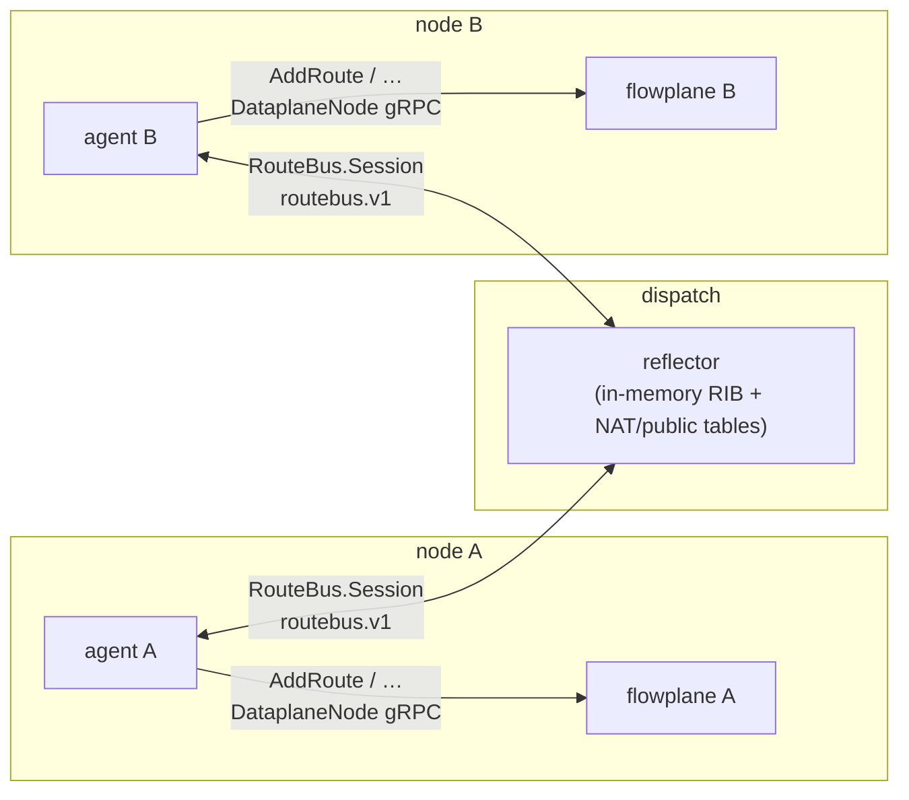
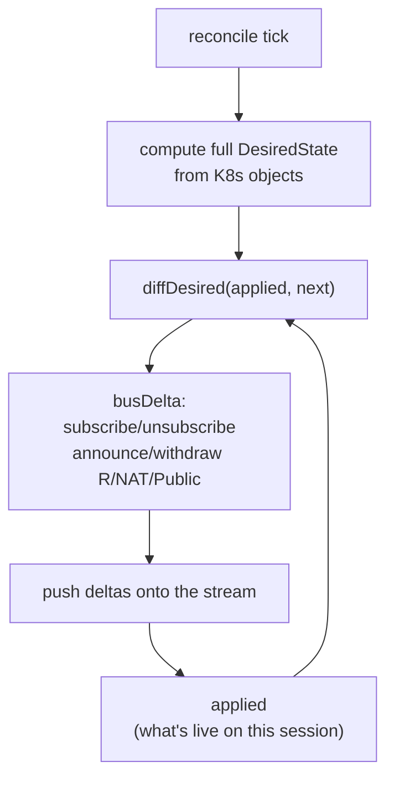
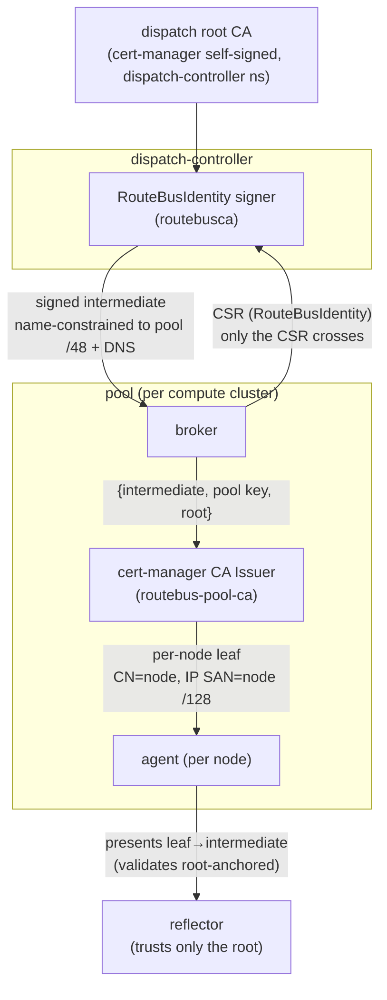

# Control/data split & the route bus

ectobase runs a **dumb datapath, smart control plane**. `flowplane` on each node
makes no distributed decisions — every forwarding action is a per-flow-keyed BPF
map lookup. All the state those maps hold is decided elsewhere and pushed down. The
mechanism that distributes the *dynamic* part of that state — which overlay prefix
lives behind which underlay node — is a custom **route bus**: a centralized reflector
(running on the dispatch) and per-node agents exchanging routes over a bidirectional gRPC stream.

This is a [metalbond](https://github.com/ironcore-dev/metalbond)-style typed
pub/sub, **not BGP in the hot path**. BGP appears only at the WAN edge, to announce
the platform's public prefixes to the upstream internet — never for overlay
distribution between nodes.

## The three moving parts

- **agent** (`mesh/agent`, per node) — a route-bus client. It reconciles the
  node's `NetworkInterface`s into a *desired* set of announcements, subscribes to
  the VNIs it cares about, and programs every route it learns onto the local
  datapath over the `DataplaneNode` gRPC (`127.0.0.1:1337`).
- **reflector** (`mesh/reflector`, on the dispatch) — a route broker. It holds an
  in-memory RIB (`rib.go`) plus a global NAT table (`nattable.go`) and public-prefix
  table (`publictable.go`), and reflects records between the agents' streams
  (`server.go`).
- **DataplaneNode** — the node-local gRPC surface (`api/proto/dataplane/v1`) that the
  agent drives: `AddRoute`/`WithdrawRoute`, the NAT-source and neighbor-NAT calls,
  firewall/LB/QoS programming. The route bus never talks to the datapath directly;
  the agent is always the intermediary.

## The routebus.v1 stream

Each agent opens exactly one long-lived `RouteBus.Session` bidi stream. The protocol
is a small tagged union in each direction (`api/proto/routebus/v1/routebus.proto`):

| Client → reflector | Reflector → client |
|---|---|
| `Hello` (node id + underlay IPv6) | `RouteUpdate` (add/withdraw per VNI) |
| `Subscribe` / `Unsubscribe` (by VNI) | `EndOfRIB` (snapshot-complete / prune marker) |
| `Announce` / `Withdraw` (route) | |
| `AnnounceNat` / `WithdrawNat` (SNAT port-block) | |
| `AnnouncePublic` / `WithdrawPublic` (edge identity, public prefix) | |
| `KeepAlive` | |

The first message on a session **must** be `Hello`; it carries the node id, which
becomes the *origin* tag on everything the node announces (`server.go`). On `Hello`
the reflector registers the session globally, because NAT and public records
broadcast to every session regardless of VNI subscription (see below).

### Per-VNI routes vs global records

Routes are fanned out **per VNI**. When an agent `Subscribe`s to a VNI, the reflector
replays the current table for that VNI in deterministic prefix order, then sends an
`EndOfRIB(vni)` marker (`RIB.Subscribe`). Subsequent `Announce`/`Withdraw` from any
origin fan out only to that VNI's subscribers (`RIB.fanout`), and never back to the
origin that sent them.

NAT port-blocks and public/edge-identity records, by contrast, **broadcast to every
connected session** — a node must learn the return path for a NAT block, or the
identity of an edge, no matter which VNI it subscribed to. Registration on `Hello`
(`RegisterSink`) also replays the current NAT/public snapshot to a freshly connected
peer.

## Reference-counted, anycast-safe routes

A single `(vni, prefix)` route can be announced by **several origins at once** — HA
anycast edges all advertise the same `0.0.0.0/0` toward the anycast edge underlay.
The RIB therefore reference-counts each route by origin (`routeEntry.origins` maps
origin → the nexthops it announced):

- The effective advertised nexthop set is the **deduped, sorted union** of every
  origin's nexthops (`mergeNexthops`), so fan-out is deterministic.
- A route is withdrawn only when its **last** origin drops it. A second anycast
  origin announcing an identical route causes **no** subscriber churn — fan-out fires
  only when the merged nexthop set actually changes (`Announce` / `withdrawRouteOrigin`).

## Liveness and fast-withdraw

The reflector runs an aggressive gRPC keepalive (`cmd/reflector/main.go`: 2s
ping / 3s timeout) as a v1 stand-in for BFD. When a session ends — clean close, error,
or keepalive timeout — the reflector calls `DropOrigin`, which withdraws **every**
route, NAT block, and public record that node originated and clears its
subscriptions, so a dead node's state is torn down fabric-wide within a bounded
budget. On `SIGTERM`/`SIGINT` the reflector `GracefulStop`s, so agents observe clean
stream closes and fast-withdraw rather than a hard kill.

Slow consumers never block the RIB: each subscriber's `Send` enqueues to a buffered
channel and **drops on overflow** (`chanSink`). A dropped update is recovered on the
next full-table resync, which happens on reconnect.

## Incremental convergence: `diffDesired`

The agent does not announce once and forget. Every reconcile tick it recomputes the
**complete** `DesiredState` from the Kubernetes objects — the VNIs to subscribe to,
the routes/NAT/public records to announce, plus egress-VNI and peering-import
configuration (`agent/desired.go`, `cmd/agent/main.go`). It then diffs that against
what is currently applied on the live stream (`diffDesired`) and emits **only the
deltas**:

Semantics per record type (`diffDesired`):

- present in `next` but not `applied` → **announce**;
- key in both but the value changed → **re-announce** (the reflector upserts by key,
  so no withdraw is needed);
- key in `applied` but gone from `next` → **withdraw**.

On reconnect, `applied` resets to empty, so the whole desired set is re-sent. This is
what makes the agent *continuously converge*: a `NetworkInterface` descheduled from a
still-connected node is withdrawn fabric-wide on the next tick, and a CRD change is
applied without waiting for the session to happen to drop.

### Prune-on-EndOfRIB

Because the datapath outlives any single session, the agent keeps a persistent
`installed[vni]` set of prefixes it has programmed onto `flowplane`, plus a
per-session `seen[vni]` set (reset at each session open). When the reflector's
snapshot for a VNI completes with `EndOfRIB(vni)`, any `installed` prefix **not** in
`seen` is stale — it left the RIB while the agent was disconnected — and is withdrawn
from the datapath (`agent/bus.go`). This closes the gap that a plain re-announce
cannot: routes that vanished during a disconnect.

## Securing the bus: per-node mTLS + underlay authz

The route bus is the fabric's source of truth for *where every overlay prefix lives*.
Without authentication, any workload that can reach the reflector could announce a
nexthop for **another** node's underlay and silently blackhole or hijack that traffic.
The optional mutual-TLS PKI closes this: it binds each session to a node identity and
cryptographically constrains what that node may announce. **Private keys never cross a
cluster or node boundary** — only a CSR and signed certificates do.

The trust chain has three levels:

1. **Root CA** — a cert-manager self-signed CA held on the dispatch (in the
   dispatch-controller's namespace, so the signer can mount its key). The reflector
   trusts *only* this root.
2. **Per-pool intermediate** — each pool's broker generates an intermediate keypair
   **locally** and submits a CSR as a `RouteBusIdentity` (platform group) on dispatch.
   The `routebusca` signer (`dispatch/pkg/routebusca`) signs a path-len-0 intermediate
   that is **name-constrained** to the pool's DNS domain *and* its underlay IP ranges
   (its `/48`). The broker writes `{tls.crt=intermediate, tls.key=pool key, ca.crt=root}`
   into a Secret that backs a pool cert-manager CA Issuer. Because Go's TLS chain
   verification enforces `NameConstraints`, one pool's intermediate **cannot** mint a
   leaf whose identity belongs to another pool — cross-pool isolation for free.
3. **Per-node leaf** — each agent self-mints its own cert-manager `Certificate`
   (`CN=node`, `IP SAN = its underlay /128`) from the pool Issuer at startup
   (`mesh/agent/nodecert.go`), and presents `leaf → intermediate` so the reflector can
   build the path back to the root it trusts.

### Reflector nexthop authorization

mTLS authenticates *who* a session is; the reflector then enforces *what it may say*.
On each session it binds the verified client cert's IP SANs and rejects any
`Announce`/`AnnounceNat`/`AnnouncePublic` whose underlay is outside the node's `/64`
(`mesh/reflector/underlayauthz.go`). A node owns a `/64` and its endpoints get `/128`s
inside it, so the check masks both to `/64` — exact-`/128` would reject the legitimate
per-endpoint nexthops. When a session is not mutually authenticated (mTLS off / dev
mode) enforcement is disabled and every announcement is allowed, matching the bus's
mTLS-optional posture. The admin (fence) API is additionally CN-gated to the
`dispatch-controller` identity and split onto its own listener, so a session-cert
holder can never drive fencing.

### Enabling it

Set `routebus.mtls.enabled=true` on **both** charts (they issue from one trust
anchor). The dispatch chart owns the root CA + a CA-type `ClusterIssuer`; because a
CA `ClusterIssuer` reads its CA secret from cert-manager's
`--cluster-resource-namespace`, cert-manager on the dispatch cluster must be installed
with that flag pointed at the namespace holding the root secret (`system`). Each pool
sets `routebus.mtls.underlayCIDRs` to its underlay `/48` (the intermediate's IP
name-constraint). cert-manager is required in every participating cluster.

## Why not BGP for the overlay?

Overlay discovery is high-churn, typed (routes vs NAT blocks vs edge identities), and
needs central policy hooks (VNI scoping, anycast reference-counting, per-node
fast-withdraw). A custom typed pub/sub expresses that directly and cheaply. BGP is
reserved for the one place it is the right tool: announcing the platform's public
prefixes from the WAN edge to the upstream internet. See
[North-South WAN edge](../features/ns-edge.md) for how edge identities
(`EDGE_UNDERLAY` public records) and the egress default route ride this same bus.

## See also

- [The CRD API](../reference/crd-interactions.md) — the intent the agent compiles into announcements.
- [Compilers: CompiledNIC](./compile-sync-materialize.md) — how static per-NIC state is lowered.
- [NAT gateway](../features/nat.md) — the distributed SNAT the NAT records drive.
- [VPC peering](../features/vpc-peering.md) — cross-VNI route imports over the bus.
