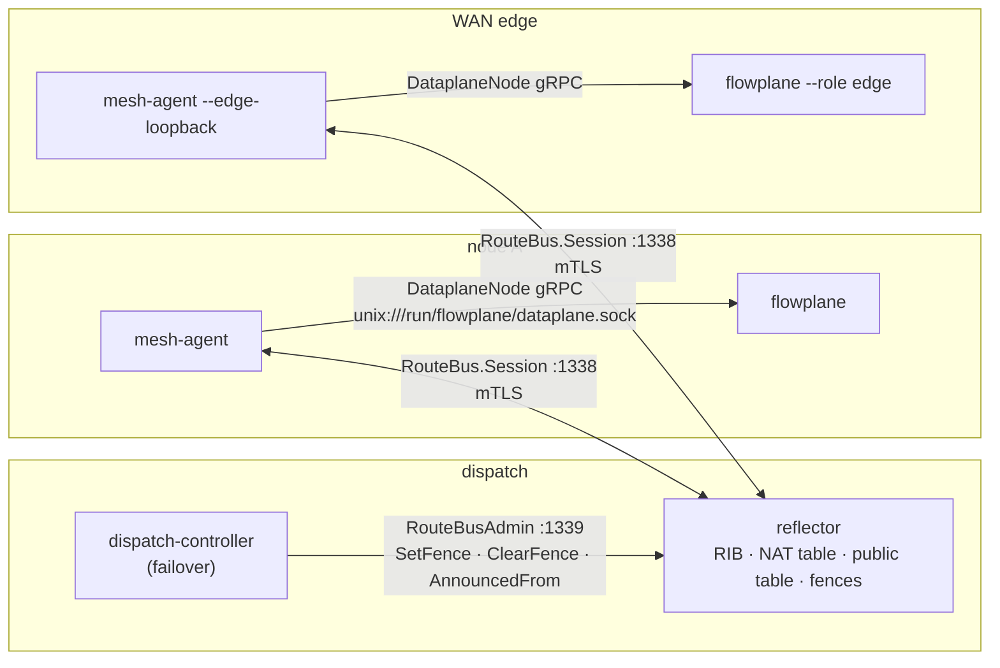
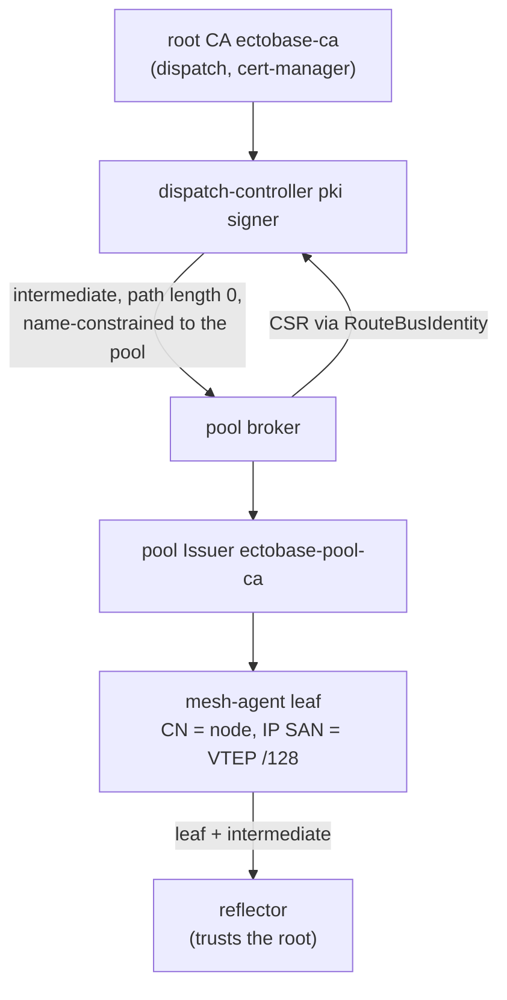

# The route bus

The **route bus** is how every node learns which node holds each overlay address. It is a typed
publish/subscribe protocol over gRPC: one **reflector** hub on the dispatch, and an **agent** on every
node and WAN edge. This page covers the protocol, how the reflector authorizes and fences what nodes
say, and how the agent turns what it learns into flowplane routes and keeps them there across
restarts and failures.

Two facts frame everything below. flowplane makes no distributed decisions; every forwarding choice
is a map lookup, and the route bus fills the `ROUTES` maps. And the agent always stands between the
bus and the datapath: the reflector never talks to flowplane.

## The moving parts

```mermaid
flowchart LR
    subgraph dispatch["dispatch"]
        reflector["reflector<br/>RIB · NAT table · public table · fences"]
        dc["dispatch-controller<br/>(failover)"]
    end
    subgraph nodeA["node A"]
        agentA["mesh-agent"]
        fpA["flowplane"]
    end
    subgraph edge["WAN edge"]
        agentE["mesh-agent --edge-loopback"]
        fpE["flowplane --role edge"]
    end
    agentA <-->|"RouteBus.Session :1338<br/>mTLS"| reflector
    agentE <-->|"RouteBus.Session :1338<br/>mTLS"| reflector
    dc -->|"RouteBusAdmin :1339<br/>SetFence · ClearFence · AnnouncedFrom"| reflector
    agentA -->|"DataplaneNode gRPC<br/>unix:///run/flowplane/dataplane.sock"| fpA
    agentE -->|"DataplaneNode gRPC"| fpE
```

| Component | Code | Role |
|---|---|---|
| reflector | `mesh/reflector`, `mesh/cmd/reflector` | An in-memory route table (the RIB) plus the global NAT and public tables. It fans records out between agent sessions. |
| agent | `mesh/agent`, `mesh/cmd/agent` | Announces this node's routes, subscribes to the VNIs it needs, and programs what it learns into flowplane. |
| flowplane | `flowplane/` | Holds the routes in its `ROUTES` maps. Reached over a root-only Unix socket. |

The protocol is `api/proto/routebus/v1/routebus.proto`. The reflector serves `RouteBus` on the
agent-facing port (default `:1338`) and `RouteBusAdmin` on a separate listener (`:1339` in the
dispatch chart).

## The session

Each agent holds one long-lived bidirectional stream, `RouteBus.Session`. Each direction carries a
small tagged union.

| Agent to reflector | Reflector to agent |
|---|---|
| `Hello` (node id, VTEP, global feed choice), first and only once | `RouteUpdate` (ADD or WITHDRAW of one route in one VNI) |
| `Subscribe` / `Unsubscribe` (a VNI) | `EndOfRIB` (a VNI's replay is complete) |
| `Announce` / `Withdraw` (a route) | `NatUpdate`, `PublicUpdate` (global records) |
| `AnnounceNat` / `WithdrawNat` (an SNAT port block) | `EndOfGlobal` (the global replay is complete) |
| `AnnouncePublic` / `WithdrawPublic` (an edge identity or load-balancer address) | |
| `KeepAlive` | |

### Hello and origins

The first message must be `Hello`. Its node id becomes the **origin** of everything the session
announces. A node id belongs to one session at a time: `Hello` claims it (`RIB.ClaimOrigin`), and if
an earlier session still holds it (a reconnect that beat the old session's keepalive timeout), the
reflector drops everything that session announced in the same step. The old session's own cleanup
later checks its token and touches nothing, so it cannot wipe its successor's state.

When a session ends, by a clean close, an error or a missed keepalive, the reflector withdraws every
route, NAT block and public record its origin announced and drops its subscriptions. The keepalive
is aggressive (a ping every 2 s, a 3 s timeout) and stands in for BFD, so a dead node's routes leave
the fabric within seconds.

### Per-VNI routes

Routes are scoped by VNI. `Subscribe(vni)` makes the reflector replay that VNI's current table in
prefix order and close it with `EndOfRIB{vni, record_count}`. After that, every change to the VNI's
table reaches its subscribers. An `Announce` skips the origin that sent it; a withdraw, including the
withdraws when a session drops, reaches the origin too. Subscribing again to a VNI the
session already holds does nothing; a client that wants a fresh replay unsubscribes first.

A key can have several origins. HA WAN edges all announce the same default route, and several
backends announce the same load-balancer address. The RIB stores each origin's nexthops separately
and advertises the sorted union. A second origin announcing an identical route changes nothing for
subscribers, and the route is withdrawn only when its last origin drops it. Agents program the first
nexthop of the advertised set.

### The global feed

NAT port blocks and public records (edge identities, load-balancer addresses) are not per-VNI. They
go to every session that asked for the **global feed** in `Hello`, which is only the WAN edges: an
edge needs every NAT block to relay returns to their owners, and every load-balancer address to run
Maglev. A compute node sends `GLOBAL_FEED_NONE`, is never added to that fanout, and gets a bare
`EndOfGlobal{record_count: 0}` so its convergence check still completes. See
[NAT](../features/nat.md) and [the WAN edge](../features/ns-edge.md).

### Slow consumers

The reflector never blocks on a session. Each session has its own outbound queue, drained by one
goroutine. A replay is queued whole, always, so a session can always converge. Live updates are
dropped once 1024 are waiting; the session converges on its next reconnect, and the reflector logs
each drop episode.

## What an agent announces

Every reconcile tick (5 s by default) the agent computes its complete desired state from the local
dataplane and the `Compiled*` objects in its pool:

- a host route (`/32` or `/128`) for each overlay address attached on this node, with the node's VTEP
  as the nexthop;
- a host route for each load-balancer address a local interface backs (every backend announces the
  same key);
- an SNAT port block for each local NAT source, owned by the node's VTEP;
- on a WAN edge, the defaults `0.0.0.0/0`, `::/0` and `64:ff9b::/96` in the public VNI (VNI 0), and
  the edge's public records;
- subscriptions: every VNI with a local interface, every peer VNI it imports from, and the public VNI.

The agent knows which interfaces are local by asking flowplane (`ListInterfaces`), not from any node
field in the API, so the routes follow the interface wherever the CNI attached it.

It diffs that set against what it has already sent on this session (`diffDesired` in
`mesh/agent/desired.go`) and sends only the difference: subscribes and announces first, then
withdraws and unsubscribes. A changed value is simply announced again; the reflector replaces by key.
On a new session the "already sent" set starts empty, so a reconnect re-announces everything.

## Origin authorization

The route bus is the fabric's record of where every overlay address lives, so it must stop one node
from announcing another's. Sessions are mutually authenticated with TLS, and each agent's leaf
certificate carries its node name as the CN and its VTEP as the only IP SAN.

On every session the reflector builds an **underlay guard** (`underlayGuard` in
`mesh/reflector/underlayauthz.go`) from the verified certificate's IP SANs. It rejects any `Announce`
whose primary nexthop (`nexthop_underlay`), and any `AnnounceNat` or `AnnouncePublic` whose owner, is
not exactly one of those addresses. A rejected announce is logged and dropped; the session stays up.

!!! warning "Known gap: extra nexthops"
    `Announce` also has an `extra_nexthops` field, which the protocol marks as carried but not yet
    used and agents never set. The reflector stores those addresses without the guard's check
    (`mesh/reflector/server.go`), so today the check covers only the primary nexthop.

The match is exact, not a prefix match, for two reasons:

- A node has one VTEP and every announcement it makes carries it, so nothing legitimate needs a
  range.
- Nodes in a cluster can share a `/64`; the lab gives every node in a cluster a `/128` from one
  cluster `/64`. A `/64` match would let any node announce a neighbour's VTEP and draw its traffic.

A speaker that legitimately announces an owner other than its datapath address carries both addresses
as IP SANs. That is the WAN edge, whose `EDGE_UNDERLAY` record pairs its underlay address with its own
control loopback.

Withdraws are guarded too. A route `Withdraw` only ever removes the session's own origin from the
key. `WithdrawNat` and `WithdrawPublic` succeed only if this session's origin announced the stored
record and its certificate covers the stored owner; the node id in `Hello` is self-asserted, so the
origin check alone is not enough.

If a session is not mutually authenticated the guard allows everything. That is a fallback in the
reflector binary for development; both charts enable the PKI (`pki.enabled`) and require it.

### Where the certificates come from

```mermaid
flowchart TB
    root["root CA ectobase-ca<br/>(dispatch, cert-manager)"]
    signer["dispatch-controller pki signer"]
    broker["pool broker"]
    issuer["pool Issuer ectobase-pool-ca"]
    agent["mesh-agent leaf<br/>CN = node, IP SAN = VTEP /128"]
    reflector["reflector<br/>(trusts the root)"]
    root --> signer
    broker -->|"CSR via RouteBusIdentity"| signer
    signer -->|"intermediate, path length 0,<br/>name-constrained to the pool"| broker
    broker --> issuer
    issuer --> agent
    agent -->|"leaf + intermediate"| reflector
```

Each pool's broker generates an intermediate key locally and sends only a CSR to the dispatch. The
signer (`dispatch/pkg/pki`) returns a CA certificate that cannot sign further CAs and is
name-constrained to the pool's DNS domain and to its underlay range. Go's TLS verification enforces
those constraints. Each agent then mints its own leaf from the pool's cert-manager `Issuer`
(`mesh/agent/nodecert.go`). A WAN edge has no cert-manager; its agent mints its leaf in-process from
an edge CA directory (`--routebus-intermediate`).

The same signer also issues the broker's dispatch client certificate, but from a different root,
the dispatch client CA, which is the only CA the dispatch apiserver accepts client certificates
from. A pool intermediate chains to `ectobase-ca`, and its name constraints bind SANs, not the
subject, so it could otherwise mint an apiserver identity such as `O=system:masters`. See
[the two roots](overview.md#two-roots).

The IP constraint is what stops one pool from minting a valid leaf for another pool's VTEP, which
the reflector's exact-match nexthop check would then accept. So the signer takes it from the
operator, never from the pool:

- A **fleet identity** is constrained to its own `spec.permittedUnderlayCIDRs`. Fleet identities
  are the names in the dispatch chart's `pki.fleetIdentities` (`--routebus-fleet-identities`), such
  as the WAN edge fleet's `edge`: the operator creates them and no broker can write them. The list
  is empty by default. A fleet identity with no ranges is denied, and so is a name that is also a
  `ClusterPool`.
- Every other identity must be a pool, and its constraint is exactly its `ClusterPool`'s
  `spec.underlayPrefix`. The broker writes its own `RouteBusIdentity`, so the
  `spec.permittedUnderlayCIDRs` it sends (from the pool chart's `pki.underlayCIDRs`) is ignored; a
  requested range outside the prefix is only named in the `Signed` condition.
- A `ClusterPool` without `spec.underlayPrefix` gets no intermediate: the signer sets `Signed=False`
  and says why. Setting the prefix later wakes the signer.
- Whenever the signer denies a pool's identity, it also sets `RouteBusIdentityDenied=True` with the
  reason on the `ClusterPool`, and turns it `False` once the pool is signed again. A denied pool
  keeps running on the intermediate it holds and only fails at renewal, so this is where to look.
- A pool prefix that overlaps another `ClusterPool`'s, or a fleet identity's ranges, is denied: two
  holders could otherwise mint leaves for the same VTEPs. Between two pools the one enrolled later
  is denied, so a mistake on a new pool cannot take a running one off the route bus at renewal.
  Admission already refuses a non-canonical prefix and one shorter than /32 (IPv6) or /16 (IPv4),
  and the signer applies the same rules to a prefix stored before them.
- No range, a pool's or a fleet identity's, may cover the reflector's or the dispatch apiserver's
  IP (`pki.reflectorIP`, `dispatchApiserver.serviceIP`, passed as `--routebus-server-ips`). Their
  serving certificates carry that IP SAN under the same root, so an intermediate permitted it could
  mint a leaf the agents and brokers would take for that server.
- An identity that is neither is denied: `no ClusterPool <name> and not a fleet identity`. A missing
  `ClusterPool` never makes an identity trusted, so one left behind by a deleted pool, still
  writable by that pool's broker, gets nothing.
- `spec.poolName` must equal the object's name. RBAC scopes a broker by name, and `poolName` is a
  field the broker writes.

The signer re-signs whenever the constraint on the current certificate differs from the one it
would issue now, and the broker copies a re-signed intermediate for its current key into the pool's
Secret at its next check (when it starts, then every 12 hours).

The reflector also refuses any client chain that passes through an intermediate with no IP name
constraint (`mesh/routebus/tls.go`). The signer no longer issues one, but an intermediate signed
before this rule had none when the pool chart left `pki.underlayCIDRs` empty, and it would
otherwise stay valid for up to 90 days. A leaf the root issues directly, the dispatch-controller's,
has no intermediate and is unaffected. An intermediate signed earlier with a *wider* constraint than
the pool's `spec.underlayPrefix` still verifies until the pool adopts the re-signed one or it
expires, because nothing revokes an intermediate.

!!! warning "Upgrading a pool whose intermediate has no IP constraint"
    Once the reflector runs this rule, a pool whose intermediate predates it and carries no IP
    constraint loses its route-bus sessions: its agents' leaves chain through that intermediate.
    They come back only once the agents present a re-signed intermediate:

    1. The pool's `ClusterPool` declares `spec.underlayPrefix`, so the signer re-signs.
    2. The broker adopts the re-signed intermediate into the pool CA Secret. It checks when it
       starts and then every 12 hours; restart it to adopt at once.
    3. Each agent's leaf Secret (`agent-<node>-routebus-tls`) still carries the old intermediate,
       copied in when cert-manager issued the leaf, and the agent reads it only at start-up.
       Reissue the leaves (`cmctl renew`, or delete those Secrets) and then restart the agents.

## Fences

A **fence** hides a lost node's routes from the rest of the fleet during failover. Failover sets one
through `RouteBusAdmin.SetFence(prefix)`, where the prefix is a node's `/64` (or a pool's underlay
aggregate), and removes it with `ClearFence`. The route fence is one half; failover also fences the
same prefix in Ceph. See [failover](failover.md).

A fence is a filter on advertised nexthops, not a deletion:

- State is kept. The RIB keeps storing every origin's nexthops. A fenced nexthop is simply left
  out of what subscribers are told, and an announce from inside a fenced prefix is stored but not
  advertised.
- Changes fan out. `SetFence` recomputes every route: a key with nothing left becomes a WITHDRAW,
  and a key another origin still announces becomes an ADD with the remaining nexthops (a key several
  nodes announce, or a VM now running on another pool). `ClearFence` re-advertises from what the RIB stored.
- A key's own origins are skipped. The fence fanout goes to every subscriber except the key's
  origins. The origin knows its own route, and an ADD for its own guest's `/32` would overwrite the
  guest's local self-route.

The reason for keeping state: an agent on a live session never re-announces a route it already sent.
If the fence deleted routes, a recovered node would stay unreachable until its next reconnect.

Fences are keyed by the canonical network, so two spellings of one `/64` are one fence. The admin
API is on its own listener and only accepts the client certificate CN `dispatch-controller`
(`--admin-client-cn`), so an agent with a valid session certificate cannot fence anything.

!!! note
    The RIB and the fence set live in the reflector's memory. A restarted reflector starts empty.
    Agents re-announce their routes when they reconnect, but nothing re-announces a fence: failover
    sets it again on its next pass over a pool that is still lost, which it requeues every failover
    threshold. Until then the fence is missing. Once the pool counts as recovered but its fence is
    still held, nothing sets the fence again. See [HA and restarts](ha-and-restarts.md).

### AnnouncedFrom: the release gate

Clearing a fence re-advertises whatever the fenced prefix still announces, stale or not. If a VM
failed over to another pool while its old node is still alive and announcing the VM's `/32`, releasing
the fence would bring back a stale nexthop beside the new one, and agents program only the first of
the sorted set.

`RouteBusAdmin.AnnouncedFrom(prefix, keys)` answers the question failover needs before it releases:
which of these `(VNI, prefix)` keys does some origin still announce with a nexthop inside this prefix?
It reads what the RIB stores, so a key the fence hides still counts, and it names the origin and
nexthop of each holding. A key matches in its own spelling or in canonical form.

Failover asks it about the addresses of every workload now placed on another pool, and keeps both
fences while any of them is still announced from the fenced prefix. The pool then shows a
`FenceReleaseBlocked` condition naming the holder. The question is deliberately narrow: a recovered
pool legitimately shares keys with other origins, such as the load-balancer host routes its backends
announce, and those must not hold its fence. See [failover](failover.md).

## From the bus into flowplane

The agent programs learned routes into flowplane in two halves. Each `RouteUpdate` is applied as it
arrives (event-driven), and every reconcile tick converges whatever is left (level-triggered). The
level-triggered half recovers what the event-driven half misses: an `AddRoute` or `WithdrawRoute`
that failed, routes a restarted flowplane lost, and a peering or egress change that arrives with no
route update at all. Each is put right on the next tick.

### Desired versus programmed

The agent keeps two views (`mesh/agent/bus.go`):

- learned: the routes the bus has taught it, per VNI with their full nexthop sets, plus the public
  defaults;
- programmed: what it last told flowplane for each key. This persists across route-bus
  reconnects, because flowplane's maps outlive a session.

For each key, `desiredRoute` decides what flowplane should hold, in priority order:

1. a route learned on the VNI's own table (delivery VNI = that VNI);
2. else a route imported from a peered VNI that covers the prefix (delivery VNI = the peer's VNI, see
   [the overlay](overlay.md#the-sender-stamps-the-delivery-vni));
3. else, in a VNI that needs egress, the public default, marked external so NAT applies.

Each tick, a key gets an `AddRoute` or `WithdrawRoute` only if its desired route differs from what is
programmed, so a converged tick makes no calls. A failed call leaves the key marked "unknown", which
differs from every desired route, so the next tick sends it again.

### Pruning on EndOfRIB

At the start of each session the agent resets a per-VNI "seen" set. When `EndOfRIB(vni)` arrives, any
learned route in that VNI that was not seen in the replay left the RIB while the agent was
disconnected; the agent forgets it and the resync withdraws it. The agent prunes only if it counted
exactly `record_count` routes in the replay. Pruning against an incomplete replay would withdraw live
routes, which is worse than keeping a stale one. The public VNI and the global feed prune the same way.

### Restarts: the instance id

flowplane rebuilds its routes from its pinned maps when it restarts, with one exception covered
below. To catch everything else, `ListInterfaces` returns an `instance_id` that is new every time the
flowplane process starts. The agent reads it every tick. When it changes, or when flowplane answers
again after being unreachable, the agent queues a full re-send of every key it has learned, with held
local host keys first because those are what a restart loses. A flowplane too old to report an id
gets a full re-send every 5 minutes instead.

### Budget and backoff

A tick runs on the same goroutine that drains the route-bus stream, so it must not stall it. Each tick
makes at most 256 dataplane calls; a full re-send of N routes takes N/256 ticks.

- Unreachable flowplane: the tick stops at the first call that cannot connect and resumes next
  tick. These failures are not backed off, so routes go out as soon as flowplane is back.
- Refused route: a key whose call fails for any other reason is retried 1, 2, 4, ... ticks later,
  up to 60 ticks (5 minutes) apart. It is logged once when it starts failing, and a summary of failing
  keys is logged about once a minute.
- Withdraws never wait. A backoff applies only while the key still wants the exact route that
  failed. A key that now wants nothing, or a different route, goes out at once, so a cross-VPC route
  never outlives its peering by a backoff.

### Unsubscribe hysteresis

When a VNI leaves the agent's desired subscriptions, the `Unsubscribe` goes out with the next diff,
but the agent keeps the VNI's learned routes until the VNI has been absent for 3 successful reconciles
in a row (about 15 s). Then it forgets them and the resync withdraws them, along with anything
imported from them. A guest pod that restarts detaches and re-attaches within a tick or two, and
dropping its VNI's routes in between would blackhole traffic until a re-subscribe replayed them.

## Local host keys and held keys

A node can hear a bus route for an address that is also attached locally. The common case is a VM
moving onto this node while the fabric still carries its old node's `/32`. Two mechanisms keep local
delivery correct.

In flowplane, a self-route holds its key. Attaching an interface writes a self-route for its
`/32` and `/128` into `ROUTES`, pointing at the node's own VTEP. While the interface lives, that
self-route owns the kernel entry. A mesh `AddRoute` or `WithdrawRoute` for the same key changes only
flowplane's shadow copy (`flowplane-control/src/routes.rs`). When the interface detaches, flowplane
puts the shadowed mesh route back into the kernel map, or removes the key if there is none.

In the agent, a local host key never points at itself. The agent reads the local host prefixes
from `ListInterfaces` every tick. For such a key it programs the first nexthop that is not one of the
node's own VTEPs, or nothing if none is left, so flowplane's shadow never holds a route from the node
to itself. When an interface leaves, the agent drops its own VTEP from the learned nexthops and
re-sends the key, in case flowplane lost its shadow across a restart.

That last case is the exception mentioned above. After a restart flowplane rebuilds its shadow from
the pinned `ROUTES` maps (`adopt_routes`), but a mesh route that a self-route was holding back was
never in the kernel, so it is lost. The instance-id re-send restores it within one agent tick.

!!! warning "Rollout order"
    The agent relies on flowplane holding local keys. Deploy flowplane before the agent on a
    pool. Against an older flowplane, a passed-through `AddRoute` for a local key replaces the
    self-route with an encapsulation, and a `WithdrawRoute` deletes it.

## Why not BGP for the overlay

Overlay routes change often, come in several types (routes, NAT blocks, edge identities), and need
policy hooks that BGP does not have: per-VNI scoping, reference counting of keys several nodes announce, fast withdraw on
session loss, certificate-bound origins and fences. A small typed protocol expresses all of that
directly. BGP stays where it fits: the lab's fabric routes the VTEP `/128`s with it, and the WAN edges
announce the platform's public prefixes over it.

## Where to go next

- [The overlay network](overlay.md): what the routes are used for once programmed.
- [Failover](failover.md): when fences are set and released.
- [HA and restarts](ha-and-restarts.md): how flowplane survives a restart with its maps intact.
- [VPC peering](../features/vpc-peering.md): the route imports from the user's side.
