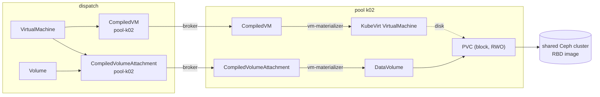
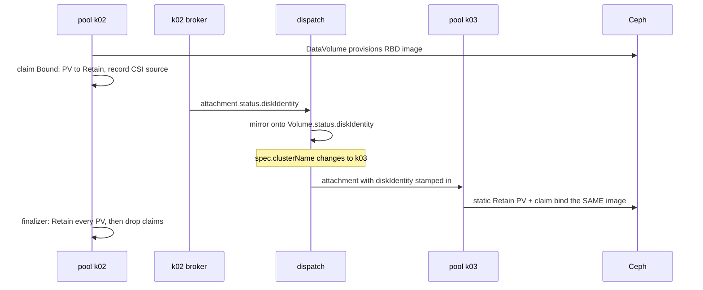
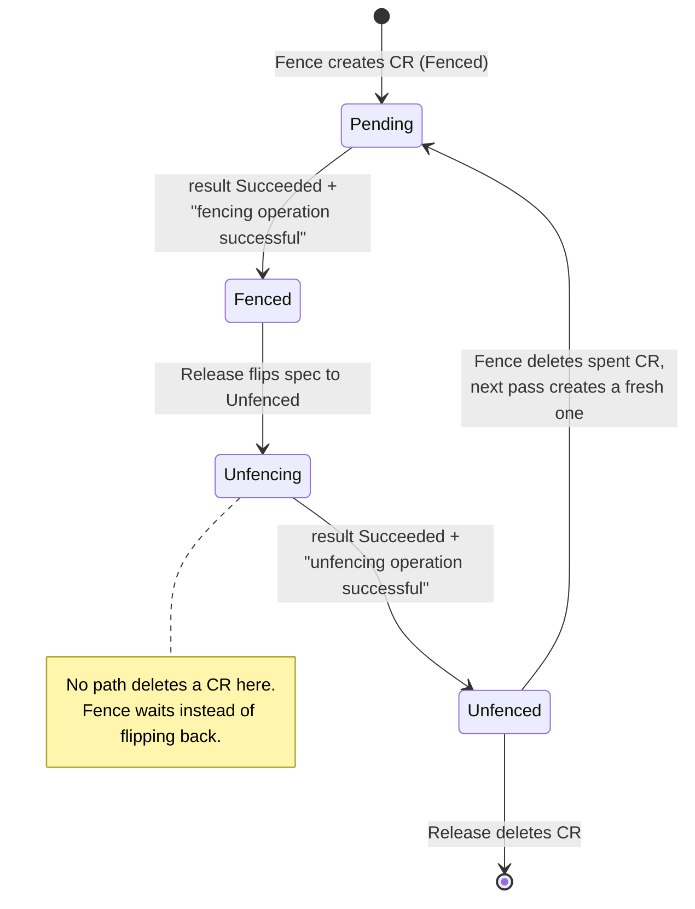

# Storage and VMs

A virtual machine in ectobase is a KubeVirt VM that boots from a Ceph RBD disk. The disk belongs
to a `Volume`, not to the pool the VM runs on, so a VM can move to another pool and take its data
with it. This page covers how a `Volume` becomes an RBD image, how the disk keeps its identity
across pools, how the vm-materializer turns a `CompiledVM` into a KubeVirt VM, and how the dispatch
fences a lost pool off Ceph with a csi-addons `NetworkFence`.

How a VM's network interface attaches to the overlay is covered in
[Attaching workloads](attaching-workloads.md).

## The objects involved

A VM is declared once on the dispatch and lowered into per-pool
[twins](../concepts/what-is-ectobase.md#vocabulary). The
[compiler](../concepts/what-is-ectobase.md#vocabulary) writes them into namespace `pool-<name>` of
the [pool](../concepts/what-is-ectobase.md#vocabulary) the VM is bound to, the pool's
[broker](../concepts/what-is-ectobase.md#vocabulary) copies them down, and the vm-materializer on the
pool acts on them.

| Declared on the dispatch | Compiled twin | Materialized on the pool as |
|---|---|---|
| `VirtualMachine` (`compute.ectobase.dev`) | `CompiledVM` | a KubeVirt `VirtualMachine` |
| `Volume` (`storage.ectobase.dev`), referenced from `spec.volumeRefs` | `CompiledVolumeAttachment`, one per volume reference | a CDI `DataVolume`, or a static PV and claim for a disk that already exists |
| `NetworkInterface` (`net.ectobase.dev`), referenced from `spec.interfaceRefs` | `CompiledNIC` | an overlay interface attached by flowplane |

The compiler names a `CompiledVM` `<namespace>-<vm>` and each attachment
`<namespace>-<vm>-<volume>`. Both carry the label `workload: <vm>`, which is how the pool side finds
a VM's attachments.



## From a Volume to an RBD image

This section explains how a disk is first provisioned.

A `Volume` declares a persistent disk: a `size`, an optional ceph-csi RBD `storageClass` (empty
means the pool's default), and an optional `bootImage`. For every `VolumeRef` on a VM whose `Volume`
exists, the compiler emits one `CompiledVolumeAttachment`. An attachment whose `Volume` has a
`bootImage` is marked `boot: true`.

On the pool, the vm-materializer's volume reconciler turns each attachment into a CDI `DataVolume`:

- The claim is `ReadWriteOnce` with `volumeMode: Block`. A raw block device is the mode KubeVirt
  wants for a VM disk.
- With a `bootImage`, the source is a registry import of `docker://<bootImage>`. Without one, it is
  a blank disk of `size`.
- The `DataVolume` is applied with server-side apply, so CDI's own defaults stay untouched and
  re-applying the same intent changes nothing.

ceph-csi then provisions an RBD image for the claim. Every pool and the dispatch talk to one shared
Ceph cluster under the same `clusterID`, which is what lets another pool, or the dispatch, reach the
image later.

## Disks that keep their identity across pools

A VM's pool can change: an operator edits `spec.clusterName`, or failover rebinds it. The
attachment twin is pool-scoped, so the old one is deleted and a new one appears in the new pool's
namespace. This section explains why that moves the disk instead of destroying it.

The rule is that the disk's lifetime belongs to the `Volume`, which has no pool. Five mechanisms
carry it.

| Step | Where | What it does |
|---|---|---|
| Capture | pool, `DiskIdentityReconciler` | Once the attachment's claim is `Bound`, flips its PersistentVolume to `reclaimPolicy: Retain` and records the PV's CSI source on the attachment's `status.diskIdentity`. |
| Report | broker, `ReportDiskIdentities` | Copies the recorded identity up onto the attachment twin on the dispatch. A failed copy fails the broker's tick, so it is retried rather than lost. |
| Mirror | dispatch, `DiskIdentityMirrorReconciler` | Copies the identity onto `Volume.status.diskIdentity`. It never clears an identity. |
| Stamp | compiler | Writes the `Volume`'s identity into every attachment it compiles for that volume, in whichever pool. |
| Adopt | pool, the vm-materializer's volume reconciler | An attachment with an identity and no `DataVolume` of its own is a disk that moved here. The materializer creates a static `Retain` PV that replays the identity, pre-bound to a claim named after the attachment, instead of asking CDI for a new image. |

Two details matter for correctness:

- Capture waits for the attachment's own claim to be `Bound`. CDI imports a block disk through a
  separate "prime" claim and moves the volume onto the named claim only when the import finishes,
  so `Bound` means the disk is fully written. Capturing earlier would let a move adopt a
  half-imported image.
- The whole `CSIPersistentVolumeSource` is recorded, minus the `csi.storage.k8s.io/` attributes
  and `storage.kubernetes.io/csiProvisionerIdentity` that name objects in the provisioning cluster.
  A ceph-csi PV carries a cluster ID, pool, image name, journal pool and several secret
  references. Rebuilding one from StorageClass parameters and dropping any of them gives a PV that
  binds and then fails at `NodeStage`, in another cluster, after a move.

The pool that provisioned the disk also gets the identity stamped into its attachment. It keeps
using its `DataVolume`: adoption happens only where no `DataVolume` for the attachment exists.

### Letting go without deleting

A disk must survive its pool letting go of it. Each pool-side attachment carries the finalizer
`compiled.ectobase.dev/disk`. When the attachment is deleted, the finalizer first flips every PV in
the attachment's claim tree to `Retain`: the attachment's own claim and any claim it owns, because
during a CDI import the prime claim holds the image. Only then does it delete the claims and PVs.
The image outlives them.

This closes the window between a disk being provisioned and its capture. A move in that window can
no longer destroy the image, though it still cannot carry it: with no identity recorded, the target
provisions a blank disk and the original is left orphaned in Ceph, where an operator can recover it.
The compiler logs an error naming the VM, the volume and both pools when it sees a move that early.

### Deleting a Volume

`Retain` everywhere means nothing deletes an image by cascade, so deleting a `Volume` reclaims it
explicitly. The finalizer `storage.ectobase.dev/disk` holds the `Volume` while any attachment still
references it. Once none does, the dispatch replays the recorded identity as a `Delete`-policy PV,
binds a throwaway claim to it and deletes the claim; the CSI driver then deletes the image. This
runs on the dispatch on purpose: ceph-csi's handle-to-image journal lives in RADOS, not in any
Kubernetes cluster, so the dispatch can reclaim an image after the pool that provisioned it is gone.



!!! note
    The order in which the old pool lets go and the new pool attaches is what keeps two VMs from
    writing one image. That ordering is the move gate, described in
    [Moving a VM between clusters](vm-moves.md).

## The VM materializer

The vm-materializer runs on each pool that hosts VMs (`vmMaterializer.enabled` in the pool chart)
and turns each `CompiledVM` into a KubeVirt `VirtualMachine` of the same name. This section covers
what it builds and why it sometimes waits.

### What it builds

- Disks. With attachments, the VM boots from persistent disks: the boot attachment first, then
  the rest by name. A provisioned disk is referenced through its `DataVolume`; a disk with a
  recorded identity is referenced through its claim, since an adopted disk has no `DataVolume`. The
  volume name is the attachment name either way, so guest disk order does not change when a VM
  moves. With no attachments, the VM boots an ephemeral `containerDisk` from `spec.image`.
- Cloud-init. If the VM has `cloudInit.userData`, a NoCloud disk is added.
- Interfaces. One interface per compiled NIC, with the MAC allocated centrally and the
  `flowplane` network binding plugin. See [Attaching workloads](attaching-workloads.md).
- Run strategy and resources come from the compiled spec. The compiler defaults an empty run
  strategy to `RerunOnFailure`, so KubeVirt restarts a VM whose node dies, inside the pool.

The materializer applies the VM with server-side apply and owns only the fields it sets. KubeVirt's
webhook defaults many fields under `spec.template.spec`; comparing whole specs would see a
difference on every pass and rewrite them forever.

### Why it waits: `spec.volumes` and `readyToMaterialize`

The broker delivers a `CompiledVM` and its attachments independently, so either can arrive first.
A KubeVirt VM created before its disks starts a VMI from a template without them; for a disk-booted
VM that is an empty `containerDisk`. KubeVirt never re-reads the template for a VMI that already
exists, so fixing the template later leaves that VMI and its virt-launcher pod broken.

The compiler therefore lists, in `CompiledVM.spec.volumes`, the attachments the VM needs (only for
`Volume`s that exist). `readyToMaterialize` holds the VM back until:

1. every attachment named in `spec.volumes` is present on the pool, and
2. for a VM without `spec.image`, at least one present attachment is marked `boot`.

Until then the materializer creates nothing and leaves an existing VM alone. An arriving attachment
re-triggers it. Attachments that carry the VM's `workload` label but are not named in
`spec.volumes` (a volume reference just removed, say) stay out of the template.

### Placement flows back

The broker knows which node KubeVirt started the VMI on. It writes that, with the node's /64
underlay prefix, onto `CompiledVM.status.placement` in its own pool namespace. The mesh-controller
mirrors it onto `VirtualMachine.status.placement`. The broker does not write the `VirtualMachine`
itself because that object lives in a tenant namespace shared by every pool's workloads, and per-pool
RBAC cannot scope such a write.

## KubeVirt, CDI and Ceph

ectobase uses KubeVirt and CDI as they ship; it does not fork or patch them. This section lists what
each pool and the dispatch need.

| Component | Where | Role |
|---|---|---|
| KubeVirt, with the `flowplane` network binding plugin registered | each VM pool | Runs the guest in a virt-launcher pod. |
| CDI | each VM pool | Turns a `DataVolume` into an RBD claim, importing `bootImage` when set. |
| ceph-csi RBD driver and StorageClass | each VM pool and the dispatch | Provisions and maps RBD images; the dispatch uses it to reclaim images. |
| csi-addons controller, `NetworkFence` CRD, and the csi-addons sidecar in the ceph-csi RBD provisioner | the dispatch | Executes the storage fence. |
| One Ceph cluster | shared by all of them | Holds every image under one `clusterID`. |

The lab pins KubeVirt v1.5.0, CDI v1.61.0 and csi-addons v0.12.0 (`test/lab/internal/deploy/`).
Its StorageClass creates images with only the `layering` feature and `reclaimPolicy: Delete`.
The Ceph client used by ceph-csi needs the mon caps `profile rbd, allow command "osd blocklist"`:
`profile rbd` allows adding a blocklist entry but not removing one, so without the explicit command
grant an unfence fails and the entry stays.

## The storage fence: csi-addons NetworkFence

When the dispatch fails a pool over, it first cuts that pool's nodes off from Ceph so they cannot
write a disk that another pool is about to attach. This section describes exactly how the dispatch
drives that cut through csi-addons. When and why it fences is in
[Failover and rescheduling](failover.md).

### The CR

The dispatch-controller's `StorageFencer` writes one cluster-scoped `NetworkFence`
(`csiaddons.openshift.io/v1alpha1`) per fenced prefix, on the dispatch cluster:

```yaml
apiVersion: csiaddons.openshift.io/v1alpha1
kind: NetworkFence
metadata:
  name: ectobase-fd00-cafe-1a2b-1----64   # "ectobase-" + prefix with ":"/"." -> "-", "/" -> "--"
  labels:
    ectobase.dev/fenced-for-pool: k02      # the pool fenced for; release refuses any other pool
spec:
  fenceState: Fenced
  driver: rbd.csi.ceph.com                # --csi-driver
  cidrs: ["fd00:cafe:1a2b:1::/64"]        # the pool's spec.underlayPrefix
  secret:
    name: rook-csi-rbd-provisioner        # --csi-secret-name
    namespace: rook-ceph                  # --csi-secret-namespace
  parameters:
    clusterID: <ceph fsid>                # --csi-cluster-id; ceph-csi rejects a fence without it
```

csi-addons calls the driver's `NetworkFence` RPC, which runs `ceph osd blocklist range add` for the
CIDR. From then on no Ceph client in that range can touch an RBD image.

### What csi-addons reports, and what the fencer trusts

csi-addons keeps one result per CR, overwritten by whichever operation ran last. It sets no
conditions and records no generation, so `status.message` is the only thing that says which
operation a `status.result: Succeeded` belongs to. The fencer compares against csi-addons' exported
messages:

| Operation | `status.result` | `status.message` |
|---|---|---|
| fence | `Succeeded` | `fencing operation successful` |
| unfence | `Succeeded` | `unfencing operation successful` |

!!! warning "Minimum csi-addons version: v0.9.0"
    The two distinct messages are stable from csi-addons v0.9.0. v0.5.0 wrote the fence message for
    both operations, which would let a finished fence pass as a finished unfence.

Two facts about csi-addons shape the rest:

- Ceph removes a blocklist entry only when csi-addons reconciles the CR with `spec.fenceState:
  Unfenced`, which in practice means flipping it from `Fenced` to `Unfenced`.
- Deleting a `NetworkFence` only drops csi-addons' finalizer. It never unfences. A CR deleted before
  its unfence ran leaves a blocklist entry behind, with a multi-year expiry and nothing tracking it.

### Fence

`Fence(prefix)` returns success only when the fence is confirmed active:

1. No CR: create a `Fenced` one and report "awaiting Succeeded" (not yet confirmed).
2. CR being deleted: wait.
3. CR whose `spec.fenceState` is not `Fenced`: a release left it `Unfenced`. The fencer never flips it
   back in place, because its status could still show the old fence operation's `Succeeded` and
   confirm a fence that is being removed. It waits, touching nothing, until the CR reports
   `Succeeded` with `unfencing operation successful`. Only then is the spent CR deleted, and the next
   pass creates a fresh `Fenced` one, whose only possible `Succeeded` is a fence's.
4. CR `Fenced`: confirmed only when `status.result` is `Succeeded` and `status.message` is
   `fencing operation successful`. Anything else is an error, which holds the failover barrier.

### Release

`Release(prefix)` returns success only once the unfence has completed and the CR is gone:

1. No CR: already released.
2. CR not yet `Unfenced`: flip `spec.fenceState` to `Unfenced` in place, so csi-addons runs the
   blocklist removal, and report "awaiting un-fence". Right after the flip the status still shows the
   fence operation's `Succeeded`, so the status is not read in this pass.
3. CR `Unfenced`: delete it only when it reports `Succeeded` with `unfencing operation successful`.



Because no path deletes a CR before its unfence is reported, a missing CR reliably means "released".

!!! warning "Do not delete a NetworkFence, and do not unfence one a pool still tracks"
    - Never delete a `NetworkFence`. Deleting it drops csi-addons' finalizer and leaves the Ceph
      blocklist entry in place.
    - Never patch one to `Unfenced` while any `ClusterPool` lists its prefix in
      `status.fencedPrefixes`. csi-addons lifts the blocklist as soon as it reconciles the flip,
      which bypasses the drain and route gates that decide when a fence may come off. On a pool that
      is still lost, its nodes could write disks already rebound elsewhere until failover's next pass
      fences again. On a recovered pool nothing re-fences at all, because the release path never
      calls `Fence`.
    - Fix what the pool's status names instead; see
      [A pool that will not let go](failover.md#a-pool-that-will-not-let-go).

    Only for a stranded entry, one that no `ClusterPool` lists and whose nodes are powered off or
    provably run none of the moved VMs, patch the CR to `Unfenced` and let csi-addons remove the entry:

    ```sh
    kubectl patch networkfence <name> --type=merge -p '{"spec":{"fenceState":"Unfenced"}}'
    ```

    Once the CR reports `Succeeded` with `unfencing operation successful`, it is spent. A later fence
    of the same prefix deletes it and replaces it with a fresh `Fenced` CR.

### What the fencer cannot see

One residual sits outside the fencer's reach. When a csi-addons RPC times out, the CR reports the
operation as failed, but Ceph may still apply it later, after the next operation. An unfence that
lands late can remove a blocklist entry that a later fence already reported in place. The same is
true of an in-place flip, so the CR protocol above cannot close it.

## Where this lives

| Concern | Location |
|---|---|
| `Volume` type | `api/storage/v1alpha1/volume_types.go` |
| VM and attachment compilers | `mesh/controllers/compiledvm.go`, `mesh/controllers/compiledvolumeattachment.go` |
| vm-materializer (`buildVM`, `readyToMaterialize`) | `mesh/controllers/vmmaterializer.go` |
| The vm-materializer's volume reconciler and adoption | `mesh/controllers/volumematerializer.go`, `mesh/controllers/volumeadopt.go` |
| Capture, `Retain`, release of a disk | `mesh/controllers/diskidentity.go` |
| Identity report and mirror | `dispatch/pkg/broker/reportdiskidentity.go`, `mesh/controllers/diskidentitymirror.go` |
| Image reclaim on `Volume` delete | `mesh/controllers/volumereclaim.go` |
| Storage fencer | `dispatch/pkg/fence/storage.go` |
| Lab installs (Ceph, csi-addons, KubeVirt, CDI) | `test/lab/internal/deploy/` |

The live tests `TestVolumeSurvivesClusterRebind`, `TestVolumeSurvivesAnImmediateRebind`,
`TestVolumeDeleteReclaimsTheImage`, `TestPlannedMove` and `TestTier2Failover`
(`test/lab/livetest/`) check these paths on the lab against Ceph itself: they compare CSI handles
and list the RBD pool.

## Where to go next

- [Moving a VM between clusters](vm-moves.md): the move gate that orders release and attach.
- [Failover and rescheduling](failover.md): when the dispatch fences a pool, and when
  it releases the fence.
- [Attaching workloads](attaching-workloads.md): how a VM's interface joins the overlay.
- [Move a VM](../guides/move-a-vm.md): drive a move on the lab.
