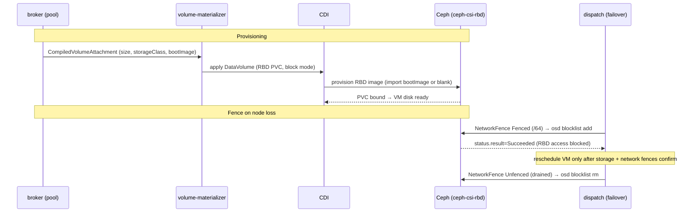

# Storage / CSI integration

!!! warning "Status: Partial"
    A VM's persistent disks are **ceph-csi-rbd** RBD volumes provisioned as CDI
    `DataVolume`s from a `CompiledVolumeAttachment`. Fenced-node recovery uses the
    **csi-addons `NetworkFence`** mechanism to blocklist a lost node's RBD access at
    Ceph before rescheduling. The provisioning path and the fence actuators are
    implemented; the full failover experience continues to be exercised and
    hardened, so this integration is marked Partial.

## Persistent disks for VMs

A `Volume` (in the storage API group) declares a persistent RBD-backed disk:
a size, an optional ceph-csi RBD `StorageClass`, and an optional `BootImage`
imported into the disk to make it bootable. The compiler lowers each
`Volume`-to-`VirtualMachine` attachment into a **`CompiledVolumeAttachment`**,
which the per-cluster broker delivers to the target pool.

On the pool cluster the **volume-materializer** reconciles each
`CompiledVolumeAttachment` into a **CDI `DataVolume`**:

- **Backing.** The DataVolume is an RBD PVC via the ceph-csi RBD `StorageClass`
  (empty = cluster default), requested `ReadWriteOnce` in **block** `volumeMode` —
  the correct mode for a KubeVirt VM disk (a raw block device gives better
  performance and clean cross-node reschedule/migration semantics compared with a
  `disk.img` on a filesystem PVC).
- **Source.** When `BootImage` is set the DataVolume imports it from a registry
  (`docker://<image>`) into the disk; otherwise it provisions a blank disk of the
  requested size.
- **Apply.** Like the VM materializer it uses **server-side apply** so CDI's own
  webhook defaults are preserved and re-applying the same intent is a no-op.

The [vm-materializer](kubevirt-integration.md) then references these DataVolumes as
the VM's disks (boot attachment first), so the KubeVirt VM boots from persistent
RBD storage.

## Node fencing for safe reschedule

Rescheduling a VM off a lost node is only safe once the old node can no longer
write its RBD disk — otherwise two instances could mount the same volume. The dispatch
enforces this with a **two-backend fence** (storage + network) that must both
confirm before any re-bind; see
[Rescheduling &amp; failover](rescheduling-and-failover.md) for the full
fence-gated failover flow.

The **storage** half is the **csi-addons `NetworkFence`** mechanism. The dispatch's
`StorageFencer` creates a cluster-scoped `NetworkFence`
(`csiaddons.openshift.io/v1alpha1`) with `fenceState: Fenced` for the lost node's
`/64`, targeting the ceph-csi RBD driver. csi-addons drives the driver's
`NetworkFence` RPC, which runs `ceph osd blocklist range add` — after which the
fenced node can no longer touch its RBD images. The fencer is **fail-safe**: it
returns success only once the CR reports `status.result == Succeeded`; a pending
or absent status is an error that holds the barrier.

Release is the inverse and equally careful. Ceph removes a blocklist entry only on
the `Fenced → Unfenced` state transition — a bare delete of a `Fenced` CR would
leave the blocklist in place (with a multi-year expiry). So `Release` flips the CR
to `Unfenced` in place, waits for csi-addons to run `ceph osd blocklist rm` and
report `Succeeded`, and only then deletes the CR.

The csi-addons controller and `NetworkFence` CRD are installed alongside a
`k8s-sidecar` wired into the ceph-csi RBD provisioner; the sidecar registers a
`CSIAddonsNode` and serves the `NetworkFence` RPC the controller dials. Ceph is
provisioned with `profile rbd, allow command "osd blocklist"` caps so the client
is permitted to blocklist.

## Flow

## Where this lives

| Concern | Location |
| --- | --- |
| `Volume` API type | `api/storage/v1alpha1/volume_types.go` |
| `CompiledVolumeAttachment` type | `api/compiled/v1alpha1/compiledvolumeattachment_types.go` |
| `CompiledVolumeAttachment` → CDI `DataVolume` | `mesh/controllers/volumematerializer.go` |
| `NetworkFence` storage fencer | `dispatch/pkg/fence/storage.go` |
| Overlay-route network fencer | `dispatch/pkg/fence/network.go` |
| Fence-gated failover | `dispatch/pkg/failover/failover.go` |
| ceph-csi-rbd install | `test/lab/internal/deploy/ceph.go` |
| csi-addons + sidecar install | `test/lab/internal/deploy/csiaddons.go` |
| KubeVirt / CDI install | `test/lab/internal/deploy/kubevirt.go` |
