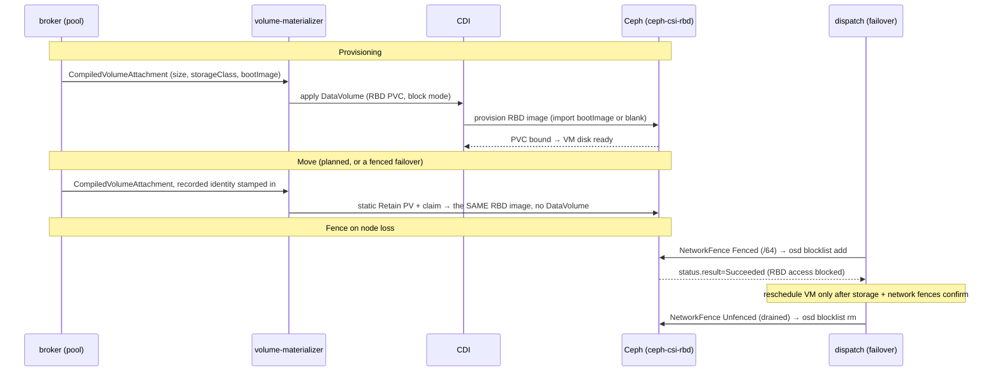

# Storage / CSI integration

!!! warning "Status: Partial"
    A VM's persistent disks are ceph-csi-rbd RBD volumes provisioned as CDI
    `DataVolume`s from a `CompiledVolumeAttachment`. Fenced-node recovery uses the
    csi-addons `NetworkFence` mechanism to blocklist a lost node's RBD access at
    Ceph before rescheduling. The provisioning path, the fence actuators and the
    disk-identity path that carries a disk with its VM are implemented and
    asserted on the live fabric. It stays Partial because a move is *cold*: the
    guest stops on one pool and starts on the other. Warm and live moves are
    designed but unbuilt.

## Persistent disks for VMs

A `Volume` (in the storage API group) declares a persistent RBD-backed disk:
a size, an optional ceph-csi RBD `StorageClass`, and an optional `BootImage`
imported into the disk to make it bootable. The compiler lowers each
`Volume`-to-`VirtualMachine` attachment into a `CompiledVolumeAttachment`,
which the per-cluster broker delivers to the target pool.

On the pool cluster the volume-materializer reconciles each
`CompiledVolumeAttachment` into a CDI `DataVolume` — unless the disk already
exists elsewhere in the fleet, in which case it is bound rather than provisioned
(see [Disk lifetime across clusters](#disk-lifetime-across-clusters)):

- Backing. The DataVolume is an RBD PVC via the ceph-csi RBD `StorageClass`
  (empty = cluster default), requested `ReadWriteOnce` in block `volumeMode` —
  the correct mode for a KubeVirt VM disk (a raw block device gives better
  performance and clean cross-node reschedule/migration semantics compared with a
  `disk.img` on a filesystem PVC).
- Source. When `BootImage` is set the DataVolume imports it from a registry
  (`docker://<image>`) into the disk; otherwise it provisions a blank disk of the
  requested size.
- Apply. Like the VM materializer it uses server-side apply so CDI's own
  webhook defaults are preserved and re-applying the same intent is a no-op.

The [vm-materializer](kubevirt-integration.md) then references these DataVolumes as
the VM's disks (boot attachment first), so the KubeVirt VM boots from persistent
RBD storage.

The broker delivers a `CompiledVM` and its `CompiledVolumeAttachment`s independently, so either
can arrive first, and the vm-materializer will not create the KubeVirt `VirtualMachine` until
every attachment `CompiledVM.spec.volumes` names is present — and, for a VM with no image, until
one of the attachments it has is marked boot. This is not a cosmetic ordering: a VM created ahead
of its disks starts from a template that does not yet reference them (for a disk-booted VM, that
means an empty `containerDisk`), and KubeVirt never re-reads a template for a VMI that already
exists. Fixing the template afterwards would not fix that VMI or its virt-launcher pod — both
would stay invalid forever. Waiting until the disks are all there avoids ever creating that VMI in
the first place (`mesh/controllers/vmmaterializer.go`, `readyToMaterialize`).

## Disk lifetime across clusters

A VM's `spec.clusterName` can change — a planned move, or a Tier-2 failover
rescheduling it off a pool that stopped reporting. Compiled twins are per-pool, so
the old pool's `CompiledVolumeAttachment` is pruned and a new one appears in the
target. None of that may destroy the disk, which takes three mechanisms:

- **Capture.** When the pool that provisioned a disk first observes its claim
  bound, it flips the `PersistentVolume` to `reclaimPolicy: Retain` and records the
  driver's own CSI source. The whole `CSIPersistentVolumeSource` is recorded, not a
  hand-picked subset: it carries five distinct secret references, and omitting one
  yields a PV that binds and then fails at `NodeStage` — in another cluster, after
  a move. The identity travels up through the attachment's status and the broker
  onto the `Volume`, which is what the compiler reads when it stamps the next
  attachment.
- **Adopt.** A pool holding an attachment whose identity is recorded but which has
  no `DataVolume` of its own is a pool the disk has moved *to*. It replays the
  recorded identity as a static `Retain` PV, pre-bound to the claim it exists for,
  rather than asking CDI to provision a second, blank image. The disk is named by
  the same claim whether it was provisioned or adopted, so the VM references it
  identically either way.
- **Release.** Detaching flips every `PersistentVolume` in the attachment's claim
  tree to `Retain` before releasing it — the attachment's own claim and any claim
  it owns, because CDI populates a block import through a "prime" claim that holds
  the image while the named one is still `Pending`. A finalizer on the attachment
  is what makes this ordering possible: the claims still exist at the point the
  attachment is being removed.

`Retain` everywhere means nothing reclaims a disk by cascade any more, so deleting
a `Volume` has to reclaim the image explicitly: the dispatch replays the recorded
identity as a `Delete`-policy PV, binds a throwaway claim and drops it. That is
dispatch-local by design — one Ceph cluster backs every pool under the same
`clusterID`, and ceph-csi's handle-to-image journal lives in RADOS rather than in
any Kubernetes cluster — so a `Volume` can still be reclaimed after the pool that
provisioned it is gone. A finalizer holds the `Volume` open until the image is.

One window remains, and it is narrow rather than silent. A disk is adoptable only
once its identity has been recorded, so a move in the seconds between the claim
binding and that first reconcile leaves the target to provision a blank disk. The
original is *orphaned* in Ceph rather than destroyed, and the compiler logs the VM,
the volume and both pools when it sees a move that early.

### A move is break-before-make

Changing `spec.clusterName` never runs a VM on two pools at once. The compiler retires the VM's
twin in the old pool — deleted, but held by the `compiled.ectobase.dev/source-released` finalizer —
and compiles neither the VM nor its disks into the new pool until that twin is gone. It goes when
the old pool's broker reports `status.released` (nothing left that could run the VM or hold its
disks), or, if the old pool is lost, when failover has fenced it. The VM's `Moving` condition says
which pool it is waiting on.

Two writers on one image is otherwise possible: `ReadWriteOnce` is enforced per cluster, and the
RBD images carry only `layering`, so Ceph does not refuse a second mapper. There is no force
option; if a pool will not release a VM, fencing that pool is the way to take the decision away
from it.

## Node fencing for safe reschedule

Rescheduling a VM off a lost node is only safe once the old node can no longer
write its RBD disk — otherwise two instances could mount the same volume. The dispatch
enforces this with a two-backend fence (storage + network) that must both
confirm before any re-bind; see
[Rescheduling &amp; failover](rescheduling-and-failover.md) for the full
fence-gated failover flow.

The storage half is the csi-addons `NetworkFence` mechanism. The dispatch's
`StorageFencer` creates a cluster-scoped `NetworkFence`
(`csiaddons.openshift.io/v1alpha1`) with `fenceState: Fenced` for the lost node's
`/64`, targeting the ceph-csi RBD driver. csi-addons drives the driver's
`NetworkFence` RPC, which runs `ceph osd blocklist range add` — after which the
fenced node can no longer touch its RBD images. The fencer is fail-safe: it
returns success only once the CR reports `status.result == Succeeded`; a pending
or absent status is an error that holds the barrier.

Release is the inverse and equally careful. Ceph removes a blocklist entry only on
the `Fenced → Unfenced` state transition — a bare delete of a `Fenced` CR would
leave the blocklist in place (with a multi-year expiry). So `Release` flips the CR
to `Unfenced` in place, waits for csi-addons to run `ceph osd blocklist rm` and
report `Succeeded`, and only then deletes the CR.

The csi-addons controller and `NetworkFence` CRD are installed alongside a
`k8s-sidecar` wired into the ceph-csi RBD provisioner; the sidecar registers a
`CSIAddonsNode` and serves the `NetworkFence` RPC the controller dials. Ceph is
provisioned with `profile rbd, allow command "osd blocklist"` caps so the client
is permitted to blocklist.

## Flow

```mermaid
sequenceDiagram
    participant Broker as broker (pool)
    participant VolM as volume-materializer
    participant CDI
    participant Ceph as Ceph (ceph-csi-rbd)

    Note over Broker,Ceph: Provisioning
    Broker->>VolM: CompiledVolumeAttachment (size, storageClass, bootImage)
    VolM->>CDI: apply DataVolume (RBD PVC, block mode)
    CDI->>Ceph: provision RBD image (import bootImage or blank)
    Ceph-->>CDI: PVC bound → VM disk ready

    Note over Broker,Ceph: Move (planned, or a fenced failover)
    Broker->>VolM: CompiledVolumeAttachment, recorded identity stamped in
    VolM->>Ceph: static Retain PV + claim → the SAME RBD image, no DataVolume

    Note over Broker,Ceph: Fence on node loss
    participant Dispatch as dispatch (failover)
    Dispatch->>Ceph: NetworkFence Fenced (/64) → osd blocklist add
    Ceph-->>Dispatch: status.result=Succeeded (RBD access blocked)
    Note over Dispatch: reschedule VM only after storage + network fences confirm
    Dispatch->>Ceph: NetworkFence Unfenced (drained) → osd blocklist rm
```

## Where this lives

| Concern | Location |
| --- | --- |
| `Volume` API type | `api/storage/v1alpha1/volume_types.go` |
| `CompiledVolumeAttachment` type | `api/compiled/v1alpha1/compiledvolumeattachment_types.go` |
| `CompiledVolumeAttachment` → CDI `DataVolume` | `mesh/controllers/volumematerializer.go` |
| Disk-identity capture + `Retain` (pool) | `mesh/controllers/diskidentity.go` |
| Adopt a disk that already exists (pool) | `mesh/controllers/volumeadopt.go` |
| Identity report, pool → dispatch | `dispatch/pkg/broker/reportdiskidentity.go` |
| Identity mirror onto the `Volume` | `mesh/controllers/diskidentitymirror.go` |
| `Volume` delete → RBD image reclaim | `mesh/controllers/volumereclaim.go` |
| `NetworkFence` storage fencer | `dispatch/pkg/fence/storage.go` |
| Overlay-route network fencer | `dispatch/pkg/fence/network.go` |
| Fence-gated failover | `dispatch/pkg/failover/failover.go` |
| ceph-csi-rbd install | `test/lab/internal/deploy/ceph.go` |
| csi-addons + sidecar install | `test/lab/internal/deploy/csiaddons.go` |
| KubeVirt / CDI install | `test/lab/internal/deploy/kubevirt.go` |
