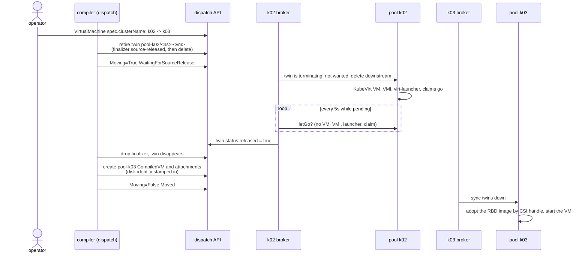

# Moving a VM between clusters

A VM moves to another pool when its `spec.clusterName` changes. The move keeps the VM's disk, its
overlay IP, its MAC and its VNI, and it is break-before-make: the VM stops on the old pool before it
starts on the new one. This page explains the mechanism, why it is ordered that way, how a failover
move differs, and what is not built yet.

Each [pool](../concepts/what-is-ectobase.md#vocabulary) has its own namespace `pool-<name>` on the
dispatch. The [compiler](../concepts/what-is-ectobase.md#vocabulary) lowers a `VirtualMachine` into
per-pool [twins](../concepts/what-is-ectobase.md#vocabulary), and each pool's
[broker](../concepts/what-is-ectobase.md#vocabulary) syncs them down.
[Storage and VMs](storage-and-vms.md) describes the twins and the disk identity this page relies on.

## A move is a `spec.clusterName` change

There is no separate move object. A planned move is an edit of `spec.clusterName` on the
`VirtualMachine`:

```sh
kubectl patch virtualmachines.compute.ectobase.dev <vm> -n <namespace> \
  --type=merge -p '{"spec":{"clusterName":"k03"}}'
```

The same field is written by the scheduler at first placement and by failover when it rebinds a VM
off a lost pool. All three go through the same gate in the compiler, so they cannot race each other
into an unsafe state: whichever write lands, the gate waits for proof that the old pool let go.

## Why break-before-make

Two copies of one VM on two pools would mean two writers on one RBD image. Nothing below ectobase
stops that:

- `ReadWriteOnce` is enforced per cluster. Two clusters can each bind a claim to the same image.
- The RBD images the lab's StorageClass creates carry only the `layering` feature, so Ceph does not
  refuse a second client mapping the image.
- Since a moved disk is attached by its CSI handle, both pools can name the same image.

Two guests writing one block device corrupt its filesystem. So the target gets nothing until the
source has shown that nothing of the VM remains. Even a VM without disks is gated, because two
running copies would also share one IP and MAC.

## The sequence



### 1. The compiler retires the source twin

On every reconcile of a `VirtualMachine` with a pool, the compiler first reads every `CompiledVM`
twin of that VM (`gateTwins`) and asks which of them keep the target closed (`awaitingRelease`):

- every twin in another pool's namespace, and
- a twin in the target's own namespace that is itself terminating (a move reversed before the pool
  it returns to had let go).

Each such twin outside the target is retired by `retireTwin`: the compiler adds the finalizer
`compiled.ectobase.dev/source-released`, then deletes the twin. The finalizer keeps it visible on
the dispatch as terminating. A twin compiled before the finalizer existed gets it first, so an
upgrade cannot wave a move through unproven.

While anything is awaiting release, the compiler writes no `CompiledVM` into the target, sets the
VM's `Moving` condition, and stops. The `CompiledVolumeAttachment` compiler uses the same gate: it
deletes the source's attachments at once (a disk leaves immediately) but creates none in the target
until the gate opens.

`gateTwins` reads from the API server directly, not from the informer cache. A twin created moments
before the `clusterName` change can still be missing from the cache, and a gate that cannot see the
source's twin would open while that pool runs the VM. A cache lagging the other way only keeps the
gate shut a little longer. The read is narrowed server-side by the `workload` label and then filtered
by the source reference stamped on each twin, so a same-named VM in another namespace does not count.

### 2. The source broker stops the VM and proves it

The source broker treats a terminating twin as unwanted, so its sync deletes the downstream
`CompiledVM`. The KubeVirt `VirtualMachine`, its VMI and the virt-launcher pod follow by owner
reference. The source's attachment twins are already gone, and their disk finalizer flips the PVs to
`Retain` before releasing the claims (see
[Storage and VMs](storage-and-vms.md#letting-go-without-deleting)).

A separate release pass, `ReportReleases`, then checks each terminating twin in the pool's namespace.
`letGo` reports the VM gone only when none of these remains downstream:

| Checked | Why |
|---|---|
| the downstream `CompiledVM` | it would recreate the KubeVirt VM |
| the KubeVirt `VirtualMachine` | it would recreate the VMI |
| the `VirtualMachineInstance` | it would recreate the launcher |
| a virt-launcher pod owned by that VMI | the launcher runs qemu; a pod leaves the API only after kubelet has torn down its volumes |
| any claim labelled with the VM's `workload` | the disk teardown issues its deletes without waiting, so a claim still present is still in use |

When all are gone, the broker sets `status.released: true` on the twin. While any twin is pending it
looks again every 5 seconds, because the downstream teardown raises no dispatch event. The patch is
optimistically locked: a twin's name is reused when a move is reversed, and a stale cached read of
the old twin must not mark the new one released.

The broker's sync pass and release pass never run at the same time; why that matters is explained in
[One worker, deliberately](multi-cluster.md#one-worker-deliberately).

### 3. The gate opens and the target starts the VM

The mesh-controller drops the `source-released` finalizer from a twin whose `status.released` is set,
and the twin disappears. The compiler then writes the `CompiledVM` and its attachments into the
target namespace. Each attachment carries the disk identity recorded on the `Volume`, so the target
pool adopts the original RBD image by its CSI handle rather than provisioning a blank one. The
vm-materializer waits until every disk the VM names has arrived, then creates the KubeVirt VM, which
cold-boots on the original disk.

## What moves with the VM

| | How it follows |
|---|---|
| Disk | By CSI handle: a static `Retain` PV in the target replays the identity the source recorded. |
| Overlay IP, MAC, VNI | Unchanged. Central IPAM and MAC allocations have no pool dimension. |
| `CompiledNIC` twin | Recompiled into the target's namespace at once; it is not behind the gate. Nothing in the target attaches it until the VM starts there. |
| Routes | The source node's agent withdraws the VM's /32 on its next 5-second tick after the interface detaches; the target's agent announces it once the VM's interface attaches. |
| Policy (firewall, NAT, LB, QoS) | Programmed by whichever agent finds the interface attached locally, keyed by `(VNI, overlay IP)`. See [Attaching workloads](attaching-workloads.md). |

## The `Moving` condition

The compiler reports progress on the `VirtualMachine`. A VM that never moved has no `Moving`
condition.

| Status | Reason | Message | Meaning |
|---|---|---|---|
| `True` | `WaitingForSourceRelease` | `waiting for pool(s) <pools> to release the VM before it starts on <target>` | The gate is closed. |
| `False` | `Moved` | `running on pool <target>` | The twin is compiled into the target. The guest may still be booting. |

```sh
kubectl get virtualmachines.compute.ectobase.dev <vm> -n <namespace> \
  -o jsonpath='{.status.conditions[?(@.type=="Moving")]}'
```

## Expected downtime

A move is a cold restart. The guest is shut down on the source and booted again on the target, and
existing connections are reset. The outage is the sum of:

1. the source's teardown of the KubeVirt VM, VMI, launcher and claims;
2. up to 5 seconds until the broker's release poll sees it;
3. the compiler opening the gate and the target broker syncing the twins down;
4. adopting the disk and starting the virt-launcher;
5. the guest's own boot.

There is no measured figure in the repository. The guest boot usually dominates.

## How a failover move differs

A failover move goes through the same gate, but the proof comes from somewhere else, because a lost
pool's broker cannot report anything.

| | Planned move | Failover move |
|---|---|---|
| Who writes `spec.clusterName` | an operator or tool | the failover reconciler, after fencing |
| Source pool | healthy and reachable | lost: lease stale beyond 2 minutes |
| Proof that the source let go | the source broker's `letGo` | the fence: Ceph blocklist plus reflector route fence, with complete coverage |
| Who sets `status.released` | the source broker (`ReportReleases`) | failover (`releaseFencedTwins`) |
| Source VM afterwards | stopped before the target starts | may still run, cut off from Ceph and from the overlay; the pool's broker removes it when the pool returns; the fence is held until the broker reports the fenced prefix drained and its routes are withdrawn |

The failover path and its release gates are described in
[Failover and rescheduling](failover.md). A planned move whose source pool dies mid-move
needs no special case: the twin stays terminating, the pool goes lost, failover fences it and
releases the twin, and the move completes.

## A move that does not finish

A move waits as long as the source holds something. If `Moving` stays `True`, look at the source
pool for whatever `letGo` still finds: a VMI that will not terminate, a stuck virt-launcher, or a
claim that is not going away. A release check that errors is logged by the source broker.

Fencing a healthy pool does not release anything: `releaseFencedTwins` runs only once the pool is
lost. There is deliberately no force flag. For the rare case where the proof cannot be made by the
machinery (the pool's `ClusterPool` was deleted, the pool never had a lease, or its fence coverage is
incomplete, or its fences never confirm), an operator with write access to `compiledvms/status`
can make the broker's report by hand. First check everything the broker's `letGo` would check:

1. On the source pool, in namespace `<namespace>`, nothing can still run the VM or write its disks:
    - no `CompiledVM` named `<namespace>-<vm>` (the vm-materializer recreates the KubeVirt VM from
      it);
    - no KubeVirt `VirtualMachine` and no VMI named `<namespace>-<vm>`;
    - no virt-launcher pod owned by that VMI;
    - no claim carrying the label `workload: <vm>`.
2. On the dispatch, the twin you are about to patch is the retired one. This must print a timestamp:

    ```sh
    kubectl get compiledvms <namespace>-<vm> -n pool-<source> \
      -o jsonpath='{.metadata.deletionTimestamp}'
    ```

    A reversed move reuses the twin's name, and a released mark on a live twin is never reset, so its
    own later retirement would pass with no proof.

Then:

```sh
kubectl patch compiledvms <namespace>-<vm> -n pool-<source> --subresource=status --type=merge \
  -p '{"status":{"released":true}}'
```

!!! warning
    This patch replaces the proof the machinery would have made. If the check is wrong, the VM runs
    in two places on one disk.

## What is not built yet

!!! note "Status: Planned"
    Live migration across clusters, where the guest keeps running and existing connections survive,
    is the goal for VM mobility. It is designed in outline only. Today's moves are cold.

What a live cross-cluster move needs, beyond what exists:

| Requirement | Why | Status |
|---|---|---|
| Conntrack portability | flowplane's connection tracking is per node: established TCP state, NAT translations (including the source port chosen for a SNAT'd flow), LB and DSR bindings, and the firewall re-evaluation epoch. Without it, packets of an existing flow reach a node with no entry, the firewall evaluates them as new flows and drops them unless a rule admits them, and SNAT'd return traffic loses its port mapping. Hardware-offloaded flows on the source node's representor would not follow either. Without moving that state a migration is warm, not live. | Needs its own design |
| A cross-cluster handover | KubeVirt's live migration is intra-cluster: a `VirtualMachineInstanceMigration` runs between virt-handlers of one cluster. Crossing pools needs a stretched pool, a libvirt-level handover orchestrated outside KubeVirt, or a decision to stay warm. | No approach chosen |
| ReadWriteMany disks | KubeVirt live migration needs the disk attached on both ends at once. All disks are `ReadWriteOnce` block volumes today, and the move gate exists precisely to forbid two attachments. | Not built |
| Route cutover | A make-before-break move has the source and target announce the same /32 at once. The reflector merges nexthops and agents program the first of a sorted set, so traffic would stay on, or flip to, an arbitrary end. | No migration-aware nexthop preference exists |

Pool evacuation (cordoning a pool and moving all its VMs) is also not built; it would be a loop over
the planned move described here.

## Where this lives

| Concern | Location |
|---|---|
| Move gate (`gateTwins`, `awaitingRelease`, `retireTwin`) | `mesh/controllers/movegate.go` |
| VM compiler and the `Moving` condition | `mesh/controllers/compiledvm.go` |
| Attachment compiler (same gate) | `mesh/controllers/compiledvolumeattachment.go` |
| Finalizer removal on release | `mesh/controllers/compiledvmrelease.go` |
| Source release proof (`ReportReleases`, `letGo`) | `dispatch/pkg/broker/release.go` |
| Broker sync and release passes | `dispatch/cmd/broker/sync.go` |
| Failover's release of lost pools' twins | `dispatch/pkg/failover/failover.go` |
| Live tests | `test/lab/livetest/plannedmove_test.go`, `test/lab/livetest/volumemove_test.go`, `test/lab/livetest/tier2_test.go` |

`TestPlannedMove` moves a running, disk-backed VM between two healthy lab pools. From the moment of
the patch until the source holds nothing, it samples both clusters every second and fails if the
target ever runs a virt-launcher while the source still has a launcher or the disk claim. It then
checks that the target bound the original image by CSI handle and that the image is still in the
Ceph pool.

## Where to go next

- [Move a VM](../guides/move-a-vm.md): run a planned move on the lab.
- [Failover and rescheduling](failover.md): the fence that proves a lost pool let go.
- [Storage and VMs](storage-and-vms.md): how the disk keeps its identity.
