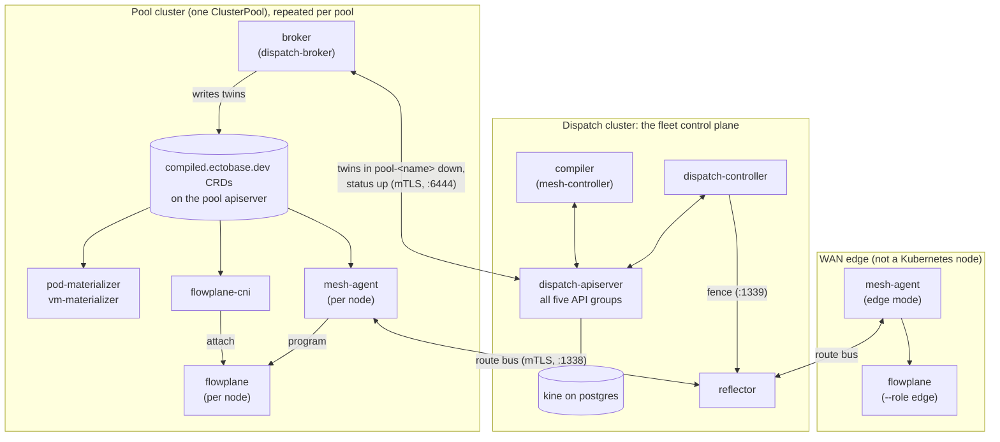
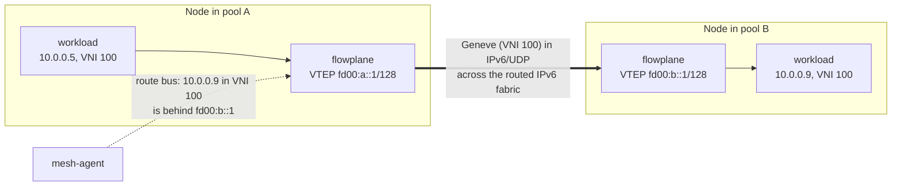
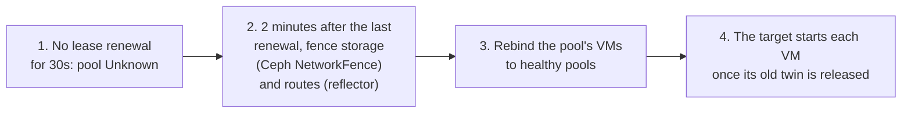

# The fleet: dispatch and pools

An ectobase fleet is one dispatch cluster and any number of pool clusters, joined by an
IPv6 fabric. This page explains what runs on each, why the dispatch serves its API without
CRDs while every pool uses ordinary CRDs, how the overlay network joins the pools, what
happens when a pool is lost, and how the code splits into flowplane, mesh and dispatch.

## The dispatch

The **dispatch** is the fleet control plane. It runs on one Kubernetes cluster and holds
the only copy of your intent. The `ectobase-dispatch` Helm chart installs it.

| Component | What it does |
|---|---|
| `dispatch-apiserver` | An aggregated apiserver that serves all five `*.ectobase.dev` API groups, listed in [CRD interactions](../reference/crd-interactions.md). Brokers reach it directly on port 6444. |
| kine and postgres | Storage for the apiserver. kine presents an etcd v3 endpoint backed by postgres, whose data directory is persistent by default. |
| mesh-controller (the compiler) | Allocates VNIs, overlay IPs, MACs and public addresses, and lowers intent into `Compiled*` objects for one pool. |
| `dispatch-controller` | Tracks pool health from each broker's lease, schedules unbound workloads onto pools, runs failover and fencing, and signs the route-bus intermediate CAs for each pool and for the WAN edges (see [Trust boundaries](../architecture/overview.md#trust-boundaries)). |
| reflector | The hub of the route bus. Agents in every pool and on every WAN edge hold a session to it. |

Each runs as a single replica today. [HA and restarts](../architecture/ha-and-restarts.md)
covers what survives a restart of each.

### Why the dispatch holds no CRDs

The five API groups are registered with the dispatch's host cluster as `APIService`
objects that point at `dispatch-apiserver`. The host cluster has no ectobase CRDs. The
API server is ectobase's own process, which buys three things.

- The fleet's objects live in their own store. Intent and compiled state for every pool
  sit in postgres through kine, separate from the host cluster's etcd.
- Validation and lifecycle hooks are Go code in the API types (`api/<group>/*_validate.go`
  and `*_rest.go`), not OpenAPI schemas and webhooks.
- Brokers in other clusters connect straight to it and authenticate with ectobase's own
  PKI, rather than going through the host kube-apiserver and its cluster CA.

Clients don't notice the difference. `kubectl` and client-go talk to the aggregated groups
through the host apiserver like any other API.

## The pools

A **pool** is an ordinary Kubernetes cluster that runs workloads. It is registered on the
dispatch as a cluster-scoped `ClusterPool`, and the dispatch keeps the pool's compiled
objects in the namespace `pool-<name>`. The `ectobase-pool` Helm chart installs the pool
side.

| Component | Runs as | What it does |
|---|---|---|
| broker (`dispatch-broker`) | Deployment | Syncs this pool's twins down from the dispatch, and reports lease, capacity, VM placement, disk identity and releases back up. |
| `flowplane` | DaemonSet | The eBPF dataplane. It serves the node-local `DataplaneNode` gRPC on a root-only unix socket. |
| `mesh-agent` | DaemonSet | Programs the local flowplane from `CompiledNIC`s and speaks the route bus. |
| `flowplane-cni` | DaemonSet (installer) | Attaches a workload's overlay interface to flowplane when its pod sandbox is created. |
| `pod-materializer` | Deployment | Turns a `CompiledContainer` into a Pod. |
| `vm-materializer` | Deployment, opt-in | Turns a `CompiledVM` and its `CompiledVolumeAttachment`s into a KubeVirt `VirtualMachine`. |

A pool also needs cert-manager and Multus, and for VMs KubeVirt, CDI and ceph-csi. The
chart can optionally add in-pool node remediation (medik8s NodeHealthCheck and
SelfNodeRemediation) for failures inside one pool.

### Why a pool uses real CRDs

The pool side is a set of ordinary controllers against the pool's own kube-apiserver, so
CRDs are the simplest fit: nothing extra to run in every pool. What the pool stores is
deliberately narrow.

- A pool only ever receives `compiled.ectobase.dev` objects. The compiled group is
  self-contained, so no pool component reads `net`, `compute` or `storage` intent, and a
  pool never has to understand the full API.
- The broker can only read its own pool's compiled objects on the dispatch. That scoping
  is RBAC, a `Role` in `pool-<name>`, not a filter the broker chooses to apply, so one
  pool can't read another's state.
- The broker writes each twin back into its source namespace in the pool, not into
  `pool-<name>`. The CNI and the materializers find a workload's objects in the
  workload's own namespace and never learn about the dispatch's layout.
- The pool keeps its own copy. If the dispatch is unreachable, the broker can't fetch a
  new desired set and leaves the local objects alone, so running workloads stay
  programmed.

## WAN edges

A WAN edge connects the overlay to networks outside the fleet. An edge is a router, not a
Kubernetes node: it runs `flowplane serve --role edge` and a `mesh-agent` in edge mode with
no apiserver. It joins the route bus with a certificate it mints itself from the edge
fleet's intermediate CA. [The WAN edge](../features/ns-edge.md) covers what it does with
traffic.

## The network

ectobase keeps tenant traffic off the fabric's routing tables by tunnelling it. This
section names the layers; [The overlay](../architecture/overlay.md) covers them in depth.

- The **underlay** is the routed IPv6 fabric between all nodes and WAN edges. It only has
  to deliver IPv6 between node addresses; it carries no routes for tenant addresses.
- The **overlay** is the tenant network on top. flowplane wraps each workload packet in
  Geneve over IPv6 and UDP, so overlapping tenant ranges never meet on the fabric.
- A **VTEP** is a node's tunnel endpoint, a single `/128` underlay address. Every
  interface on the node is reached through it; nothing is allocated per workload.
- The **VNI** is the overlay's network identifier, one per VPC, carried in the Geneve
  header. The receiving node uses the VNI and the inner destination to find the right
  interface.
- The **route bus** tells each node where an overlay address lives. Every agent announces
  the addresses on its node to the reflector, which passes them to every agent subscribed
  to that VNI, in any pool.

The addresses in the diagram are illustrative.

## When a pool is lost

A pool can disappear as a whole: a power cut, a network partition, a failed control plane.
The dispatch notices through the broker's lease and moves the pool's VMs elsewhere, but
only after it has made sure the lost pool can no longer touch their disks or attract their
traffic.

The fence comes first because a VM's disk is a single RBD image: if the lost pool were
still running the VM, two writers on one image would corrupt it. If a fence can't be
confirmed, failover leaves the VMs where they are and marks them `FailoverBlocked`.
Containers on a lost pool are not rebound.

A planned move, a deliberate change of a VM's `spec.clusterName`, follows the same
release rule without the fence: the target starts the VM only after the source pool has
let go of it. [Failover](../architecture/failover.md) and
[VM moves](../architecture/vm-moves.md) cover both in depth.

## flowplane, mesh and dispatch

The code splits into three parts by job, not by where each part runs.

| Part | Language | Contains | Runs on |
|---|---|---|---|
| flowplane (`flowplane/`) | Rust, eBPF via aya | The dataplane: eBPF programs, the pure core, the `flowplane` binary | every pool node, every WAN edge |
| mesh (`mesh/`) | Go | The network control plane: compiler, agent, reflector, route bus, materializers | compiler and reflector on the dispatch; materializers in pools; agent in pools and on edges |
| dispatch (`dispatch/`) | Go | Fleet orchestration: apiserver, broker, dispatch-controller | apiserver and controller on the dispatch; broker in each pool |

flowplane holds no policy of its own. Every decision it makes is a map lookup, and the
agent fills the maps from `CompiledNIC`s and from routes it learns on the route bus. The
API types live in `api/`, and the CNI plugin in `cni/`.

## How the pieces talk

| From | To | Over | Carries |
|---|---|---|---|
| broker | dispatch-apiserver | HTTPS with mTLS, port 6444 | twins down; lease, capacity and status up |
| mesh-agent | reflector | gRPC (`routebus.v1`) with mTLS, port 1338 | overlay routes, per VNI |
| dispatch-controller | reflector | gRPC (`RouteBusAdmin`), port 1339 | route fences |
| mesh-agent, flowplane-cni | flowplane | gRPC (`DataplaneNode`) on a unix socket | interface attach, routes, firewall, NAT, LB, QoS |
| flowplane | flowplane | Geneve over IPv6, UDP 6081 | tenant traffic |

The admin port is separate from the session port so that an agent with a valid session
certificate can't drive fencing.

## Where to go next

- [From intent to a running workload](intent-to-running.md): how a request moves through these components.
- [Multi-cluster orchestration](../architecture/multi-cluster.md): scheduling, the broker and per-pool authorization in depth.
- [The route bus](../architecture/route-bus.md): how the reflector and agents distribute overlay routes.
- [Deploy with Helm](../operations/deploy-helm.md): install the two charts.
