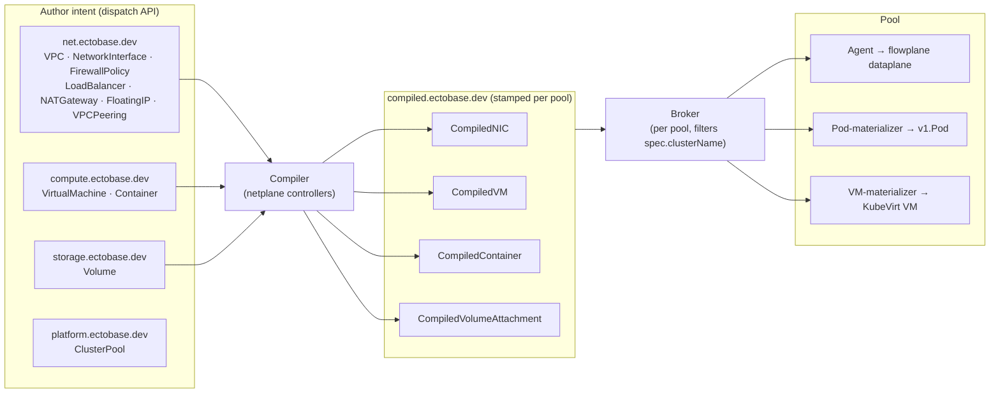

# Intent to datapath

Everything in ectobase flows through one reconcile loop:

> **intent → compiled → programmed / materialized**

You author declarative intent as CRDs; the **compiler** lowers that intent into `Compiled*` objects
stamped for a specific pool; the **broker** syncs those down; and finally the **agent** programs the
dataplane while **materializers** create the actual Pods and VMs. This page walks the loop and
explains why it is split the way it is.

## The flow

### 1. Intent — the user-facing CRDs

Intent is authored against the dispatch's aggregated API in five groups:

| Group | Kinds |
|---|---|
| `net.ectobase.dev` | `VPC`, `NetworkInterface`, `FirewallPolicy`, `LoadBalancer`, `NATGateway`, `FloatingIP`, `VPCPeering` |
| `compute.ectobase.dev` | `VirtualMachine`, `Container` |
| `storage.ectobase.dev` | `Volume` |
| `platform.ectobase.dev` | `ClusterPool` |
| `compiled.ectobase.dev` | (output only — see below) |

These describe *what you want*, not how any node achieves it: a VPC's VNI, a NIC's overlay
addresses, a firewall policy's rules, an LB's VIP and backends.

### 2. Compile — lowering intent into `Compiled*`

The **compiler** (the netplane controllers) reconciles that intent into the `compiled.ectobase.dev`
group: `CompiledNIC`, `CompiledVM`, `CompiledContainer`, and `CompiledVolumeAttachment`. A
`CompiledNIC` is the keystone: a fully lowered, node-local bundle of one interface's VNI, underlay
address, firewall rules, NAT sources, LB memberships, and peer imports — everything the dataplane
needs for that NIC, resolved and precomputed. Each compiled object is **stamped for a specific pool**
(via its cluster binding), which is what lets the fleet route it to the right place.

### 3. Sync — the broker

Each pool's **broker** watches the compiled objects in the dispatch apiserver, **filtered by
`spec.clusterName`**, and set-reconciles them onto the pool's downstream apiserver as ordinary CRDs.
The broker is a kubelet-analog: it does not interpret the objects, it just faithfully mirrors the
subset destined for its pool into local storage where pool-side controllers can act on them.

### 4. Program / materialize — agent and materializers

Inside the pool, two kinds of consumer act on the synced compiled objects:

- The **agent** reads `CompiledNIC` and programs the local flowplane dataplane over the
  `DataplaneNode` gRPC. It also distributes overlay routes over the [route bus](../architecture/route-bus.md).
- The **materializers** turn compiled workload objects into real Kubernetes resources: the
  **pod-materializer** creates a `v1.Pod` (attached to the overlay via Multus + flowplane-cni) from a
  `CompiledContainer`; the **vm-materializer** creates a KubeVirt `VirtualMachine` from a
  `CompiledVM`. See [Workloads](workloads.md) for both paths.

## Why the split

The intent→compiled→programmed indirection is not incidental — it is the core design decision.

**Central policy authoring.** Intent is authored and validated once, against the dispatch, for the whole
fleet. Cross-cutting policy (firewall, LB, NAT allocation, VPC peering) is resolved centrally in the
compiler, not re-derived on every node.

**Per-pool distribution.** Compiled objects are stamped per pool, so the broker can sync exactly the
slice each cluster needs — and only that slice — over the `spec.clusterName` filter. A pool never
sees another pool's objects.

**A minimal node footprint.** The agent reads **only** `CompiledNIC` plus **node-local facts** it
learns from the dataplane itself (for example, the interfaces actually present via `ListInterfaces`).
It never reads the raw `net.ectobase.dev` CRDs. This keeps the trust and blast radius at the node
small: a node cannot misinterpret high-level intent because it never sees it — it only applies a
fully lowered bundle. It is also the seam that makes brokering compiled objects out to many clusters
tractable.

## Where to go next

- [Compile, sync, materialize](../architecture/compile-sync-materialize.md) — the loop in
  architectural depth, including reconcile ordering and ownership.
- [Two planes and the fleet](two-planes-and-the-fleet.md) — where the compiler, broker, agent, and
  materializers run.
- [Workloads](workloads.md) — containers and VMs as materialization targets.
