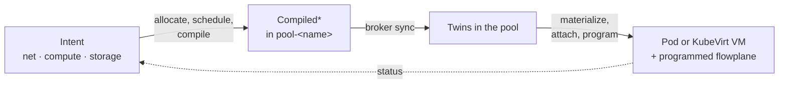
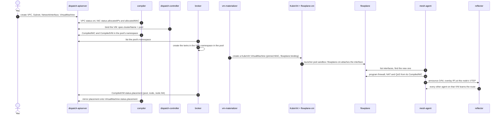

# From intent to a running workload

Every request in ectobase takes the same path: you write intent on the dispatch, the
compiler lowers it into `Compiled*` objects for one pool, the broker (`dispatch-broker`) copies them into that
pool, and the materializers and the agent make them real. Status then flows back the
other way. This page follows one VM through that path and explains why each stage exists.

## The life of a request

The sequence below creates a VPC, a `NetworkInterface` and a `VirtualMachine` that names
it, with no `spec.clusterName`, so the dispatch picks the pool.

The CNI and the agent both talk to flowplane over its node-local `DataplaneNode` gRPC. The
CNI attaches the interface once, when the sandbox is created; the agent keeps the
interface's policy and the node's routes converged for as long as it runs.

## The stages

### 1. Intent

You write objects in four of the five API groups on the dispatch (`net`, `compute`,
`storage` and `platform`); [CRD interactions](../reference/crd-interactions.md) lists every
kind and how they relate. Intent says what you want, a VPC, an interface in it, a VM that
owns the interface, and nothing about which node does what.

The fifth group, `compiled.ectobase.dev`, is output only. The compiler writes it; you
don't.

### 2. Allocate and schedule

Before anything can be compiled, two kinds of decisions are made centrally.

- The compiler's allocators fill in status: a fleet-wide VNI for each VPC, overlay IPs and
  a VPC-unique MAC for each `NetworkInterface`, and public addresses from an `IPPool` for
  load balancers and NAT gateways. You can pin any of these in the spec instead.
- The dispatch-controller binds each workload with an empty `spec.clusterName` to a
  `Ready` pool with room for its resource requests. It picks the pool only; the node
  inside the pool is chosen later by kube-scheduler or KubeVirt.

These decisions live on the dispatch because they need a fleet-wide view. A VNI or an IP
must be unique across every pool, and placement has to see every pool's capacity.

### 3. Compile

The compiler lowers intent into `Compiled*` objects:

| Compiled kind | From | Holds |
|---|---|---|
| `CompiledNIC` | one `NetworkInterface` | VNI, overlay IPs, MAC, the interface's firewall rules in match order, egress NAT sources, LB memberships, peer-VPC imports, QoS caps |
| `CompiledVM` | one `VirtualMachine` | image, resources, run strategy, interfaces with their MACs, cloud-init, the volume attachments it needs |
| `CompiledVolumeAttachment` | one `Volume` attached to one VM | size, storage class, boot image, and the disk's CSI identity once known |
| `CompiledContainer` | one `Container` | the pod template, cluster and optional node, interfaces |

Each object is written into the namespace of the pool it is placed on, `pool-<name>`.
Compiling waits on two gates. A
`NetworkInterface` compiles only after its addresses are allocated for the current spec,
so a pool never sees provisional addresses. And nothing compiles without a pool, because
there would be no namespace to put it in.

Compiling once, centrally, means a node never interprets policy. Firewall priorities,
which load balancers an interface backs, NAT port ranges and peering imports are all
resolved into the `CompiledNIC`. The agent is only allowed to read `CompiledNIC`s, and the
compiled group never refers back to the intent groups, so a pool needs nothing else.

### 4. Sync

Each pool's broker runs a set-reconcile per compiled kind. It lists the twins in its
`pool-<name>` namespace on the dispatch, lists its local copies, and makes them match:
create what is missing, update what drifted, delete what is no longer wanted. Each copy
lands in its source namespace, the namespace the VM or container was created in.

A pass runs on every change in the pool namespace, at startup, and once a minute. It keeps
no state between passes, so a restarted broker converges from the live sets alone.

The broker is a separate stage so the pool pulls rather than the dispatch pushes. A pool
holds RBAC for its own namespace only, keeps working from its local copy when the dispatch
is unreachable, and needs no inbound connection from the dispatch.

### 5. Materialize, attach and program

Inside the pool, three consumers act on the twins.

- The vm-materializer turns a `CompiledVM` into a KubeVirt `VirtualMachine`, with each
  interface's MAC pinned and the `flowplane` network binding. It waits until every volume
  attachment the VM needs has arrived. The pod-materializer does the same for a
  `CompiledContainer`, producing a Pod.
- flowplane-cni runs when the Pod or the VM's launcher pod gets its sandbox. It finds the
  `CompiledNIC` (by annotation for a container, by MAC for a VM) and asks flowplane to
  attach the interface.
- The mesh-agent sees the new interface on its node, matches it to its `CompiledNIC` by VNI
  and overlay IP, and programs its firewall, egress NAT and QoS state. It then announces
  the interface's address on the route bus. For each load balancer the interface backs, it
  announces the LB address too, which the WAN edges program.

[Workloads](workloads.md) covers the container and VM paths in more detail.

### 6. Status flows back

Apart from its own route-bus certificate request, the broker writes only status, and only
on its own pool's objects. Everything it reports lands on the dispatch, and the compiler
mirrors what users need onto the intent objects.

| Reported by | Lands on | Mirrored onto |
|---|---|---|
| broker heartbeat | `ClusterPool` lease and allocatable capacity | pool phase (`Ready`, `Unknown`), set by the dispatch-controller |
| broker | `ClusterPool` node `/64` prefixes and drain state | used by failover and fencing |
| broker | `CompiledVM` `status.placement` (pool, node, node `/64`) | `VirtualMachine` `status.placement` |
| broker | `CompiledVM` `status.released` | gates the start of a VM on its next pool |
| broker | `CompiledVolumeAttachment` disk identity | `Volume` `status.diskIdentity` |

## Editing and deleting

An edit flows through the same path: the compiler recompiles, the broker updates the
twin, and the agent reconverges. An edit that leaves a `NetworkInterface` unallocatable,
say a bad IP or a deleted subnet, does not tear anything down. The interface keeps its
last good `CompiledNIC` until a valid edit lands, so a typo can't cut a running workload
off. To revoke an interface, delete the `NetworkInterface`; a finalizer removes its twin.

Changing a VM's `spec.clusterName` is a [planned move](../architecture/vm-moves.md). The
compiler retires the old twin and compiles nothing into the new pool until the old pool
reports the VM released.

## Where to go next

- [Workloads](workloads.md): containers, VMs and the shared NIC model.
- [Multi-cluster orchestration](../architecture/multi-cluster.md): the broker and scheduler in depth.
- [Your first VPC](../guides/first-vpc.md): walk this path on the lab.
