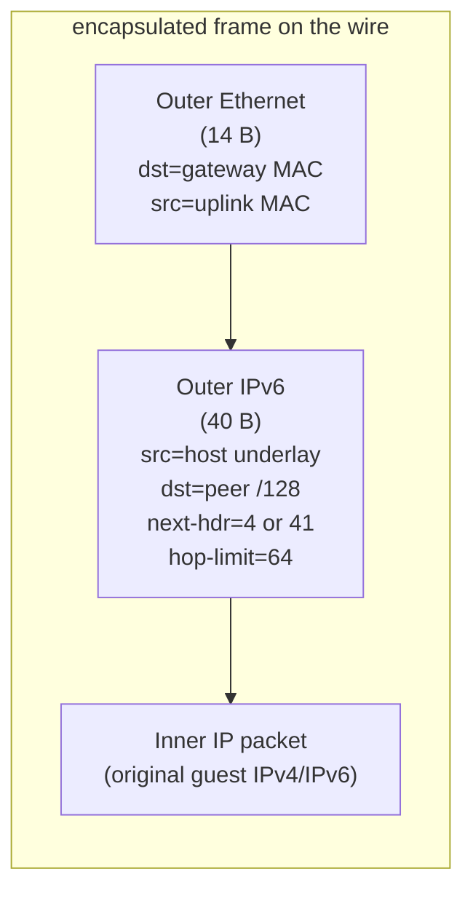

# The overlay: IPv6 underlay + IP-in-IPv6

Every ectobase workload gets an **overlay** address (IPv4 and/or IPv6) that is meaningful
only within its tenant. Overlay packets travel between hosts encapsulated inside an
**IPv6 underlay** — the physical/fabric network that connects the hypervisors. The
datapath encapsulates guest traffic on egress and decapsulates it on the receiving host.

## The underlay

The underlay is a routed IPv6 fabric. Each hypervisor has a stable underlay IPv6 identity
(typically a `/128` on a `lo`/`dummy` fabric loopback, announced into the fabric). That
identity is:

- the **outer source** address the host stamps on every encapsulated frame, and
- the base of the **`/64` pool** from which the host allocates a per-interface underlay
  `/128` for each workload it hosts.

Crucially, each *interface* — not just each host — has its own underlay `/128`. That
per-interface `/128` is the interface's identity on the underlay: it is the outer
destination other hosts encapsulate toward, and it uniquely identifies the interface and
its VNI on arrival. This is what lets overlapping overlay IPv4 ranges coexist across
tenants (see [multi-VNI tenancy](#multi-vni-tenancy)).

## IP-in-IPv6 encapsulation

An overlay packet is wrapped in an outer **Ethernet + IPv6** header. There is no
additional tunnel shim — the inner IP packet is carried directly as the IPv6 payload,
selected by the outer IPv6 **next-header** field:

| Inner packet | Outer IPv6 next-header |
|---|---|
| IPv4 | **4** (IP-in-IP) |
| IPv6 | **41** (IPv6-in-IPv6) |

The outer frame laid down by the encap writer is:

The outer Ethernet next-hop MAC is a single configured underlay gateway/ToR MAC used for
**all** encapsulated traffic; L3 routing on the fabric handles delivery from there. The
outer IPv6 `payload_length` is derived from the packet's **logical** length (`skb->len`
on tc contexts), so a non-linear skb encapsulates with the correct outer length rather
than a truncated one.

Concretely, encap prepends `IPV6_LEN` (40) bytes of headroom via
`bpf_xdp_adjust_head`/`adjust_room`, then writes the outer Ethernet and IPv6 headers in
place; decap does the reverse — strips the outer 40 bytes and rewrites the inner
Ethernet for local delivery. The header-writing logic lives in
[`flowplane-core`](../architecture/dataplane/pure-core.md) (`encap::write_outer_v6`,
`uplink::decap_and_rewrite`) so the exact same byte layout is produced in the kernel and
in the simulator.

## Egress: guest → fabric

When a guest emits a packet, the guest-edge program (`tc_guest_tx`) on the host-side
veth/tap ingress:

1. applies the **firewall** (deny-by-default) and, if configured, **SNAT/VIP** rewrites
   and **rate metering**;
2. looks up the inner destination in the per-VNI **route** table (`ROUTES` for IPv4,
   `ROUTES6` for IPv6) to find the next-hop underlay `/128`;
3. either takes the **same-host fast path** (below) or **encapsulates** and redirects the
   frame out the fabric uplink.

## Ingress: fabric → guest

On the receiving host, `uplink_rx` (XDP on the fabric uplink):

1. matches the **outer IPv6 destination** against the `UNDERLAY` map to resolve the
   destination interface, its VNI, tap ifindex, and guest MAC (this disambiguates
   overlapping overlay IPv4 across VNIs — the resolution keys on the underlay `/128`, not
   the inner IP);
2. applies firewall + conntrack, and any LB/NAT return rewrites;
3. **decaps** (strips the outer header), rewrites the inner Ethernet for the guest, and
   redirects to the guest tap.

See [Datapath programs](../architecture/dataplane/programs.md) for the full per-program breakdown,
including the LB reforward and NAT-return branches.

## Same-host fast path

When the destination interface lives on the **same host** as the source, the datapath
skips the encap/decap round trip entirely: the guest-edge egress program resolves the
destination to a local tap and redirects the inner frame directly, avoiding a pointless
trip through the outer IPv6 header. This keeps intra-host guest-to-guest traffic on a
short in-kernel redirect.

## Multi-VNI tenancy

Every overlay is scoped by a **VNI** (a 32-bit virtual network identifier). VNIs provide
tenant isolation: overlay IP ranges may overlap freely across VNIs because every map key
that could otherwise collide is VNI-qualified. Specifically:

- **routes** are keyed by `(VNI, prefix)` — the `ROUTES`/`ROUTES6` LPM tries prepend the
  VNI to the address bits, so a `/32` lookup is really a `(VNI ++ IPv4)` lookup;
- **interface resolution** on ingress is by the unique underlay `/128`, which carries the
  VNI in its `UNDERLAY` entry;
- **conntrack, NAT, VIP, and firewall** keys are all VNI-qualified.

A VNI corresponds to a `VPC` in the CRD API. Cross-VNI reachability is *not* implicit —
it is granted explicitly via [VPC peering](../features/vpc-peering.md) (control-plane
route import with local-VNI precedence; no datapath change) and still subject to the
deny-by-default [firewall](../features/firewall.md).

## Where to go next

- [Datapath programs](../architecture/dataplane/programs.md) — the programs that implement encap/decap.
- [BPF maps & state model](../architecture/dataplane/maps.md) — `ROUTES`, `UNDERLAY`, `INTERFACES`, …
- [Routing & multi-VNI tenancy](../features/routing-vni.md) — the routing feature in depth.
