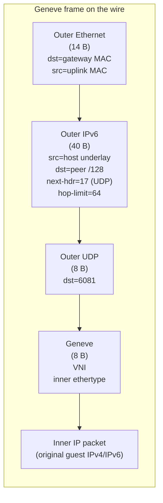

# The overlay: Geneve over an IPv6 underlay

Every ectobase workload gets an overlay address (IPv4 and/or IPv6) that is meaningful
only within its tenant. Overlay packets travel between hosts as Geneve frames over an
IPv6 underlay — the physical/fabric network that connects the hypervisors. On egress the
datapath stamps a Geneve tunnel key and hands the packet to a kernel `collect_md` Geneve
device, which builds the outer header; on the receiving host the kernel strips that header
before the datapath delivers the inner frame.

## The underlay

The underlay is a routed IPv6 fabric. Each hypervisor has a stable underlay IPv6 identity
(typically a `/128` on a `lo`/`dummy` fabric loopback, announced into the fabric). That
identity is:

- the outer source address on every Geneve frame the host sends, and
- the outer destination other hosts send toward to reach any workload it hosts.

That single address is the node's VTEP, and it is the underlay for **every** interface on
the node — no per-endpoint `/128` is allocated. Geneve is what makes that possible: the VNI
travels in the tunnel header, so the outer destination only has to identify the *node*, and
the receiving host resolves the specific interface by demuxing `(VNI, inner destination)`
against its `INTERFACES` maps. Overlapping overlay IPv4 ranges coexist across tenants for the
same reason (see [multi-VNI tenancy](#multi-vni-tenancy)).

The older design gave each interface its own underlay `/128` carved from the host's `/64`,
because a bare IP-in-IPv6 outer header carried no VNI and the destination address had to do
that work itself. The host's `/64` remains meaningful as the **fence coordinate** — failover
fences a whole node by its prefix — but it is no longer an endpoint-addressing unit.

## Geneve encapsulation

An overlay packet is wrapped in an outer Ethernet + IPv6 + UDP + Geneve header — 56 bytes
of overhead (outer IPv6 40 + UDP 8 + Geneve 8; the outer Ethernet is link framing on the
fabric NIC). The outer IPv6 next-header is `17` (UDP); the Geneve header carries the VNI
and the inner frame's ethertype, so one encapsulation format carries both inner IPv4 and
inner IPv6.

The Geneve frame the kernel `collect_md` device builds on the wire is:

The kernel `collect_md` Geneve device builds the outer Ethernet, IPv6, and UDP headers
from the tunnel key and the fabric routing table; the datapath only supplies the VNI and
the remote underlay address. Outer length and checksums are the kernel's responsibility,
so a non-linear skb is encapsulated with the correct outer length rather than a truncated
one.

Concretely, the egress datapath stamps a Geneve tunnel key with `bpf_skb_set_tunnel_key`
and redirects the skb to the geneve device, which builds the outer header; on ingress the
kernel strips the outer header before the datapath runs, leaving only an inner-Ethernet
rewrite for local delivery. The encap decision lives in
[`flowplane-core`](../architecture/dataplane/pure-core.md) (`encap::tunnel_encap` on
egress, `decap::decap_and_rewrite` on ingress) so the same `(VNI, remote)` decision drives
the kernel and the simulator.

## Egress: guest → fabric

When a guest emits a packet, the guest-edge program (`tc_guest_tx`) on the host-side
veth/tap ingress:

1. applies the firewall (deny-by-default) and, if configured, SNAT/LB address rewrites and rate
   metering;
2. looks up the inner destination in the per-VNI route table (`ROUTES` for IPv4, `ROUTES6`
   for IPv6) to find the next-hop node VTEP and the VNI to deliver under;
3. either takes the same-host fast path (below) or stamps the Geneve tunnel key and
   redirects the frame to the geneve device, which builds the outer header and transmits.

## Ingress: fabric → guest

On the receiving host the kernel `collect_md` device decaps the outer header first, then
`uplink_rx` (a tc classifier on the geneve device) runs:

1. reads the VNI from the Geneve header via `bpf_skb_get_tunnel_key`, then resolves
   `(VNI, inner destination)` in the `INTERFACES` map to the destination interface, its tap
   ifindex, and guest MAC (a VNI-qualified lookup, so overlapping overlay IPv4 across VNIs
   stays disambiguated);
2. applies firewall + conntrack, and any LB/NAT return rewrites;
3. rewrites the inner Ethernet for the guest and redirects to the guest tap (the outer
   header is already gone).

See [Datapath programs](../architecture/dataplane/programs.md) for the full per-program breakdown,
including the LB reforward and NAT-return branches.

## Same-host fast path

When the destination interface lives on the same host as the source, the datapath skips
the geneve device entirely: the guest-edge egress program resolves the destination to a
local tap and redirects the inner frame directly, so intra-host guest-to-guest traffic
never touches the Geneve encap path and stays on a short in-kernel redirect.

## Multi-VNI tenancy

Every overlay is scoped by a VNI (a 32-bit virtual network identifier). VNIs provide
tenant isolation: overlay IP ranges may overlap freely across VNIs because every map key
that could otherwise collide is VNI-qualified. Specifically:

- routes are keyed by `(VNI, prefix)` — the `ROUTES`/`ROUTES6` LPM tries prepend the VNI
  to the address bits, so a `/32` lookup is really a `(VNI ++ IPv4)` lookup;
- interface resolution on ingress is by `(VNI, inner destination)` in `INTERFACES`, with
  the VNI taken from the Geneve header;
- conntrack, NAT, LB address, and firewall keys are all VNI-qualified.

A VNI corresponds to a `VPC` in the CRD API. Cross-VNI reachability is not implicit: it is
granted explicitly via [VPC peering](../features/vpc-peering.md) (control-plane route
import with local-VNI precedence; no datapath change) and still subject to the
deny-by-default [firewall](../features/firewall.md).

## Where to go next

- [Datapath programs](../architecture/dataplane/programs.md) — the programs that implement encap/decap.
- [BPF maps & state model](../architecture/dataplane/maps.md) — `ROUTES`, `UNDERLAY`, `INTERFACES`, …
- [Routing & multi-VNI tenancy](../features/routing-vni.md) — the routing feature in depth.
