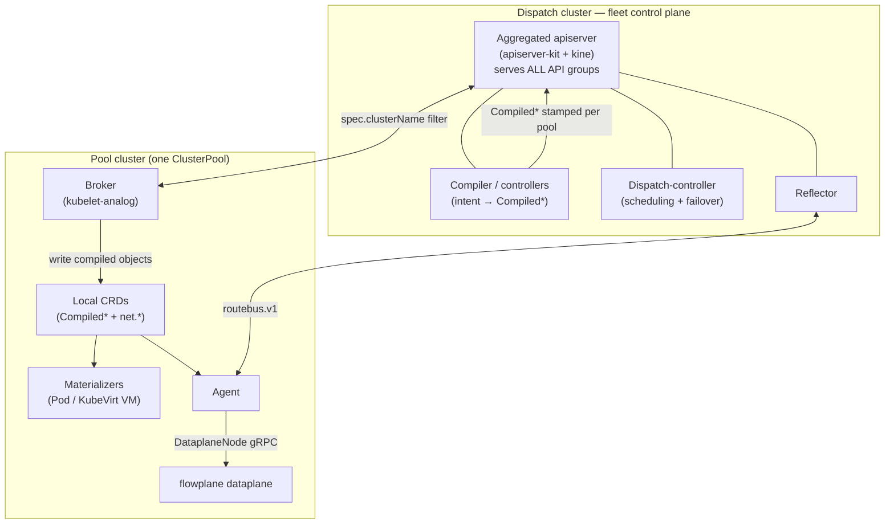

# Two planes and the fleet

ectobase is built from **two planes** and organized as a **fleet**. The mental model is worth
internalizing before anything else, because every other concept hangs off it.

- **flowplane** — the **dataplane**. What moves packets.
- **netplane** — the **control plane**. What decides where packets should go and programs the
  dataplane accordingly.
- **the fleet (dispatch + pools)** — how a single API serves many clusters at once.

## flowplane: the dataplane

flowplane is a Rust eBPF/XDP dataplane. It is deliberately *dumb*: it holds no policy and makes no
distributed decisions. Every forwarding action is a **per-flow-keyed BPF map lookup**, and all the
state those maps hold is decided elsewhere and pushed down. It attaches XDP to the fabric uplink and
`tc`/`tcx` to guest edges, and forwards guest traffic over an
[IP-in-IPv6 overlay](overlay.md) on a routed IPv6 fabric.

Each node runs one `flowplane` process. It exposes a small local gRPC surface (`DataplaneNode`, on
`127.0.0.1:1337`) that the control plane calls to program interfaces, and it participates in the
[route bus](../architecture/route-bus.md) to learn which overlay prefix lives behind which underlay
node. A byte-parity [DPDK backend](../architecture/dataplane/dpdk.md) implements the same datapath on
the `nfkit` substrate for hardware acceleration.

!!! success "Status: Implemented"
    The eBPF/XDP datapath — routing, stateful NAT, Maglev load balancing with DSR, deny-by-default
    firewall, DHCP/ARP/ND responders, QoS/EDT shaping, and NAT64 — runs on the shared IPv6 overlay.

## netplane: the control plane

netplane is a Go control plane built on controller-runtime. It turns a small set of user-facing CRDs
into concrete, fully lowered per-NIC dataplane configuration and distributes the dynamic parts of the
overlay. Its pieces:

- **controllers / the compiler** — reconcile user intent (`VPC`, `NetworkInterface`,
  `FirewallPolicy`, `LoadBalancer`, `NATGateway`, `FloatingIP`, `VPCPeering`, `VirtualMachine`,
  `Container`, `Volume`) into `Compiled*` objects.
- **the agent** — runs per node and programs the local dataplane. It reads **only** `CompiledNIC`
  objects (never the raw CRDs) plus node-local facts from the dataplane, keeping the node footprint
  small.
- **the reflector** — a metalbond-style pub/sub RIB that distributes overlay routes over the route
  bus. This is **not** BGP in the hot path; BGP appears only at the
  [WAN edge](../features/ns-edge.md).

## The fleet: dispatch and pools

A single **dispatch** cluster fronts the API for many **pool** clusters. This is what makes ectobase
multi-cluster: you author intent once, against the dispatch, and it lands wherever the workload is
scheduled.

### The dispatch serves the API; it holds no CRDs

The dispatch runs an **aggregated apiserver** (built on the apiserver-kit toolkit, backed by
[kine](https://github.com/k3s-io/kine) rather than etcd) that serves **all** of ectobase's API
groups — `net.ectobase.dev`, `compute.ectobase.dev`, `storage.ectobase.dev`,
`compiled.ectobase.dev`, and `platform.ectobase.dev`. Crucially, these are *aggregated API types*,
not CustomResourceDefinitions installed on the dispatch. The dispatch is the single write surface for the whole
fleet. Alongside the apiserver it runs the compiler, the dispatch-controller (scheduling and failover),
and the reflector.

### A pool is a real cluster with real CRDs

Each **pool** is registered as a `ClusterPool` (`platform.ectobase.dev`) and is a genuine Kubernetes
cluster running the dataplane. Its **broker** is a kubelet-analog: it watches the compiled objects in
the dispatch apiserver **filtered by `spec.clusterName`** and set-reconciles them onto the pool's
**downstream apiserver as ordinary CRDs**. Where the dispatch has aggregated types, the pool has the
concrete CRDs the broker writes into. Once written, the pool's **materializers** turn compiled
objects into Pods and KubeVirt VMs, and the **agent** programs `CompiledNIC` into flowplane.

So the split is precise:

| | Dispatch | Pool |
|---|---|---|
| API types | Aggregated apiserver, **no CRDs** | Real **CRDs** |
| Storage | kine | the pool's own etcd |
| Role | Author + compile + schedule for the whole fleet | Run the dataplane, materialize workloads |
| Key components | apiserver, compiler, dispatch-controller, reflector | broker, materializers, agent, flowplane |

## Where each piece runs

| Layer | Language | Runs on | As |
|---|---|---|---|
| Dataplane (flowplane) | Rust (`#![no_std]` eBPF) | every pool node | XDP on uplink, `tcx` on guest edges |
| Agent | Go | every pool node | programs the local dataplane over gRPC |
| Broker + materializers | Go | each pool | syncs compiled objects; creates Pods/VMs |
| Aggregated apiserver | Go | dispatch | serves all API groups (kine-backed) |
| Compiler / dispatch-controller / reflector | Go | dispatch | compile, schedule/failover, route distribution |

## Where to go next

- [The overlay](overlay.md) — the IPv6 underlay and IP-in-IPv6 wire format the dataplane speaks.
- [Intent to datapath](intent-to-datapath.md) — the reconcile loop from CRD to programmed dataplane.
- [Multi-cluster control plane](../architecture/multi-cluster-control-plane.md) — the dispatch/pool design in depth.
