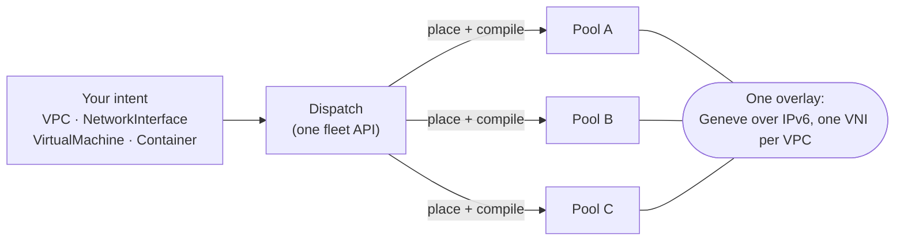

# What ectobase is

ectobase runs containers and KubeVirt virtual machines across a fleet of Kubernetes
clusters, behind one API and on one overlay network. This page covers the problem it
solves, the core idea, what it deliberately does not do, and the vocabulary the rest of
the docs use.

## The problem

Kubernetes gives you one cluster. Once you run workloads on several clusters, for
capacity, for failure isolation, or because a site has its own hardware, every cluster
brings its own API, its own pod network and its own addresses. Connecting a VM in one
cluster to a database in another takes extra machinery: VPNs, gateways, address
translation, or a service mesh. Moving that VM to a different cluster changes its address,
and anything that pointed at it has to follow.

ectobase treats the clusters as one pool of capacity. The cluster a workload runs on is a
placement decision, not part of its identity.

## The core idea

ectobase rests on three ideas.

- One fleet API: you write intent (a `VPC`, a `NetworkInterface`, a `VirtualMachine`,
  a `Container`, a `LoadBalancer` and so on) once, against the dispatch. You never talk
  to an individual cluster.
- Many pools: each compute cluster is a pool. The dispatch places every workload on a
  pool, by resource fit or by your explicit choice, and that pool turns it into a real Pod
  or KubeVirt VM.
- One overlay: every node in every pool runs the same eBPF dataplane and shares one
  Geneve overlay on a routed IPv6 fabric. A VPC has one VNI fleet-wide, so its workloads
  reach each other no matter which pool they run in.

Because an overlay address belongs to the `NetworkInterface` and not to the cluster, it
survives a change of pool. The address allocator works per VPC and has no cluster
dimension, the VNI comes from the VPC, and the MAC is derived from the interface. When a VM
moves to another pool, on purpose or because its pool failed, it keeps its overlay IP, MAC
and VNI. If it has a persistent disk, it keeps that too: the target pool binds the same
Ceph RBD image.

## What you get

| Area | What ectobase provides | Where it's covered |
|---|---|---|
| Workloads | `Container` and `VirtualMachine`, both scheduled onto pools | [Workloads](workloads.md) |
| Networking | VPCs, subnets, interfaces, routing, firewall, NAT, load balancing, VPC peering, QoS, DHCP/ARP/ND | [Routing and VNIs](../features/routing-vni.md) |
| Reaching the outside | WAN edges that announce public prefixes and carry N/S traffic | [The WAN edge](../features/ns-edge.md) |
| Storage | Persistent RBD-backed `Volume`s for VMs, whose disk follows the VM between pools | [Storage and VMs](../architecture/storage-and-vms.md) |
| Resilience | Fence-gated failover of a lost pool, and planned VM moves between pools | [Failover](../architecture/failover.md), [VM moves](../architecture/vm-moves.md) |

## What ectobase is not

Knowing the boundaries saves time. All but the last one are deliberate.

- It doesn't replace the pool's cluster network. ectobase workloads attach to the overlay
  as a Multus secondary network. Each pool keeps its own primary CNI, and the overlay
  interface is added next to it.
- It doesn't stretch one cluster across sites. Each pool is an independent Kubernetes
  cluster with its own control plane. A pool works from a local copy of its compiled
  objects, so a short loss of contact with the dispatch doesn't stop its workloads. A pool
  that stays unreachable is failed over.
- It doesn't use BGP for overlay routes. They travel over ectobase's own route bus. The
  underlay only has to route IPv6 to each node's VTEP; how it does that is up to the
  fabric (the lab uses eBGP).
- It isn't a storage system. VM disks come from Ceph through ceph-csi and CDI. ectobase
  tracks which disk belongs to which `Volume` and fences storage during failover, but it
  doesn't provide the storage.
- It doesn't live-migrate VMs. A VM move is break-before-make: the VM stops on the source
  pool, and the target starts it only after the source has let go of it. Established
  connections reset.

!!! note "Status: Planned"
    Live migration of a running VM between pools is a goal, not a feature. It needs
    connection-tracking state to move with the VM and a cross-cluster handover that
    KubeVirt doesn't provide today.

## Vocabulary

These terms mean the same thing on every page. Each links to the page that covers it.

[Dispatch](fleet.md)
:   The fleet control plane: one Kubernetes cluster running the dispatch-apiserver (an
    aggregated apiserver backed by kine and postgres), the compiler, the
    dispatch-controller and the reflector.

[Pool](fleet.md)
:   A compute cluster, registered on the dispatch as a `ClusterPool`. The dispatch keeps a
    pool's compiled objects in the namespace `pool-<name>`.

[Intent](intent-to-running.md)
:   The objects you write: `VPC`, `Subnet`, `NetworkInterface`, `FirewallPolicy`,
    `LoadBalancer`, `NATGateway`, `VirtualMachine`, `Container`, `Volume` and the rest.
    Intent says what you want, not how a node achieves it.

[Compiler](intent-to-running.md)
:   The `mesh-controller` on the dispatch. It allocates addresses and VNIs, and lowers
    intent into `Compiled*` objects for one pool.

[Twin](intent-to-running.md)
:   A `Compiled*` object in its pool's namespace on the dispatch, together with the copy
    the broker keeps of it in the pool.

[Broker](../architecture/multi-cluster.md)
:   Runs in each pool. It syncs that pool's twins down from the dispatch and reports status
    (lease, capacity, VM placement, disk identity, releases) back up.

[Materializer](workloads.md)
:   The `pod-materializer` and `vm-materializer` in each pool. They turn a
    `CompiledContainer` into a Pod and a `CompiledVM` into a KubeVirt `VirtualMachine`.

[Agent](../architecture/route-bus.md)
:   `mesh-agent`, one per node and one on each WAN edge. It programs the local flowplane
    from `CompiledNIC`s and announces and learns overlay routes on the route bus.

[Reflector](../architecture/route-bus.md)
:   The route-bus hub on the dispatch. Every agent in every pool keeps one session to it.

[Route bus](../architecture/route-bus.md)
:   How overlay routes are distributed: each agent announces the overlay addresses it
    hosts, and the reflector passes them to every agent subscribed to that VNI.

[flowplane](../architecture/dataplane/index.md)
:   The eBPF dataplane, written in Rust. It runs on every pool node and on each WAN edge.

[VTEP](../architecture/overlay.md)
:   A node's tunnel endpoint: one `/128` underlay IPv6 address per node, shared by every
    interface on that node.

[VNI](../features/routing-vni.md)
:   The virtual network identifier carried in the Geneve header. Each VPC has one,
    allocated fleet-wide, and it keeps tenants' address ranges apart.

[Fence](../architecture/failover.md)
:   A barrier around a node's `/64` underlay prefix (or a pool's whole underlay prefix): a
    route fence in the reflector plus a Ceph `NetworkFence` on storage. Failover fences a
    pool before it reschedules anything from it.

[Drain](../architecture/failover.md)
:   A pool's report that a fenced `/64` no longer hosts a stale VM. A fence is released
    only once its prefix is drained.

[Release](../architecture/vm-moves.md)
:   The point at which a pool has let go of a VM: no KubeVirt VM, VMI, launcher pod or disk
    claim left. For a lost pool, failover marks the VM released once the pool is fenced.
    A VM starts on its next pool only after the old one released it.

[Failover](../architecture/failover.md)
:   What the dispatch does when a pool stays unreachable: fence it, then rebind its VMs to
    healthy pools.

[Planned move](../architecture/vm-moves.md)
:   A change of a VM's `spec.clusterName` while both pools are healthy.

## Where to go next

- [The fleet: dispatch and pools](fleet.md): what runs where, and why.
- [From intent to a running workload](intent-to-running.md): the life of a request.
- [Bring up the lab](../guides/lab.md): run the whole thing locally.
