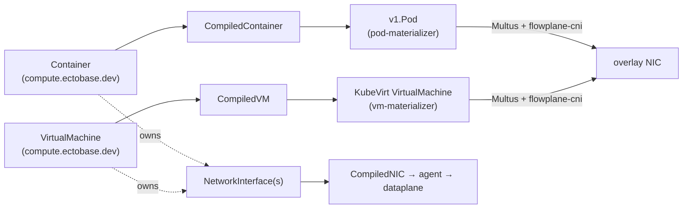

# Workloads: containers and VMs

ectobase treats **containers** and **KubeVirt virtual machines** as first-class, co-equal workloads.
Both are authored as declarative intent, compiled, synced to a pool, and materialized into a real
Kubernetes object — and both attach to the **same overlay NIC model**. A workload does not know or
care whether its neighbor on the overlay is a container or a VM; they share VNIs, routes, firewall,
LB, and NAT identically.

The two paths mirror the [intent → compiled → materialized](intent-to-datapath.md) loop:

## The shared NIC model

A workload references one or more `NetworkInterface` objects it **owns**. The workload's placement —
its `ClusterName` (and, for containers, `NodeName`) — is the **authority** for where those NICs live:
the compiler propagates that binding onto each owned `CompiledNIC`, so a NIC is always materialized
and programmed on the same cluster/node as the workload that owns it. Whichever workload type it
belongs to, a NIC becomes a `CompiledNIC` that the agent programs into flowplane, and the workload's
Pod or VM is wired to that overlay interface via **Multus + flowplane-cni** at sandbox-creation time.

## Containers

!!! success "Status: Implemented"
    The container path — `Container` → `CompiledContainer` → `v1.Pod` on the overlay — is built and
    exercised end-to-end.

A `Container` (in the `compute.ectobase.dev` group) is a schedulable container workload: it owns
`NetworkInterface`s and carries a pod template (image, command, args). Its placement fields
(`ClusterName`, `NodeName`) are the placement authority for the NICs it owns.

The compiler lowers a `Container` into a `CompiledContainer`. The **pod-materializer** then creates a
`v1.Pod` from it: a pod attached to the flowplane overlay via the Multus secondary-network annotation
and the `net.ectobase.dev/network-interface` annotation that flowplane-cni resolves to the
broker-synced `CompiledNIC`. The pod is pinned to its target node with a `nodeSelector`.

!!! note
    In the current model a `Container`'s placement (`ClusterName`/`NodeName`) is set explicitly.
    There is no automatic container scheduler binding it to a pool yet.

## Virtual machines

!!! warning "Status: Partial"
    The VM path — `VirtualMachine` → `CompiledVM` → KubeVirt VM — is built, and the tap-based overlay
    datapath for VMs is proven. Some of the surrounding KubeVirt control-plane integration (for
    example the network-binding plugin registration and persistent-volume boot flow on a live pool)
    is still being completed; validate against your target pool before relying on it.

A `VirtualMachine` (also `compute.ectobase.dev`) owns `NetworkInterface`s and, optionally,
`Volume`s, and carries compute resources plus boot intent (a containerDisk `Image` or persistent
volumes, and a KubeVirt `RunStrategy`). Its `ClusterName` is the placement anchor for its NICs.

Unlike containers, VMs are **scheduled**: the hub-controller binds an unbound `VirtualMachine` to a
`ClusterPool` that fits its resource requests before compilation proceeds. The compiler then lowers
the VM into a `CompiledVM` (and its interfaces into `CompiledNIC`s carrying the same cluster binding).

The **vm-materializer** turns a `CompiledVM` into a KubeVirt `kubevirt.io/v1.VirtualMachine` with
pinned-MAC overlay interfaces on the flowplane Multus network, attached through a KubeVirt
**network-binding plugin** (`flowplane`) that wires the overlay via a **tap** device. Boot disks come
from CDI `DataVolume`s when the VM references persistent `Volume`s (an RBD-backed boot disk first,
then data disks); with no volumes it falls back to an ephemeral containerDisk from the VM's `Image`.

## Containers vs VMs at a glance

| | Container | VirtualMachine |
|---|---|---|
| API kind | `Container` (`compute.ectobase.dev`) | `VirtualMachine` (`compute.ectobase.dev`) |
| Compiled form | `CompiledContainer` | `CompiledVM` (+ `CompiledVolumeAttachment`) |
| Materialized as | `v1.Pod` | KubeVirt `VirtualMachine` |
| Overlay attach | Multus + flowplane-cni (veth) | KubeVirt binding plugin + flowplane-cni (tap) |
| Placement | explicit `ClusterName` / `NodeName` | scheduled onto a `ClusterPool` by the hub-controller |
| Boot / image | container image | containerDisk `Image` or CDI `DataVolume` (RBD) |
| Status | Implemented | Partial |

## Where to go next

- [Intent to datapath](intent-to-datapath.md) — the compile/sync/materialize loop these paths follow.
- [KubeVirt / VM integration](../architecture/kubevirt-integration.md) — the VM binding plugin and tap datapath.
- [CNI integration](../architecture/cni-integration.md) — how Multus + flowplane-cni attach the overlay NIC.
- [Storage / CSI integration](../architecture/storage-csi-integration.md) — the RBD/CDI boot-volume path.
