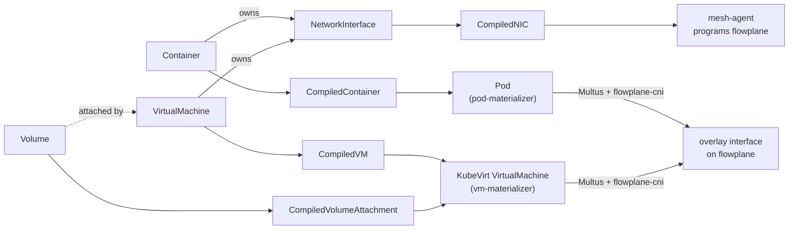

# Workloads: containers and VMs

ectobase runs two kinds of workload: a `Container`, which becomes a Pod, and a
`VirtualMachine`, which becomes a KubeVirt VM. Both are scheduled onto a pool the same way,
and both reach the overlay through the same object, a `NetworkInterface`. This page covers
that shared NIC model, then each workload kind, and how the two compare.

```mermaid
flowchart LR
    nic["NetworkInterface"] --> cnic["CompiledNIC"] --> agent["mesh-agent<br/>programs flowplane"]

    ctr["Container"] -->|owns| nic
    vm["VirtualMachine"] -->|owns| nic
    vol["Volume"] -.->|attached by| vm

    ctr --> cctr["CompiledContainer"] --> pod["Pod<br/>(pod-materializer)"]
    vm --> cvm["CompiledVM"] --> kv["KubeVirt VirtualMachine<br/>(vm-materializer)"]
    vol --> cva["CompiledVolumeAttachment"] --> kv

    pod & kv -->|"Multus + flowplane-cni"| fp["overlay interface<br/>on flowplane"]
```

## The shared NIC model

A `NetworkInterface` is a workload's identity on the overlay. It belongs to a VPC, and
it carries everything that should stay the same wherever the workload runs.

| Field | What it holds |
|---|---|
| `spec.vpcRef`, `spec.subnetRef` | The VPC and the subnet to allocate from. The subnet is optional when the VPC has exactly one. |
| `spec.ips` | Optional. Requested overlay IPs; empty means the platform allocates them. |
| `spec.mac` | Optional. A requested MAC; empty means the platform derives a stable, VPC-unique one. |
| `spec.qos` | Optional egress shaping and ingress policing caps. |
| `status.vni`, `status.allocatedIPs`, `status.allocatedMAC` | What the platform actually assigned. These, not the spec, are what gets compiled. |

A workload claims its interfaces by name in `spec.interfaceRefs`, in the same namespace.
The interface follows its owner: the compiler places each `CompiledNIC` on the owning
workload's pool. An interface with no owner can name a pool itself with `spec.clusterName`.

Policy attaches to interfaces, not to workloads. A `FirewallPolicy` selects interfaces by
label, and a `LoadBalancer` picks its backends by label selector or by name. Because a
container and a VM both end up as a `CompiledNIC`, they share VNIs, routes, firewall,
load balancing and NAT on equal terms. Neither can tell which kind its neighbor is.

!!! note
    To revoke a workload's network access, delete its `NetworkInterface`. An edit that
    makes the interface invalid keeps it on its last good configuration rather than
    cutting it off.

## Containers

A `Container` (`compute.ectobase.dev`) is a single-container workload. Its spec is a
small pod template: `image`, `command`, `args`, `env`, `resources`, `restartPolicy`, plus
`interfaceRefs`.

- Placement: leave `spec.clusterName` empty and the dispatch-controller binds the
  container to a `Ready` pool with room for its resource requests. Inside the pool,
  kube-scheduler picks the node, unless you pin one with `spec.nodeName`.
- Materialization: the pod-materializer turns the `CompiledContainer` into a Pod with two
  annotations, the Multus networks annotation and `net.ectobase.dev/network-interface`.
  flowplane-cni reads the second to find the `CompiledNIC` and attach the interface.
- Changing pools: edit `spec.clusterName` and the compiler moves the `CompiledContainer`
  to the new pool and drops the old one. Unlike a VM move, there is no release handshake
  between the two.
- Failover: when a pool is lost, failover rebinds VMs only. A container on a lost pool
  stays bound to it.

!!! warning "Status: Partial"
    A container gets one overlay interface. The `net.ectobase.dev/network-interface`
    annotation names a single interface, so only the first entry in `interfaceRefs` is
    attached.

## Virtual machines

A `VirtualMachine` (`compute.ectobase.dev`) owns interfaces and, optionally,
persistent `Volume`s. Its spec holds `resources`, a boot `image` (a containerDisk), a
KubeVirt `runStrategy`, optional `cloudInit` user data, `interfaceRefs` and `volumeRefs`.

- Placement: an unbound VM goes to a `Ready` pool that matches its optional
  `poolSelector` and fits its resource requests. Among the pools that fit, the scheduler
  picks the one with the most headroom. An `antiAffinity` group spreads VMs across pools
  when failover rebinds them; the first bind doesn't consult it.
- Materialization: the vm-materializer turns the `CompiledVM` into a KubeVirt
  `VirtualMachine`. Each interface gets its allocated MAC pinned and the `flowplane`
  network binding plugin, which attaches it through a tap device. KubeVirt creates the
  launcher pod itself, so flowplane-cni finds that pod's `CompiledNIC` by MAC.
- Disks: each attached `Volume` becomes a `CompiledVolumeAttachment`, and the
  vm-materializer turns that into a CDI `DataVolume` on Ceph RBD, boot disk first. A VM
  with no volumes boots from its containerDisk image. The materializer waits until every
  attachment the VM needs has arrived, so a VM never starts without its disks.
- Moving: change `spec.clusterName` and the VM [moves](../architecture/vm-moves.md) to the
  new pool. On pool loss, [failover](../architecture/failover.md) rebinds it.

!!! warning "Status: Partial"
    A VM gets one overlay interface. flowplane-cni finds the interface by the MAC in the
    launcher pod's Multus annotation and cannot tell several flowplane interfaces apart, so
    only single-interface VMs are supported.

### Volumes

A `Volume` (`storage.ectobase.dev`) is a persistent RBD disk: a `size`, an optional
`storageClass`, and an optional `bootImage` to import into it. The disk belongs to the
`Volume`, not to the pool it was first provisioned on. Once a pool provisions it, the
broker (`dispatch-broker`) reports the disk's CSI identity, and the compiler records it on the `Volume`'s
`status.diskIdentity`. When the VM lands on another pool, that pool binds the same RBD
image through a static PersistentVolume instead of provisioning a new one.
[Storage and VMs](../architecture/storage-and-vms.md) covers the details.

## Containers and VMs compared

| | `Container` | `VirtualMachine` |
|---|---|---|
| Compiled form | `CompiledContainer` | `CompiledVM`, plus a `CompiledVolumeAttachment` per volume |
| Materialized as | Pod | KubeVirt `VirtualMachine` |
| Pool choice | resource fit | resource fit, `poolSelector` |
| Node choice | kube-scheduler, or `spec.nodeName` | KubeVirt |
| Overlay attach | Multus + flowplane-cni, found by annotation | Multus + `flowplane` binding + flowplane-cni, found by MAC |
| Boot | container image | containerDisk image or a persistent `Volume` |
| On pool loss | stays bound | failed over to another pool |
| Change of `spec.clusterName` | recompiled into the new pool, no release handshake | break-before-make move, gated on release |

## Where to go next

- [Attaching workloads](../architecture/attaching-workloads.md): how flowplane-cni and the binding plugin wire an interface into flowplane.
- [Storage and VMs](../architecture/storage-and-vms.md): the RBD and CDI disk path, and how a disk follows its VM.
- [VMs across clusters](../guides/vms-across-clusters.md): run VMs on two pools and connect them.
