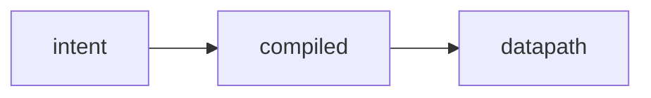

# Writing docs

The published documentation is the **living source of truth** for how ectobase works.
It is not a historical record and not an afterthought: any change that alters behaviour,
architecture, or the API updates the relevant page in the same change. Design specs and
plans live in git history, not in the docs tree.

## How the docs are built

The site is built with **mkdocs-material**:

```sh
make docs         # mkdocs build --strict — broken links / nav fail the build
make docs-serve   # mkdocs serve — live-reloading local preview
```

`--strict` means a dead internal link or a page missing from the nav fails the build, so
keep cross-references and `mkdocs.yml` nav in sync when you add or move a page. Pages live
under `docs/` in the tree that the nav mirrors (`concepts/`, `architecture/`,
`architecture/dataplane/`, `features/`, `guides/`, `reference/`, `testing/`,
`contributing/`).

## Diagrams: mermaid

Diagrams are **mermaid**, written inline in fenced ` ```mermaid ` blocks — no external
image files. mkdocs-material renders them at build time (via `pymdownx.superfences`):

````markdown

````

Prefer a mermaid diagram over prose when explaining a flow, a topology, or a pipeline;
it stays diffable and never goes stale as a binary asset.

## Status badges

Not every subject is fully shipped. Convey status with an admonition badge at the top of
the page (or the relevant section) so a reader knows how far to trust it:

```markdown
!!! success "Status: Implemented"
    Shipped and validated (e.g. in the lab or by a byte-parity anchor).

!!! warning "Status: Partial"
    Works with caveats or only on some paths — e.g. hardware-gated behaviour, or a feature
    proven on the lab fabric but not on real hardware.

!!! note "Status: Planned"
    Designed but not built.
```

Most of the eBPF datapath is **Implemented** and needs no badge — do not over-badge. Reach
for **Partial**/**Planned** where a page describes something hardware-gated
or otherwise not fully shipped, so the caveat is impossible to miss.

## The generated CRD API reference

The per-group API reference under `reference/api/` (`net.md`, `compute.md`, `storage.md`,
`compiled.md`, `platform.md`) is **generated** from the Go types by `crd-ref-docs` — do
**not** hand-edit those pages. They are regenerated by:

```sh
make docs-crd-ref   # crd-ref-docs over each api/<group>/v1alpha1
```

`make generate` runs `docs-crd-ref` for you as its final step, so the reference never
drifts from the types. When you edit a CRD field or its doc comment, run `make generate`
and commit the regenerated reference alongside the type change. When a doc page needs to
point at the API, link the hand-written [`reference/crd-interactions.md`](../reference/crd-interactions.md)
overview or the generated `reference/api/<group>.md` page for the specific group.

## Keeping the docs current

The expectation is simple: **docs are part of the change, not a follow-up.**

- Changing behaviour, a datapath path, or an architecture seam → update the concept /
  architecture / feature page that describes it, and its status badge if the maturity moved.
- Changing a CRD type or field → run `make generate` (regenerates the API reference) and
  update any hand-written page that describes the field's semantics.
- Adding or moving a page → wire it into the `mkdocs.yml` nav and fix inbound links, then
  run `make docs` to confirm `--strict` passes.

## See also

- [Contributing overview](index.md) — where things live and how a change flows.
- [Dev environment & workflows](../guides/development.md) — the devShell and `make` targets.
- [The CRD API](../reference/crd-interactions.md) — the hand-written API overview the
  generated per-group pages complement.
