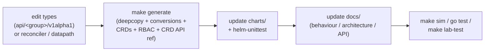

# Contributing

This page is the map: where things live, how the toolchain works, and how a change
flows from a type edit through generated artifacts, charts, docs, and tests. For the
detailed command-by-command workflow see [Dev environment & workflows](../guides/development.md);
for the docs conventions see [Writing docs](documentation.md).

## Where things live

ectobase is a single repository holding the Rust dataplane, the Go control planes, the
CNI plugin, the CRD API, the Helm charts, and the lab/test harnesses.

| Path | What |
|---|---|
| `api/` | The Kubernetes CRD types, split into five API groups — `net`, `compute`, `storage`, `compiled`, `platform` (each under `api/<group>/v1alpha1/`) — plus the gRPC/protobuf contracts (`api/proto/dataplane/v1/`, `api/proto/routebus/v1/`) and the generated conversions. |
| `mesh/` | The per-pool Go control plane: `cmd/agent`, `cmd/reflector`, `cmd/controller`, the pod/VM materializers, the `routebus` client/server, and the reconcile/desired-state logic. |
| `cni/` | The CNI plugin (`cni/plugin/main.go`) that attaches pods via the `DataplaneNode` gRPC. |
| `dispatch/` | The fleet control plane: the extension `apiserver`, the `controller` (compiler), and the `broker` (per-pool kubelet-analog) under `cmd/`, plus the generated client. |
| `flowplane/` | The Rust workspace: the eBPF dataplane, its userspace loader/agent/CLI, the pure-core datapath library, the shared map types, and the in-process simulator. |
| `charts/` | The Helm charts — `ectobase-dispatch` and `ectobase-pool` — with generated CRDs and RBAC. |
| `test/` | Test harnesses: Go conformance/e2e suites (`test/conformance/`, `test/e2e/`), the CRD bases for envtest (`test/crds/`), test container images (`test/images/`), and the `test/lab/` Talos + containerlab live lab. |
| `docs/` | This mkdocs-material site (plus the design-spec/plan archive under `docs/superpowers/`). |

See [Repository layout & crates](../architecture/layout.md) for the crate-level breakdown
of `flowplane/` and the `mesh`/`dispatch` module split.

## The toolchain: Nix devShell + `make`

Everything a contributor needs is pinned by the Nix flake. Enter it once, then drive
everything through `make`:

```sh
nix develop     # enter the dev shell (all targets assume you are inside it)
make            # list every annotated make target
```

The dev shell provides the pinned Rust toolchain, Go, `bpf-linker`, `protobuf`, `bpftool`,
`qemu`, `talosctl`/`containerlab`/`helm`, `controller-gen` + `crd-ref-docs`, and
`mkdocs`+`mkdocs-material`. It exports `KUBEBUILDER_ASSETS` so controller-runtime
**envtest** integration tests can spin a real in-process apiserver under `go test`.

Key targets (the full annotated list prints from a bare `make`):

| Command | Runs |
|---|---|
| `make build` | Build `flowplane` (host crates + the eBPF object via aya-build). |
| `make generate` | Regenerate deepcopy/conversion + CRD manifests + RBAC + the CRD API reference. |
| `make test` / `make sim` | Host unit + POD-layout tests / the in-process datapath sim. |
| `make lint` / `make fmt` / `make check` | Clippy / format / the pre-commit gate. |
| `make sim-anchor` / `make verifier` / `make e2e` / `make ha` | The privileged (sudo) datapath tests. |
| `make lab-up` / `make lab-test` / `make lab-down` | Bring up / test / tear down the live Talos + containerlab fabric. |
| `make docs` / `make docs-serve` | Build (`mkdocs build --strict`) / live-serve this site. |

## The test tiers

Each concern is asserted at the cheapest level that can observe it (see
[Testing strategy](../testing/strategy.md) for the full rationale):

- **Unit** (`make test`) — `flowplane-core` logic and `#[repr(C)]` POD layouts. No root.
- **Sim** (`make sim`) — byte-level datapath behaviour over the native simulator, plus
  whole flows across a `Fabric`. No root, no clab.
- **envtest** (`go test` in the devShell) — controllers/compilers against a real
  in-process apiserver via `KUBEBUILDER_ASSETS`.
- **Live lab** (`make lab-test`) — the Go live suite (`test/lab/livetest/`) against the
  Talos + containerlab fabric, for behaviours that only appear under sustained kernel
  forwarding (zero-drop restart, native-XDP paths). Sudo.

## How a change flows

A change that touches the API or behaviour moves through the same pipeline every time:



1. **Edit the types** under `api/<group>/v1alpha1/` (or the reconciler / datapath code).
2. **Run `make generate`.** This regenerates deepcopy + conversion functions, the CRD
   manifests (into the pool chart's `crd-bases` and `test/crds`), the per-component RBAC
   roles (into each chart's `files/`), and the per-group CRD API reference under
   `docs/reference/api/`. Never hand-edit those generated artifacts.
3. **Update the charts** (`charts/ectobase-dispatch`, `charts/ectobase-pool`) if the change adds
   a component, permission, or value; keep the `helm-unittest` suites and snapshots current.
4. **Update the docs** — the published pages are the living source of truth. Any change to
   behaviour, architecture, or the API updates the relevant page in the same commit
   (see [Writing docs](documentation.md)).
5. **Test at the right tier** — sim for datapath byte behaviour, envtest for controllers,
   the live lab for end-to-end forwarding.

## See also

- [Dev environment & workflows](../guides/development.md) — the detailed command reference and pre-commit hooks.
- [Writing docs](documentation.md) — the mkdocs/mermaid/status-badge conventions.
- [Repository layout & crates](../architecture/layout.md) — the module and crate breakdown.
- [The CRD API](../reference/crd-interactions.md) — how the five API groups relate.
