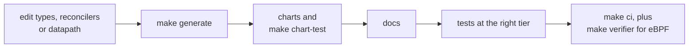

# Contributing

This section is for people changing ectobase itself. This page gives the map: how the repository
is organised, the toolchain, and the path a change takes from an edit through generated
artifacts, charts, docs and tests. The pages after it go into each step.

## The repository

ectobase is one repository: the Rust dataplane (`flowplane/`), the Go control planes (`mesh/`
and `dispatch/`), the CNI plugin (`cni/`), the API types (`api/`), the Helm charts (`charts/`),
the test harnesses (`test/`) and this site (`docs/`).
[Repository layout](repository-layout.md) goes through it crate by crate and module by module.

## The toolchain

Everything is pinned by the Nix flake and driven by `make`:

```sh
nix develop     # enter the devShell
make            # list every target
```

The devShell brings the pinned Rust nightly, Go, `bpf-linker`, the code generators, containerlab
and Talos tooling, and `zensical` for the docs. [Development](development.md) covers the shell,
every target and which ones need root.

## How a change flows

A change to the API or to behaviour goes through the same steps every time:


```mermaid
flowchart LR
    edit["edit types, reconcilers<br/>or datapath"]
    gen["make generate"]
    charts["charts and<br/>make chart-test"]
    docs["docs"]
    test["tests at the right tier"]
    done["make ci, plus<br/>make verifier for eBPF"]
    edit --> gen --> charts --> docs --> test --> done
```

1. Edit the types under `api/<group>/v1alpha1/`, a reconciler, or the datapath.
2. Run `make generate`. It regenerates deepcopy and conversion code, the typed client, the CRDs,
   each component's RBAC and the API reference. Never edit those outputs by hand
   ([Generated artifacts](../reference/generated-artifacts.md)).
3. If the change adds a component, a permission or a value, update the charts and their
   `helm-unittest` suites.
4. Update the docs in the same change. A behaviour, architecture or API change updates the page
   that describes it, and its status badge if the maturity moved
   ([Writing docs](documentation.md)).
5. Test at the cheapest tier that can see the property: the sim for datapath bytes, envtest for
   controllers, the lab for end-to-end forwarding ([Testing strategy](testing/strategy.md)).
6. Run `make ci` before you push. A change to the eBPF datapath is not done until
   `make verifier` passes too, because nothing else loads the programs into a real kernel. A
   change to the dataplane's gRPC API also needs the live tests compiled with
   `go vet -tags live ./livetest/` in `test/lab`, since no gate builds them.

## Where to go next

- [Development](development.md): the devShell, the `make` targets and the lab loop.
- [Repository layout](repository-layout.md): where each part of the code lives.
- [Testing strategy](testing/strategy.md): the test tiers and what each proves.
- [Writing docs](documentation.md): how this site is built and written.
