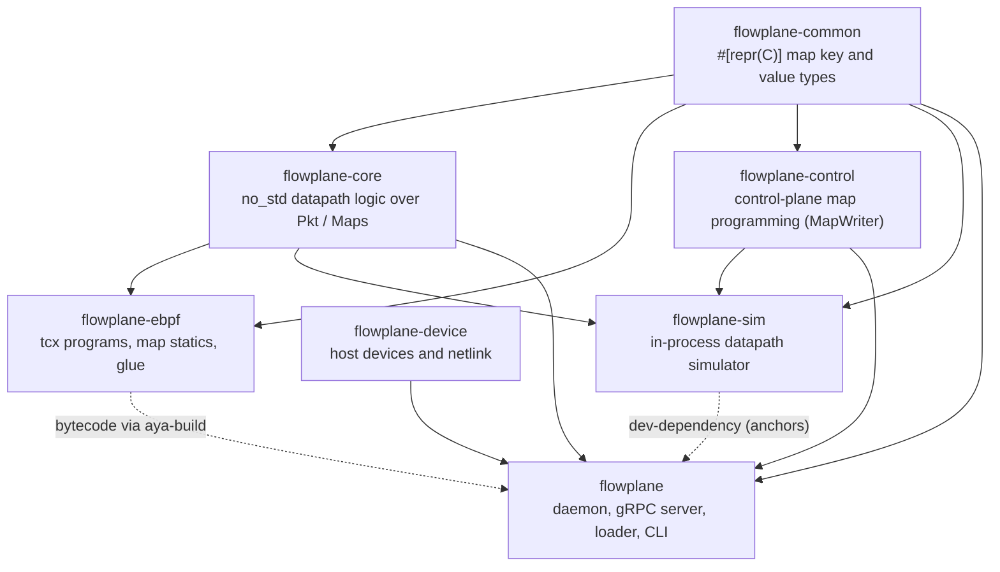

# Repository layout

ectobase is one repository: a Rust workspace for the dataplane, four Go modules for the control
planes and the CNI, the Helm charts, and the test harnesses. This page maps the tree, then goes
one level down into the Rust crates and the Go modules, so you can find where a behaviour lives.

## Top level

| Path | What |
|---|---|
| `api/` | The Go API module: the five API groups (`net`, `compute`, `storage`, `compiled`, `platform`), each as an internal package `api/<group>/` and a versioned package `api/<group>/v1alpha1/`; the protobuf contracts in `api/proto/dataplane/v1/` and `api/proto/routebus/v1/`; shared validation in `api/validate/`. |
| `mesh/` | The network control plane in Go: the binaries under `cmd/`, the per-node agent, the compiler's controllers, the allocators, the reflector and the route-bus helpers. |
| `dispatch/` | The fleet control plane in Go: `dispatch-apiserver`, `dispatch-controller` and `dispatch-broker` under `cmd/`, their logic under `pkg/`, the generated client in `client-go/`, and envtest suites in `test/`. |
| `cni/` | The `flowplane-cni` plugin (`cni/plugin/`) and its generated gRPC client (`cni/gen/`). |
| `flowplane/` | The Rust dataplane workspace: seven crates, described below. |
| `charts/` | The Helm charts `ectobase-dispatch` and `ectobase-pool`, with generated CRDs and RBAC and their `helm-unittest` suites under `tests/`. |
| `test/` | Harnesses: the lab (`test/lab/`), Go probe tools (`test/e2e/`), CRDs for envtest (`test/crds/`), the lab's container images (`test/images/`), and the netns scenario scripts (`test/*.sh`). |
| `hack/` | Helper scripts: `bpf-cleanup.sh` (behind `make bpf-clean`), `cni-install.sh` (run by the pool chart's CNI installer DaemonSet), and a one-off live-sweep helper. |
| `docs/` | This site. Built with zensical from `zensical.toml`. |
| `reviews/` | Dated design and engineering reviews, kept as records. |

At the root, `flake.nix` pins the toolchain, `Makefile` is the entry point for every workflow,
`go.work` ties the Go modules together, `Cargo.toml` defines the Rust workspace, and
`rust-toolchain.toml` pins the Rust nightly. `Dockerfile`, `Dockerfile.mesh` and `Dockerfile.cni`
build the `flowplane`, `mesh` and `cni` images; the three dispatch images are built from
`dispatch/Dockerfile.*` by `make image-dispatch`.

## The flowplane Rust workspace

The dataplane is a Cargo workspace of seven crates. The split that matters is between the pure
datapath logic, `flowplane-core`, which is `no_std` and generic over traits, and the two
environments that run it: the real eBPF programs in `flowplane-ebpf` and the in-process simulator
in `flowplane-sim`. [The pure core](../architecture/dataplane/pure-core.md) explains why.

| Crate | Role |
|---|---|
| `flowplane-common` | `#[repr(C)]` plain-old-data types shared by eBPF and userspace: the map keys and values (`maps/` holds `ct`, `fw`, `fwclass`, `iface`, `lb`, `nat`, `node`, `route`, `dhcp`) and protocol constants, with layout tests. `no_std`; the `user` feature adds aya's `Pod` impls for userspace. |
| `flowplane-core` | `no_std`, generic datapath logic: parse, encap and decap decisions, NAT, NAT64, load balancing, firewall, conntrack, metering, ARP and ND, DHCPv4, DSR. Every function is written against the `Pkt` and `Maps` traits, so the same code runs in eBPF, in the sim and in unit tests. `datapath/` composes the per-program flows (`guest_tx`, `guest_local`, `uplink`, `wan_rx`, `nat64`). |
| `flowplane-ebpf` | The eBPF programs and their `#[map]` statics. The forwarding programs are tc classifiers attached through tcx: `uplink_dsr_note`, `uplink_rx`, `xdp_uplink_v6` (a tail-called classifier that kept its old name), `wan_rx`, `tc_guest_tx`, `tc_guest_egress_v6`, `tc_guest_nat64` and `tc_guest_dhcp`. `xdp_inspect` is the only XDP program, a debug dumper. `coreimpl.rs` binds the `Pkt` and `Maps` traits to the kernel context and maps; the DHCPv6 responder stays here because it cannot be expressed over `Pkt`. Its binary target is `flowplane-prog`, not built as a host crate. |
| `flowplane-control` | Turns control-plane objects into map writes through the `MapWriter` trait, without depending on aya: interfaces, routes, firewall and its classifier compiler (`fwclass.rs`), load balancing and the Maglev table, NAT and NAT ownership, and the route shadow. The `mem-writer` feature provides an in-memory writer for tests. |
| `flowplane-device` | Host device and netlink plumbing for the daemon: the Geneve `collect_md` device, netkit, veth and tap creation, SR-IOV VF and SF claims, tc-flower offload rules, guest network namespaces, and underlay address inference. No gRPC, no eBPF. |
| `flowplane-sim` | The in-process simulator: heap-backed `VecPkt` and `MemMaps`, a `SimNode` running the real `flowplane-core` functions, and a multi-node `Fabric`. Its tests are the datapath's main functional oracle. See [The in-process sim](testing/sim.md). |
| `flowplane` | The daemon and CLI that ship in the image: the `DataplaneNode` gRPC server and handlers, the aya `MapWriter` (`control/aya_writer.rs`), the loader with pin adoption (`loader.rs`, `control/recover.rs`), interface attach and naming (`attach/`), conntrack GC, offload management, and the CLI subcommands `serve`, `bringup`, `tc-bringup`, `inspect`, `load` and `infer-underlay`. |

The workspace's `default-members` leave out `flowplane-ebpf` and `flowplane-device`, so a plain
`cargo build` at the root never tries to compile the `#![no_main]` eBPF binary. `flowplane`'s
`build.rs` builds the eBPF object through `aya-build` with the pinned nightly, and compiles the
`DataplaneNode` protobuf with `tonic-build`.

The eBPF crate's binary is named `flowplane-prog` rather than `flowplane-ebpf`: aya-build builds
into `$OUT_DIR/<package name>` and copies the artifact to `$OUT_DIR/<binary name>`, so matching
names would make the copy target collide with the build directory.

## The Go modules

`go.work` ties six modules together: `api`, `mesh`, `dispatch`, `cni`, and the test modules
`test/lab` and `test/e2e`. Each has its own `go.mod`, and `make lint` and `make ci` run per module.

| Path | What |
|---|---|
| `mesh/cmd/` | Five binaries, all in the `mesh` image: `agent`, `controller` (the compiler), `reflector`, `pod-materializer`, `vm-materializer`. All but the reflector have an `rbac.go` with their RBAC markers; the reflector holds no Kubernetes credentials. |
| `mesh/agent/` | The per-node agent: desired-state computation from `CompiledNIC`s, reconcilers for firewall, load balancing, NAT, imports and QoS, the route-bus client, the node certificate and the node-prefix stamp. |
| `mesh/controllers/` | Everything `mesh-controller` and the materializers run: the four compilers, the allocators (`vpc.go`, `subnet.go`, `ippool.go`, `nicipam.go`, `lbip.go`, `natgateway.go`, `ipalloc.go`), finalizers and the orphan sweep, the placement and disk-identity mirrors, volume reclaim, and the pod, VM and volume materializers. |
| `mesh/allocator/` | Pure allocation helpers: IPAM, MACs, NAT port blocks. |
| `mesh/reflector/` | The route-bus hub: the RIB, fences, `AnnouncedFrom`, the admin API, authorization of announcements against certificates. |
| `mesh/routebus/` | Route-bus helpers shared by agent and reflector: TLS, edge certificates, NAT and LB-port encodings. |
| `dispatch/cmd/` | `apiserver`, `controller`, `broker`. `broker/rbac/poolside/` is a marker-only package for the broker's pool-side role. |
| `dispatch/pkg/` | `broker` (sync, heartbeat, status and release reports, CA bootstrap), `clusterpool` (lease health), `scheduler` (VM and container binding), `failover` (fence, rebind, release, route gate), `fence` (the Ceph `NetworkFence` and reflector fence actuators), `pki` (the `RouteBusIdentity` signer). |
| `dispatch/test/` | envtest suites against a real aggregated apiserver, including the failover and volume-move end-to-end scenarios. |
| `cni/plugin/` | The plugin: CNI ADD and DEL, `CompiledNIC` resolution, attach over the dataplane socket. |
| `test/lab/` | The lab CLI (`go run ./test/lab`), its templates, the deploy code that installs the charts, and the live suite in `livetest/` (build tag `live`). See `test/lab/README.md`. |
| `test/e2e/cmd/` | Probe binaries the live tests run: `netprobe` (send and sniff, pcap replay) and `tap-dhcp-probe` (a DHCPv4 and DHCPv6 client). |

The `dispatch` module resolves `go.opendefense.cloud/kit` (apiserver-kit) through a `replace` to a
local path in `dispatch/go.mod`. Until that module is published, `dispatch` builds only with a
checkout at that path; `.github/workflows/test.yml` records that CI's `go test` for `dispatch`
fails for this reason.

## Where to go next

- [Development](development.md): the devShell and the `make` targets that drive this tree.
- [Generated artifacts](../reference/generated-artifacts.md): which files under these paths are
  generated.
- [The flowplane dataplane](../architecture/dataplane/index.md): how the crates fit together at
  run time.
