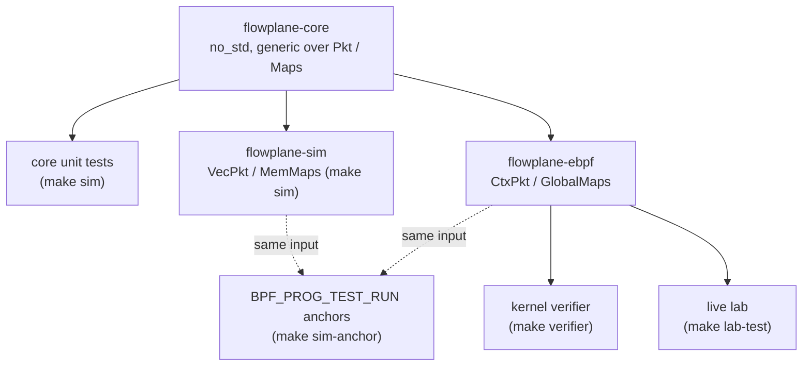

# Testing strategy

ectobase tests each property at the cheapest level that can observe it. A byte layout is proven
in a native test in microseconds; a verifier limit only by loading the real program into the
kernel; zero-loss forwarding across a restart only under live traffic on the lab fabric. This
page lists the tiers, what each proves and which ones CI runs, then explains the rule that holds
the datapath tiers together.

## The tiers

| Tier | Command | Proves | Root | In CI |
|---|---|---|---|---|
| Rust unit and layout | `make test` | `flowplane-common` `#[repr(C)]` layouts, `flowplane-control` map programming against an in-memory writer, and the `flowplane` daemon's unit tests (this also builds the eBPF object) | no | yes |
| Datapath sim | `make sim` | `flowplane-core` unit tests and the in-process sim: byte-level behaviour of every datapath path, single node and across a multi-node `Fabric` | no | yes |
| Go unit and envtest | `go test` per module, run by `make ci` | controllers, allocators, compilers, the broker, the reflector, failover and fencing, against a real in-process apiserver where needed (`KUBEBUILDER_ASSETS`) | no | yes |
| Chart tests | `make chart-test` | rendered chart output and snapshots, via `helm-unittest` | no | yes |
| Verifier | `make verifier` | every forwarding program loads through the kernel verifier: stack and instruction limits | sudo | no |
| Byte-parity anchors | `make sim-anchor` | the real bytecode, run with `BPF_PROG_TEST_RUN`, agrees with the native core on the same input | sudo | no |
| Restart and adopt | `make ha` | pinned maps are re-bound, the `IFACE_META` journal rebuilds the daemon's bookkeeping, and pinned guest links are re-pointed, through the real control path | sudo | no |
| netns scenarios | `make e2e`, `make tap-dhcp-probe`, `make tap-vm-smoke` | the datapath on real kernel devices in network namespaces, and a real VM on a tap | sudo | no |
| Live lab | `make lab-test` | everything that needs a real multi-cluster fabric under sustained forwarding (below) | sudo | no |

`make ci` runs every non-privileged tier, and `make test-all` runs `test`, `e2e` and `ha`. The CI
workflow, `.github/workflows/test.yml`, runs `make sim`, `make test`, `make chart-test` and
`go test` in every module, plus a Go lint job; the privileged tiers need root or a self-hosted
runner and are not in CI.

!!! warning "`make e2e` predates the Geneve datapath"
    `test/netns-e2e.sh` starts helper processes with `flowplane pass`, a subcommand the binary no
    longer has, and its encap capture filters for IP-in-IPv6 (`ip6 proto 4`), which the Geneve
    datapath does not emit. Treat the live lab as the end-to-end tier until the script is
    updated.

### What only the lab proves

The live suite (`test/lab/livetest/`, run by `lab test` as
`go test -tags live -timeout 45m ./livetest/...`) covers what no in-process tier can see:

- the kernel Geneve `collect_md` decap, which `BPF_PROG_TEST_RUN` cannot drive;
- the real attach paths: netkit for containers, the KubeVirt tap for VMs, and DHCPv6 through a
  real client;
- zero-loss forwarding across a `flowplane` restart (`TestRestartContinuity`) and an edge
  restart (`TestEdgeLBSurvivesFlowplaneRestart`);
- the fleet end to end: BGP and ECMP on the underlay, brokers and the reflector, load balancing
  and NAT from intent, NAT64 and DNS64, VPC peering, planned moves, volume moves and Tier-2
  failover with Ceph fencing.

Each live test skips when the fabric is not up. Each [guide](../../guides/index.md) names the
live test that runs the same steps.

### Tests that no gate runs

Some suites carry a Go build tag and are compiled by nothing in `make ci` or CI:

| Tag | Where | Run it with |
|---|---|---|
| `live` | `test/lab/livetest/` | `make lab-test`, with the lab up |
| `kine` | `dispatch/test/kine_durability_test.go` | `dispatch/hack/kine-up.sh`, then `KINE_ENDPOINT=http://127.0.0.1:2379 go test -tags kine ./test/ -run TestKineDurability` in `dispatch/` |

The live tests call the dataplane's gRPC API by name, so a change to that API can break them
silently. When you change a method, a field or what the dataplane accepts, grep
`test/lab/livetest/` and at least compile it: `cd test/lab && go vet -tags live ./livetest/`.

## One core, run everywhere

The datapath logic lives in `flowplane-core`, a `no_std` crate whose functions are generic over
two traits, `Pkt` (packet access and resizing) and `Maps` (the BPF maps). The same code runs in
three places:

- in eBPF, where `CtxPkt` and `GlobalMaps` (`flowplane-ebpf/src/coreimpl.rs`) bind the traits to
  the tc packet context and the kernel maps;
- in the sim, where `VecPkt` and `MemMaps` are heap-backed;
- in unit tests, which call the functions directly.

The rule is that production eBPF calls the shared core function, so the code under test is the
code that ships. A parallel reimplementation in the sim, guarded only by an anchor, is not
acceptable: it tests code the datapath does not run. When a function is shared, an anchor proves
the bytecode agrees with it; it never replaces sharing it.

When the verifier cannot accept the shared form, the answer is not a fork of the core. Move the
assertion up a tier, to a live test, and keep the real code under test.

### Why the sim is the main oracle

Under Geneve `collect_md` the kernel's Geneve device does the encap and decap, and the programs
read the VNI from the tunnel key. `BPF_PROG_TEST_RUN` cannot inject tunnel metadata into a test
packet, so no anchor can drive the ingress path past that read. The encap side keeps a real
anchor; on the ingress side the anchors only prove that the bytecode fails safe (`TC_ACT_OK`,
packet unchanged) when the key is missing. Everything past that point, delivery, load balancing,
NAT return, firewall and conntrack, is proven in the sim, so every egress and ingress case needs
explicit sim coverage. A gap in sim coverage is the real risk, more than a missing anchor.

### Why DHCPv6 stays in eBPF

The DHCPv6 reply carries a runtime-variable option block (the echoed client DUID, conditional
options, a runtime number of DNS servers and a boot-file URL), written at runtime offsets with
`store_bytes`. The fixed-size `Pkt` trait cannot express that, so the DHCPv6 responder stays
hand-written in `flowplane-ebpf` and is validated live by `TestDhcpLeaseSmoke`, which runs a real
DHCPv6 client against it.

## The anchors

Each anchor in `flowplane/tests/anchor_*.rs` feeds one crafted frame to the native core through
the sim and to the real compiled program, and compares the verdict and the bytes. They are
narrow on purpose: they catch drift between the two environments (codegen, byte order,
adjust-room semantics), not logic the sim already covers.

| Anchor | Program | What it asserts |
|---|---|---|
| `anchor_guest_tx` | `tc_guest_tx` | encap redirect with the inner frame unchanged, byte-identical to the sim; firewall classifier verdicts for v4 and v6; conntrack epoch revocation |
| `anchor_wan_rx` | `wan_rx` | the NAT return relay against the kernel's `NAT_OWNERS` tries, relay versus pass at block and prefix boundaries, with parity against `SimNode::wan_rx` |
| `anchor_dhcp` | `tc_guest_dhcp` | the DHCPv4 OFFER, against the native sim and against a golden frame |
| `anchor_uplink`, `anchor_lb`, `anchor_dnat` | `uplink_rx` | fails safe without a tunnel key, on the base, load-balancer and DNAT-return inputs |

Not anchored yet, as the `sim-anchor` target records: the DHCPv6 replies, the DHCP fallback MTU
(the anchor seeds an explicit MTU), the ARP and ND replies, and the NAT64 translation. Those are
covered by the sim alone, or live for DHCPv6.

## Where to go next

- [The in-process sim](sim.md): `SimNode`, `Fabric` and the `CompiledNIC` bridge.
- [Conformance map](conformance-map.md): every behaviour of the retired dpservice suite and the
  native test that now covers it.
- [The pure core](../../architecture/dataplane/pure-core.md): the trait boundary in detail.
- [Development](../development.md): the targets and what to run before a change is done.
