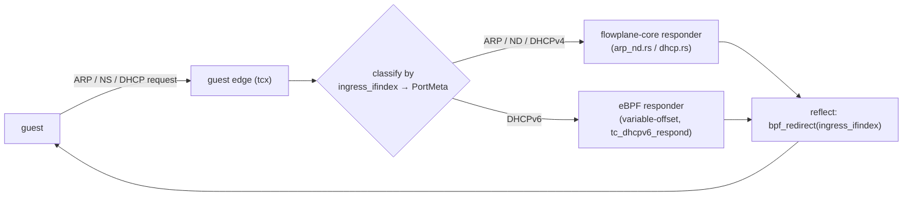

# DHCP / ARP / IPv6 ND responders

`flowplane` answers a guest's address-configuration protocols **in the dataplane** — there is no
userspace `dhcpd`/`radvd` and no per-node responder daemon. A guest DHCPv4/DHCPv6 request, ARP
request, or IPv6 Neighbor Solicitation is caught at the guest edge, answered from the port's
configured identity, and reflected straight back to the guest. Every reply is built from the
per-port `PortMeta` (its IPs, the virtual gateway MAC/IP, DNS, MTU) — no round trip leaves the node.

## What each responder does

| Protocol | Trigger | Reply |
|---|---|---|
| **ARP** | request for the virtual gateway IPv4 | in-place rewrite to an ARP reply (sender = gateway MAC/IP, Ethernet src/dst swapped) |
| **IPv6 ND** | Neighbor Solicitation for the gateway IPv6 | solicited Neighbor Advertisement (type 136, target-link-layer = gateway MAC, solicited+override, recomputed ICMPv6 checksum) |
| **DHCPv4** | DISCOVER / REQUEST (UDP dport 67) | OFFER / ACK: `yiaddr` = the port's IPv4, gateway as server identity, plus MTU, DNS, subnet-mask, classless-route, optional host-name |
| **DHCPv6** | guest v6 solicit/request | reply echoing the client DUID, conditional IA_NA/RapidCommit, DNS, BootFileUrl |

ARP, ND, and DHCPv4 live in **`flowplane-core`** (`arp_nd.rs`, `dhcp.rs`) — the pure `no_std` layer
generic over the `Pkt`/`Maps` traits, so the *same* reply builder runs in the eBPF datapath, in the
in-process sim, and under the `BPF_PROG_TEST_RUN` byte-parity anchor. DHCPv6 is the deliberate
exception (below): it stays a hand-written eBPF responder in `flowplane-ebpf`.

## Why these fit the pure-core `Pkt` seam

The verifier keeps packet-bound *provenance* only across **constant-offset** accesses. A response
built entirely from compile-time-constant offsets is verifiable through the `Pkt` trait; one that
advances a runtime write cursor is not.

- **ARP / ND** are **fixed-size in-place rewrites**: NS/NA is always 14 Eth + 40 IPv6 + 32 ICMPv6,
  so every access is a constant-offset `read_array`/`write_array` (`arp_nd.rs`). The responder does
  only the byte rewrite; the eBPF glue owns the classification (`ingress_ifindex → PortMeta`) and
  the reflect verdict (`bpf_redirect(ingress_ifindex)`).
- **DHCPv4** has a **compile-time-constant total length** (`REPLY_LEN`) with every option at a
  constant offset. Variable parts (which DNS servers, whether a host-name is present) are handled by
  writing option bytes into fixed slots and PAD-filling the unused tail of each slot — never by
  advancing a cursor. The glue resizes the frame to `REPLY_LEN` (`bpf_xdp_adjust_tail` /
  `bpf_skb_change_tail` / `VecPkt::grow_tail`) *before* calling the writer, so the writer only ever
  sees an already-`REPLY_LEN` frame.

Both responders are `#[inline(always)]` on purpose: the `tc_guest_tx` caller is stack-heavy
(conntrack / NAT / v6), and keeping these out-of-line would make each a separate BPF subprogram whose
frame is summed with the caller's, blowing the 512-byte BPF stack limit.

## Why DHCPv6 stays in eBPF

The DHCPv6 reply option block is **genuinely runtime-variable-length**: the echoed client DUID, the
conditional IA_NA / RapidCommit, a runtime DNS count, and a runtime BootFileUrl mean options are
emitted at **runtime offsets** via `bpf_xdp_store_bytes`. That is an idiom the fixed-size
const-generic `Pkt` trait cannot express — there is no compile-time-constant layout to write into
fixed slots.

This is a **verifier instruction / variable-offset ceiling**, not a policy choice: the XDP verifier
cannot track packet-pointer provenance across a variable offset without a bounds-check the raw
`Pkt`-trait model doesn't provide. The limitation is identical for tc and XDP, so unifying the guest
edge on tcx does not, on its own, let DHCPv6 move into `flowplane-core`. The DHCPv6 responder
therefore stays a hand-written eBPF program (`tc_dhcpv6_respond`); its conformance is covered by a
real-lease smoke test rather than the pure-core sim + anchor path the others use.

A future `Pkt`-trait redesign around `bpf_skb_load_bytes`/`bpf_skb_store_bytes` — which
bounds-check internally and so permit verifiable variable-offset access — could bring DHCPv6 (and
other variable-length parsing) into `flowplane-core`, at the cost of the clean const-generic model.
That is out of scope of the current design; DHCPv6 works today as a dedicated eBPF responder.
