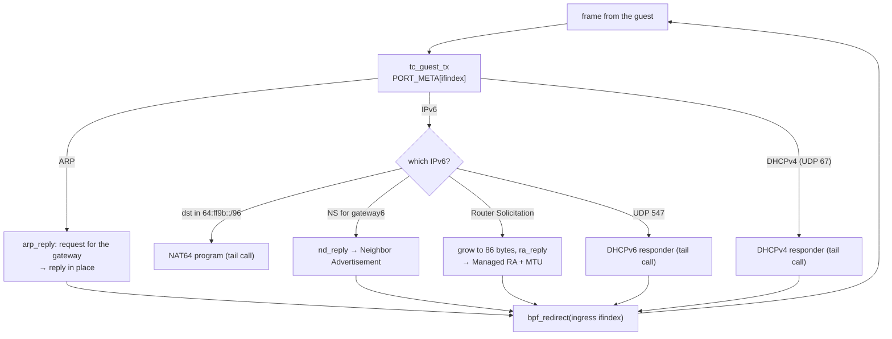

# DHCP, ARP and ND

flowplane answers a guest's address-configuration traffic inside the datapath: ARP for the gateway,
IPv6 Neighbor Solicitation and Router Solicitation, DHCPv4 and DHCPv6. The reply is built in place
from the interface's configured identity and sent straight back to the guest, so no request leaves
the node and no `dhcpd` or `radvd` runs anywhere.

## Where the answers come from

The responders have no CRD of their own. Their inputs come from two places:

- Per interface, from the `NetworkInterface`: the guest's addresses (`status.allocatedIPs`), which
  the attach writes into the interface's `PORT_META` entry.
- Per node, from `flowplane serve` flags: the virtual gateway addresses, the DNS servers, and the
  guest MTU.

| Flag | Used by |
|---|---|
| `--gateway <ipv4>` | ARP replies, DHCPv4 server identity and routes. Required. |
| `--gateway6 <ipv6>` | Neighbor Advertisements and Router Advertisements. Unset disables both. |
| `--dhcp-dns`, `--dhcpv6-dns` | DNS option of DHCPv4 and DHCPv6 replies. |
| `--guest-mtu` | DHCPv4 option 26 and the RA MTU option. Unset derives it from the smallest uplink MTU minus 80 bytes (Geneve plus the DSR option reserve). |

```sh
flowplane serve --addr unix:///run/flowplane/dataplane.sock --uplink eth1 \
  --gateway-mac <fabric router MAC> --gateway 169.254.0.1 --gateway6 fe80::1 \
  --dhcp-dns 10.0.0.53 --dhcpv6-dns fd00::53
```

The gateway answers at one shared virtual router MAC, `02:00:00:00:00:01`, the same source MAC the
datapath puts on every frame it delivers to a guest. See
[`NetworkInterface`](../reference/api/net.md#networkinterface) in the API reference.

## How a request is answered

`tc_guest_tx` classifies each frame from the guest by its ethertype and the interface's
`PORT_META[ifindex]`, rewrites the request into a reply, and redirects it back out the interface it
arrived on.


```mermaid
flowchart TD
    g["frame from the guest"] --> tx["tc_guest_tx<br/>PORT_META[ifindex]"]
    tx -->|ARP| arp["arp_reply: request for the gateway<br/>→ reply in place"]
    tx -->|IPv6| v6{"which IPv6?"}
    v6 -->|"dst in 64:ff9b::/96"| nat64["NAT64 program (tail call)"]
    v6 -->|"NS for gateway6"| nd["nd_reply → Neighbor Advertisement"]
    v6 -->|"Router Solicitation"| ra["grow to 86 bytes, ra_reply<br/>→ Managed RA + MTU"]
    v6 -->|"UDP 547"| d6["DHCPv6 responder (tail call)"]
    tx -->|"DHCPv4 (UDP 67)"| d4["DHCPv4 responder (tail call)"]
    arp --> back["bpf_redirect(ingress ifindex)"]
    nd --> back
    ra --> back
    d6 --> back
    d4 --> back
    back --> g
```

| Request | Reply |
|---|---|
| ARP request for the gateway IPv4 | ARP reply with the gateway MAC, Ethernet source and destination swapped. |
| Neighbor Solicitation for the gateway IPv6 | Solicited Neighbor Advertisement (type 136) with the gateway MAC as target link-layer address, solicited and override flags set, ICMPv6 checksum recomputed. |
| Router Solicitation | Router Advertisement (type 134) naming the gateway as default router, with a source link-layer option and the MTU option. The M flag is set and no SLAAC prefix is advertised, so addressing stays with DHCPv6 and central IPAM. |
| DHCPv4 DISCOVER or REQUEST | OFFER or ACK: `yiaddr` is the interface's IPv4; the gateway is the server identity; options carry an infinite lease, subnet mask, classless static route, MTU, DNS and, when configured, a host name. |
| DHCPv6 SOLICIT, REQUEST or CONFIRM | Advertise for a SOLICIT without Rapid Commit, Reply otherwise. It echoes the client DUID and carries an IA_NA with the interface's IPv6 when the client asks for one, and DNS. |

The Router Advertisement exists because DHCPv6 has no MTU option: a self-configuring IPv6 guest
learns its link MTU and default router only from an RA.

## Why DHCPv6 stays in the eBPF crate

ARP, ND, RA and DHCPv4 replies are built in `flowplane-core` (`arp_nd.rs`, `dhcp.rs`), the `no_std`
layer generic over the `Pkt` and `Maps` traits. The same code then runs in the kernel, in the
simulator and under the `BPF_PROG_TEST_RUN` byte-parity tests. They fit because every reply has a
fixed layout, and the verifier keeps packet-bounds facts only across constant-offset accesses:

- ARP, NS/NA and RA are fixed-size in-place rewrites. An RA is larger than the RS it answers, so the
  glue grows the skb to 86 bytes first.
- A DHCPv4 reply has a constant total length, `REPLY_LEN`, with every option in a fixed slot.
  Variable parts, such as how many DNS servers or whether a host name is present, are written into
  their slots and the unused tail of each slot is filled with PAD options. The glue resizes the
  frame to `REPLY_LEN` before the writer runs.

A DHCPv6 reply cannot be built that way. Its options vary in length at runtime (the echoed client
DUID, the conditional IA_NA and Rapid Commit, the DNS count), so they are written at runtime offsets
with `bpf_skb_store_bytes`, which the constant-offset `Pkt` trait cannot express. The DHCPv6
responder therefore stays a hand-written eBPF function, `tc_dhcpv6_respond`, and its conformance
comes from a real-lease test instead of the simulator.

The responders that run inside `tc_guest_tx` are `#[inline(always)]`. As separate BPF subprograms,
their stack frames would add to the caller's, which is already near the 512-byte BPF stack limit.
DHCP and NAT64 run as tail-called programs for the same reason: a tail call starts with a fresh
stack.

## Limits

- The pool Helm chart starts flowplane with `--gateway 169.254.0.1` only. It passes no `--gateway6`
  and no DNS servers, so on a chart-deployed node the ND and RA responders are disabled and DHCP
  replies carry no DNS option. DHCPv6 still answers.
- Host-name and PXE options exist in the responders (`DHCP_META`), but no control-plane path
  populates that map today, so replies never carry them.
- DNS servers and MTU are node-wide, not per interface or per VPC.
- The live test `TestDhcpLeaseSmoke` attaches a dual-stack guest and checks the DHCPv4 `yiaddr` and
  the DHCPv6 IA address and client ID; it treats MTU and DNS as optional because the lab does not
  set them.

## Where to go next

- [Attaching workloads](../architecture/attaching-workloads.md)
- [Programs and hooks](../architecture/dataplane/programs.md)
- [The pure core](../architecture/dataplane/pure-core.md)
