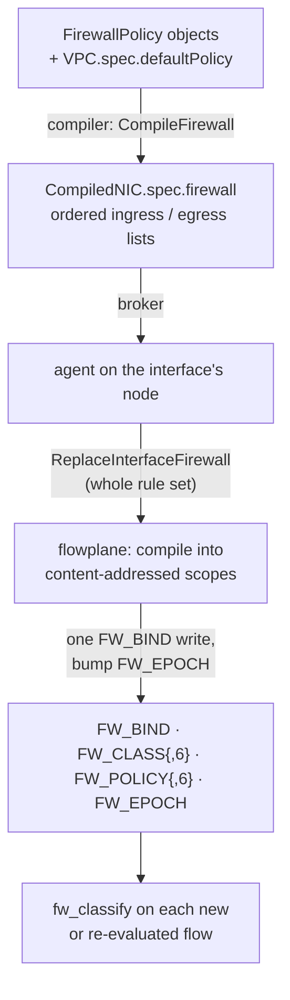

# Firewall

The firewall filters every guest interface in both directions, inside the datapath of the node the
interface runs on. It is always on, and the datapath evaluator is deny-by-default: a packet passes
only when an allow rule decides it. What reaches that evaluator depends on the VPC's
`defaultPolicy`. When it is unset (the default), a direction that no policy governs gets an explicit
allow-all, so it stays open. Rules come from `FirewallPolicy` objects and the VPC's default posture.
The firewall is stateful, so the replies of an admitted connection need no rule of their own.

## The API: FirewallPolicy and the VPC default

A `FirewallPolicy` selects interfaces by label and carries ordered `ingress` and `egress` rule
lists. Each rule matches a peer CIDR, a protocol, and a destination port, port range or ICMP type
and code, and either allows or denies.

| Field | Meaning |
|---|---|
| `spec.interfaceSelector` | Label selector over `NetworkInterface`s in the namespace. Required; `{}` selects all. |
| `spec.priority` | Orders this policy against others selecting the same interface. 0–65535, lower wins, unset means 32768. |
| `ingress[]`, `egress[]` | Rules, in list order. |
| `cidr` | The peer: the source of an ingress packet, the destination of an egress one. No host bits may be set. |
| `proto` | `TCP`, `UDP`, `ICMP`, or empty for any. `ICMP` means ICMPv6 on an IPv6 CIDR. |
| `port`, `endPort` | Destination port, or the inclusive range `port`–`endPort`. Needs `TCP` or `UDP`. |
| `icmpType`, `icmpCode` | One ICMP message type, optionally one code. Needs `ICMP`. |
| `action` | `Allow` or `Deny`. |
| `priority` (per rule) | Orders rules of equally prioritized policies, same scale as the policy priority. |

```yaml
apiVersion: net.ectobase.dev/v1alpha1
kind: FirewallPolicy
metadata: {name: web, namespace: tenant-a}
spec:
  interfaceSelector: {matchLabels: {app: web}}
  ingress:
    - {cidr: 0.0.0.0/0, proto: TCP, port: 443, action: Allow}
    - {cidr: 10.0.0.0/8, proto: TCP, port: 8000, endPort: 8100, action: Allow}
    - {cidr: 10.0.0.0/8, proto: ICMP, icmpType: 8, action: Allow}   # echo request only
```

`VPC.spec.defaultPolicy` decides what happens to traffic no rule matches:

| `defaultPolicy` | Unmatched traffic |
|---|---|
| `Allow` | Passes, in both directions. A lone `Deny` rule denies only what it matches. |
| `Deny` | Drops, in both directions, on every interface, whether or not a policy selects it. |
| unset | Kubernetes NetworkPolicy semantics per direction: a direction with no rules is open, a direction with rules admits only what they allow. |

The VPC's `FirewallDefault` condition reports the posture in effect (reason `Allow`, `Deny` or
`PerDirection`). The full schema is in the API reference:
[`FirewallPolicy`](../reference/api/net.md#firewallpolicy),
[`VPCSpec`](../reference/api/net.md#vpcspec).

### Admission

The dispatch apiserver validates each `FirewallPolicy` on create and on every spec change, and
rejects:

- a missing or unparseable `interfaceSelector`;
- an `action` other than `Allow` or `Deny`, or a `proto` other than `TCP`, `UDP`, `ICMP` or empty;
- a `port` outside 0–65535, or a non-zero `port` without `TCP` or `UDP`;
- an `endPort` without a `port`, or below it;
- an `icmpType` without `ICMP`, an `icmpCode` without `icmpType`, or either outside 0–255;
- a `cidr` with host bits set, such as `10.0.0.5/24`, because the firewall would have to guess
  whether the `/24` or a `/32` was meant;
- a priority outside 0–65535.

## How a policy reaches the datapath

A policy goes through three stages: the compiler orders and prunes the rules per interface, the
agent hands each interface's whole rule set to flowplane, and flowplane compiles it into lookup
tries the datapath can evaluate in constant time.



### The compiler orders and prunes rules

`CompileFirewall` builds each interface's ingress and egress lists from every policy whose selector
matches the interface's labels:

1. Order. Rules are ranked by `(policy priority, rule priority, policy namespace, policy name, rule
   index)`, lower first at each level. Priorities follow the GCP model: 0–65535, lower wins, unset
   is 32768, so a rule can be placed ahead of or behind every unprioritized one. The ranking is
   total, so the compiled list never depends on the order the apiserver lists policies in.
2. Shadowing. A rule that a higher-ranked rule fully covers can never be the first match, so it is
   dropped. Coverage means: the other rule's CIDR contains this one, its protocol is the same or
   any, and its port range contains this one's (or its ICMP type and code are unset or equal).
   Partly overlapping rules are kept. The result is the same for any insertion order.
3. Default posture. The datapath drops anything no rule allows, so an open default becomes explicit
   rules: an allow-all pair (`0.0.0.0/0` and `::/0`) ranked below every real rule, added in both
   directions for `Allow` and in each empty direction when the posture is unset.

### The rule budget

An interface may hold 256 rules per address family after shadowing, ingress and egress combined
(`FirewallRuleBudget`). The allow-all pair counts like any rule. The budget is a quota that keeps
policies far below the datapath's own limits, which a rule count cannot bound exactly because port
ranges and nested CIDRs expand.

When an interface's rules exceed the budget, or a stored rule cannot be interpreted, the compiler
does not guess:

- an interface that already has a `CompiledNIC` keeps its last good rule set, because truncating
  could drop a `Deny` and emptying would cut off a running workload over an unrelated edit;
- an interface compiling for the first time gets an empty rule set, which the datapath treats as
  deny-all.

Either way the `NetworkInterface`'s `FirewallCompiled` condition turns `False`, with reason
`RuleBudgetExceeded` or `InvalidRule` and a message naming the family and count, or the policy and
rule. On success the condition is `True` and its message reports budget use, for example `IPv4
2/256, IPv6 1/256`.

### The agent replaces whole rule sets

The agent reads only `CompiledNIC.spec.firewall`, never a raw `FirewallPolicy`. For each locally
attached interface it calls `ReplaceInterfaceFirewall` with the complete rule set; there is no
per-rule add or delete, so nothing can drift. An ingress rule's CIDR becomes the source match and an
egress rule's CIDR the destination match; the port is always the destination port; `ICMP` lowers to
protocol 1 or 58 by the CIDR's family. Failures are collected and retried on the next reconcile.

flowplane applies a rule set to both families or to neither. It compiles the whole set before
writing anything, and a refused set leaves the interface on its previous rules. The gRPC errors are
`NOT_FOUND` for an unknown interface, `INVALID_ARGUMENT` for a rule the classifier cannot express,
and `RESOURCE_EXHAUSTED` for a scope over its size limits.

## The classifier

flowplane compiles each direction's ordered rule list into a **scope**: a pair of longest-prefix
tries per address family that answer "which rule matches first" in a fixed number of lookups.

1. Class trie. Every distinct peer prefix in the direction's rules becomes a class; a packet's peer
   address maps to the class of its longest matching prefix. The any-peer `/0` is class 0 and is
   never stored.
2. Policy trie. Each rule becomes entries keyed `[class, proto, port]`, with protocol and port as a
   maskable suffix. A port range becomes a few masked port prefixes; an ICMP rule stores its type
   and code in the port bytes. Each entry carries the rule's rank as its precedence, and an entry a
   higher-precedence entry already covers is not inserted.

A packet probes the policy trie twice, once with its class and once with class 0, and the
higher-precedence hit decides. The cost is a binding lookup, a class lookup and two probes, whatever
the number of rules. A scope holds at most 4,096 classes and 16,384 policy entries per family;
flowplane checks this before writing.

Scopes are content-addressed: interfaces with identical rules share one scope. A rule change builds
the new scopes in full, then one write to `FW_BIND[ifindex]` moves the interface to them, both
directions and both families at once, and unreferenced scopes are deleted. `FW_BIND`, the scope maps
and `FW_EPOCH` are pinned, so a flowplane restart keeps enforcing and re-adopts them. A randomized
differential test in the simulator holds the classifier to first-match semantics against a reference
evaluator.

The evaluator, `fw_classify` (`fw_classify6` for IPv6), returns accept only when the deciding rule
allows. An interface with no binding, a direction with no scope, an unreadable header and a packet
no rule matches all drop.

## Connections and policy changes

The first packet of a flow meets the source interface's egress rules and the destination interface's
ingress rules. Once admitted, the flow is tracked in conntrack, and its later packets and all its
replies ride that entry without another evaluation.

A policy change reaches established connections on their next packet. flowplane keeps a node-wide
firewall epoch, `FW_EPOCH`, and advances it after every `FW_BIND` change. Each conntrack entry
records the epoch it was last evaluated under. A forward packet whose entry carries an older epoch
is evaluated again, as a new flow would be: if the rules still allow it, the entry is re-stamped; if
not, the packet drops and the entry is removed, so the replies stop too. Replies are never
re-evaluated on their own. No conntrack sweep runs; every other connection on the node pays one
extra evaluation, once.

A bare TCP SYN that hits a tracked entry is a new connection reusing the tuple, so it is evaluated
even when the epoch has not changed.

Connections offloaded to hardware with `--offload` bypass the evaluator. The offload manager
withdraws any offloaded connection whose epoch is stale, and its next packet takes the eBPF path, so
for those connections a change takes effect within one reconcile interval.

## Load-balanced and peered traffic

Membership in a [load balancer](loadbalancer.md) and a [peering](vpc-peering.md) import both grant
reachability only; neither adds a firewall rule. With `defaultPolicy` unset and no policy governing
the backend's ingress, that direction is open and LB traffic passes. Under `defaultPolicy: Deny`, or
once a policy governs the backend's ingress, the backend admits LB traffic only through its own
ingress `FirewallPolicy`, written for the clients: allow the clients' source range (`0.0.0.0/0` and
`::/0` for an internet-facing service) on the service port. The destination address is never part of
an ingress match, so the LB address does not appear in the rule. Peered traffic works the same way:
it passes where the destination's posture or policy admits the peer's CIDR.

## Limits

- 256 rules per interface per address family, after shadowing (compiler quota).
- 4,096 peer classes and 16,384 policy entries per scope per family (datapath limit), and up to
  4,096 scopes per node.
- `FW_BIND` holds 1,024 interfaces per node.
- Rules match the peer address, protocol and destination port or ICMP type. There is no source-port
  match and no match on the interface's own address.
- `FirewallPolicy.status` is empty by design; the compile result is reported per interface on its
  `FirewallCompiled` condition.

## Where to go next

- [Firewall and peering](../guides/firewall-and-peering.md)
- [Routing and VNIs](routing-vni.md)
- [VPC peering](vpc-peering.md)
- [Maps and state](../architecture/dataplane/maps.md)
