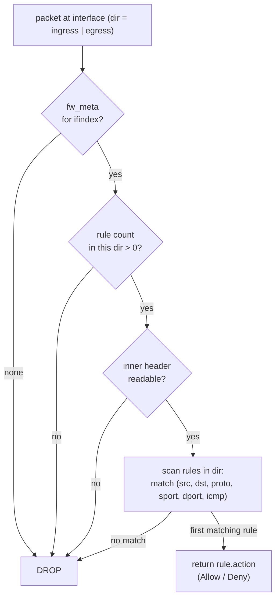

# Distributed firewall

`flowplane`'s firewall is always-on and deny-by-default. It is enforced in the
datapath on every guest interface, in both directions, and derives entirely from
`FirewallPolicy` intent lowered by the control plane. There is no "firewall off" mode: a
packet is forwarded only when an explicit allow rule matches it.

## Deny-by-default

The evaluator, `flowplane_core::firewall::fw_eval_dir`, returns `ACCEPT` only when a rule
in the packet's direction explicitly matches with an accept action. Every other
outcome is `DROP`:

- no per-interface firewall metadata at all → drop;
- zero rules in this direction → drop;
- an unreadable inner header → drop;
- rules present but none match → drop.

The drop is unconditional. This is a hard invariant of the datapath — the control plane is
responsible for materializing any "default-allow" behavior as explicit allow rules.



Each rule matches on the packet's 5-tuple selectors (`src`, `dst`, `proto`, `sport`,
`dport`) plus ICMP type/code. Rules are scanned in order; the first matching rule's action
wins.

## From FirewallPolicy to datapath

`FirewallPolicy` is a Kubernetes-native intent object with an `interfaceSelector`, an optional
`priority`, and `ingress` / `egress` rule lists (each rule a `{cidr, proto, port, action}` plus
an optional `priority`). The control plane compiles every policy that selects a NIC into one
first-match-wins rule list per direction, which the agent programs into BPF maps.

### Admission

The dispatch apiserver validates a `FirewallPolicy` on create and on every spec update:

- `interfaceSelector` is required and must parse (`{}` selects every interface in the
  namespace);
- `action` is `Allow` or `Deny`, `proto` is `TCP`, `UDP`, `ICMP` or empty (any);
- `port` is 0 (any) to 65535 and needs `proto` `TCP` or `UDP`;
- `cidr` is a CIDR with no host bits set: `10.0.0.5/24` is refused rather than read as
  either the `/24` or a typo for `/32`;
- both priorities are 0 to 65535.

`VPC.spec.defaultPolicy` must be `Allow` or `Deny` when set.

### The compiler: FirewallPolicy → CompiledNIC.Firewall

`CompileFirewall()` builds each NIC's rule lists in three steps.

1. **Order.** Every rule of every selecting policy is ranked by
   `(policy priority, rule priority, policy namespace, policy name, rule index)`, lower wins
   at each level. Priorities follow GCP: 0 to 65535, lower wins, and an unset priority is
   32768, so a policy or rule can be placed ahead of or behind every unprioritized one. With
   no priorities set, rules keep their list order within a policy and policies apply in name
   order. The ranking is total, so the compiled lists never depend on the order the apiserver
   lists policies in.
2. **Shadowing.** A rule that a higher-ranked rule fully covers can never be the first match,
   so it is dropped: its CIDR lies inside the other's, and the other's proto and port are the
   same or wildcards. Duplicates collapse the same way. Rules that only overlap partly are
   kept, since first match still decides between them. This follows Cilium's policy map
   discipline and gives the same result for any insertion order.
3. **Default posture.** The NIC's `VPC.spec.defaultPolicy` decides what happens to traffic no
   rule matches. The datapath drops it, so an open default is materialized as explicit allow
   rules, one for `0.0.0.0/0` and one for `::/0`:

    | `defaultPolicy` | Unmatched traffic | What the compiler adds |
    |---|---|---|
    | `Allow` | allowed | an allow-all pair below every rule, in both directions. A lone `Deny` rule then denies only what it matches. |
    | `Deny` | dropped, in both directions, on every interface | nothing |
    | unset | Kubernetes NetworkPolicy semantics, per direction | an allow-all pair in a direction with no rules. A direction with rules admits only what they allow, so a lone `Deny` there denies everything. |

    The VPC's `FirewallDefault` condition states which posture is in effect.

The direction that a peer CIDR describes follows k8s semantics, applied by the agent when
it lowers each `CompiledFwRule`:

- an ingress rule's CIDR is the source (who may reach us);
- an egress rule's CIDR is the destination;
- the port is always the destination port;
- `ICMP` means the ICMP of the CIDR's family, so it lowers to protocol 58 (ICMPv6) on an IPv6
  CIDR.

### The rule budget and the FirewallCompiled condition

The datapath holds 16 rules per interface per address family, ingress and egress sharing
the budget (`FW_MAX_RULES`). Shadowed rules cost nothing; the allow-all pair a posture adds
counts like any other rule. The compiler enforces the budget. When a NIC's rules exceed it
in either family, or a rule stored before admission validation can't be interpreted, the
compiler does not guess:

- a NIC that already has a `CompiledNIC` keeps its last good rule set, since truncating
  could drop a `Deny` and emptying would cut a running workload off over an unrelated edit;
- a NIC compiling for the first time gets an empty rule set, which the datapath treats as
  deny-all.

Either way the NIC's `FirewallCompiled` condition turns `False`, with reason
`RuleBudgetExceeded` or `InvalidRule` and a message naming the family and count, or the
policy and rule. While compilation succeeds the condition is `True` and its message reports
budget use, for example `IPv4 2/16, IPv6 1/16`.

### The agent: CompiledNIC.Firewall → fw maps

The agent is declarative. `ReconcileFirewall` computes the whole desired rule set for each
locally-attached interface and calls `ReplaceInterfaceFirewall`, a single gRPC that carries
the entire set. It holds no in-memory diff and never issues a per-rule delete; the dataplane
replaces the interface's rules wholesale, and cleanup happens through `DetachInterface`.
Failures are collected, not fatal, so the loop retries the interfaces that didn't land.

Each `CompiledFwRule` becomes a dataplane `FwRule` with the proto number, destination-port
range, allow/deny bit, and direction, keyed per interface. Those land in the per-interface
firewall maps (`fw_meta` + the rule table) that `fw_eval_dir` reads.

The dataplane replaces an interface's rules in both families or in neither. A family over
the budget is refused with `RESOURCE_EXHAUSTED` and an unknown interface with `NOT_FOUND`,
before either family's maps are touched. With the compiler enforcing the budget, the first
should not happen; it remains as a backstop.

## The two-step: reachability vs. permission

Learning a route grants reachability, not firewall permission. These are two independent
gates a packet must pass:

1. Reachability: is there an overlay [route](routing-vni.md) to the destination? Routes
   are distributed by the route bus and may enter a tenant's table via VPC peering imports.
2. Permission: does an allow rule admit the packet? Allow rules come from `FirewallPolicy`
   and from the VPC's default posture, never from routing.

So importing a [peered VPC](vpc-peering.md)'s prefixes makes those destinations reachable
but grants nothing: traffic flows only where the destination's firewall already admits it.
Under `defaultPolicy: Deny`, or in a direction a policy governs, that takes a matching
`FirewallPolicy`. Likewise, [load-balancer](loadbalancer.md) membership is pure forwarding
data: a NIC being an LB backend adds no firewall rule. This is why LB traffic can be silently
dropped if only the backend's own overlay IP is allowed (see the DSR gotcha below).

## The DSR gotcha

Load balancing uses direct server return: the inner destination address stays the LB address
all the way to the backend (see [Load balancing](loadbalancer.md)). The backend's ingress
firewall therefore sees `dst = LB address`, not the backend's own overlay IP. A
`FirewallPolicy` written for the backend's overlay IP will not match LB-delivered traffic,
so deny-by-default drops it. The fix is an explicit `LB address:port` allow rule in the
backend's ingress policy. LB membership never generates this rule; it must be authored as
policy.

## How it's wired

```
FirewallPolicy { interfaceSelector, priority, ingress[], egress[] }  + VPC.spec.defaultPolicy
        │  CompiledNICReconciler → CompileFirewall()
        │    · match selector → NIC labels
        │    · rank rules by priority, drop shadowed ones
        │    · add the default posture's allow-all pair
        │    · enforce the 16-per-family budget (else keep last good; report on the NIC)
        ▼
CompiledNIC.Spec.Firewall { Ingress[], Egress[] }
        │  agent.ReconcileFirewall() — whole desired set, per interface
        ▼
DataplaneNode gRPC: ReplaceInterfaceFirewall (per interface, whole rule set)
        │
        ▼
BPF fw maps (fw_meta + rule table, keyed by ifindex)
        │
        ▼
datapath: fw_eval_dir(pkt, ifindex, dir) → ACCEPT only on explicit match, else DROP
```

- CRD → compiler. `FirewallPolicy` selectors resolve to concrete, priority-ordered rules
  per NIC; the VPC's default posture decides where an explicit allow-all is added, so the
  deny-by-default datapath is only as permissive as the intent.
- Compiler → agent. The agent reads only `CompiledNIC.Spec.Firewall`, never the raw
  `FirewallPolicy`, and replaces each interface's whole rule set from it.
- Agent → dataplane. Rules are written per interface and evaluated in both directions
  by `fw_eval_dir` on every guest ingress and egress.

## Related

- [Routing & multi-VNI tenancy](routing-vni.md) — the reachability half of the two-step.
- [Load balancing (Maglev + DSR)](loadbalancer.md) — why DSR needs explicit LB address rules.
- [VPC peering](vpc-peering.md) — imports grant reachability, not permission.
- [Compilers: CompiledNIC](../architecture/compile-sync-materialize.md)
