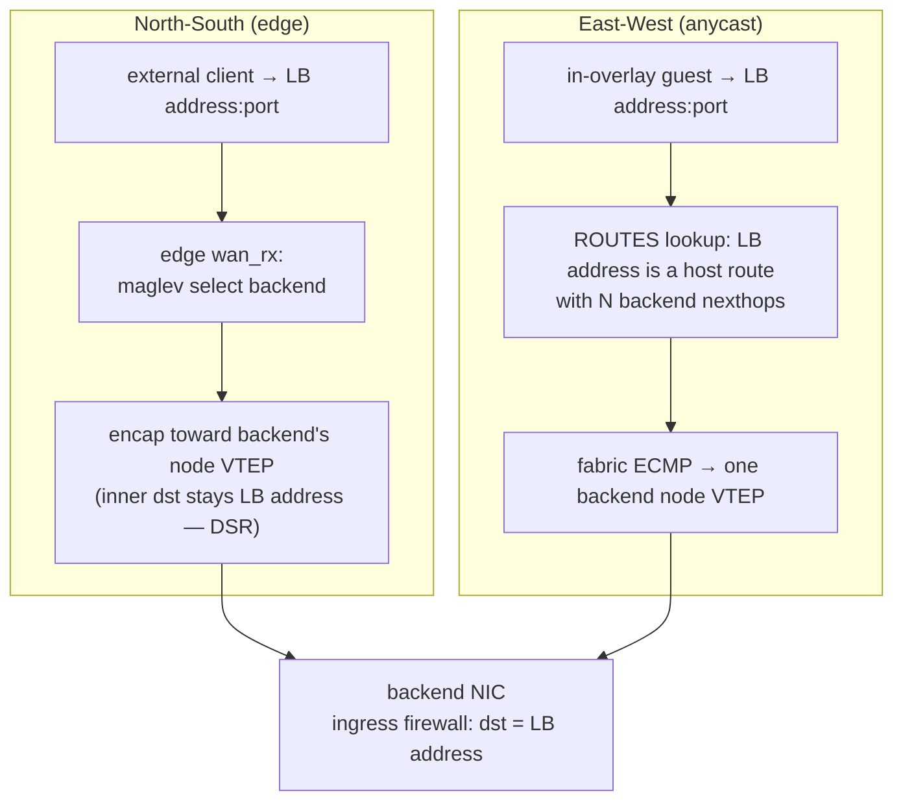

# Load balancing

`flowplane` load-balances one address across a set of backend workloads using Maglev consistent
hashing for backend selection and direct server return (DSR) for delivery. A `LoadBalancer` CRD
allocates its address from an `LBPool` named by `spec.poolRef`, lists its service ports, and selects
the backend `NetworkInterface`s by selector or by name. If `spec.ip` is empty the controller
allocates the lowest-free address in the pool; if it is set the controller validates and reserves
it. Either way the authoritative value is `status.allocatedIP`. LB membership is pure forwarding
data; it grants no firewall permission.

!!! info "There is deliberately no object called a \"VIP\" here"
    Three different things get called a "virtual IP" in this problem domain, and conflating them
    caused real confusion, so ectobase names each one after what it actually is:

    | Concept | Cardinality | Direction | ectobase name |
    |---|---|---|---|
    | Load-balancer address | 1:N — Maglev across backends | ingress only (DSR) | `LoadBalancer.spec.ip` / `status.allocatedIP` |
    | Owned public address | 1:1 — one interface | ingress **and** egress | `FloatingIP` (scaffold; `FLOATING_IPS` map in the datapath) |
    | Anycast apiserver address | 1:N — control plane | n/a | the lab's `APIAddr` |

    So a backend's own egress is SNATed to its `NATGateway` address, **never** to the load
    balancer's — the two are mutually exclusive rewrites of the same source field, and the datapath
    enforces that (see [North-South WAN edge](ns-edge.md)). A `LoadBalancer` with a single backend
    is still a load balancer, not a floating IP: it gives you inbound only, and spends a
    1021-slot Maglev table doing it.

## Two delivery models

There are two distinct ways an LB address is reached, and they use different machinery:

- North-South (external → LB address), via the edge. External clients hit an LB address that lives at
  the [WAN edge](ns-edge.md). The edge runs the Maglev datapath, picks a backend, and
  forwards to it. This is the classic ingress load balancer.
- East-West (in-overlay → LB address), via anycast. Every backend node announces the same
  LB address as an overlay host route on the route bus, nexthop = that backend's own node VTEP.
  Multiple backend nodes announcing the same LB address means the fabric ECMPs across them.
  No LB-specific datapath state is needed for E/W — it reuses the plain route channel.



## Maglev backend selection

Backend selection is a faithful port of the dpservice Maglev model, in shared pure-core
code (`flowplane_core::lb::lb_select_forward` / `lb_select_forward_v6`):

- A service is keyed `(vni, LB address, port, proto)` in the `LB` map. For ICMP the port is
  ignored (looked up as 0).
- The flow's 5-tuple is hashed (`hash5` over src/dst/sport/dport/proto) modulo the LB's
  table size to pick a Maglev slot; the slot maps (via the `MAGLEV` map) to a full
  `LbBackend { node_vtep, overlay_ip, vni, is_v6 }`. The underlay alone can no longer name
  a backend — every interface on a node shares that node's VTEP, so two backends on the
  same node carry the same `node_vtep` — which is exactly why `overlay_ip` is in the value.
  The datapath decides local-vs-remote with `be.node_vtep == local.underlay_ipv6`: a remote
  backend is re-forwarded toward `node_vtep`, a local hit resolves the delivery tap via
  `INTERFACES[(vni, overlay_ip)]` (`INTERFACES6` when `is_v6`).
- The Maglev lookup table is built in userspace (`maglev::build`) as a fixed-size prime
  table (1021 slots). Each backend gets a permutation `(offset, skip)` derived from an
  FNV-1a hash of the backend's overlay IP; slots are filled by walking each backend's
  permutation in turn. This gives minimal disruption: adding or removing one backend
  reshuffles only a small fraction of slots, so existing flows mostly keep landing on the
  same backend.

The v6 path (`lb_select_forward_v6`) is the IPv6-in-IPv6 uplink relay: the LB key uses the
last 4 bytes of the IPv6 LB address (matching the control-plane `last4`), and only TCP/UDP are
relayed.

## Direct server return

Delivery is DSR: once a backend is selected, the packet is forwarded to the backend
node with the inner destination address left as the LB address. The backend replies directly
(the reverse path does not traverse the LB), which avoids a return-path bottleneck.

The consequence: the backend sees traffic addressed to the LB address, not to its own overlay
IP. In the multi-node relay case, the selecting node re-forwards (reforwards) the packet to
the chosen backend's node, still LB address-addressed.

## The DSR firewall gotcha

Because DSR keeps `inner dst = LB address`, the backend's ingress firewall evaluates the packet
with `dst = LB address` — not the backend's overlay IP. The firewall is
[deny-by-default](firewall.md), and LB membership generates no firewall rule. So a
`FirewallPolicy` that allows traffic to the backend's own overlay IP does not cover its
LB traffic, and deny-by-default drops it.

The fix is an explicit `LB address:port` allow rule in the backend's ingress `FirewallPolicy`.
This must be authored as policy; the LB never creates it. This is the same "reachability is
not permission" split as the rest of the firewall: being an LB backend makes the backend reachable
at the LB address, but only an explicit rule admits the traffic. (This exact failure — "LB packets
dropped" — is reproduced synthetically in the fabric simulator and pinned by the fix.)

## The agent split: edge LB address vs. backend anycast

The two delivery models map onto two different agent responsibilities:

- Edge (`applyPublic`). Only a WAN-edge node programs the maglev LB address datapath, and it does so
  entirely from the route bus — an edge is a router, not a Kubernetes node, so it has no
  `LoadBalancer` to list. Each `LB_IP` record carries the whole load balancer: the LB address with its
  service ports (for `AddLoadBalancer`) alongside the announcing backend's VTEP, overlay IP and VNI (for
  `AddLbBackend`). The edge registers the LB address on first sight, then attaches the backend, and drops
  the LB address again when its last backend withdraws. Non-edge nodes ignore `LB_IP` records — they
  reach LB addresses via the E/W anycast route, not maglev.

  A consequence worth stating: the edge's LB address set is *derived* from backend announcements, so an LB address
  with zero backends is never programmed there. That is correct (an empty backend set can only
  blackhole) but means a bring-your-own LB address is not reserved at the edge until something backs it.
- Backend (`desiredLB` → route announce). Any node hosting a backend NIC, for each
  `CompiledNIC.LB` entry, announces the LB address as an anycast overlay host route with nexthop =
  this node's VTEP. Multiple backend nodes → the fabric ECMPs. A NIC the local dataplane
  does not yet report is skipped (nothing to announce until it is attached).

## How it's wired

```
LoadBalancer { PoolRef, LB address (optional), Ports[], TargetSelector | TargetRefs }
        │  LoadBalancerIPReconciler — allocate lowest-free from LBPool, or validate+reserve LB address
        ▼
LoadBalancer.Status.AllocatedIP
        │  CompiledNICReconciler.Compile()
        │    · match backend NICs (selector or refs)
        │    · consume Status.AllocatedIP
        │    · record LB membership — NO firewall rule
        ▼
CompiledNIC.Spec.LB[]  CompiledLB{ LB address, Ports[] }
        │
        ├─ backend node: agent.desiredLB() → route-bus announce
        │     Route{ Vni, Prefix = LB address /32|/128, Nexthop = node VTEP }  (E/W anycast, ECMP)
        │     + LB_IP PublicPrefix{ LB address, Ports[], owner VTEP, overlay IP, vni }
        │
        └─ edge node (no apiserver): agent.applyPublic() → DataplaneNode gRPC
              AddLoadBalancer(ip, vni=0, lbUnderlay=this edge, ports) then AddLbBackend(...)
        ▼
datapath: lb_select_forward — maglev select LbBackend {node VTEP, overlay IP, vni}
          DSR forward — inner dst stays LB address → backend ingress firewall sees dst = LB address
```

- CRD → compiler. `Compile()` records LB membership on each matched backend NIC's
  `CompiledNIC.Spec.LB`. This is forwarding membership only; permission still comes solely
  from `FirewallPolicy`.
- Compiler → agent. Backend nodes announce the LB address as an anycast route (E/W) and publish an
  `LB_IP` record; the edge programs the maglev LB address (N/S) from those records alone — LB address, ports and
  backends all arrive on the bus, which is what lets the edge stay API-less.
- Agent → dataplane. The edge's `LB` + `MAGLEV` maps drive backend selection; DSR
  forwards LB address-addressed to the chosen backend. The backend's ingress firewall must
  explicitly allow `LB address:port`.

## Related

- [Distributed firewall](firewall.md) — why DSR needs an explicit `LB address:port` rule.
- [Routing & multi-VNI tenancy](routing-vni.md) — the anycast route + node-VTEP nexthop
  the E/W path reuses.
- [North-South WAN edge](ns-edge.md) — where the maglev LB address datapath runs for ingress.
- [Compilers: CompiledNIC](../architecture/compile-sync-materialize.md)
