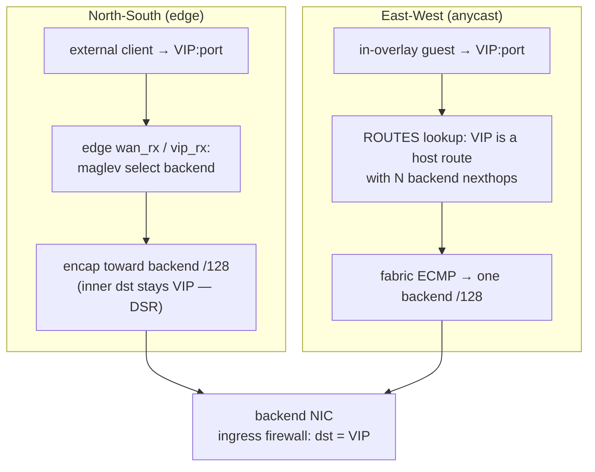

# Load balancing (Maglev + DSR)

`flowplane` load-balances a **virtual IP (VIP)** across a set of backend workloads using
**Maglev consistent hashing** for backend selection and **direct server return (DSR)** for
delivery. A `LoadBalancer` CRD names the VIP, its service ports, and the backend
`NetworkInterface`s (by selector or by name). LB membership is **pure forwarding data** —
it grants no firewall permission.

## Two delivery models

There are two distinct ways a VIP is reached, and they use different machinery:

- **North-South (external → VIP), via the edge.** External clients hit a VIP that lives at
  the [WAN edge](ns-edge.md). The edge runs the Maglev datapath, picks a backend, and
  forwards to it. This is the classic ingress load balancer.
- **East-West (in-overlay → VIP), via anycast.** Every backend node announces the **same
  VIP** as an overlay host route on the route bus, nexthop = that backend's own underlay
  `/128`. Multiple backends announcing the same VIP means the **fabric ECMPs** across them.
  No LB-specific datapath state is needed for E/W — it reuses the plain route channel.



## Maglev backend selection

Backend selection is a faithful port of the dpservice Maglev model, in shared pure-core
code (`flowplane_core::lb::lb_select_forward` / `lb_select_forward_v6`):

- A service is keyed `(vni, VIP, port, proto)` in the `LB` map. For ICMP the port is
  ignored (looked up as 0).
- The flow's 5-tuple is hashed (`hash5` over src/dst/sport/dport/proto) modulo the LB's
  table size to pick a **Maglev slot**; the slot maps (via the `MAGLEV` map) to a backend's
  underlay `/128`.
- The Maglev lookup table is built in userspace (`maglev::build`) as a fixed-size prime
  table (1021 slots). Each backend gets a permutation `(offset, skip)` derived from a hash
  of its `/128`; slots are filled by walking each backend's permutation in turn. This gives
  **minimal disruption**: adding or removing one backend reshuffles only a small fraction of
  slots, so existing flows mostly keep landing on the same backend.

The v6 path (`lb_select_forward_v6`) is the IPv6-in-IPv6 uplink relay: the LB key uses the
last 4 bytes of the IPv6 VIP (matching the control-plane `last4`), and only TCP/UDP are
relayed.

## Direct server return (DSR)

Delivery is **DSR**: once a backend is selected, the packet is forwarded to the backend
node with the **inner destination address left as the VIP**. The backend replies directly
(the reverse path does not traverse the LB), which avoids a return-path bottleneck.

The consequence: the backend sees traffic addressed to the **VIP**, not to its own overlay
IP. In the multi-node relay case, the selecting node re-forwards (reforwards) the packet to
the chosen backend's node, still VIP-addressed.

## The DSR firewall gotcha

Because DSR keeps `inner dst = VIP`, the backend's **ingress firewall** evaluates the packet
with `dst = VIP` — not the backend's overlay IP. The firewall is
[deny-by-default](firewall.md), and **LB membership generates no firewall rule**. So a
`FirewallPolicy` that allows traffic to the backend's own overlay IP does **not** cover its
LB traffic, and deny-by-default drops it.

The fix is an **explicit `VIP:port` allow rule** in the backend's ingress `FirewallPolicy`.
This must be authored as policy; the LB never creates it. This is the same "reachability is
not permission" split as the rest of the firewall: being an LB backend makes you reachable
at the VIP, but only an explicit rule admits the traffic. (This exact failure — "LB packets
dropped" — is reproduced synthetically in the fabric simulator and pinned by the fix.)

## The agent split: edge VIP vs. backend anycast

The two delivery models map onto two different agent responsibilities:

- **Edge (`ReconcileLB`).** Only a WAN-edge node programs the maglev VIP datapath. It lists
  `LoadBalancer`s and diffs `AddLbVip` / `DelLbVip` against what it has applied. Backends
  are added separately, learned from `LB_VIP` records on the route bus (published by each
  backend node). Non-edge nodes are a no-op here — they reach VIPs via the E/W anycast
  route, not maglev.
- **Backend (`desiredLB` → route announce).** Any node hosting a backend NIC, for each
  `CompiledNIC.LB` entry, announces the VIP as an anycast overlay host route with nexthop =
  that NIC's underlay `/128`. Multiple backends → the fabric ECMPs. A NIC without an
  allocated underlay yet is skipped (nothing to announce until it is attached).

## How it's wired

```
LoadBalancer { VIP, Ports[], TargetSelector | TargetRefs }
        │  CompiledNICReconciler.Compile()
        │    · match backend NICs (selector or refs)
        │    · record LB membership — NO firewall rule
        ▼
CompiledNIC.Spec.LB[]  CompiledLB{ VIP, Ports[] }
        │
        ├─ backend node: agent.desiredLB() → route-bus announce
        │     Route{ Vni, Prefix = VIP /32|/128, Nexthop = NIC /128 }   (E/W anycast, ECMP)
        │     + LB_VIP record on the bus (for edge backend discovery)
        │
        └─ edge node: agent.ReconcileLB() → DataplaneNode gRPC
              AddLbVip(vip, ...) ; backends learned from LB_VIP records
        ▼
datapath: lb_select_forward — maglev select backend /128
          DSR forward — inner dst stays VIP → backend ingress firewall sees dst = VIP
```

- **CRD → compiler.** `Compile()` records LB membership on each matched backend NIC's
  `CompiledNIC.Spec.LB`. This is forwarding membership only; permission still comes solely
  from `FirewallPolicy`.
- **Compiler → agent.** Backend nodes announce the VIP as an anycast route (E/W) and publish
  an `LB_VIP` record; the edge programs the maglev VIP (N/S) and learns backends from those
  records.
- **Agent → dataplane.** The edge's `LB` + `MAGLEV` maps drive backend selection; DSR
  forwards VIP-addressed to the chosen backend. The backend's ingress firewall must
  explicitly allow `VIP:port`.

## Related

- [Distributed firewall](firewall.md) — why DSR needs an explicit `VIP:port` rule.
- [Routing & multi-VNI tenancy](routing-vni.md) — the anycast route + underlay-`/128`
  nexthop the E/W path reuses.
- [North-South WAN edge](ns-edge.md) — where the maglev VIP datapath runs for ingress.
- [Compilers: CompiledNIC](../architecture/compile-sync-materialize.md)
