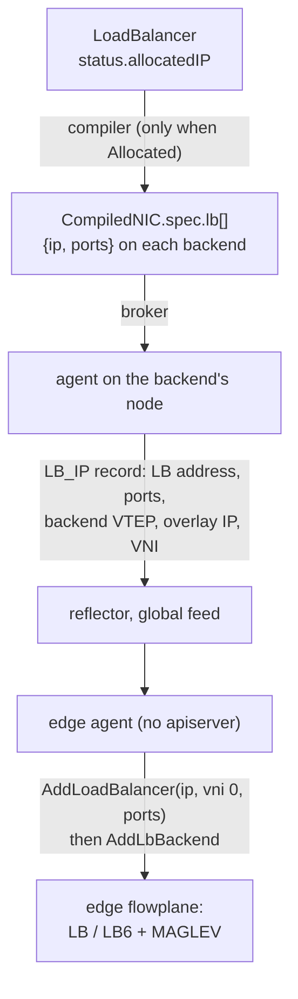
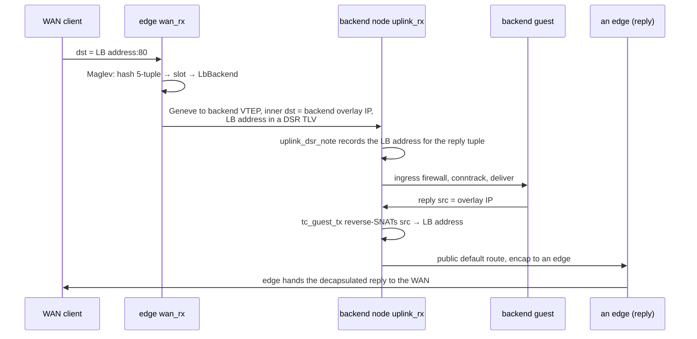

# Load balancing

A `LoadBalancer` spreads traffic for one public address across a set of backend interfaces. Clients on the internet reach the address through the [WAN edge](ns-edge.md), which picks a backend with Maglev consistent hashing and hands the packet to it; the backend replies directly, without the edge holding any per-flow state. Membership in a load balancer is forwarding data only and grants no firewall permission.

## The API: LoadBalancer and IPPool

| Field | Meaning |
|---|---|
| `spec.poolRef` | The `IPPool` the address comes from. Required, and the pool must be of type `public`. |
| `spec.ip` | Optional. Empty allocates the lowest free address of the pool (IPv4 if the pool has both families); set pins that address, which must be inside the pool. |
| `spec.ports[]` | Service tuples: `port` and `proto` (`TCP` or `UDP`). |
| `spec.targetSelector` / `spec.targetRefs` | Backend `NetworkInterface`s, by label or by name. Mutually exclusive. |
| `status.allocatedIP` | The address in effect. Spec is the request; status is the truth. |
| `status.state` | `Allocated`, `Pending` (pool not ready), `Exhausted` or `Invalid`. |

```yaml
apiVersion: net.ectobase.dev/v1alpha1
kind: IPPool
metadata: {name: public-v4, namespace: tenant-a}
spec:
  type: public
  v4Prefix: 192.0.2.0/27
---
apiVersion: net.ectobase.dev/v1alpha1
kind: LoadBalancer
metadata: {name: web, namespace: tenant-a}
spec:
  ip: ""                       # allocate from the pool
  poolRef: {name: public-v4}
  ports: [{port: 80, proto: TCP}]
  targetSelector: {matchLabels: {app: web}}
```

The schema is in the API reference: [`LoadBalancer`](../reference/api/net.md#loadbalancer), [`IPPool`](../reference/api/net.md#ippool), [`IPAllocation`](../reference/api/net.md#ipallocation).

### Where the address comes from

The `LoadBalancerIPReconciler` claims the address as an `IPAllocation` named after the pool and address, owned by the `LoadBalancer`. Object names are unique, so creating the allocation is a compare-and-swap: two consumers racing for one address cannot both succeed, and a `NATGateway` can draw from the same pool without either allocator knowing about the other. The status is written after the claim, so a crash between the two leaves an allocation the next reconcile adopts by name. When the `LoadBalancer` is deleted, Kubernetes garbage collection removes the allocation and the address returns to the pool.

An internal pool is refused (`Invalid`), because an LB address is reached from outside the fabric and an internal range could not be routed to. An auto-allocated load balancer keeps its address across spec edits; repointing `spec.ip` releases the old claim.

The model has three distinct kinds of "virtual IP", and ectobase names each by what it is:

| Concept | Cardinality | Direction | Name in ectobase |
|---|---|---|---|
| Load-balancer address | 1 address to N backends | ingress only | `LoadBalancer.status.allocatedIP` |
| Owned public address | 1 address to 1 interface | ingress and egress | `FloatingIP` (CRD is a scaffold, see Limits) |
| Anycast apiserver address | control plane | n/a | the lab's `APIAddr` |

A backend's own outbound traffic is SNATed to its [NAT gateway](nat.md) address, never to the LB address.

## How a load balancer reaches the edge

The edge runs no apiserver, so it learns every load balancer from the route bus. Each backend's node announces both halves of the load balancer: the service ports and the backend's own identity.


```mermaid
flowchart TD
    lb["LoadBalancer<br/>status.allocatedIP"] -->|"compiler (only when Allocated)"| cnic["CompiledNIC.spec.lb[]<br/>{ip, ports} on each backend"]
    cnic -->|broker| agent["agent on the backend's node"]
    agent -->|"LB_IP record: LB address, ports,<br/>backend VTEP, overlay IP, VNI"| refl["reflector, global feed"]
    refl --> edge["edge agent (no apiserver)"]
    edge -->|"AddLoadBalancer(ip, vni 0, ports)<br/>then AddLbBackend"| maps["edge flowplane:<br/>LB / LB6 + MAGLEV"]
```

1. The compiler adds a `CompiledLB` to the `CompiledNIC` of every matching backend, but only once the load balancer is `Allocated`, so an unallocated address never reaches the bus.
2. The agent on each node hosting an attached backend announces an `LB_IP` record carrying the LB address, its ports, the node's VTEP, the backend's overlay IP and its VNI.
3. Only edges take the global feed. The edge agent registers the load balancer on first sight, then attaches the backend, because flowplane rejects a backend for an unknown load balancer. flowplane is not idempotent here, so the agent diffs against its own record of what it registered.
4. When the last backend withdraws, the edge deletes the load balancer. At the end of each snapshot it also withdraws backends the snapshot no longer carries.

An LB address with no attached backend is therefore never programmed at the edge. That is correct, since an edge with an empty backend set can only drop the traffic, but it means a pinned address is not reserved at the edge until something backs it.

After a restart, flowplane rebuilds its record of each load balancer from the pinned `LB` and `MAGLEV` maps (`adopt_lbs`). A restarted agent that meets a load balancer flowplane already holds deletes and re-creates it; the reflector's snapshot replay re-attaches every backend in the same burst.

## The datapath: Maglev and DSR with a Geneve option


```mermaid
sequenceDiagram
    participant C as WAN client
    participant E as edge wan_rx
    participant B as backend node uplink_rx
    participant G as backend guest
    participant X as an edge (reply)
    C->>E: dst = LB address:80
    E->>E: Maglev: hash 5-tuple → slot → LbBackend
    E->>B: Geneve to backend VTEP, inner dst = backend overlay IP,<br/>LB address in a DSR TLV
    B->>B: uplink_dsr_note records the LB address for the reply tuple
    B->>G: ingress firewall, conntrack, deliver
    G->>B: reply src = overlay IP
    B->>B: tc_guest_tx reverse-SNATs src → LB address
    B->>X: public default route, encap to an edge
    X->>C: edge hands the decapsulated reply to the WAN
```

- Selection. The edge looks the packet up in `LB` (or `LB6`) by `(vni 0, dst, dport, proto)`; ICMP is looked up with port 0, and IPv6 load balancing relays TCP and UDP only. It hashes the 5-tuple modulo the table size to a slot in `MAGLEV`, which holds an `LbBackend {node_vtep, overlay_ip, vni}`. The overlay IP is part of the value because two backends on one node share its VTEP.
- Maglev table. flowplane builds each load balancer's table in userspace as a 1,021-slot prime table. Each backend gets an offset and skip derived from an FNV-1a hash of its overlay IP, and slots are filled by walking each backend's permutation in turn. Adding or removing a backend moves only a small share of slots, so most flows keep their backend. Every edge builds the same table from the same backend set, so any edge picks the same backend for a flow.
- DSR encode. The edge rewrites the inner destination from the LB address to the backend's overlay IP, because a guest only accepts its own address, and carries the original LB address and port in a Geneve option (class `0x0108`, type 1). The inner source stays the real client.
- Backend. `uplink_dsr_note`, a tcx program that runs ahead of `uplink_rx` on the Geneve device, records the LB address in the `DSR` (or `DSR6`) map keyed by the reply tuple. `uplink_rx` then delivers like any other inbound packet, through the backend's ingress firewall and conntrack.
- Reply. The guest replies from its overlay IP. `tc_guest_tx` finds the `DSR` note and rewrites the source back to the LB address. The backend's VNI is an egress VNI, so the reply follows the edges' public default route, misses SNAT (the LB address has no NAT entry), and leaves through whichever edge the route points at. The reply does not need to return through the edge that selected the backend.

## Firewall: the backend admits its clients

The firewall is [deny-by-default](firewall.md) and load-balancer membership adds no rule. A backend admits LB traffic only through its own ingress `FirewallPolicy`, written for the clients: allow their source range (`0.0.0.0/0` and `::/0` for an internet-facing service) on the service port. The destination address is never part of an ingress match, so neither the LB address nor the overlay IP appears in the rule.

## ICMP errors and PMTUD

`uplink_rx` relays an ICMP error (IPv4 types 3, 11 and 12, and the ICMPv6 equivalents) whose quoted packet was sent from an LB address to the backend that owns the quoted flow, by hashing the quoted tuple the way Maglev hashed the original. The relayed error is exempt from the backend's ingress firewall, because its outer tuple (an ICMP packet from a router) would never match a service policy and dropping it would break path-MTU discovery.

## Limits

!!! warning "Status: Partial"
    North-south load balancing works end to end from intent: `TestLbFromIntentReachesTheWan` applies a `LoadBalancer` and a WAN client reaches a real pod backend, and `TestEdgeLBSurvivesFlowplaneRestart` restarts each edge's flowplane under a live load balancer. East-west access to an LB address from inside the overlay is not complete, and the ICMP-error relay does not run on the edge.

- East-west. Each backend node also announces the LB address as a host route in its VNI, with its own VTEP as nexthop. A sender programs only the first of the reflector's sorted nexthops, so all of a VPC's traffic to the address goes to one backend node, with no spreading. On that node, `uplink_rx` can only deliver if it holds a Maglev table for the LB address in that VNI or an `INTERFACES` entry for it. The simulator tests install those by hand; no control-plane path writes either today, and no live test covers east-west.
- ICMP-error relay. The relay runs in `uplink_rx` against overlay-side LB tables. The edge's `wan_rx` has no such arm, so an ICMP error from the internet addressed to an LB address is not relayed to a backend in the from-intent path.
- `FloatingIP` is a scaffold CRD with an empty spec. The `FLOATING_IPS` datapath map exists and is exercised by the simulator, but only the debug `flowplane bringup --floating-ip` flag programs it.
- Fragments are never Maglev-selected, because hashing a non-first fragment would scatter one datagram across backends.
- Per edge: 1,024 service entries in `LB` and 1,024 in `LB6`, and 65,536 `MAGLEV` slots, of which each load balancer's table takes 1,021.

## Where to go next

- [Guide: expose a workload to the WAN](../guides/expose-to-wan.md)
- [WAN edge](ns-edge.md)
- [Distributed firewall](firewall.md)
- [CRD interactions](../reference/crd-interactions.md)
