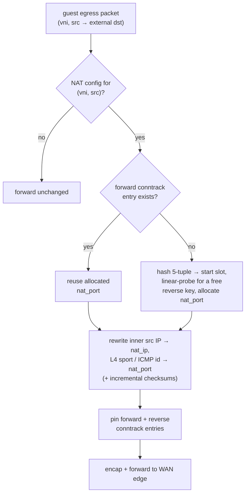

# NAT gateway

The NAT gateway provides **distributed egress SNAT**: workloads in a VPC reach the outside
world through a shared pool of public IPv4 addresses, with the address translation
performed **on the source node itself** — not funnelled through a central NAT box. The
control plane hands each source a deterministic, non-overlapping `(public IP, port block)`,
and the route bus ensures return traffic finds the node that owns that block.

## Deterministic, drain-safe allocation

The core idea is that any node can compute a source's translation from a shared table
without coordination. The `NATGatewayReconciler` owns that table:

- A `NATGateway` selects a VPC (`Spec.VPCRef`) and carries a pool of `PublicIPs` plus a
  `PortsPerSource` block size (default 1024).
- The reconciler lists every `NetworkInterface` in that VPC, collects each NIC's overlay
  IPs as **sources**, and assigns each source a deterministic block from the pool.
- The result is written to `NATGateway.Status.Allocations` — a
  `[]NATAllocation{ Source, PublicIP, PortMin, PortMax }` table.

Determinism is what makes this **drain-safe**. Existing assignments are seeded from the
persisted status (`Preassign`) so that adding or removing *other* sources never re-NATs a
source's live flows; a source that is still present keeps its exact block. Any gateway node
can recompute a source's block from the published table with no shared runtime state.

The block size follows the RFC 7422 / static-port-allocation style: each source owns a
fixed contiguous port range on its public IP, so return traffic is unambiguously
attributable to a source by `(nat IP, port)` alone.

## The datapath: SNAT on egress

Egress SNAT runs on the guest-egress path (`tc_guest_tx`), in shared pure-core code
(`flowplane_core::nat::snat_egress`). When an external-bound packet leaves a guest whose
`(vni, src)` has a NAT config:



- **Port allocation.** The flow's 5-tuple is hashed to a start slot inside the source's
  `[port_min, port_max)` range; a short linear probe finds a free **reverse key**. The
  reverse key is peer-independent — `(vni, 0, nat_ip, 0, nat_port)` — so an allocated
  `nat_port` is **globally unique per `nat_ip`** (the dpservice model): two flows to
  different destinations can never share a port, which is exactly what makes the return
  path reversible from `(nat_ip, port)` alone.
- **Rewrite.** The inner source IP is rewritten to `nat_ip` and the L4 source port (or ICMP
  id) to `nat_port`, with incremental checksum updates for IPv4/TCP/UDP/ICMP.
- **Conntrack.** Forward and reverse conntrack entries are pinned so subsequent packets of
  the flow reuse the same port, and the return path can reverse the translation.

## The return path: neighbor-NAT

Return traffic from the internet arrives at the [WAN edge](ns-edge.md) addressed to a
public IP + port. The edge must forward it to the node that *owns* that
`(nat_ip, port)` block — the neighbor-NAT lookup does this. The owning node announces its
NAT block on the route bus with **owner = the NIC's underlay `/128`**, so every node
(including the edge) learns which underlay address to encapsulate the return toward.

The edge's `uplink_rx` / `wan_rx` path matches the return packet's `(nat_ip, dport)`
against its neighbor-NAT table, gets back the owning node's underlay `/128` and VNI, and
encapsulates the return toward it. On the owning node, the reverse conntrack key
`(vni, 0, nat_ip, 0, nat_port)` matches, the translation is reversed, and the packet is
delivered to the original guest. (A plain IPv4 return from the internet carries no VNI, so
the edge uses a VNI-agnostic lookup that returns both the underlay and the owner's VNI.)

## The agent derives NAT solely from CompiledNIC

An important structural point: the node agent **never reads `NATGateway`**. The allocation
table is folded into each NIC's `CompiledNIC` by the compiler, and the agent programs and
announces NAT purely from there.

- The `CompiledNICReconciler` gathers every `NATGateway` allocation in the namespace
  indexed by source overlay IP, and for each of the NIC's overlay IPs with an allocation,
  stamps a `CompiledNATSource{ SourceIP, NATIP, PortMin, PortMax }` onto `CompiledNIC.Spec.NAT`.
- The agent, iterating its local `CompiledNIC`s, calls `AddNatSource` for each entry (which
  programs the datapath `NAT` map) **and** announces a `NatBlock` on the route bus with
  `OwnerUnderlay = the NIC's underlay /128`.

This keeps the agent's input surface small (only `CompiledNIC`) and makes the owner of a
NAT block explicit and self-describing on the wire.

## How it's wired

```
NATGateway { VPCRef, PublicIPs[], PortsPerSource }
        │  NATGatewayReconciler
        │    · list NICs in the VPC → sources (overlay IPs)
        │    · deterministic (public IP, port block) per source (drain-safe)
        ▼
NATGateway.Status.Allocations[]  { Source, PublicIP, PortMin, PortMax }
        │  CompiledNICReconciler — index by source IP, match NIC's overlay IPs
        ▼
CompiledNIC.Spec.NAT[]  CompiledNATSource{ SourceIP, NATIP, PortMin, PortMax }
        │  agent.Desired() — for each local CompiledNIC.NAT entry
        ├─ DataplaneNode gRPC: AddNatSource(vni, srcIP, natIP, portMin, portMax)
        └─ route-bus announce: NatBlock{ …, OwnerUnderlay = NIC /128 }
        ▼
datapath egress: snat_egress rewrites src → nat_ip : nat_port (+ conntrack)
datapath return: neighbor-NAT lookup at the edge → encap toward owner /128 → reverse
```

- **CRD → allocator.** `NATGatewayReconciler` turns pool + block size into a deterministic
  per-source table in status. Any NIC add/remove re-syncs the gateway, but existing blocks
  are preserved.
- **Allocator → compiler.** `CompiledNICReconciler` folds the allocations into each NIC's
  `CompiledNIC.Spec.NAT`. A NAT-gateway status change re-enqueues affected NICs.
- **Compiler → agent → dataplane.** The agent programs the `NAT` map and announces the
  block (owner = NIC `/128`) on the route bus, so return traffic finds the owning node.

## Related

- [North-South WAN edge](ns-edge.md) — where return traffic enters and neighbor-NAT runs.
- [Routing & multi-VNI tenancy](routing-vni.md) — the underlay-`/128`-nexthop model NAT
  blocks reuse.
- [Compilers: CompiledNIC](../architecture/compile-sync-materialize.md)
- NAT64 (`64:ff9b::/96`) reuses the same egress path for IPv6-only guests reaching IPv4.
