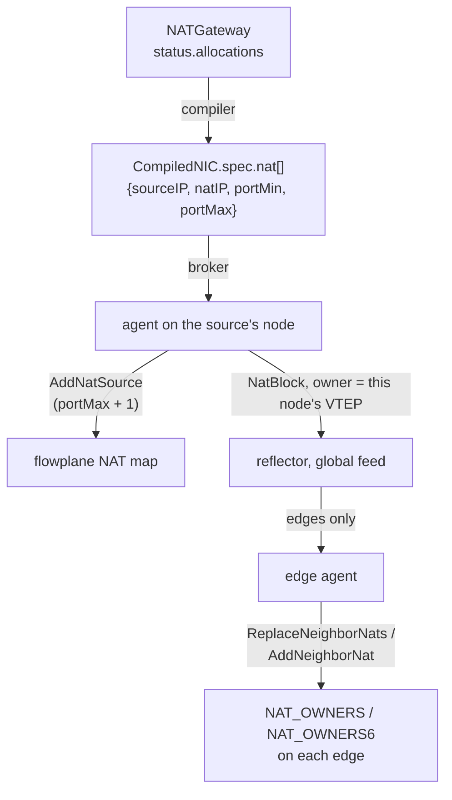
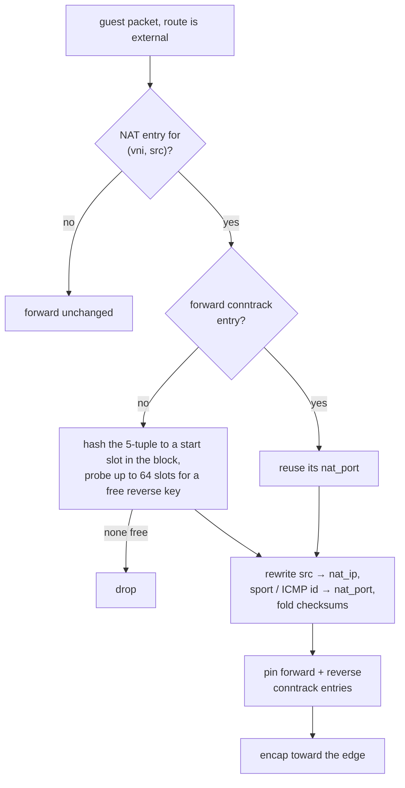

# NAT gateway

A `NATGateway` gives the workloads of a VPC outbound access to the internet through shared public addresses. Each source address gets its own fixed `(public IP, port block)`, and the node that hosts the workload performs the translation itself, so there is no central NAT box. Return traffic enters at any [WAN edge](ns-edge.md), which relays it to the node that owns the block.

## The API: NATGateway

| Field | Meaning |
|---|---|
| `spec.vpcRef` | The VPC whose interfaces egress through this gateway. Every overlay address of every `NetworkInterface` in it becomes a source. |
| `spec.poolRef` | The `IPPool` the public addresses come from. It must be of type `public`. |
| `spec.publicIPs` | With `poolRef` set: addresses the gateway must hold inside the pool (pins). Without `poolRef`: a literal address list, kept so gateways written before pools keep working. |
| `spec.portsPerSource` | Port-block size per source. Default 1024. |
| `status.allocations` | The source → `(publicIP, portMin, portMax)` table. `portMax` is inclusive. |
| `status.state` | `Ready`, `Exhausted`, `Pending` (pool not ready) or `Invalid`. |

```yaml
apiVersion: net.ectobase.dev/v1alpha1
kind: IPPool
metadata: {name: public-v4, namespace: tenant-a}
spec:
  type: public
  v4Prefix: 192.0.2.32/27
---
apiVersion: net.ectobase.dev/v1alpha1
kind: NATGateway
metadata: {name: egress, namespace: tenant-a}
spec:
  vpcRef: {name: blue}
  poolRef: {name: public-v4}
  portsPerSource: 1024
```

`spec.edgeUnderlay` is deprecated and ignored; the edges advertise themselves. The schema is in the API reference: [`NATGateway`](../reference/api/net.md#natgateway), [`IPPool`](../reference/api/net.md#ippool).

## How allocation works

The `NATGatewayReconciler` on the dispatch owns the allocation table. Its job is to give every source a block that never moves while the source exists, because moving a block re-NATs that source's live connections.

- Sources are the `status.allocatedIPs` of every `NetworkInterface` whose `vpcRef` matches the gateway.
- Blocks start at port 1024 and are laid out back to back up to 65535, so a 1024-port block gives 63 blocks per public address.
- Existing assignments are seeded from `status.allocations` before anything new is assigned, and are pinned by value. Adding or removing other sources, or adding an address, never moves a block a source already holds. Only new sources take the lowest free block.
- Addresses are claimed on demand. A gateway starts with its pins; when a source cannot get a block because every address it holds is full, it claims one more address from the pool and lays the blocks out again. It claims at most one per reconcile, so a gateway that suddenly gains hundreds of interfaces cannot drain a shared pool in one pass.
- The address set never shrinks while the gateway exists. Removing a pin does not release the address, because a live source may still use its blocks. The addresses are released when the gateway is deleted.
- When the pool has nothing left the gateway reports `Exhausted` and keeps every block it already handed out. A pool problem (`Invalid`, `Pending`) leaves `status.allocations` untouched for the same reason.

Each claimed address is an `IPAllocation` object named after the pool and address, so `create` is the compare-and-swap that keeps two consumers from taking the same address. The [CRD interactions](../reference/crd-interactions.md) page explains the IPPool and IPAllocation model.

## From allocation to the datapath

The compiler folds the allocation table into each interface's `CompiledNIC`, and the agent programs and announces NAT from there. The agent never reads a `NATGateway`.


```mermaid
flowchart TD
    gw["NATGateway<br/>status.allocations"] -->|compiler| cnic["CompiledNIC.spec.nat[]<br/>{sourceIP, natIP, portMin, portMax}"]
    cnic -->|broker| agent["agent on the source's node"]
    agent -->|"AddNatSource<br/>(portMax + 1)"| fp["flowplane NAT map"]
    agent -->|"NatBlock, owner = this node's VTEP"| refl["reflector, global feed"]
    refl -->|"edges only"| edge["edge agent"]
    edge -->|"ReplaceNeighborNats /<br/>AddNeighborNat"| owners["NAT_OWNERS / NAT_OWNERS6<br/>on each edge"]
```

1. The compiler writes a `CompiledNATSource` into `CompiledNIC.spec.nat` for each of the interface's addresses that has an allocation.
2. The agent on the node where the interface is attached calls `AddNatSource`, then announces a `NatBlock` on the route bus with the node's VTEP as owner. It skips the announcement when `AddNatSource` fails, so no edge learns a return route to a node without matching SNAT state.
3. The status and the `CompiledNIC` carry an inclusive `portMax`; flowplane and the route bus use an exclusive upper bound. The agent is the one place the two meet and adds 1 there.

The agent also needs a route out. A local interface with a NAT allocation (or a load-balancer membership) makes its VNI an egress VNI, and the agent imports the edges' default routes from the public VNI 0 into it, marked external. See [WAN edge](ns-edge.md#egress-defaults-in-the-public-vni).

## Egress SNAT on the source node

`tc_guest_tx` runs the SNAT in `flowplane_core::nat::snat_egress` when the matched route is external and the guest's `(VNI, source)` has a NAT entry.


```mermaid
flowchart TD
    p["guest packet, route is external"] --> cfg{"NAT entry for<br/>(vni, src)?"}
    cfg -->|no| out["forward unchanged"]
    cfg -->|yes| ct{"forward conntrack<br/>entry?"}
    ct -->|yes| reuse["reuse its nat_port"]
    ct -->|no| alloc["hash the 5-tuple to a start slot in the block,<br/>probe up to 64 slots for a free reverse key"]
    alloc -->|none free| drop["drop"]
    reuse --> rw
    alloc --> rw["rewrite src → nat_ip,<br/>sport / ICMP id → nat_port,<br/>fold checksums"]
    rw --> pin["pin forward + reverse<br/>conntrack entries"]
    pin --> encap["encap toward the edge"]
```

The reverse key is `(vni, 0, nat_ip, 0, nat_port)`, independent of the peer, so an allocated port is unique per public address. That uniqueness is what lets any edge route a reply by `(nat_ip, port)` alone. When all probed slots are taken, the packet drops: forwarding it would leak the guest's overlay address, and reusing a port would misdirect another flow's replies.

## Return traffic through the edge

A reply from the internet reaches an edge's `wan_rx`, addressed to a public IP and port. The edge looks `(nat_ip, dport)` up in `NAT_OWNERS` (`NAT_OWNERS6` for IPv6), gets the owning node's VTEP and VNI, and re-encapsulates the packet toward it. On the owning node, `uplink_rx` matches the reverse conntrack key, reverses the translation and delivers to the guest. The edge holds no per-flow state, so the reply can enter at a different edge than the one the request left through.

The return path has four properties that let it scale and survive restarts:

- Tries. Each block is stored as the fewest aligned port prefixes that cover it, keyed on the public address, so a lookup is one trie probe however many blocks exist. A default 1024-port block on a 1024 boundary is one prefix. Each trie holds 65,536 prefixes per family.
- Edge-only feed. NAT blocks travel on the route bus's global channel, and only edges subscribe to it (`Hello.global_feed`). A compute node opts out and holds an empty table.
- Lossless, declarative snapshots. The reflector sends each snapshot whole. While it replays, the edge agent collects blocks; at the `EndOfGlobal` marker, whose count must match what arrived, it calls `ReplaceNeighborNats` once with the complete set. flowplane keeps unchanged blocks and removes the rest, including blocks it re-adopted after its own restart that no agent remembers. A short snapshot programs what arrived and prunes nothing. Announcements after the marker apply one block at a time.
- Ownership. The reflector applies a withdraw only from the origin that announced the block, and only when the session's certificate speaks for the block's owner. A takeover by another node moves the block to the new origin.

flowplane refuses a block that overlaps another on the same public address (`ALREADY_EXISTS`) and a block that does not fit in the trie (`RESOURCE_EXHAUSTED`). The tries are pinned, so blocks survive a flowplane restart.

### ICMP errors and PMTUD

An ICMP error, such as "fragmentation needed" or "packet too big", is addressed to the public IP but carries no port of its own. The port that names the flow is the source port of the packet the error quotes. Both the edge's relay and the owner's reverse lookup read the quoted packet, and trust it only when its source is the same public IP the error is addressed to.

Delivery then rewrites both copies of the public address, as [RFC 5508](https://www.rfc-editor.org/rfc/rfc5508) section 3.2 requires: the outer destination, so the frame reaches the guest, and the quoted source address and port, because the guest matches an ICMP error to a socket by the quoted tuple. All affected checksums are folded incrementally, including the ICMPv6 pseudo-header. This works for both IPv4 and IPv6.

## NAT66 and NAT64

- NAT66. An IPv6 source with an IPv6 public address uses `snat_egress6` and `NAT_OWNERS6`, mirroring the IPv4 path. flowplane rejects a NAT entry whose source and public address are of different families.
- NAT64. A guest packet to `64:ff9b::/96` is translated to IPv4 (header rewrite, checksum translation, ICMPv6 echo to ICMPv4 echo) and SNATed with the guest's IPv4 NAT entry. The edges originate `64:ff9b::/96` into the public VNI alongside the defaults. NAT64 therefore needs the interface to hold an IPv4 address with a NAT allocation.

## Limits

!!! warning "Status: Partial"
    NAT44 works end to end from intent: `TestNatFromIntent` applies a `NATGateway` and a `Container`, and a pod reaches a WAN server and back with no hand-driven dataplane call. NAT66 and the IPv6 return path are proven live at the dataplane tier (`TestNatEgressSmoke6`, `TestNatEgressReturn6`) with hand-programmed state. The guest NAT64 path is covered by the simulator only.

- The allocator does not separate address families. It lays every source of the VPC, IPv4 and IPv6, over one address list, so a dual-stack VPC whose pool offers one family gets sources whose block is on the wrong family; flowplane rejects those entries and the agent retries them every reconcile. NAT66 from intent needs a gateway whose sources and addresses are all IPv6.
- Fragmented datagrams do not traverse NAT. A non-first IPv4 fragment has no port to translate or to route the reply by, so it is dropped rather than forwarded with the guest's overlay source.
- Up to 64 probes per new flow. A block whose ports are nearly all in use drops new flows that find no free slot in 64 tries.
- Each edge's trie holds 65,536 port prefixes per family.

## Where to go next

- [Guide: NAT egress](../guides/nat-egress.md)
- [WAN edge](ns-edge.md)
- [The route bus](../architecture/route-bus.md)
- [HA and restarts](../architecture/ha-and-restarts.md)
