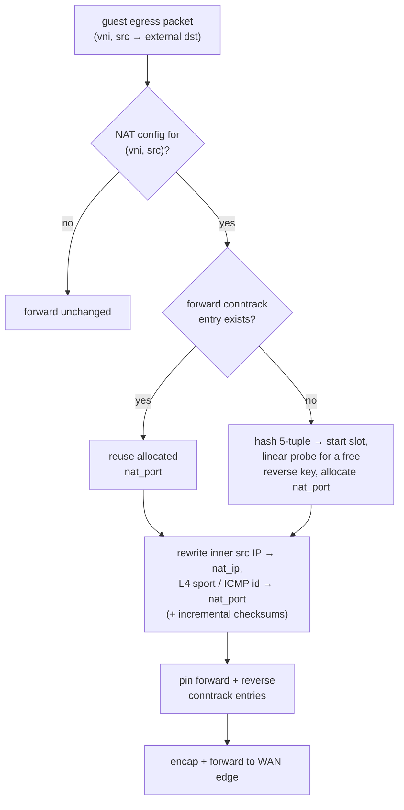

# NAT gateway

The NAT gateway provides distributed egress SNAT: workloads in a VPC reach the outside
world through a shared pool of public IPv4 addresses, with the address translation
performed on the source node itself, not funnelled through a central NAT box. The
control plane hands each source a deterministic, non-overlapping `(public IP, port block)`,
and the route bus ensures return traffic finds the node that owns that block.

## Deterministic, drain-safe allocation

The core idea is that any node can compute a source's translation from a shared table
without coordination. The `NATGatewayReconciler` owns that table:

- A `NATGateway` selects a VPC (`Spec.VPCRef`) and draws its public addresses from an
  [`IPPool`](../reference/crd-interactions.md) of `type: public` named by `Spec.PoolRef`, with a
  `PortsPerSource` block size (default 1024). `Spec.PublicIPs` is no longer the pool itself: it
  *pins* addresses inside `PoolRef`, the way `LoadBalancer.spec.ip` does. A gateway with no
  `PoolRef` still treats `PublicIPs` as a literal list, so an older object keeps working.
- Addresses are claimed on demand. The gateway starts with whatever it has pinned, and when a
  source cannot be given a block because every address it holds is full, it claims **one more**
  from the pool and lays the blocks out again. One per reconcile pass on purpose: a gateway that
  suddenly gains hundreds of NICs must not drain a shared pool in a single tick — it grows again
  on the next pass. When the pool has nothing left the gateway reports `Exhausted`, keeping every
  block it had already handed out.
- The address set never shrinks while the gateway lives. An address whose blocks a live source is
  still using cannot be handed back without re-NATing that source mid-flow, so removing a pin from
  `PublicIPs` does not release it either. The addresses go when the gateway does, collected with
  the `IPAllocation` objects that hold them.
- The reconciler lists every `NetworkInterface` in that VPC, collects each NIC's overlay
  IPs as sources, and assigns each source a deterministic block from the pool.
- The result is written to `NATGateway.Status.Allocations`, a
  `[]NATAllocation{ Source, PublicIP, PortMin, PortMax }` table.

Determinism is what makes this drain-safe. Existing assignments are seeded from the
persisted status (`Preassign`) so that adding or removing other sources never re-NATs a
source's live flows; a source that is still present keeps its exact block. Any gateway node
can recompute a source's block from the published table with no shared runtime state.

The block size follows the RFC 7422 / static-port-allocation style: each source owns a
fixed contiguous port range on its public IP, so return traffic is unambiguously
attributable to a source by `(nat IP, port)` alone.

## The datapath: SNAT on egress

Egress SNAT runs on the guest-egress path (`tc_guest_tx`), in shared pure-core code
(`flowplane_core::nat::snat_egress`). When an external-bound packet leaves a guest whose
`(vni, src)` has a NAT config:


```mermaid
flowchart TD
    p["guest egress packet<br/>(vni, src → external dst)"] --> cfg{"NAT config for<br/>(vni, src)?"}
    cfg -->|no| out["forward unchanged"]
    cfg -->|yes| ct{"forward conntrack<br/>entry exists?"}
    ct -->|yes| reuse["reuse allocated<br/>nat_port"]
    ct -->|no| alloc["hash 5-tuple → start slot,<br/>linear-probe for a free<br/>reverse key, allocate nat_port"]
    reuse --> rw
    alloc --> rw["rewrite inner src IP → nat_ip,<br/>L4 sport / ICMP id → nat_port<br/>(+ incremental checksums)"]
    rw --> pin["pin forward + reverse<br/>conntrack entries"]
    pin --> encap["encap + forward to WAN edge"]
```

- Port allocation. The flow's 5-tuple is hashed to a start slot inside the source's
  `[port_min, port_max)` range; a short linear probe finds a free reverse key. The
  reverse key is peer-independent — `(vni, 0, nat_ip, 0, nat_port)` — so an allocated
  `nat_port` is globally unique per `nat_ip` (the dpservice model): two flows to
  different destinations can never share a port, which is exactly what makes the return
  path reversible from `(nat_ip, port)` alone.
- Rewrite. The inner source IP is rewritten to `nat_ip` and the L4 source port (or ICMP
  id) to `nat_port`, with incremental checksum updates for IPv4/TCP/UDP/ICMP.
- Conntrack. Forward and reverse conntrack entries are pinned so subsequent packets of
  the flow reuse the same port, and the return path can reverse the translation.

!!! warning "Fragmented datagrams do not traverse NAT"

    Only the *first* fragment of an IPv4 datagram carries an L4 header, so a non-first
    fragment has no source port to rewrite — and since the return path demuxes on
    `(nat_ip, port)` alone, there is nothing to reverse it with either. Such a fragment is
    **dropped** rather than forwarded un-SNATed, which would put the guest's overlay
    source address on the wire. The same applies to load balancing: a fragment is never
    Maglev-selected, because hashing it would scatter one datagram across backends.

    Fragments of one datagram do share a single conntrack key (`(proto, 0, 0)`), so they
    are at least consistent for firewall and conntrack purposes — but a port-specific
    firewall rule will not match them. Supporting fragmented flows end-to-end needs a
    fragment-tracking map keyed `(src, dst, proto, ip_id)` carrying the first fragment's
    ports; that is deliberately not built.

## The return path: neighbor-NAT

Return traffic from the internet arrives at the [WAN edge](ns-edge.md) addressed to a
public IP + port. The edge must forward it to the node that owns that
`(nat_ip, port)` block; the neighbor-NAT lookup does this. The owning node announces its
NAT block on the route bus with owner = that node's own VTEP, and the sessions that take
the route bus's global feed — the WAN edges — learn it. A compute node opts out
(`Hello.global_feed = GLOBAL_FEED_NONE`) and holds no neighbor-NAT blocks at all: the
relay code below still runs there, just against a table that is always empty.

The edge's `uplink_rx` / `wan_rx` path looks the return packet's `(nat_ip, dport)` up in
the `NAT_OWNERS` trie (`NAT_OWNERS6` for IPv6), gets back the owning node's underlay
`/128` and VNI, and encapsulates the return toward it. A NAT port block is stored as the
fewest aligned port prefixes that cover it — a default 1024-port block starting on a
1024-boundary is a single prefix — so lookup cost is one trie lookup regardless of how
many blocks exist. On the owning node, the reverse conntrack key
`(vni, 0, nat_ip, 0, nat_port)` matches, the translation is reversed, and the packet is
delivered to the original guest. (A plain return from the internet carries no VNI, so
the edge uses a VNI-agnostic lookup that returns both the underlay and the owner's VNI.
Both families work the same way, over `NAT_OWNERS` / `NAT_OWNERS6`.)

The edge keeps this table in sync declaratively, not incrementally. While a snapshot
replays, the agent only collects the blocks it sees; at that snapshot's exact-count
`EndOfGlobal` marker it calls `ReplaceNeighborNats` once with the whole set, which makes
the dataplane's blocks exactly that set — an unchanged block is left alone, and one that
left is removed, including a block the dataplane adopted after its own restart that no
agent remembers installing. A lossy snapshot (fewer records arrived than the marker
claims) programs what did arrive and prunes nothing, since removing blocks against an
incomplete picture would drop live routes. Live NAT announcements after the marker are
still applied incrementally, one block at a time.

!!! note "Limits"

    Each trie holds up to 65,536 prefixes per family. A block that overlaps another
    block on the same `nat_ip` — in any VNI — is refused as `AlreadyExists`; a full trie
    is refused as `ResourceExhausted`. Blocks live in pinned maps, so they survive a
    dataplane restart: adopt rebuilds the block list from the trie values (each prefix
    carries its whole block) and re-writes any prefix a crash left missing. If the
    dataplane and the agent both restarted while a block was withdrawn or reassigned,
    the adopted block used to stay listed forever, misrouting that public IP's return
    traffic and refusing any overlapping successor — CLOSED: the edge's next complete
    snapshot replaces the whole block set declaratively, so the stranded block is removed
    and its successor admitted in the same call.

    Upgrading a node from the old 64-slot neighbor-NAT table converts its blocks: adopt
    reads the retired maps before the loader unpins them and installs what they held, so
    an edge's already-announced remote NAT blocks keep relaying across the upgrade. Only
    the slots below the old table's count are taken — it was rewritten in place and never
    cleared above its count, so a slot above it is a withdrawn block, and reading it back
    would relay that public IP to a node that no longer owns it. A table that cannot be
    read is logged and skipped, which is no worse than before: those blocks come back on
    the agent's next reflector replay. The conversion is one-shot, since the loader unpins
    the old maps either way — so running the debug `flowplane bringup --pin-dir` against a
    production pin directory before `serve` discards them.

### ICMP errors

An ICMP error — a PMTUD "fragmentation needed" / "packet too big", or any unreachable —
breaks the assumption above: it is addressed to the `nat_ip` but carries **no port of its
own**. The port that names the flow is the *source* port of the packet the error quotes,
which is the guest's original packet as it left post-SNAT. So both the edge's relay lookup
and the owner's reverse conntrack key are built from the quoted packet instead, and a quote
is only trusted when its source is the very `nat_ip` the error is addressed to — an error
quoting someone else's packet says nothing about this flow.

Delivering it then requires rewriting **both** copies of the public address
([RFC 5508](https://www.rfc-editor.org/rfc/rfc5508) §3.2): the outer destination, or the
frame cannot reach the guest, and the quoted source and source port, because a guest
matches an ICMP error to a socket by the quoted tuple and silently discards one still
addressed to the public identity. Every affected checksum is folded incrementally,
including the ICMP checksum, which covers the quoted packet — and for ICMPv6 also covers a
pseudo-header containing the outer address being rewritten.

## The agent derives NAT solely from CompiledNIC

The node agent never reads `NATGateway`. The allocation
table is folded into each NIC's `CompiledNIC` by the compiler, and the agent programs and
announces NAT purely from there.

- The `CompiledNICReconciler` gathers every `NATGateway` allocation in the namespace
  indexed by source overlay IP, and for each of the NIC's overlay IPs with an allocation,
  stamps a `CompiledNATSource{ SourceIP, NATIP, PortMin, PortMax }` onto `CompiledNIC.Spec.NAT`.
- The agent, iterating its local `CompiledNIC`s, calls `AddNatSource` for each entry (which
  programs the datapath `NAT` map) and announces a `NatBlock` on the route bus with
  `OwnerUnderlay = this node's VTEP`.

This keeps the agent's input surface small (only `CompiledNIC`) and makes the owner of a
NAT block explicit and self-describing on the wire.

## How it's wired

```
NATGateway { VPCRef, PoolRef -> IPPool(public), PublicIPs[] (pins), PortsPerSource }
        │  NATGatewayReconciler
        │    · list NICs in the VPC → sources (overlay IPs)
        │    · deterministic (public IP, port block) per source (drain-safe)
        ▼
NATGateway.Status.Allocations[]  { Source, PublicIP, PortMin, PortMax }
        │  CompiledNICReconciler — index by source IP, match NIC's overlay IPs
        ▼
CompiledNIC.Spec.NAT[]  CompiledNATSource{ SourceIP, NATIP, PortMin, PortMax }
        │  agent.Desired() — for each local CompiledNIC.NAT entry
        ├─ DataplaneNode gRPC: AddNatSource(vni, srcIP, natIP, portMin, portMax)
        └─ route-bus announce: NatBlock{ …, OwnerUnderlay = node VTEP }
        ▼
datapath egress: snat_egress rewrites src → nat_ip : nat_port (+ conntrack)
datapath return: neighbor-NAT lookup at the edge → encap toward owner VTEP → reverse
```

- CRD → allocator. `NATGatewayReconciler` turns pool + block size into a deterministic
  per-source table in status. Any NIC add/remove re-syncs the gateway, but existing blocks
  are preserved.
- Allocator → compiler. `CompiledNICReconciler` folds the allocations into each NIC's
  `CompiledNIC.Spec.NAT`. A NAT-gateway status change re-enqueues affected NICs.
- Compiler → agent → dataplane. The agent programs the `NAT` map and announces the
  block (owner = the node VTEP) on the route bus, so return traffic finds the owning node.

!!! warning "The port block's upper bound changes meaning at the agent"

    `NATGateway.Status.Allocations[].PortMax` and `CompiledNIC.Spec.NAT[].PortMax` are
    **inclusive** — the allocator writes `portMin + size - 1`. The dataplane's `port_max`
    and every route-bus `NatBlock` are **exclusive**. The agent is the single place the
    two conventions meet and converts there (`portMaxExcl := src.PortMax + 1`). Passing
    the inclusive bound straight through loses the block's top port, and turns a one-port
    block into an empty range the dataplane refuses outright.

## Live coverage

`TestNatFromIntent` (`test/lab/livetest/natintent_test.go`) drives this whole chain from
intent alone on the lab fabric: a `NATGateway` and a `Container` are the entire input, and
a Pod on the overlay reaches an HTTP server in the WAN namespace and back. It issues no
dataplane gRPC of its own — the CNI's attach, triggered by scheduling the Pod, is the only
call into the dataplane anywhere in the flow.

It asserts in stages so a failure localizes: the central allocation in
`NATGateway.Status`, the compiled twin's `CompiledNIC.Spec.NAT` in the pool cluster, the
block in **both** edges' `NAT_OWNERS` tries (decoded from the pinned map, so a
half-programmed edge fails loudly rather than becoming an intermittent blackhole), and
finally the bidirectional flow. The trie assertion is also what pins the inclusive →
exclusive conversion above: it requires the exclusive bound in the edge's `NatOwner`.

This complements `TestNatEgressSmoke{,6}` and `TestNatEgressReturn6`, which hand the
dataplane exactly the arguments the agent would have produced and so isolate the datapath
tier; everything above the gRPC boundary had no live coverage before.

## Related

- [North-South WAN edge](ns-edge.md) — where return traffic enters and neighbor-NAT runs.
- [Routing & multi-VNI tenancy](routing-vni.md) — the node-VTEP-nexthop model NAT blocks
  reuse.
- [Compilers: CompiledNIC](../architecture/compile-sync-materialize.md)
- NAT64 (`64:ff9b::/96`) reuses the same egress path for IPv6-only guests reaching IPv4.
